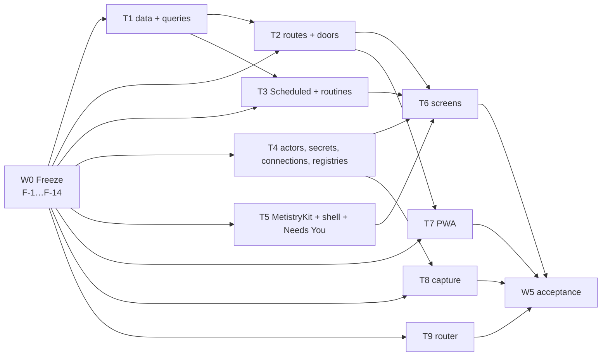

# Design round 0 — approved spec and execution plan

**Status: the approved spec**, rewritten for execution to the owner's rulings of
2026-09-26 on #260. It is what implement agents build the final design to
(`docs/product/design/`, merged as #263). Every question the owner has answered is
closed here (§1); what remains is the **25 up-front questions in §4**, each with a
default so the answer can be one word.

Written against `origin/main` at `0b20767` (#263's merge). Every code citation
was re-checked there (Appendix A).

---

## 0. How to use this spec

**Who reads what.** The coordinator reads all of it. An implement agent reads
**§0, the §2 section its ticket cites, and its ticket in §3** — every ticket is
written to be buildable from those three alone.

**Precedence.** This spec, then `docs/product/design/DEVELOPER-HANDOFF.md` §0's
order (the ratified C-rows, `design-system-amendments.md`, the screen and
component specs, `glossary.md`, the older product docs). Where this spec names a
reading of the design, build that reading (§1.4).

**The naming rule, on every line of code.** The design writes the assistant's
name, *Metis*, into labels. `CLAUDE.md` makes a hardcoded "Metis" in a path,
table, env var, package, class or function a bug, and C88 agrees for the
interface: every label templates `identity.yaml`'s `name`, served by
`GET /api/identity`. In code the assistant is `assistant`.

**Universal acceptance — every ticket, stated once (U1–U10).**

- **U1** CI green, including the job that applies migrations twice.
- **U2** Every new door ships its **misuse tests** (invariant 8): the four the
  console already asserts per route — 401 with no credential, 403 for an agent
  bearer, 403 for the capture owner token, the local owner token reaches it —
  plus the ticket's own, marked **bold** in its Tests line.
- **U3** Enforce at the tool, never by prompting: a refusal is a code path with a
  test, never a sentence in a prompt.
- **U4** Migrations additive, numbered from the reserved table (§2.9), each with a
  durability comment and a rollback note.
- **U5** No new dependency. `@modelcontextprotocol/sdk`, `pg`, `zod`, `yaml`,
  `chokidar`, `web-push`, `@simplewebauthn/*` are pre-approved; anything else
  goes back to the coordinator.
- **U6** Casing: the vault is TitleCase, `.metistry/` and the repo lowercase
  (`ops/scripts/check-path-case.sh`).
- **U7** A route, action or CLI verb that changes updates
  `docs/ops/client-api.md` (the contract, F-1) or `docs/ops/cli.md` in the same
  PR.
- **U8** A package change carries a changeset; a change with product
  significance carries one fragment under `docs/product/record/`.
- **U9** A view ticket meets §2.18 (keyboard, VoiceOver, Reduce Motion, largest
  text) and its screen's row of the state table (`components-03` §2), and is
  built against the recorded fixtures (F-7) before its routes land.
- **U10** A ticket that finds this spec wrong stops and reports the
  contradiction to the coordinator; it does not route around it.

---

## 1. Rulings

### 1.1 The owner's rulings of 2026-09-26, and where each lands

| # | Ruling (owner's words where quoted) | What it changes | Where |
| --- | --- | --- | --- |
| 1 | **One client API.** "the desktop app (and maybe the PWA) should use a similar interface so that we can expand the product to more clients… the desktop app is the main interface and the management interface so there are some actions that only that client can do… it's the only client with direct access to the CLI interface and the local filesystem" | One versioned API — the console's routes and the closed action set — for the Mac, the PWA and a future iPhone app; the Mac uses the CLI and filesystem **only** for enumerated management-only actions; `console session --stdio` for the Mac, HTTPS for the rest | §2.1, §2.2; F-1, F-12, F-13 |
| 2 | **Everything scheduled is a routine, under Scheduled.** "Timing of the standup should be driven by the time of the associated routine… The same should apply to morning brief and other scheduled things… Unify under that model." | Standup, Morning Brief, Tomorrow's Plan, the fold, the weekly review and every sync are routines with their own schedule and config; Variables hold no schedule; `Me/profile.md` keeps facts about the owner | §2.5; T3 |
| 3 | **Lid closed** is an administrator change: the app explains how, warns, and keeps the value | A dialog with the command, how to undo it and the risks ("not recommended"); the setting is stored; doctor reports whether it is in effect | §2.15; T4-20, T6-11 |
| 4 | **One actor model.** "keep the definition of agents generic… That's how they configure the 'actors' in the system, regardless of where they're used" | One Agent (actor) type — identity, definition, permissions, tools and connections, compute — referenced by chat, routines, crews and Metis itself | §2.4; F-2, T4-6 |
| 5 | **Calendar and mail connections** — ICS feeds, Google Calendar, Gmail | `calendar` and `mail` join the connection types; EventKit and Apple Mail stay read-only bridges; replying to an invitation and drafting mail become capabilities of specific transports | §2.6; T4-12…T4-17 |
| 6 | **Everything extendable.** "implement our internal models… in a way that assumes the plugin system is coming soon. Make things clean, keep interfaces simple… easy for a human to understand" | The extension model: a manifested directory per extensible kind, registries keyed by manifest instead of hardcoded lists, security vocabularies kept closed | §2.7; F-3, T4-5 |
| 7 | **C60** do not build. **C76** build the chosen UX. **C82** Areas rename approved. **C104** accept both names | No Chat pane; Window + audio + microphone *and* Audio only; `projects_overview` becomes Areas; `decision` and `decided` both accepted as the report kind | T1-14, T2-3, T8 |
| 8 | **Q1 — a dynamic router.** "Rather than routing to a model directly, Metis uses a DYNAMIC ROUTER that chooses the right operations and compute necessary… I'm willing to revise my statement on 'a model does not choose other models' if necessary." Tiers stay in Advanced | Rules stay the outer control; inside them a local policy picks operations and compute per request; the invariant-4 amendment is proposed for ratification; the composer wiring is gated on it | §2.8; T9 |
| Q2–Q10 | **Q2** leave as is · **Q3** secrets **per instance only** ("no bleed between instances… simpler and easier to test") · **Q4** standup settings are the Standup routine's · **Q5** yes (`connection_call`, and 26 → 28 tools) · **Q6** capture every permission meeting capture needs · **Q7** keep audio until transcribed and ingested, acceptable until after the fold; "check the audio again" must work · **Q8** phone settings mostly read-only, decided per setting by what is unsafe remotely · **Q9** start with *Open in Calendar*, add ICS/Google later · **Q10** Decline always sends `deny` | K7 closed with a migration; K8/K13 closed by ruling 2; `connection_call` is the fifth action kind; the TCC enum gains `screen_recording`, `microphone`, `audio_capture`; retention and a re-review tool; the remote-exposure table | §2.2, §2.3, §2.14, §2.15; T4-3, T4-9, T8 |
| 9 | **Execution.** "optimize how it's implemented so that you have the autonomy you need to oversee the sub-agents… enough parallelism and questions answered up front… several weeks… without significant oversight from me" | An interface-freeze wave, nine parallel tracks of self-contained tickets, a wave schedule with a release per wave, and the up-front questions | §3, §4 |

### 1.2 The decisions ledger

Every owner ruling in the design record — round 00's nineteen answers
(*Ratified — 2026-09-18*), review 01's eleven (C88–C98), every C-row marked
ruled, closed or ratified through C138, and rulings recorded inside screen
specs — with its status on main at `0b20767` and the ticket that builds it.
**Status**: Done · Partial · Not started · Ruled 09-26 (an owner answer from
§1.1 settled it).

**Navigation and shell**

| # | Decision | Recorded | Main today | Built by |
| --- | --- | --- | --- | --- |
| N1 | Feed is **Activity** | Ratified 09-18 #1 | Partial — MetistryKit `ActivityFeed`; PWA `data-view="feed"` (`index.html:23`) | T7-2 |
| N2 | **work** is a noun; the section stays Work | #2 | Done (glossary) | — |
| N3 | Sidebar **Today · Chat · Activity · Work ▸ · Knowledge ▸ · Agents · Scheduled**, then Pinned | C30, C50, C57, C113; owner 09-22 accepted extra rows | Not started — the Mac window has one destination, *Status* (`root-view.swift:17`) | T5-2 |
| N4 | **Needs You row** above Today only while something waits; the one badge; no Mac bell; ⌘0 | C110 | Not started | T1-7, T5-2 |
| N5 | **Usage gauge** top-right beside **+** (the owner's "System button"); *Insights* reserved | #5, #17, brand-kit round B, screen 17 | Not started | T5-6 |
| N6 | Chat as a persistent pane | C60 | **Ruled 09-26: do not build** | — |
| N7 | Window title is **Metistry** | brand-kit 09-19 | Not started (Mac) | T5-2 |
| N8 | Labels use **the configured name**; set in Settings ▸ Instance | C88, C123 | Partial — `GET /api/identity` serves it; `metistry identity` is read-only | T2-16, T5-2 |
| N9 | Dock carries the Needs You count; board escalations a footnote count | #11, C1, C36 | Not started | T5-2, T6-7 |
| N10 | Menu bar keeps four SF Symbols | #14 | Done | — |
| N11 | **Metistry** / `metistry` | #15 | Not started — manifest `name: "metistry"` | F-9 |
| N12 | No Rooms list; **Has Thread**; *Open Room* over Board | #4, C89 | Not started — PWA ships Rooms | T1-2, T6-7, T7-3 |

**Colour, type, motion**

| # | Decision | Recorded | Main today | Built by |
| --- | --- | --- | --- | --- |
| T1 | Quiet-fill roles; CI checks the **painted** ground | #6 | Partial — roles merged; `style.css:224, 285–297` not repointed; no painted-ground check | F-10, T7-1 |
| T2 | `stale` role and age pattern | #7 | Partial — role merged | T5-3 |
| T3 | **Accent pinned**, not `controlAccentColor` | #8, C11 | Not guarded | F-10 |
| T4 | Chart palette, judged at 3:1 | #9 | **Done** (#263's `NON_TEXT`) | — |
| T5 | The `--check` extension | #19 | Not started | F-10 |
| T6 | `ICON_PNG` in `build-app.sh` | #16, C9 | Not started (`ops/release/build-app.sh:130`) | F-9 |
| T7 | Motion: a closed list of two, both still under Reduce Motion | C16, C75 | Not started | T6-2, T8-5 |
| T8 | Agent prose: 2px rule in a transcript, wash elsewhere | C69 | Not started | T5-3 |
| T9 | Serif stack (web) / `.serif` (SwiftUI) | C32, C35 | Partial — tokens merged | T5-3, T7-1 |
| T10 | Painted-ground contrast; dimmer ink not opacity; `border-control` outlines; weight not two inks; glass floors | C49, C54, C63, C70, C73, C74 | Not started | T5-3, T8-5 |
| T11 | Light chart chroma | C87 | Open — §4 Q21 | — |
| T12 | HIG title case; values verbatim; 12-hour clocks | amendments §8.1, #12 | Not started | T5-3 |

**Needs You and requests**

| # | Decision | Recorded | Main today | Built by |
| --- | --- | --- | --- | --- |
| R1 | **Approve · Revise · Decline**, then Later; Skip bulk-only; Approve the one accent fill | C92 | Contradicts `docs/ops/reply-feedback.md`'s six verbs (K2) | F-14, T5-4 |
| R2 | `action` reads **action** | C80 | Not started (`pending_requests.yaml:79`) | F-5 |
| R3 | One pattern; closed set of bodies; **twelve types** | screen 3 §12 | Not started | F-5, T5-4 |
| R4 | Questions: several per request, *Something else…*, Revise free text, never executed | C105 | Partial — chat settles one question in free text (`server.ts:625–635`) | T2-3 |
| R5 | Questions **step one at a time** | screen 3 §13.2 | Not started | T5-4 |
| R6 | **Pull requests** reviewed in Metistry, posted as the owner, from agents and GitHub | C106, C107 | Not started | T2-13 |
| R7 | **Hub rule**: a sync raises a request only when the source names the owner; mirrors clear with the source | C108 | Not started | T1-8, T4-23 |
| R8 | Owner events become requests | C96 | Partial — budget stop is a question (`apps/assistant/src/budgets.ts`); sync-conflict copies are `report` (`indexer.ts:286–302`) | T2-9 |
| R9 | Revise on access **only grants less** | C40 | Not started (`server.ts:1389–1390`) | T2-2 |
| R10 | A failed consequential operation leaves the request pending | C45 | Done in behaviour; not tested per door | T2-15 |
| R11 | Needs You is a **list-and-detail view** | C109 → C110 | Not started | T5-4 |
| R12 | A meeting is one card; Accept All one approval per item | C81 | Not started | T1-8, T8-7 |
| R13 | Report kind `decision` / `decided` | C104 | **Ruled 09-26: accept both** | T2-3 |
| R14 | Render `trust`, neutral | C22 | Not started | T5-4 |
| R15 | Decline always sends `deny`, with its consequences | Q10 | **Ruled 09-26** | F-14, T5-4 |

**Today and the daily flow**

| # | Decision | Recorded | Main today | Built by |
| --- | --- | --- | --- | --- |
| D1 | **One Morning Brief**, Today's first state; a machine-owned file | C97 | Not started | T3-6 |
| D2 | **Standup** and **Tomorrow's Plan** are routines; the brief presents the standup file | C111 | Not started | T3-5, T3-7 |
| D3 | **Ticking** in phase 1; **no confirm**; Undo; 409 on a changed line | C98, C99 | Not started | T2-4 |
| D4 | **Close the Day writes the vault** | C101 | Not started | T2-5, T2-8, T3-7 |
| D5 | **One writer per region** in the daily note | C102 | Not started (K5) | T2-6 |
| D6 | Generated prose outside fold templates | C103 | Not started | T3-6 |
| D7 | Metis moves meetings **after a warning** | C90 | Not started — eventkit has no move tool | T2-12 |
| D8 | The do-date reads **Planned** | C134 | Not started | T5-3 |
| D9 | Next Up, Slipping, three predictions a page | review-01 §5 | Not started — A1 partial: events carry `id, location, calendar`, attendee **names** (`ek-helper.swift:58–60`) | T2-11, T6-1 |
| D10 | Today's drag order stored server-side | C29 (developer's) | Decided here: `today_order` | T1-9 |

**Scheduled**

| # | Decision | Recorded | Main today | Built by |
| --- | --- | --- | --- | --- |
| S1 | **Scheduled**, tabs Routines and Syncs | C113 | Not started | T3-3, T6-6 |
| S2 | Everything scheduled visible and editable; **default** tag; Reset to Default | C111, C112 | Not started — schedules are product manifests read at start (`apps/console/src/main.ts:292–295`) | T3-1, T3-2 |
| S3 | Sync cadence and raise rules are instance config | C112, C113 | Not started | T3-2 |
| S4 | Inbox Sort, Usage Rollup as default routines | C113 | Not started | T3-2 |
| S5 | Routine display names | C55 | Not started | T3-2 |
| S6 | A routine is an **assignment** of an actor with a task | HANDOFF §3; ruling 4 | Not started | T3-8 |
| S7 | Routine runs are their own Activity group | C43 | Not started (`activity_feed.yaml:81–82`) | T1-3 |
| S8 | Routine suggestions are improvement requests | screen 8 §10.4 | Not started | T3-11 |
| S9 | **All timing lives on routines**; the profile holds owner facts | ruling 2, Q4 | **Ruled 09-26** | T3-4 |

**Connections, secrets, variables, permissions, agents**

| # | Decision | Recorded | Main today | Built by |
| --- | --- | --- | --- | --- |
| P1 | **Connection**, typed; *resource / target / source* retired | C114; ruling 5 adds calendar and mail | Not started | T4-8 |
| P2 | Per-tool **On · Ask · Off**, grouped Reads · Changes things · Starts an agent | C114, C93 | Not started | T4-8, T4-9 |
| P3 | **Offer to agents** through the proxy; generated tools for non-MCP types | C115 | Not started | T4-10 |
| P4 | Known fields or HTTP / Command / Path; *What it sends*; host guards | C118 | Not started | T4-10, T6-13 |
| P5 | Ask = pause interactive, defer unattended; destructive defaults to Ask, may be On | C59, C61 | Not started (K4) | T4-9, T4-22 |
| P6 | Secrets in the Keychain, **per instance only**, `{{ secret.name }}` | C116; Q3 | **Ruled 09-26** — main scopes provider, AWS and Devin keys to the user (`packages/cli/src/secrets.ts:72–83`) | T4-1…T4-3 |
| P7 | Variables, plain, usable in instructions; **no scheduling** | C117; ruling 2 | Not started | T4-4 |
| P8 | Permissions: one table, absence is the denial | C58 | Not started | T4-6 |
| P9 | Metis is not on Agents | C52 | Partial — a view filter over `describeScope` | T6-5 |
| P10 | A project holds permissions; members inherit | screen 13, 09-22 | Not started | T1-13, T4-7 |
| P11 | Effective actions carry their reason | C46, C47 | **Done** (`packages/core/src/actions.ts:170–220`) | T7-1 (PWA stops recomputing) |
| A1 | One **actor** model; an agent's model and effort in its definition; tiers stay in Advanced | C128, C132; ruling 4; Q1 | **Ruled 09-26** | F-2, T4-6 |
| A2 | New Agent asks the kind; Run Now dimmed with its reason | C138 | Not started | T6-5 |
| A3 | Esc in the agent editor keeps a draft | C136 | Not started | T6-5 |
| A4 | The definition is the owner's hand; Metis never writes it | screen 7 §3.1 | Not started | T4-6 |
| A5 | The escalation ceiling is visible | C42 | Not started (`packages/mcp-brain/src/access.ts:86, :133`) | T2-2 |
| A6 | Approve on access states the tier trade | C41 | Partial (`agents.ts:600–616`) | T2-2 |

**Settings, work, knowledge, capture, accessibility, PWA**

| # | Decision | Recorded | Main today | Built by |
| --- | --- | --- | --- | --- |
| G1 | Settings: sidebar, **fixed 840 × 600**, panes scroll; *Connections* → **Account** | C62, C86 | Not started — `640 × 520`, seven tabs (`settings-view.swift:47`, `settings-model.swift:54–89`) | T6-11 |
| G2 | Instance · Services · Updates · Keyboard · Advanced panes | C123, C124, C126, C127 | Partial — `metistry instances`, `doctor`, `restart/stop/start/logs`, `update --rollback` exist | T6-11 |
| G3 | Keep Awake with two sub-switches; lid closed → dialog | C129; ruling 3 | **Ruled 09-26** | T4-20, T6-11 |
| G4 | Compute one column; one model dropdown; no fallback | C130–C132 | Partial — no fallback already enforced (`packages/core/src/compute.ts:107`) | T4-18, T6-12 |
| G5 | Spending limits **enforced** | C133 | **Done in the engine**; copy stale in the app and CLI | F-14 |
| G6 | Sessions kept 30 days, outside git; fold before expiry | C78, C91 | Not started | T1-11, T3-9 |
| W1 | Five columns; Blocked; Assigned; Reported a facet | C2, C38, C39 | Not started (`console-data.swift:585–593`) | T1-2, T6-7 |
| W2 | Board carries blocked-by | C37 | Not started — `day_work.yaml:107–108` has it | T1-2 |
| W3 | Every card click opens the detail popover | C84 | Not started | T6-7 |
| W4 | `work.description` | C85 | Not started | T1-1 |
| W5 | Autonomous / Review; the rollup says why | C83, C94 | **Done in data** (`projects.ts:30, 53–61`) | T6-8 |
| W6 | Artifact threads in the margin | screen 16, 09-23 | Not started | T6-9 |
| W7 | The per-area rollup is **Areas** | C82 | **Ruled 09-26: approved** | T1-14 |
| K-1 | Knowledge leads with the fold, then Needs your eye, Areas, one sources line | screen 10 | Not started | T1-6, T6-4 |
| K-2 | Two timestamps on a failure; an expired credential is failed | C48, C64, C95 | Not started | T1-5 |
| K-3 | Learned facts are proposals | C79 | Not started | T3-10 |
| K-4 | `partial` state | C28 | Open — §4 Q20 | T5-3 |
| C1 | Capture receipt is id + path | C23 | **Done** (`server.ts:550–579`) | — |
| C2 | Idempotency-Key minted by the composer | C24 | Partial | T5-5 |
| C3 | App captures carry `source: app` | C25 | Not started — no migration needed | T2-1 |
| C4 | The bar: an edge the owner picks, same conversation as the window | screen 11, 09-22 | Not started | T8-5 |
| C5 | A meeting is window + sound + voice; *Audio only* stays | C76 | **Ruled 09-26: build both** | T8-2, T8-3 |
| C6 | Jots anchor to (session, offset) | C77 | Not started | T8-7 |
| C7 | Up to 10 hours; ~150 MB/h; audio kept until ingested | C137; Q7 | **Ruled 09-26** | T8-2, T8-4 |
| X1 | Every shortcut a menu item; ⌘0–⌘7; ⌘9 retired | C119 | Not started | T5-2 |
| X2 | Shortcuts in any app off by default, conflict-checked | C120, C127 | Not started | T6-16 |
| X3 | A Spoken table per screen | C121 | Not started — six `accessibilityLabel`s in the Swift tree | U9 |
| X4 | Reduce Motion and the largest text size | C122 | Not started | U9 |
| X5 | First paint is the last data; three failures raise one request | C135 | Partial — runner streak exists | T5-3, T3-12 |
| X6 | Undo when reversible, confirm naming the cost when not | C136 | Not started | T5-3 |
| X7 | No dead-end buttons | C138 | Not started | T6-5, T5-6 |
| Q1 | PWA: tab bar Today · Chat · Work · Knowledge · More; bell and + in the header | screen 18, 09-24 | Not started | T7-2 |
| Q2 | PWA offline: one rule per verb | screen 18 §4 | Not started | T7-4 |
| Q3 | Phone settings mostly read-only | Q8 | **Ruled 09-26** | §2.3, T7-6 |
| Q4 | Python exempt for design tooling | owner 09-22 | Done (`CLAUDE.md:97–101`) | — |

### 1.3 Contradictions with merged rulings and code — how each is closed

| K | Design | Merged side | Closed by |
| --- | --- | --- | --- |
| **K1** | Eight rows, Today first, a conditional ninth | `daily-flow-spec.md` §10 "No new top-level section"; D19 | Owner 09-22 (rows accepted); the spec is bannered |
| **K2** | Three answers + Later; Skip bulk-only | `docs/ops/reply-feedback.md` "six verbs" | C92 + Q10: F-14 rewrites `reply-feedback.md` to §2.12's table; Decline is always `deny` |
| **K3** | Metis not on Agents | #235 lets the internal principal ask; `describeScope` renders it | A view filter; the triple stays for the CLI and the access card |
| **K4** | A destructive connection tool may be **On** | `CLAUDE.md` Packages: every bridge does preview-then-confirm on destructive tools | Q5 ruled the mechanism; the one sentence for `CLAUDE.md` is §4 Q3 (the owner's file) |
| **K5** | One writer per region in the daily note | daily-flow §5.1 one writer per file; #255's `isUserOwnedPath` refusal | C102; built as a reconciler section operation that proves the rest of the file unchanged (§2.13, T2-6) |
| **K6** | Deferring writes `⏳ <date>` / `#someday` | daily-flow D2/D3: the parser emits one form, English tokens (`task-line.ts:1–8`) | Write `do <date>` via `formatTaskLine`; add a `someday` token (T2-5) |
| **K7** | Secrets per instance | `SECRET_SCOPES` user scope, deliberate | **Q3 ruled per instance**; migration in §2.14, T4-3 |
| **K8** | Variables hold `standup_time`, `timezone` | `Me/profile.md` holds owner facts (daily-flow §6.6) | **Ruling 2**: scheduling lives on routines; the profile keeps facts (§2.5) |
| **K9** | The app configures connections, routines, secrets, identity | #258 §4.13 "no in-app editor"; the console may write two protected paths (`apps/reconciler/src/paths.ts:100–135`) | **Ruling 1**: one API plus enumerated management-only actions (§2.1–2.2) |
| **K10** | *Allow sleep when the lid is closed* can be off | `power.ts` `LID_CLOSED_NOT_AVAILABLE`; "lid close must always sleep" (09-19) | **Ruling 3**: keep the value, show the administrator steps and the warning (§2.15) |
| **K11** | Audio kept until the fold (C137) | screen 11 §8 "audio — never kept"; #253 frames dropped | **Q7**: kept until transcribed and ingested, at most until after the fold; screen 11's copy changes (§2.15) |
| **K12** | Metis uses one model | Invariant 4; the router's tiers incl. `intent` (#257) and `routine` | **Q1**: tiers stay in Advanced; the dynamic router (§2.8) |
| **K13** | Standup at 6:00 AM | daily-flow §7 "within the hour before `standup_time`" | **Ruling 2**: the routine's schedule decides |
| **K14** | Limits enforced | the Mac app and CLI say they are not | The engine is right; F-14 fixes the copy |
| **K15** | Mirrors clear with their source | `morning-brief` expires every pending row after 14 days (`run.ts:15, 251–255`) | Rows with a `source` are exempt (T1-8) |
| **K16** | Answer invitations in Metistry | EventKit cannot: `EKParticipant.participantStatus` is `readonly` and the framework has no response call — **verified in the macOS 26.5 SDK headers** | **Q9**: *Open in Calendar* first; RSVP through a calendar connection that can (§2.6) |
| **K17** | *Draft Reply* in Mail | D17: Apple Mail bridge read-only | **Ruling 5**: a `mail` connection whose transport can draft (§2.6) |
| **K18** | Rename `decision` → `decided` | a published tool schema | **Ruled: accept both** (T2-3) |
| **K19** | Stale sentences in the designer's record (Rooms as a Work child, *Routines* row, the gauge "beside the bell") | C89, C113, C110 | Build the rulings; X-1 sweeps the docs |

### 1.4 Where the design disagrees with itself — the reading to build

| Topic | Disagreement | Build |
| --- | --- | --- |
| Revise | "always free text" vs access Revise = a narrowing control | Access: `accept_with_changes {area}` (narrower only). Every other type: `accept_with_changes {feedback}` |
| Dismiss / Not Mine | banned on requests by amendments §8.1; used by screen 3 §12.2 | As drawn in §12; both send `skip` |
| Approve as Work | folded into Approve (components-01) vs offered (glossary) | Approve sends `accept_as_work` when `payload.suggested_work` exists |
| Projects empty state | "no New Project" vs *New Project* | Projects appear on first use; the empty state links to Board |
| Tomorrow's Plan time | 7 PM vs the profile's evening gate | 7 PM default on the routine, the close trigger earlier (§2.5) |

---

## 2. The frozen interfaces

Everything in this section is **frozen by Wave 0** (§3). A ticket that needs it
to change goes back to the coordinator (U10).

### 2.1 The client API

**One API for every client.** The console's routes and its closed action set
are the interface the Mac app, the PWA and a future iPhone app all speak. The
Mac reaches it through `metistry console session --stdio` (F-12: one long-lived
CLI child, newline-delimited JSON requests and responses, the owner token never
entering the app's process); the PWA and a future phone over HTTPS with a
passkey session. **Same routes, same bodies, same errors.**

**The contract is a document and a table** (F-1):

- `docs/ops/client-api.md` — every route, action and principal, its reach, its
  body, its error and conflict semantics, and the CLI-only operations (§2.2).
  `docs/ops/console-api.md`'s sections move into it, route by route.
- `packages/core/src/client-api.ts` — the same table as data:
  `{method, path, reach, principals, idempotent, conflict, cursor}` per route.
  The console's gate reads it, and a conformance test fails CI when the server
  serves a route the table does not list or the table lists one nothing serves.

**Reach — four classes, enforced at the gate, never by the client:**

| Reach | Who gets through | How it is proved |
| --- | --- | --- |
| `public` | anyone | the bootstrap: health, identity, the WebAuthn ceremony |
| `agent` | agent bearers, the capture owner token | `/mcp`, `POST /capture` |
| `owner` | the owner, from any client | a passkey session **or** the local owner token |
| `local` | the owner **on this Mac** | the local owner token only — accepted solely from a loopback peer (`apps/console/src/local-owner.ts`); a passkey session, even from the same Mac, is refused `403 local_only` naming the Mac app |

The gate is the existing `may(principalOf(auth), "act", {kind: "console", door:
"console_management", route})` (`server.ts:800`) plus one check from the table:
`reach === "local" && auth.kind !== "local_owner"` → `403 local_only` (F-13).

**Versioning.** `api_version: 1` in `GET /api/identity` and `GET /health`, and a
`Metistry-API-Version` response header. An additive change (a route, a field, a
value) keeps the version; removing or changing the meaning of anything is
version 2, served beside version 1 for at least one release. A client refuses a
console below its minimum with an upgrade sentence, never a crash.

**Errors.** `packages/core`'s envelope `{error: {code, message}}` on every
refusal; `409` carries `reason` and the row as it stands; `Idempotency-Key` is
honoured where the table says `idempotent`; list routes take a `since` cursor
where it says `cursor`.

**The closed action set** (invariant 10; what an agent may *propose* and an
owner's Approve runs): `dispatch`, `task_update`, `comment`, `capture`, and — by
Q5 — **`connection_call`**, args closed to `{connection, tool, args,
confirm_token}`, whose effective mode is never `allow` in its first release.

**The route table.** *Existing* routes keep their behaviour; their reach is
recorded. *New* routes cite their ticket. All `owner` unless marked.

| Route | Reach | Notes | Status |
| --- | --- | --- | --- |
| `GET /health`, `GET /api/identity` | public | + `api_version` | exists; F-1 |
| `POST /auth/enroll/{start,finish}`, `POST /auth/login/{start,finish}` | public | | exists |
| `POST /auth/logout`, `GET /api/whoami` | owner | | exists |
| `POST /capture` | agent · owner | `Idempotency-Key`; `source: app` for owner credentials | exists; T2-1 |
| `/mcp` | agent | | exists |
| `POST /message`, `GET /api/messages`, `POST\|DELETE /api/messages/:id/feedback` | owner | `tier` hint | exists |
| `GET /api/push/vapid-key`, `POST /api/push/subscribe` | owner | | exists |
| `GET /api/status`, `GET /api/devices`, `POST /api/devices/:id/revoke` | owner | | exists |
| `GET /api/proposals`, `POST /api/proposals/batch` | owner | cursor; per-row results | exists |
| `POST /api/proposals/:id` | owner | `if_unchanged` → 409; question answers v2 | exists; T2-3 |
| `GET /api/agents` | owner | + `permissions` rows | exists; T4-6 |
| `POST /api/agents`, `POST /api/agents/:id/rotate` | **local** | mint a bearer — a new credential is a boundary change | exists; **reach changes**, F-13 |
| `PUT /api/agents/:id/{grants,projects,autonomy}`, `POST /api/agents/:id/{revoke,approve}` | owner | widenings audited and alerted, as today | exists |
| `GET /api/agents/:id/definition` | owner | read-only; the write is CLI (§2.2) | new; T4-6 |
| `GET /api/projects`, `PUT /api/projects/:slug` | owner | | exists |
| `GET /api/targets`, `POST /api/tasks/:id/dispatch` | owner | targets become Agent connections (T4-11) | exists |
| `PATCH /api/tasks/:id`, `POST /api/tasks/:id/{claim,release,renew}` | owner | + `description` | exists; T1-1 |
| `/api/artifacts/**`, `POST /api/dispatches`, `/api/work/:id/{thread,comments,thread/resolve,thread/reopen}` | owner | | exists |
| `GET /api/runs/export`, `GET /api/runs/:id` | owner | | exists |
| `GET /api/instances`, `GET /api/commands` | owner | | exists |
| `GET /api/compute`, `GET /api/compute/models`, `POST /api/compute/{assign,budget,providers/test}` | owner | budgets are designed onto the phone | exists |
| `GET /api/knowledge/{search,page,pages,links}` | owner | | exists |
| `GET /api/q/:name` | owner (agents via `queries_run`) | `expose: generic` only | exists |
| `GET /api/needs-you/count` | owner | the sidebar row, the Dock badge | T1-7 |
| `GET /api/today`, `GET /api/vault-tasks`, `PUT /api/today/order` | owner | | T2-7 |
| `POST /api/vault-tasks/:task_key/check`, `…/schedule` | owner | `seen_text` → 409; replayable from an outbox | T2-4, T2-5 |
| `POST /api/today/close` | owner | | T2-8 |
| `POST /api/meetings/:event_id/note` | owner | idempotent per event | T2-11 |
| `POST /api/calendar/events/:id/move` | owner | preview → confirm, token single-use | T2-12 |
| `POST /api/calendar/invitations/:id/respond`, `POST /api/mail/messages/:id/draft` | owner | through the connection that can; never sends mail | T4-17 |
| `GET /api/knowledge/{fold,drafts,areas}`, `POST /api/knowledge/conflicts/resolve` | owner | 409 | T1-6, T2-10 |
| `GET /api/scheduled`, `GET /api/scheduled/{routines,syncs}/:name` | owner | | T3-3 |
| `PUT /api/scheduled/routines/:name/schedule`, `POST …/{pause,resume,run}`, `DELETE /api/scheduled/routines/:name` | owner | Reset to Default is the DELETE | T3-3 |
| `PUT /api/scheduled/routines/:name/assignment`, `POST /api/scheduled/routines` | **local** | the actor, the task and the per-run grants change what runs | T3-3, T3-8 |
| `PUT /api/scheduled/syncs/:name`, `POST /api/scheduled/syncs/:name/run` | owner | cadence, pause, raise toggles | T3-3 |
| `GET /api/turns/:turn_id/progress`, `GET /api/sessions/:id` | owner | | T2-17 |
| `POST /api/sessions/purge` | **local** | irreversible; the confirm names unfolded sessions and offers *Fold First* | T3-9 |
| `GET /api/connections`, `GET /api/connections/:name` | owner | read-only; every write is CLI | T4-8 |
| `GET /api/secrets`, `GET /api/variables` | owner | names, hosts, grants, last used — **never a secret value** | T4-1, T4-4 |
| `GET /api/recordings/:id` | owner | retention state | T8-4 |
| `POST /api/github/pulls/:owner/:repo/:number/review`, `…/threads/:id/{reply,resolve}` | owner | head SHA must match | T2-13 |
| `POST\|DELETE /api/prose/:id/feedback` | owner | | T1-12 |

**The console writes exactly three protected paths**: the two it writes today
(`.metistry/assistant-prompt.md`, `.metistry/compute.yaml`) and
**`.metistry/scheduled.yaml`** (T3-2). Every other protected path is written by
the CLI with the owner caller class (`apps/reconciler/src/paths.ts:132–135`).

### 2.2 Management-only — exactly what the Mac does outside the API

The Mac app uses the CLI or the filesystem **only** for these, each because the
console cannot or must not do it (credentials, the machine, code that runs):

| # | Action | CLI verb (owner caller class) | Why not the API |
| --- | --- | --- | --- |
| M1 | Install, first run, runtime seed | `metistry init`, `runtime install`, `up`, `down`, `migrate-*` | the console is not running yet, or is what is being installed |
| M2 | Update and roll back the runtime | `metistry update [--channel\|--version\|--rollback]` | replaces the console itself |
| M3 | Deployment shape | `metistry deployment set-shape` | moves the data between shapes |
| M4 | Keep awake, and the lid-closed setting | `metistry deployment set-keep-awake` (object form, T4-20) | a machine setting; the lid dialog never runs a command |
| M5 | Service lifecycle and logs | `metistry restart\|stop\|start [service]`, `logs` | the supervisor's local socket; a remote stop locks the owner out |
| M6 | Doctor | `metistry doctor --json` | local probes: launchd, containers, TCC |
| M7 | Secrets | `metistry secrets set\|replace\|remove\|hosts\|grant\|migrate-scope\|purge-shared` | the login Keychain; a value never crosses the API |
| M8 | Instance repository | `metistry connect-repo` | git remote and credentials |
| M9 | Connect a local tool | `metistry connect <tool>` | writes the tool's own config files |
| M10 | The assistant's identity | `metistry identity set` (T2-16) | `.metistry/identity.yaml` |
| M11 | Linked instances | `metistry instances add\|remove\|refresh` | a trust relationship with another origin |
| M12 | Agent definitions | `metistry agents define <id>` (T4-6) | `.metistry/agents/**` — how an actor behaves |
| M13 | Connections | `metistry connections add\|set\|remove\|policy\|test` (T4-8) | `.metistry/connections/**` — hosts, commands, credentials, tool modes, the offer switch |
| M14 | Variables | `metistry variables set\|unset` (T4-4) | `.metistry/variables.yaml` — text agents read |
| M15 | Extensions | `metistry extensions add\|remove\|list` (T4-5) | `.metistry/extensions/**` — what the product loads |
| M16 | Compute providers | `metistry compute providers add\|remove\|set` | keys and base URLs — where prompts go |
| M17 | Models on this Mac | `metistry compute models install\|load\|unload` | this Mac's disk and memory |

**Device-local, no CLI and no API:** global hot keys, the capture bar's placement
and window preferences, the login item, reading TCC state, the instance chooser
and recents, and **controlling a recording** — the app talks to the local
live-capture bridge directly; what a recording produces reaches Metistry through
`POST /capture` like any capture.

### 2.3 What a remote client may do — the Q8 table

**The line:** *a remote client may act inside the boundary; only the Mac may
change the boundary itself* — what runs, where data may go, which credentials
exist. Reach (§2.1) enforces it; a client hiding a control is never the control.

| Setting or act | Phone / PWA | Mac | Why |
| --- | --- | --- | --- |
| Needs You answers, ticks, defers, Close the Day, captures, chat | write | write | the daily acts |
| Board, projects (mode, daily budget), rooms, artifact comments | write | write | inside the boundary |
| Agents: grants, projects, autonomy, revoke, approve an enrolment | write (audited and alerted, as today) | write | who may do what, inside the boundary |
| Agents: register or rotate a bearer; edit a definition | read | write | a new credential; how an actor behaves |
| Scheduled: pause, resume, Run Now, a schedule, Reset, sync cadence and raise toggles | write | write | timing, inside budgets |
| Scheduled: a routine's actor, task or per-run grants; New Routine | read | write | changes what runs |
| Compute: Metis's model and effort, spending limits | write | write | spends within configured providers |
| Compute: providers, keys, base URLs, installing models | read | write | where prompts and keys go; this Mac's disk |
| Connections: status, tools, used by | read | read | — |
| Connections: add, configure, tool modes, Offer to agents | — | write | hosts, commands, credentials, agent reach |
| Secrets: names, hosts, grants, last used | read | read | a value is never shown anywhere |
| Secrets: set, replace, remove | — | write | the Keychain |
| Variables | — | write | Mac-only by design |
| Instance: name, mention, mark | read | write | |
| Instance: path, ports, linked instances | — | write | local filesystem; trust with other origins |
| Services: health (`GET /api/status`); Doctor on the Mac | read | read | Doctor's probes are local (M6) |
| Services: restart, stop, start, logs; Keep Awake | — | write | the machine; a remote stop locks the owner out |
| Updates: versions | read | read | |
| Updates: update, roll back, runtime source | — | write | replaces running code |
| Account: devices, revoke a device, Sign Out Everywhere | write | write | a lost phone is revoked from another device |
| Account: console sign-in, instance repository | — | write | |
| Sessions: *Let Metis learn*, retention | write | write | the session-fold and purge routines' settings, through the Scheduled doors (§2.5) |
| Sessions: Purge Now | — | write | irreversible |
| Live Capture, Keyboard, Advanced | — | write | this Mac |

### 2.4 The actor model

**One type for everything that acts** (ruling 4): Metis, a crew Metis delegates
to, and an external agent that connects in. Chat runs the assistant actor; a
routine names an actor and a task; a crew run is an actor with a brief; the
permissions table renders an actor. Storage does not move — one resolver
composes what already exists, so this is a model, not a migration.

```ts
// packages/core/src/actor.ts (F-2)
interface Actor {
  id: string;                       // agents.id — a slug, never the assistant's name
  kind: "assistant" | "crew" | "external";   // agents.kind internal | crew | external
  displayName: string;              // the assistant: identity.yaml name
  definition: ActorDefinition | null;        // external: null — someone else's code
  permissions: {                    // describeScope's triple + provenance per line
    role: Role; scope: Scope; autonomy: ActionAutonomy;
    lines: PermissionRow[];         // describePermissions(): Resource × Read × Write
  };
  tools: { groups: CrewToolGroup[]; connections: string[] };  // brain groups + granted connections
  compute: { kind: "router" } | { kind: "model"; ref: `${string}/${string}`; effort: Effort }
         | { kind: "same_as_assistant" } | null;             // external: null
  limits: { maxTurns: number; budgetUsdPerRun: number } | null;
}
```

| Actor | Definition from | Permissions from | Compute |
| --- | --- | --- | --- |
| **assistant** (Metis) | `identity.yaml` (name, mention, mark) + `CLAUDE.md` + `.metistry/assistant-prompt.md` | unscoped by default (C52); `METISTRY_ASSISTANT_AREAS` narrows it; `agent_grant_overrides` (0023) merge on top — as `ensureInternalAgent` does today (`agents.ts:421`) | **`router`** — the dynamic router over `compute.yaml`'s assignments and `rules.yaml`'s tiers (§2.8) |
| **crew** | `.metistry/agents/<area>/<id>.md` — frontmatter + prompt | the frontmatter's `scope`, `projects`, `autonomy`, `uses`, plus connections it is granted; synced to its `agents` row (`crews.ts`) | frontmatter `model: <provider>/<model>` and `effort`, or `same_as_assistant` (Metis's **default tier model**, not the router — §4 Q14); the legacy `haiku \| sonnet \| opus` values resolve through `compute.yaml`'s `assignments.crews` for one release |
| **external** | none | the registry row (`agents.grants`, `projects`, `autonomy`) | none — it runs elsewhere |

**Where tiers go (Q1).** `rules.yaml`'s `tiers:` and `compute.yaml`'s
`assignments.tiers` stay, as the **allow-list the dynamic router chooses from**,
edited in Settings ▸ Compute ▸ Advanced. `assignments.crews` moves into crew
definitions (read as a fallback for one release, then warned by doctor).
**Metis uses** in Compute is `assignments.default`.

### 2.5 The Scheduled model — everything recurring, in one place

**Every scheduled thing is a routine or a sync, and all of their timing and
configuration lives under Scheduled** (ruling 2). Standup, Morning Brief,
Tomorrow's Plan, the Knowledge Fold, Reply Review, the Weekly Review, Inbox Sort,
Usage Rollup, and every sync.

**Layers**, resolved per field with its origin shown in the UI (*default* ·
*from your profile* · *yours*):

1. the **manifest** — a product routine or collector, or an extension (§2.7):
   the default schedule, the config schema, what it reads and writes;
2. **`Me/profile.md`** — facts about the owner a schedule may *follow*;
3. **`.metistry/scheduled.yaml`** — the owner's changes, written only through
   the Scheduled doors (T3-3); **Reset to Default** deletes an entry.

```yaml
# .metistry/scheduled.yaml (F-4 freezes the schema)
routines:
  standup:
    schedule: { days: working_days, at: ["06:00"] }   # or days: [mon, tue, …]
    paused: false
    config: { template: Templates/Standup.md, skip_without_calendar_event: false }
  vendor-sweep:                       # a New Routine: an assignment, no product code
    actor: vendor-research
    task: "Summarise everything added to Areas/Finance since yesterday…"
    grants: { read: [Areas/Finance], write: [Journal/Digest/] }
    schedule: { days: [mon, tue, wed, thu, fri], at: ["07:00"] }
syncs:
  github-state:
    connection: github
    every: 15m                        # 5m | 15m | 1h | 6h
    raise: { review_requested: true, assigned: true }
```

**Schedule shape (closed):** `{days, at, tz?}` — `days` is a list of weekdays or
`working_days`; `at` one or more `HH:MM`; `tz` defaults to the profile's
timezone — or `{every: 5m|15m|1h|6h}`. Cron strings in product manifests are
accepted for one release. The next-occurrence function is hand-rolled in
`packages/core/src/schedule.ts` over `Intl` (U5), with DST tested.

**How profile facts are read (and only read).** `Me/profile.md` keeps
`timezone`, `working_days`, `working_hours`, `daily_capacity_min`,
`task_size_minutes`, `today_cap` — facts about the owner, never written by
Metistry. A schedule whose `days` is `working_days` **follows the profile** until
the owner sets days on the routine; Close the Day's window reads `working_hours`;
a routine with `working_days` and no profile writes nothing and says so (§6.4's
absent state). **`standup_days` and `standup_time` move to the Standup routine**:
T3-4 reads them once into `scheduled.yaml` (a note records it), and doctor says
the profile keys are no longer read. The seeded profile drops them. Today's
code reads profile keys in one place (`routines/plan-tomorrow/run.ts`), so the
change is small.

**Defaults** (§4 Q12): Standup working days 6:00 AM · Morning Brief 6:02 AM ·
Tomorrow's Plan 7:00 PM, or at Close the Day · Knowledge Fold 10:00 PM · Reply
Review 11:00 PM · Weekly Review Sunday 6:00 PM · Inbox Sort every 5 min · Usage
Rollup hourly.

**Runs.** Every routine writes `meta.outcome` — `acted`, `silent` or
`skipped:<reason>` (D7). Activity shows `acted` and absent skips, never a silent
tick; Scheduled's history shows all three.

**A routine is an assignment** (ruling 4). A product routine with code names the
assistant as its actor (*run by Metis*). A **New Routine** is an actor + a task +
per-run grants + a schedule, with no code: the generic agent-routine runner (T3-8)
composes the actor's definition and the task (appended, never replacing), grants
the run its `grants` for that run only, and enqueues one crew run — the shape
`knowledge-fold` already uses for the assistant.

### 2.6 The connection model — including calendar and mail

A **connection** is anything outside Metistry it reaches for the owner
(C114). Its **type** says what kind of thing it is; its **provider** is the
connection-type plugin (§2.7) that knows how to reach it.

| Type | Is | Consumed natively by |
| --- | --- | --- |
| `mcp` | a server that offers tools | the proxy (agents), Metis |
| `agent` | somewhere work is sent — A2A, ACP, Devin, a local crew runner (today's `targets/`) | dispatch |
| `api` | an HTTP service with a key | generated tools, syncs |
| `feed` | RSS / Atom | generated tools, syncs |
| `files` | a folder, a file, a web page | generated tools |
| **`calendar`** *(ruling 5)* | events and invitations | Today, Next Up, invitation requests |
| **`mail`** *(ruling 5)* | messages | message requests, Draft Reply |

```yaml
# .metistry/connections/<name>.yaml (F-3 freezes the schema; written only by the CLI, M13)
name: work-calendar
type: calendar
provider: google-calendar          # a connection-type id, or "custom"
reach: { http: { url: …, auth: oauth } }   # http | command | path (C118)
secrets: [google_calendar_token]   # names only — never a value
variables: []
tools:                             # per tool: group + mode (C114)
  list_events:        { group: reads,   mode: on }
  respond_invitation: { group: changes, mode: ask }
offer_to_agents: false
```

Syncs for a connection live in `scheduled.yaml` (§2.5), never in the connection
file. The tool modes and the offer switch are the owner's per-tool policy (K4).

**Calendar and mail providers — what each can do, verified where it matters.**
Capabilities are a closed vocabulary per type; Today and Needs You consume
capabilities, never provider names.

| Provider | Type | Capabilities | Auth | Evidence |
| --- | --- | --- | --- | --- |
| `eventkit` (the existing bridge) | calendar | `read`, `write_own` (preview-then-confirm) | TCC | **no reply to invitations** — `EKParticipant.participantStatus` is `readonly` and EventKit has no response call (macOS 26.5 SDK headers, checked 2026-09-26) |
| `ics` | calendar | `read` | none, or a secret URL | a subscription feed is read-only by construction |
| `caldav` | calendar | `read`, `write_own`, **`rsvp`** | an app-specific password | RFC 6638: an attendee changes `PARTSTAT` in their copy and "the server MUST deliver an iTIP REPLY"; requires a server that implements scheduling |
| `google-calendar` | calendar | `read`, `write_own`, **`rsvp`** | OAuth | Calendar API v3: `attendees[].responseStatus` is writable; `attendeesOmitted` "can be used to only update the participant's response" |
| `apple-mail` (D17 bridge) | mail | `read` | TCC | read-only by ruling |
| `imap` | mail | `read`, **`draft`** (APPEND to Drafts) | an app password | IMAP APPEND; no SMTP, so nothing can send |
| `gmail` | mail | `read`, **`draft`** | OAuth (`gmail.compose` or `gmail.readonly`) | `users.drafts.create` makes a draft and does not send |

**Nothing sends mail.** No provider gets a `send` capability; the action set has
no send (`docs/ops/actions.md`). *Draft Reply* is a draft the owner sends.
**One risk to verify at T4-14/T4-16:** a Google OAuth client left in *Testing*
issues refresh tokens believed to expire after seven days; the owner's client
may need to be published (§3.5).

**Until an `rsvp` provider is connected** an invitation request shows *Open in
Calendar* (Q9). Invitation and message requests are **mirrors** (C108): they
exist while the source says the owner is needed and clear when it stops.

**The proxy** (C115, #258): agents reach connections through a lazy pair on
`/mcp` — `connections_list`, `connections_call` — and `mcp-brain` moves from 26
to 28 eager tools (Q5). Every call is grant-checked, has its secrets filled at
egress, is redacted on the way back, and writes a `runs` row
`kind = connection_call`. An **Ask** call returns a preview and raises an
`action` of kind `connection_call`; Approve runs the server-held payload. An
unattended run defers the call and reports what it skipped (C59).

### 2.7 The extension model

**A plugin is a directory with a manifest** (invariant 5). Everything the owner
asked to be extendable — connections, compute providers, bridges, routines,
syncs — is a kind with a manifest schema in `packages/core/src/manifest.ts`, a
contract, and a registry that is built from manifests rather than from a list
in code. **Product-shipped units and extensions go through the same registry.**

**Where units live:** product units in the repo (`seed/`, `routines/`,
`collectors/`, `packages/mcp-*`); an owner's extensions in
**`.metistry/extensions/<name>/`** — already reserved and protected
(`packages/core/src/instance-layout.ts:53, :77`), so adding one is the owner's
hand (M15).

| Kind | Unit | Contract | Registry (replaces) |
| --- | --- | --- | --- |
| `connection-type` *(new)* | `manifest.yaml`: `type`, `transports`, config **fields** (a closed field-kind vocabulary: text · secret · variable · url · choice · oauth), **capabilities**, tools with their group, optional sync, `implementation` | `check()`; the bridge wire contract when it runs as a process | connection types (new); known-service forms (the app renders fields — no per-service Swift) |
| `provider` (compute) | one YAML: base URL, auth as a secret reference, `billing`, locality, data policy, catalogue endpoint | `providers test` | `COMPUTE_TEMPLATES` (`packages/cli/src/compute.ts:75`) → `seed/compute-templates/` + extensions |
| `bridge` | `packages/mcp-*/manifest.yaml` | the wire contract, `check()`, lazy discovery, preview-then-confirm, redaction; **`requires_tcc` from a closed enum** | bridge discovery by manifest |
| `routine` | manifest + code (product), or **no code** (an assignment in `scheduled.yaml`) | declared `config` fields, default `schedule`, **declared output paths**, `requires` | `routines/index.ts`'s array |
| `collector` / sync | manifest + code | declared `needs_you` raise rules, the connection type it reads | `collectors/index.ts`'s array |
| `agent` (actor) | `.metistry/agents/**.md` | the agent manifest | exists |
| named query | `queries/*.yaml` | `expose`, params | exists (overlay) |
| target | — | folds into connection type `agent` | `targetManifest.transport` enum (`manifest.ts:336`) |

**Closed on purpose — a change is a product change, never a manifest:**
`ACTION_KINDS`, the `Resource` union in `may()` (one new `connection` variant,
T4-8), `tccGrant`, `INTENTS`, `BUDGET_ACTIONS`, `EXPOSURES`, `EFFORTS`, the
request **body** kinds, the template directives and filter flags, each type's
**capability** vocabulary, the reach classes, the field-kind vocabulary. These
are the security and language boundaries; a plugin names values from them and
never adds one.

**Enums that become registries** (T4-5): `collectors/index.ts` and
`routines/index.ts` (static arrays), `targetManifest.transport`, `CREW_MODELS`
(→ compute references), `COMPUTE_TEMPLATES`, `DEVIN_PURPOSES`
(`apps/console/src/devin.ts:35` → the Devin connection type), `SECRET_SCOPES`
(→ removed, §2.14), the proposal kind → request type mapping (→ the F-5 table,
open to new types that pick a closed body), the connection known-service list,
`inbox.source` values (a capture-source registry), and Swift's per-service
setting forms (→ rendered from field schemas).

**Code from an extension never runs inside the console.** Product units run
in-process (reviewed product code). An extension that needs code runs as a
**process** — a stdio or HTTP MCP child under the supervisor, behind the egress
allowlist, speaking the bridge wire contract — and is loaded through the same
registry. **In this program:** the registries and data-only extensions ship;
process extensions are designed here and built after (§4 Q10).

**Edge cases decided now, because each is a design problem if left:**

- **A name collision** between a product unit and an extension: the extension
  wins (D4 overlay), doctor says so, and Reset to Default restores the product's.
- **An extension removed while referenced** (a routine's actor, a connection's
  provider): the referrer turns `absent` naming the missing unit; nothing is
  deleted.
- **A manifest that fails validation** is skipped with its reason, never fatal —
  the runner's rule today (`runner.ts:153–185`).
- **Versioning:** every manifest carries `schema: 1`; an unknown major is refused
  with the version named.

### 2.8 The dynamic router

**What the owner asked (Q1):** Metis chooses the operations and the compute a
request needs, simply for the owner and efficiently in tokens and money. Tiers
stay, in Advanced.

**Shape: rules outside, a policy inside.**

1. **The rules (the owner's, deterministic, first).** Commands, `/note`, fast
   paths, explicit overrides (`/deep`, the picker's `tier`), budgets (the engine's
   guard, `apps/assistant/src/budgets.ts`), the **allow-list** of tiers and models
   (`rules.yaml` `tiers:`, `compute.yaml` `assignments`), and **hard caps per
   request** (tokens, tool calls, cost). Everything the router does is inside
   these, and they win.
2. **The policy (local, cheap, inside the rules).** Features: PoC-20's intent
   verdict (`packages/core/src/intent.ts`, closed enum with confidence), length,
   attachments, thread size, recent failures and re-asks. Output, from closed
   vocabularies: an **operation plan** — `answer | fast_path:<query> |
   retrieve:<knowledge|queries> | delegate:<crew> | tools` — and a **tier** from
   the allow-list, with an effort and a tool-call budget. The policy is a table
   in `rules.yaml` (owner-editable) over the features; a local planner model may
   supply a feature or propose a tier, and the table clamps it.
3. **The record.** Every decision is a `runs` row (`kind: route`) with the
   features, the plan, the rule that bounded it and the chosen tier — readable in
   Run detail and summarised by `route-report`.
4. **Absent or failing = today.** No policy, a timeout, or a proposal outside the
   allow-list, and the request takes the rules' default — tested (P3 of the
   research's §3.2).

**Rollout.** T9-1 logs the policy's decision beside the real one on every turn
(shadow) using the stage-2 shadow machinery (`assignments.default.shadow`,
`shadow_agreement`); T9-3 runs PoC-15's confirmatory eval — at least 50 deep items
authored independently of the rubric — against quality and cost; **T9-4 wires the
policy into the composer only after the owner ratifies the invariant** (§4 Q1)
and the eval passes (§4 Q2). The capture door already uses the intent tier and
needs no ruling.

**The amended invariant 4, proposed for the owner to ratify in `CLAUDE.md`**
(not edited here):

> **4. Routing is bounded by rules and always audited.** Rules the owner writes
> decide what may run — which tiers and models, what a request may cost, and
> every hard limit — and they always win: commands, overrides and budgets come
> first. Inside those bounds a local policy may choose the operations and the tier
> for a request; it can never choose outside them, every choice is recorded with
> its reasons, and with the policy absent or failing every request takes the
> rules' default.

### 2.9 Data model and the reserved migrations

**Reserved numbers**, so parallel tickets cannot collide (F-6):

| # | File | What | Durability | Ticket |
| --- | --- | --- | --- | --- |
| 0026 | `work_description.sql` | `work.description text` | durable where the owner wrote it | T1-1 |
| 0027 | `proposal_group_and_source.sql` | `proposals.group_id text`, `proposals.source jsonb {kind, external_ref, person}`, unique index on `(source->>'kind', source->>'external_ref') WHERE decision = 'pending'`; `resolved_at_source` needs no DDL | durable | T1-8 |
| 0028 | `today_order.sql` | `today_order (day, task_key, position)` | durable | T1-9 |
| 0029 | `meeting_refs.sql` | `vault_meeting_refs (event_id, path)`, `people_emails (email, path)` — derived by the reconciler | derived | T1-10 |
| 0030 | `session_archive.sql` | `session_archive (id, session_id, thread, turn_id, ts, system_prompt, messages jsonb, tool_calls jsonb, folded_at, expires_at)` | **ephemeral** — a 30-day cache in Postgres, lost on `down -v` (§4 Q16) | T1-11 |
| 0031 | `prose_feedback.sql` | `prose_feedback (prose_id UNIQUE, rating, note, ts)` | durable | T1-12 |
| 0032 | `project_grants.sql` | `projects.grants jsonb` | durable | T1-13 |
| 0033 | `capture_sessions.sql` | `capture_sessions (id, event_id, started_at, ended_at, media_bytes, transcript_capture_id, folded_at, audio_deleted_at)` — retention state; media stays on the Mac under `.metistry/state/capture/` | derived | T8-4 |
| 0034 | `calendar_events.sql` | `calendar_events (connection, event_id, ical_uid, series_id, starts_at, ends_at, title, location, organizer, attendees jsonb, self_status, updated_at)` + `sync_state (connection, key, value, updated_at)` — **every** calendar source syncs here, so Today has one read path | derived | T2-11 |
| 0035 | — | spare | | |

**No migration needed:** `inbox.source = 'app'` (no CHECK); `runs.kind` values
`connection_call`, `route`, `config_write`, `access_ceiling`; `runs.meta.outcome`;
new proposal kinds.

**Configuration files** — git is the record; all protected:

| File | Holds | Written by |
| --- | --- | --- |
| `.metistry/scheduled.yaml` *(new)* | §2.5 | console (Scheduled doors) |
| `.metistry/connections/<name>.yaml` *(new)* | §2.6 | CLI (M13) |
| `.metistry/secrets.yaml` *(new)* | names → Keychain items, *Sent only to*, grants, expiry; never a value | CLI (M7) |
| `.metistry/variables.yaml` *(new)* | name → plain value; no scheduling | CLI (M14) |
| `.metistry/extensions/<name>/` | §2.7 | CLI (M15) |
| `.metistry/identity.yaml` | name, mention, mark | CLI (M10) |
| `.metistry/deployment.yaml` | `keep_awake` gains `{enabled, sleep_on_battery, sleep_lid_closed}`; the four values stay valid | CLI (M4) |
| `.metistry/compute.yaml` | providers gain `enabled`, `billing`; `auth.secret` takes `{{ secret.x }}` | console + CLI (existing) |
| `.metistry/agents/<area>/<id>.md` | `model:` takes `<provider>/<model>` | CLI (M12) |
| `seed/model-identities.yaml` *(new)* | provider model id → one identity (C131); overlayable | product |

**Vault:** `Journal/Brief/` joins `JOURNAL_MACHINE_DIRS`; `Templates/Brief.md` is
seeded; `Templates/Daily.md` gains the `<!-- metistry:day -->` markers.

### 2.10 Named queries

Every new read is a named query run by `packages/queries` (invariant 3);
`expose: route` wherever the owner's route is the only door, so the generic door
cannot hand an agent with `queries: true` the owner's data.

| Query | Params | `expose` | Serves |
| --- | --- | --- | --- |
| `pending_count` | — | route | `GET /api/needs-you/count` → `{waiting, oldest_ts}` |
| `collector_health` | `component` | route | last ok, last failure, last error, streak |
| `knowledge_fold_latest` | `date` | route | newest `Journal/Fold/*.md` + its links |
| `knowledge_drafts` | `limit`, `offset` | route | owner-only drafts |
| `knowledge_areas` | — | route | area → index description, count, last change, named by the fold |
| `vault_task_by_key` | `task_key` | route | the row the Tick and Defer doors act on |
| `today_order` | `day` | route | Today's order |
| `day_events` | `day`, `connection` | route | `calendar_events` for a day, every source |
| `routine_history` | `component`, `limit` | route | runs with outcome, cost, steps |
| `turn_progress` | `turn_id` | route | running tool names for Chat |
| `spend_by_actor` | `days` | generic | Usage's *Where it went* |
| `session_detail` | `session_id`, `turn_id` | route | Run detail's conversation |
| `people_by_email` | `email` | route | attendees → person pages, never guessed |
| `connection_calls` | `connection`, `principal`, `since`, `ok` | route | audit and *Used by* |
| `areas_overview` | as `projects_overview` | generic | C82's rename; `projects_overview` kept as an alias for one release |

**Modified:** `board` (+blocked-by, `thread_count`, five columns),
`activity_feed` (+`ok`, `routine` group, `turn_id`, `config_write`),
`pending_requests` (the F-5 table, `source`, `group_id`). **Not widened:**
`GET /api/proposals` reads `proposals` in inline SQL (`server.ts:968–990`); new
reads do not copy it.

### 2.11 The owner's doors

Every mutating route of §2.1 is a door onto an existing service, gated as §2.1
says, with the misuse tests of U2 plus its own. The ones with a write worth
spelling out:

| Door | Service | Writes | Guard |
| --- | --- | --- | --- |
| Tick | core `task-line` + vault bridge as `user` | `[x]` and `done <date>` on one line; Undo the reverse | `seen_text` → 409; nothing else on the line changes |
| Defer | same | `do <date>` or `someday` (K6) | 409 |
| Close | the reconciler **section operation** as `user` + enqueue `plan-tomorrow` | the daily note's section | markers missing → a `note` request, no write |
| Meeting note | render `Templates/Meeting.md`, write as `user` | one new note | one per `event_id` |
| Move a meeting | eventkit `move_event` | the calendar | attendees in the preview; a confirm without the owner-door token is refused at the bridge for events with others in them (B10) |
| Respond / Draft | the connection's `rsvp` / `draft` capability | the source | never sends mail; mirror clears when the source changes |
| Resolve a conflict | vault bridge as `user` | one note | 409; only a path in `conflict` |
| Scheduled edits | `scheduled.yaml` through the reconciler (console authority) | one protected file | schema-validated; a product manifest is never written |
| PR review | an owner-only GitHub client with the `github_write` secret | GitHub | the head SHA shown must match |

### 2.12 Needs You and requests

**One type table in core** (F-5), read by the console, `pending_requests`, the
morning brief and every client — replacing the two copies of the kind → word
mapping that exist today:

| Type | Stored kind | Body | Primary | Revise | Decline |
| --- | --- | --- | --- | --- | --- |
| question | `decision` (v2) | choices | Send Answers → per-question answers | `accept_with_changes` + text | `deny` |
| pull request | `pull_request` | diff · thread | Approve / Reply → PR door | Request Changes (text required) | — |
| access | `access_request`, `grant_elevation`, secret failure | before and after | `allow` | `accept_with_changes {area}` (narrower only) | `deny` |
| action | `action` (+ `connection_call`) | preview (the payload shown) | `allow` | `accept_with_changes` | `deny` |
| meeting | `group_id` over note, to-do and transcript rows | to-dos | Accept All = one `allow` per row, in order | `accept_with_changes` | Decline All = one `deny` per row after a 10 s client-held Undo |
| review | `review`; knowledge conflict | before and after · preview | `allow` / Keep Mine | Take the Other | `deny` |
| note | `knowledge`, `draft_settle` | preview | `allow` | `accept_with_changes` | `deny` |
| improvement | `improvement` (+ routine suggestions) | before and after | `allow` | `accept_with_changes` | `deny` |
| report | `report`; failed routine | excerpt | its act (Try Again, Reconnect) | — | Dismiss → `skip` |
| invitation | `invitation` (calendar mirror) | preview | Accept (→ `rsvp`) | Maybe | Decline |
| task | `task` (tracker mirror) | excerpt | Add to Today | — | Delegate |
| message | `message` (Metis, from mail) | excerpt + reason | Draft Reply (→ `draft`) | — | Not Mine → `skip` |

**The answer set**, one table for `docs/ops/reply-feedback.md` (F-14):

| The owner presses | Wire |
| --- | --- |
| Approve | `allow`, or `accept_as_work` where `payload.suggested_work` exists |
| Revise | `accept_with_changes` + `feedback` (access: + `area`, narrower only) |
| Decline | `deny`, **always**, with its consequences (Q10) |
| Later | `snoozed_until` |
| Skip | `deny` + `SKIP_FEEDBACK` — the bulk list only, ≤ 100 "on this page" |
| an option, *Something else…* | the option, or `other` + text |
| (the source cleared it) | `resolved_at_source` — mirrors only |
| (14 days pass) | `expired` — rows without a `source` |

**The sidebar row** exists while `pending_count` is above zero and leaves on the
next navigation after it reaches zero. **Stale** (amendments §9): a request whose
subject changed while open is refused `409 stale` and sends nothing — PR head
SHA, task line text, work row `updated_at` (T2-14).

### 2.13 Today — what each piece writes

| File | Writer | How |
| --- | --- | --- |
| `Journal/Standup/<date>.md` | the assistant, `source: standup` | the routine renders a skeleton from `Templates/Standup.md`; **one** assistant turn fills the prose slots — the fold's pattern (`routines/knowledge-fold/run.ts:24–42`); the routine calls no model |
| `Journal/Brief/<date>.md` | the assistant, `source: morning-brief` | the same pattern; the same single turn writes each meeting's Next Up line |
| `Journal/<date>.md`, between `<!-- metistry:day -->` markers | `morning-brief` at 6:02 (model-free: plan + meetings); `user` at Close the Day | the reconciler **section operation** |
| a ticked or deferred line | `user` | the Tick and Defer doors |
| `Journal/Plan/<tomorrow>.md` | `plan-tomorrow` | on close, or at its scheduled time |

**The section operation, enforced at the tool:** `POST /vault/section
{path, marker, body, principal, expected_outer_sha}`. It refuses unless the path
is `Journal/<date>.md`, the file has exactly one well-formed marker pair outside a
code block, and the bytes outside the markers hash to `expected_outer_sha`; it
replaces only the bytes between them (appending `## Today · Metistry` with the
markers the first time). `writeAllowed` keeps refusing every other non-user write
to the file. Generated prose never enters the owner's own note.

### 2.14 Secrets and variables — per instance

**Model.** A secret has an owner-chosen lowercase **name**, a value in the login
Keychain under service `metistry:secret:<name>`, account `<instance_id>` — **one
instance, one account, no shared scope** (Q3) — and a policy in
`.metistry/secrets.yaml`: *Sent only to* hosts, *Who may use it* (On · Ask · Off
per connection and actor), expiry where the service reports it. It is referenced
as `{{ secret.name }}` in connection files, compute providers and manifests
(`env:NAME` accepted for one release). **Filled at egress**, checked against the
host list (`packages/core/src/egress.ts`), **redacted on the way back**
(`core/redact.ts`); a model never receives a value; a local agent gets a granted
secret as an environment variable.

**Migration from the shared scope** (T4-3), run by `metistry update` and
re-runnable as `metistry secrets migrate-scope`:

1. For each item `SECRET_SCOPES` put in the user scope (`METISTRY_AWS_*`,
   `METISTRY_DEVIN_API_KEY`, `METISTRY_*_API_KEY`), copy it into this instance's
   account under its new name (`METISTRY_DEVIN_API_KEY` → `devin_api_key`), and
   record the name in `secrets.yaml`. Idempotent: an existing instance item wins.
2. Rewrite references (`auth.secret`, `requires.env`) to `{{ secret.name }}`
   through the protected write, preserving comments.
3. Stop reading the user account. `SECRET_SCOPES` is deleted.
4. Leave the shared originals: doctor lists them with
   `metistry secrets purge-shared`, which removes only items no longer copied
   into any instance this Mac knows (§4 Q9).

**Misuse tests** (T4-1, T4-2): a secret bound for an unlisted host is blocked; a
secret in a URL is flagged; one instance can never read another's item; a model
request body never contains a value; a transcript shows the name.

**Variables** are plain shared values (`{{ variable.name }}`) usable anywhere,
including an actor's instructions; a value that looks like a key is refused with
*Store as Secret*. **No schedule or time lives in a variable** (ruling 2).

### 2.15 Capture: permissions, recording, retention, re-review, the lid

**Permissions (Q6).** The manifest TCC enum (`packages/core/src/manifest.ts:30`)
gains **`screen_recording`, `microphone`, `audio_capture`** (T8-1), and the
live-capture bridge declares all three. The bridge has **no `exposes` entry that
starts a recording** (invariant 9) — the owner's hand starts one, from the bar.

**What it records (C76).** *Window* or *Screen*: `SCStream` with `capturesAudio`
and `captureMicrophone` (macOS 15; a second session below), one filter-building
path. *Audio only*: a Core Audio process tap, per-process by construction.
Lifecycle per C137 (reminders every 2 h, stop at 10 h, disk warn 10 GB / stop
5 GB, sleep pauses and marks the gap, a crash saves up to the crash and raises one
report). Transcription on the Mac, **as it records** (SpeechTranscriber, macOS 26
— §4 Q18).

**Retention (Q7).** Audio (and screen frames) stay under
`.metistry/state/capture/<session>/` until the transcript is ingested — the
meeting proposal group approved or the fold has read the session — **plus 7 days,
never more than 30** (§4 Q6); then the media is deleted and
`capture_sessions.audio_deleted_at` set. Transcripts: 30 days (C91). Settings ▸
Live Capture shows it and *Purge Now* (Mac only). Screen 11 §8's "audio — never
kept" changes to this.

**Re-review — "check the audio again" (Q7).** A read-only bridge tool,
`recording_review {session_id, from_s, to_s, question?}`, re-transcribes a span
with the on-device transcriber's most careful setting and returns text with
timestamps — **text, never audio, to a model**. Only the assistant actor may call
it (never a crew: it joins `CREW_NEVER_TOOLS`), and while a capture session is in
scope the assistant's turn runs on the `private` tier (an `on_machine` provider,
refused off-machine at `metistry compute assign`). After deletion it answers
*Audio deleted on <date> after the fold; the transcript remains.*

**The lid (ruling 3).** `keep_awake.sleep_lid_closed: false` is stored. Turning
the switch off opens a dialog: *Keeping a closed Mac awake needs an
administrator setting Metistry will not change for you* — the command
(`sudo pmset -a disablesleep 1`) with **Copy**, how to undo it
(`sudo pmset -a disablesleep 0`), and the warning, **not recommended**: it applies
to the whole Mac and every app, persists across restarts, can overheat a laptop
in a bag and run the battery flat. The app never runs the command. Doctor reads
`pmset -g` and reports whether the setting is in effect (P5), so the switch says
*not in effect* until it is.

### 2.16 MetistryKit — the store interface

F-7 freezes one Swift protocol per domain, each method one route of §2.1, over
`ConsoleCallTransport` (the session transport of F-12 in production, recorded
fixtures in tests): `NeedsYouStore`, `TodayStore`, `ChatStore`, `ActivityStore`,
`KnowledgeStore`, `AgentsStore`, `ScheduledStore`, `WorkStore`, `ArtifactsStore`,
`UsageStore`, `SettingsStore`, `CaptureStore`; plus `ManagementRunner` for §2.2's
CLI verbs over the existing `CommandRunner`, and `LiveCaptureClient` for the local
bridge. Fixtures: one recorded JSON per route under
`apps/macos/tests/kit/fixtures/<method>-<path>.json`, generated from the
contract, so every view is built and tested before its route lands (U9).

Existing methods stay (`console-api.swift:194–459`: identity, whoami, activity,
run, requests, answer, board, task verbs, rooms, agents, presence, autonomy,
compute, knowledge, commands); the new ones follow §2.1 route for route.

### 2.17 The PWA

A tab bar — Today · Chat · Work · Knowledge · More — with + and the bell in the
header; sheets for the bell, Capture, Usage and threads; pushes for cards, rooms,
agents and More rows; the Mac layout at 900px (`style.css:131`); glyphs for the
emoji (`style.css:118–128`). It **stops recomputing** the effective actions table
(`app.js:752–770`, read `scope.autonomy.detailed`), the four states (`:433`), the
title-case allow-list (`:1446`) and the quiet fills. **Offline:** an outbox for
captures and ticks, replayed with `Idempotency-Key` and the Tick door's 409;
answers, moves, Run Now and grants are not offered offline. **Install:**
`manifest.webmanifest` `name: "Metistry"`, colours per scheme, PNG icons, a 180px
`apple-touch-icon`. **Settings:** §2.3's table.

### 2.18 Accessibility — acceptance for every view (C119–C122)

1. Every shortcut is a menu item — Go (⌘0 Needs You while shown, ⌘1 Today … ⌘7
   Scheduled, ⌘[ ⌘], ⌘K, ⌘F), Capture (⌘N and the any-app five), Item (↩, ⌘O,
   A R D L, Space, M, ⇧⌘P, ⌘R, ⌥⌘P), View (⌥⌘T, ⌃⌘S), Help ▸ Keyboard
   Shortcuts ⌘/. Single-letter keys only while a list has focus; ⌘9 unbound;
   New Conversation ⇧⌘N.
2. Any-app shortcuts register nothing until on and every row is clear;
   `eventHotKeyExistsErr` and the symbolic-hotkeys domain name the conflict.
3. The screen's **Spoken** table is implemented verbatim; glyph-only controls
   speak their name and shortcut; meaningful marks speak in their row; charts
   speak one sentence with a rotor table; the badge announces once; landmarks
   sidebar, list, detail, capture bar; each detail section a heading.
4. Reduce Motion: questions cross-fade, the Needs You row appears without
   sliding, the waiting dots hold flat, the recording mark holds still.
5. The largest macOS text size: nothing clips; Settings panes grow longer, never
   wider.
6. Full Keyboard Access: the accent focus ring on every custom control.
7. A SwiftUI accessibility test per view fails on an unlabeled control.

The PWA adds no shortcuts (C119) and keeps the browser's text size and
`:focus-visible`.

### 2.19 Tokens, after #263

#263 merged clean: tokens 2.6.2 (28 roles added, none removed, 18 repointed —
warm light ground, teal accent) in both apps; CI passes because `NON_TEXT` judges
`border-control` and `chart-1…5` at 3:1, which leaves **two pairs at no margin**
(`border-control` on dark `elevated` 3.00:1, on light `sunken` 3.01:1 — any change
to either token needs a full re-check). **Still to do (F-9, F-10):** the PWA
manifest and icons still carry the old theme colour and placeholder mark;
decision 19's `--check` extension (painted grounds, every design SVG hex a token)
and decision 16's `ICON_PNG` never shipped; `affirmative` / `on-affirmative` are
unused since C92 (drop them).

---

## 3. Execution plan

### 3.1 Waves, tracks and the graph

**Six waves, a release at the end of each, nine parallel tracks after a freeze.**

| Wave | Goal | Agent-days | Checkpoint, at ~12 agents |
| --- | --- | --- | --- |
| **W0** Freeze | every interface in §2 as documents and types; the transport; the reach gate; tokens | 37 | end of week 1 |
| **W1** Foundations | data, the first doors, the scheduler, per-instance secrets, the actor model, the Mac shell | 99 | week 3 |
| **W2** The day | Needs You, Today, Chat, Activity; Scheduled routes and the day's routines; connections P1 | 107 | week 4½ |
| **W3** Work and agents | Knowledge, Agents, Scheduled, Board, Projects, Artifacts, Run detail, the Settings window; connections P2; sessions; PR reviews; the recorder | 92.5 | week 6 |
| **W4** Reach | connections P3, calendar and mail, the remaining panes, the capture bar, the router wiring | 75 | week 7 |
| **W5** Acceptance | the owner's walkthrough, the doc sweep, the 1.0 decision | 1 | week 7½ |

**Waves are checkpoints, not start gates.** A ticket starts the moment its
dependencies have merged; the wave says which release it lands in. The
**critical path** is F-3 → T4-1 → T4-2 → T4-8a → T4-8b → T4-9 → T4-10 → T4-11 —
secrets into connections P1–P3, **35 agent-days** — and 411 agent-days over ~12
concurrent agents is ≈ 34 working days, so the two limits agree on **≈ 7 weeks**.



**Views never wait for routes.** Every view builds against F-7's recorded
fixtures and integrates at the wave checkpoint (U9); that is what lets T5–T7 run
in the same wave as T1–T4.

**Checkpoint at the end of every wave** (the coordinator runs it):

1. every ticket in the wave merged, main green;
2. a **scratch instance** — `metistry init` in a temporary directory with
   `--namespace` ports, never the live instance — upgraded from the previous
   release, migrations applied twice;
3. the contract conformance test: every route in `client-api.ts` served, every
   reach enforced;
4. the Mac fixture suite and a smoke of each new view against the scratch
   instance;
5. a release through changesets (a `release/0.x.0` PR); the owner installs it on
   the live instance (§3.4).

**Merging** (§4 Q24): tickets of this approved spec merge after CI and a review
agent's pass, per the PR close rule; the owner reviews at checkpoints.

### 3.2 Waves, ticket by ticket

| Wave | Tickets (running concurrently unless a dependency says otherwise) |
| --- | --- |
| W0 | F-1…F-14, T1-4, T1-5, T7-1, T8-1 |
| W1 | T1-1, T1-2, T1-3, T1-6, T1-7, T1-8, T1-9, T1-11, T1-12, T1-14, T1-15 · T2-1, T2-2, T2-4 → T2-5, T2-6, T2-15, T2-16, T2-17 · T3-1, T3-2, T3-4, T3-9 · T4-1 → T4-2, T4-3; T4-4, T4-5, T4-6, T4-20, T4-21 · T5-1, T5-2, T5-3 · T7-2 · T9-1 |
| W2 | T1-10, T1-13 · T2-3, T2-7, T2-8, T2-9, T2-10, T2-11, T2-14 · T3-3, T3-5 → T3-6, T3-7, T3-12 · T4-7, T4-8a, T4-8b, T4-18 · T5-4a, T5-4b, T5-5, T5-6 · T6-1a, T6-1b, T6-2, T6-3 · T7-3a, T7-3b · T9-2 |
| W3 | T2-12, T2-13 · T3-8, T3-10, T3-11 · T4-9, T4-12, T4-19, T4-22, T4-23 · T6-4…T6-11 · T7-4, T7-5 · T8-2a → T8-2b, T8-6 · T9-3 |
| W4 | T4-10 → T4-11, T4-14; T4-13, T4-15 → T4-17; T4-16 · T6-12, T6-13a, T6-13b, T6-14, T6-15, T6-16 · T7-6 · T8-3, T8-4, T8-5, T8-7 · T9-4 (gated on §4 Q1, Q2) |
| W5 | X-1 |

### 3.3 The tickets

Sizes (agent-days, ±30 %): **S** 1 · **M** 2.5 · **L** 5 · (no ticket is larger;
the XL work is split). Every ticket also meets U1–U10.

#### W0 — Freeze

**F-1 · Client API contract v1** · L · deps —
*Spec:* Write `docs/ops/client-api.md` from §2.1: every route in the table with
method, path, reach, principals, body, response, errors, idempotency, cursor and
409 semantics; the action set; §2.2's management-only list; §2.3's table; the
versioning rule. Move `docs/ops/console-api.md`'s sections into it and leave that
file as a pointer. Add `packages/core/src/client-api.ts` exporting the table as
data, and `api_version` to `GET /api/identity` and `/health`.
*Files:* `docs/ops/client-api.md`, `docs/ops/console-api.md`,
`packages/core/src/client-api.ts`, `apps/console/src/server.ts`.
*Tests:* a conformance test — every route the server dispatches is in the table
and every table row is served; `api_version` present.
*Accept:* the table in code and the document agree line for line.

**F-2 · The actor model** · M · deps —
*Spec:* §2.4. Add `packages/core/src/actor.ts` with the `Actor` type, the
`ActorDefinition`, `PermissionRow`, and a `resolveActor(id, sources)` signature
with its source mapping documented; write `docs/ops/actors.md`. No behaviour
change: the implementation is T4-6.
*Files:* `packages/core/src/actor.ts`, `docs/ops/actors.md`.
*Tests:* type-level tests; the mapping table covers `internal`, `crew`,
`external`.
*Accept:* an agent can implement T4-6 from the file and the doc alone.

**F-3 · Connection and extension model** · M · deps —
*Spec:* §2.6 and §2.7. Add manifest schemas for `connection-type` and for a
connection file, the closed capability and field-kind vocabularies, a generic
`Registry<Kind>` interface (load from directories, overlay by name, validate,
report skips), and `docs/ops/extensions.md` with the kinds table, the closed
list and the enums-to-registries list.
*Files:* `packages/core/src/manifest.ts`, `packages/core/src/registry.ts`,
`packages/core/src/connections.ts`, `docs/ops/extensions.md`.
*Tests:* schema tests incl. **an unknown capability or field kind is refused**;
a registry test for overlay, skip-with-reason and `schema: 1`.
*Accept:* the Google Calendar row of §2.6 validates as a `connection-type`.

**F-4 · The Scheduled model** · M · deps —
*Spec:* §2.5. Add the `scheduled.yaml` schema, the closed schedule shape, the
field-origin type, and the signature of the next-occurrence function (implemented
in T3-1); write `docs/ops/scheduled.md`.
*Files:* `packages/core/src/schedule.ts`, `packages/core/src/scheduled.ts`,
`docs/ops/scheduled.md`.
*Tests:* schema tests incl. **`every` outside the closed set refused**.
*Accept:* §2.5's example file validates.

**F-5 · The request type table** · M · deps —
*Spec:* §2.12. `packages/core/src/requests.ts`: stored kind → type, body kind
(closed), primary verb, allowed decisions; `pending_requests.yaml` and
`routines/morning-brief/run.ts` read it; `action` reads *action* (C80).
*Files:* `packages/core/src/requests.ts`, `seed/queries/pending_requests.yaml`,
`routines/morning-brief/run.ts`.
*Tests:* every stored kind maps; an unknown kind renders `excerpt`.
*Accept:* the two old mappings are gone.

**F-6 · Migration numbering** · S · deps —
*Spec:* Record §2.9's reserved table in `db/migrations/README.md`; a CI check that
a new migration's number is reserved.
*Files:* `db/migrations/README.md`, `ops/scripts/`.
*Tests:* the check fails on an unreserved number.
*Accept:* two agents cannot pick the same number.

**F-7 · MetistryKit store interface and fixtures** · M · deps F-1 (its `client-api.ts` lands first) —
*Spec:* §2.16. Swift protocols per domain, method per route; a fixture recorder
that writes one JSON per route from the scratch console; a fake transport that
serves fixtures.
*Files:* `apps/macos/sources/kit/stores/*.swift`,
`apps/macos/tests/kit/fixtures/`.
*Tests:* every protocol method has a fixture.
*Accept:* a view can be built with no console running.

**F-8 · Dynamic router spec** · M · deps —
*Spec:* §2.8 as `docs/ops/dynamic-router.md`: the rules, the policy table's
shape in `rules.yaml`, the closed operation vocabulary, the `route` run row, the
shadow and eval plan, the proposed invariant text.
*Files:* `docs/ops/dynamic-router.md`.
*Tests:* —
*Accept:* T9's tickets reference it and nothing else.

**F-9 · PWA manifest, icons, `ICON_PNG`** · S · deps —
*Spec:* §2.19: `name: "Metistry"`, theme and background per scheme from tokens,
PNG icons and a 180px `apple-touch-icon` from `docs/product/design/brand/`;
`ICON_PNG` in `build-app.sh` with the generator as fallback (C9, C12, C13).
*Files:* `apps/console/web/{manifest.webmanifest,index.html,icon.svg}`,
`ops/release/build-app.sh`.
*Tests:* the PWA integration test asserts name, colours, PNG.
*Accept:* no hardcoded `#f6f7f9` remains.

**F-10 · The `--check` extension** · M · deps —
*Spec:* Decision 19: declared painted-ground pairs for every quiet fill; every
hex in `docs/product/design/*.svg` and the web CSS is a token; `accent` never
mapped to `controlAccentColor`; drop `affirmative` / `on-affirmative`.
*Files:* `ops/scripts/build-design-tokens.mjs`, `docs/product/design/tokens.json`,
tests.
*Tests:* a stray hex and an undeclared painted pair each fail the check.
*Accept:* `--check` green on main.

**F-11 · `console call` prints the error body** · S · deps —
*Spec:* With `--json`, a ≥ 400 answer prints the console's body on stdout (so a
409's `reason` and row survive) and still exits non-zero.
*Files:* `packages/cli/src/main.ts`, `apps/macos/sources/kit/console-api.swift`.
*Tests:* CLI test for a 409 body; Swift decodes it.
*Accept:* `ConsoleError.conflictBodyIsUnavailable` is gone.

**F-12 · The Mac session transport** · M · deps F-11 —
*Spec:* Measure one `console call` first and record it. Add
`metistry console session --stdio`: one long-lived child; each line
`{id, method, path, body?, idempotency_key?}` in, `{id, status, body}` out; the
local owner token resolved once and never printed. Implement
`ConsoleCallTransport` over it in MetistryKit, with restart on child exit.
*Files:* `packages/cli/src/console-client.ts`, `packages/cli/src/main.ts`,
`apps/macos/sources/kit/console-api.swift`.
*Tests:* **refuses a non-loopback console; the token never appears in output;
responses match by id; a crashed child fails in-flight calls, never hangs**; the
Swift source scan (no credential header, no Keychain API) still passes.
*Accept:* 100 sequential calls well under one second each on the scratch
instance.

**F-13 · The reach gate** · M · deps F-1 (its `client-api.ts` lands first) —
*Spec:* §2.1's `local` reach, read from `client-api.ts`: a `local` route refuses
any credential that is not the local owner token with `403 local_only`, the
message naming the Mac app. `POST /api/agents` and `…/rotate` become `local`.
*Files:* `apps/console/src/server.ts`, `packages/core/src/client-api.ts`,
`docs/ops/client-api.md`.
*Tests:* **a passkey session from 127.0.0.1 is refused on every `local` route; the
local owner token from a non-loopback peer is refused as today; `metistry connect`
still works**.
*Accept:* the conformance test checks reach for every route.

**F-14 · Copy and the answer set** · S · deps —
*Spec:* Remove "Recorded, not enforced" (`compute-model.swift:451`,
`compute-facts.swift:191`) and "Nothing dials a provider or enforces a budget yet"
(CLI help); rewrite `docs/ops/reply-feedback.md`'s six-verb section as §2.12's
answer table (Decline is always `deny`); fix the glossary's *Approve as Work* and
"beside the bell".
*Files:* those files, `docs/product/glossary.md`.
*Tests:* snapshot of the new copy.
*Accept:* no surface says limits are not enforced.

#### T1 — Data and queries

**T1-1 · `work.description`** · M · W1 · deps F-6 —
*Spec:* Migration 0026; `TasksService` create and update carry `description`
(capped); `tasks_create` accepts it; `PATCH /api/tasks/:id` edits it.
*Files:* `db/migrations/0026_work_description.sql`, `packages/tasks`,
`packages/mcp-brain`, `apps/console/src/task-routes.ts`.
*Tests:* migration twice; **an agent may set it at create and never edit it**.
*Accept:* the card detail can show and edit it.

**T1-2 · The board query** · M · W1 · deps —
*Spec:* Port `blocked_by_task`, `blocked_by_task_open` from `day_work.yaml:107–108`;
add `thread_count`; five columns with `reported` a flag on Done; labels *Blocked*,
*Assigned* in `console-data.swift:585–593` and `app.js`; update
`docs/ops/board.md`.
*Files:* `seed/queries/board.yaml`, `apps/macos/sources/kit/console-data.swift`,
`apps/console/web/app.js`, `docs/ops/board.md`.
*Tests:* seed-query test for the five columns and the new fields.
*Accept:* no "Addressed to" anywhere.

**T1-3 · The activity query** · M · W1 · deps T1-4 —
*Spec:* Add `ok`; admit `routine_run` with group `routine` and exclude
`meta.outcome = 'silent'`; a `turn_id` param; `config_write` rows in group `run`;
drop `work_history` from the PWA's title-case allow-list (`app.js:1446`).
*Files:* `seed/queries/activity_feed.yaml`, `apps/console/web/app.js`.
*Tests:* a silent tick has no row; a failed routine shows `ok = false`.
*Accept:* the eight chips resolve.

**T1-4 · Routine outcome** · S · W0 · deps —
*Spec:* Every routine and the runner write `meta.outcome`
(`acted | silent | skipped:<reason>`).
*Files:* `routines/*/run.ts`, `apps/console/src/runner.ts`.
*Tests:* each outcome recorded.
*Accept:* no routine row lacks an outcome.

**T1-5 · `collector_health`** · S · W0 · deps —
*Spec:* §2.10; two timestamps per sync.
*Files:* `seed/queries/collector_health.yaml`.
*Tests:* a failing sync shows last ok and last error.
*Accept:* Knowledge's sources line can say *current* honestly.

**T1-6 · Knowledge reads** · M · W1 · deps —
*Spec:* `knowledge_fold_latest`, `knowledge_drafts`, `knowledge_areas` and
`GET /api/knowledge/{fold,drafts,areas}` (§2.10).
*Files:* `seed/queries/`, `apps/console/src/knowledge-routes.ts`.
*Tests:* **drafts are never reachable at the generic door or through `/mcp`**.
*Accept:* all three fixtures recorded.

**T1-7 · The Needs You count** · S · W1 · deps F-1 —
*Spec:* `pending_count` and `GET /api/needs-you/count`.
*Files:* `seed/queries/`, `apps/console/src/server.ts`.
*Tests:* U2's four; a snoozed row is not counted.
*Accept:* matches `GET /api/proposals`' length.

**T1-8 · Groups and sources** · M · W1 · deps F-6 —
*Spec:* Migration 0027; `resolved_at_source`; the morning brief's 14-day expiry
skips rows with a `source` (K15).
*Files:* `db/migrations/0027_proposal_group_and_source.sql`,
`routines/morning-brief/run.ts`.
*Tests:* dedupe on `external_ref`; a mirror never expires.
*Accept:* two raises for one PR make one row.

**T1-9 · Today's order** · S · W1 · deps F-6 —
*Spec:* Migration 0028 and `today_order`.
*Files:* `db/migrations/0028_today_order.sql`, `seed/queries/today_order.yaml`.
*Tests:* migration twice.
*Accept:* read by T2-7.

**T1-10 · Meeting refs and people emails** · M · W2 · deps F-6 —
*Spec:* Migration 0029; the reconciler's walk derives `event_id` from meeting-note
frontmatter and `email:` from People pages; `people_by_email`.
*Files:* `db/migrations/0029_meeting_refs.sql`, `apps/reconciler/src/indexer.ts`,
`seed/queries/`.
*Tests:* rebuilt exactly after a wipe (derived); **an unmatched attendee never
resolves to a page**.
*Accept:* Next Up can link a person.

**T1-11 · The session archive table** · S · W1 · deps F-6 —
*Spec:* Migration 0030 and `session_detail` (the writer is T3-9).
*Files:* `db/migrations/0030_session_archive.sql`, `seed/queries/`.
*Tests:* expired rows are not returned.
*Accept:* —

**T1-12 · Prose feedback** · S · W1 · deps F-6 —
*Spec:* Migration 0031 and `POST|DELETE /api/prose/:id/feedback`.
*Files:* `db/migrations/0031_prose_feedback.sql`, `apps/console/src/server.ts`.
*Tests:* U2; an unknown id refused.
*Accept:* —

**T1-13 · Project grants table** · S · W2 · deps F-6 —
*Spec:* Migration 0032; `PUT /api/projects/:slug` accepts `grants` (validated as
an agent area grant).
*Files:* `db/migrations/0032_project_grants.sql`, `apps/console/src/projects.ts`.
*Tests:* **a grant outside the vault's content is refused**.
*Accept:* inheritance is T4-7.

**T1-14 · Areas** · S · W1 · deps —
*Spec:* C82: `areas_overview` (a copy of `projects_overview` under the right
name); the old name an alias for one release; the brief's section and the
dashboard say *Areas*.
*Files:* `seed/queries/`, `routines/morning-brief/run.ts`,
`apps/console/web/app.js`.
*Tests:* both names return the same rows.
*Accept:* —

**T1-15 · Small queries** · S · W1 · deps —
*Spec:* `turn_progress`, `spend_by_actor`, `routine_history` (§2.10).
*Files:* `seed/queries/`.
*Tests:* seed-query tests.
*Accept:* —

#### T2 — Console routes and doors

**T2-1 · Captures from the apps** · S · W1 · deps —
*Spec:* An owner credential's capture records `source: "app"` (`server.ts:576`).
*Files:* `apps/console/src/server.ts`.
*Tests:* an agent bearer still records its own source.
*Accept:* Activity can tell the owner's captures apart.

**T2-2 · Access hardening** · M · W1 · deps —
*Spec:* C40: `accept_with_changes` on an access request refuses any area not
under the asked one. C41: the answer carries the prior tier. C42: the ceiling
refusal writes a `runs` row `access_ceiling`, shown on Agents.
*Files:* `apps/console/src/server.ts:1380–1400`, `apps/console/src/agents.ts`,
`packages/mcp-brain/src/access.ts`.
*Tests:* **a wider or sibling area is refused and nothing is written**.
*Accept:* —

**T2-3 · Questions v2 and both report names** · L · W2 · deps F-5 —
*Spec:* Decision block v2 (several questions, pick one or any, `allow_other`),
hand-rolled and bounded like v1; agents raise questions through `requests_create`
kind `question` (no new tool — the brain stays at its budget); answers stored per
question, free text as `other`; Revise on a question is `accept_with_changes`;
`decided` accepted alongside `decision` (C104).
*Files:* `packages/core/src/decision-block.ts`,
`packages/mcp-brain/src/report.ts`, `apps/console/src/server.ts`.
*Tests:* **an answer outside the options without `other` is refused; free text
never executes; the tool-surface check holds**.
*Accept:* a three-question request round-trips.

**T2-4 · The Tick door** · M · W1 · deps F-13 —
*Spec:* §2.11: `POST /api/vault-tasks/:task_key/check {checked, seen_text}`;
writes exactly `[x]` and `done <date>` (or the reverse) through the vault bridge
as `user` with the file's hash; 409 `stale` with the current line.
*Files:* a vault-task route module, `packages/core/src/task-line.ts`,
`seed/queries/vault_task_by_key.yaml`.
*Tests:* **a byte diff shows only the two tokens; a changed line is refused; agent
and capture tokens refused; a key under `.metistry/` refused**.
*Accept:* Undo is the same door.

**T2-5 · The Defer door** · M · W1 · deps T2-4 —
*Spec:* `…/schedule {do | someday, seen_text}`; writes `do <date>` via
`formatTaskLine`; adds a `someday` token to the grammar and a filter flag (K6).
*Files:* as T2-4, `packages/core/src/task-filter.ts`.
*Tests:* 409; round-trips through the parser; **no emoji is ever written**.
*Accept:* —

**T2-6 · The section operation** · L · W1 · deps —
*Spec:* §2.13, on the reconciler.
*Files:* `apps/reconciler/src/{server,paths,vault}.ts`.
*Tests:* **bytes outside the markers identical after every write; two pairs, one
marker, or markers inside a code block → `section_missing`; a non-user principal
cannot write the note any other way; a mismatched outer hash is refused**.
*Accept:* the Morning Brief and Close can both use it.

**T2-7 · Today routes and order** · L · W2 · deps T1-9, T2-4, T2-11 —
*Spec:* `GET /api/today?date=` composes `vault_tasks_query` (today preset),
`day_work`, `today_order`, `day_events`, and the brief, standup and plan paths;
`GET /api/vault-tasks?where=` via `compileTaskFilter` with Slipping · Owed ·
Waiting on Others; `PUT /api/today/order`.
*Files:* `apps/console/src/`, `seed/queries/`.
*Tests:* U2; **order keys outside the day are refused**.
*Accept:* F-7's Today fixture matches.

**T2-8 · Close the Day** · M · W2 · deps T2-5, T2-6 —
*Spec:* `POST /api/today/close {day, line?}`: the section write as `user`, then
enqueue `plan-tomorrow`.
*Files:* `apps/console/src/`.
*Tests:* **markers missing → a `note` request and no write**.
*Accept:* closing twice re-renders tomorrow's plan.

**T2-9 · Events become requests** · M · W2 · deps T1-8, F-5 —
*Spec:* C96: a failed routine → `report` with two timestamps; a failed secret →
one `access` request naming what it stopped; `knowledge_files.status = 'conflict'`
→ `review` with both versions.
*Files:* `apps/console/src/runner.ts`, `apps/reconciler/src/indexer.ts`.
*Tests:* one request per signature, deduped.
*Accept:* —

**T2-10 · Resolve a conflict** · M · W2 · deps T2-9 —
*Spec:* `POST /api/knowledge/conflicts/resolve {path, keep, seen_sha}`.
*Files:* `apps/console/src/knowledge-routes.ts`, reconciler.
*Tests:* **a path not in `conflict` is refused**; 409.
*Accept:* the Undo is client-held (C136).

**T2-11 · Calendar fields and the meeting note** · L · W2 · deps T1-10 —
*Spec:* `ek-helper` returns attendee email and status, organizer, notes
(owner-only), series; migration 0034 creates `calendar_events` and `sync_state`
and `day_events` reads them (§2.9, §2.10); an eventkit sync writes the owner's
events into it, so every later calendar source lands in the same table;
`POST /api/meetings/:event_id/note` renders `Templates/Meeting.md` as `user`.
*Files:* `packages/mcp-eventkit/helper/ek-helper.swift`, `packages/mcp-eventkit/src`,
`db/migrations/0034_calendar_events.sql`, `seed/queries/day_events.yaml`,
`apps/console/src/`.
*Tests:* **notes never reach an agent**; a second note call returns the first path.
*Accept:* the owner re-grants Calendar if the helper's signature changed (§3.4).

**T2-12 · Move a meeting** · M · W3 · deps T2-11 —
*Spec:* eventkit `move_event` (destructive; preview returns attendees and the new
time); the door; the bridge refuses a confirm for events with others in them unless
it carries the owner-door token.
*Files:* `packages/mcp-eventkit`, `apps/console/src/`.
*Tests:* **the engine's own confirm is refused for an event with attendees**.
*Accept:* an owner-only event moves without the warning.

**T2-13 · Pull requests** · L · W3 · deps T1-8, T4-1 —
*Spec:* `github-state` raises `pull_request` mirrors for `needs_my_review` and
collects review threads; agents raise them through `requests_create`; the owner
PR doors post through a client holding the `github_write` secret, each checking
the head SHA shown; the mirror resolves when the review lands.
*Files:* `collectors/github-state`, `apps/console/src/`.
*Tests:* **refused without the SHA shown; no agent credential reaches the write
client; the collector's PAT stays read-only**.
*Accept:* the owner has stored `github_write` (§3.4).

**T2-14 · Stale requests** · M · W2 · deps T1-8 —
*Spec:* A subject fingerprint per type (PR head SHA, task line text, work row
`updated_at`) checked on answer → `409 stale`, nothing sent.
*Files:* `apps/console/src/server.ts`, `packages/core/src/requests.ts`.
*Tests:* **each subject change refuses the answer**.
*Accept:* —

**T2-15 · C45, tested per door** · M · W1 · deps —
*Spec:* For every consequential door, a test that a refusal leaves the row pending
with `payload.error`.
*Files:* `apps/console/test/`.
*Tests:* as spec.
*Accept:* extended by each later door.

**T2-16 · Identity and the config record** · M · W1 · deps —
*Spec:* `metistry identity set --name --mention --mark` (M10) through the
protected write; the reconciler writes a `config_write` runs row for every
protected-path write, so Activity shows it whichever door made it.
*Files:* `packages/cli/src/identity.ts`, `apps/reconciler/src/server.ts`.
*Tests:* an invalid identity is refused and nothing is written.
*Accept:* a rename appears in Activity.

**T2-17 · Turn progress and sessions** · S · W1 · deps T1-11, T1-15 —
*Spec:* `GET /api/turns/:turn_id/progress`, `GET /api/sessions/:id`.
*Files:* `apps/console/src/server.ts`.
*Tests:* U2.
*Accept:* —

#### T3 — Scheduled and routines

**T3-1 · The scheduler** · L · W1 · deps F-4 —
*Spec:* The next-occurrence function (§2.5), DST and TZ correct; the runner reads
manifests ⊕ `scheduled.yaml` every tick and runs what is due; time-of-day routines
drop their hourly gates (the working-day guard stays).
*Files:* `packages/core/src/schedule.ts`, `apps/console/src/runner.ts`,
`routines/*`.
*Tests:* DST spring-forward and fall-back, a timezone change, a missed tick while
the Mac slept.
*Accept:* the default schedules fire once, at their time.

**T3-2 · The overlay** · M · W1 · deps F-4 —
*Spec:* Load and validate `scheduled.yaml`; add it to `CALLER_AUTHORITY.console`;
manifests gain `display_name`, `config` fields and collector `needs_you` rules;
Inbox Sort and Usage Rollup present as routines.
*Files:* `packages/core/src/scheduled.ts`, `apps/reconciler/src/paths.ts`,
`routines/*/manifest.yaml`, `collectors/*/manifest.yaml`.
*Tests:* **the console still cannot write any other protected path**.
*Accept:* —

**T3-3 · Scheduled routes and doors** · M · W2 · deps T3-1, T3-2, F-13 —
*Spec:* §2.1's Scheduled rows, reach as listed; Reset deletes the entry; Run Now
runs the runner's tick for one component under the budget preflight.
*Files:* `apps/console/src/`, `seed/queries/routine_history.yaml`.
*Tests:* U2; **the assignment route refuses a passkey session; a product manifest
is never written; a paused routine's Run Now says why**.
*Accept:* F-7's Scheduled fixtures match.

**T3-4 · Profile facts and the standup move** · M · W1 · deps F-4 —
*Spec:* §2.5: `working_days` follows the profile until set; read `standup_days` /
`standup_time` once into the Standup routine; doctor notes the keys are no longer
read; the seeded profile drops them.
*Files:* `packages/core/src/scheduled.ts`, `routines/plan-tomorrow/run.ts`,
`seed/vault/Me/profile.md`, `packages/cli/src/doctor.ts`.
*Tests:* a profile with no working days → the routine is absent, not guessed.
*Accept:* —

**T3-5 · The Standup routine** · M · W2 · deps T3-1 —
*Spec:* §2.13: skeleton from `Templates/Standup.md`, one assistant turn, writes
`Journal/Standup/<date>.md` as `source: standup`.
*Files:* `routines/standup/`, `routines/index.ts` (until T4-5).
*Tests:* nothing written without working days.
*Accept:* —

**T3-6 · The Morning Brief** · L · W2 · deps T2-6, T3-5 —
*Spec:* §2.13: `Journal/Brief/<date>.md` with Next Up lines from one turn; the
model-free daily-note section; `Journal/Brief` in `JOURNAL_MACHINE_DIRS` and the
seed; prose legal in `Templates/Brief.md` and `Templates/Standup.md` (C103).
*Files:* `routines/morning-brief/`, `packages/core/src/instance-layout.ts`,
`seed/vault/`.
*Tests:* **no generated text is ever written between the markers**.
*Accept:* —

**T3-7 · Tomorrow's Plan** · S · W2 · deps T3-1 —
*Spec:* 7 PM default; the close trigger.
*Files:* `routines/plan-tomorrow/`.
*Tests:* a second close re-renders.
*Accept:* —

**T3-8 · Agent routines** · L · W3 · deps T4-6, T3-3 —
*Spec:* §2.5's New Routine: actor + task + per-run grants; the runner composes the
definition and the task, grants for the run only, enqueues one crew run;
`POST /api/scheduled/routines` (local).
*Files:* `apps/console/src/runner.ts`, `apps/assistant/src/crew-drain.ts`.
*Tests:* **a per-run grant is gone after the run; outside it the actor cannot read
the area**.
*Accept:* —

**T3-9 · Writing the session archive** · M · W1 · deps T1-11 —
*Spec:* The engine appends each turn (system prompt as sent, messages, tool calls
with arguments and results, redacted) with `expires_at` 30 days out; a purge
routine whose retention is its Scheduled config; `POST /api/sessions/purge`
(local) for Purge Now.
*Files:* `apps/assistant/src/`, `routines/`.
*Tests:* **arguments and results pass through `core/redact.ts`**.
*Accept:* —

**T3-10 · The session fold** · L · W3 · deps T3-9 —
*Spec:* C79: a routine reads sessions not yet folded (before expiry), enqueues one
turn that proposes lessons, preferences and profile facts; Approve writes the
owner's words to `Me/Working Style.md` or `Me/profile.md` as `user`.
*Files:* `routines/session-fold/`.
*Tests:* **nothing reaches `Me/` without an Approve**.
*Accept:* the owner reviews the fold prompt (§3.4).

**T3-11 · Routine suggestions** · M · W3 · deps T3-3 —
*Spec:* Improvement proposals carry a before-and-after of an overlay entry;
Approve writes it through the Scheduled door as `user`.
*Files:* `routines/reply-review` pattern, `apps/console/src/`.
*Tests:* **nothing is written before Approve**.
*Accept:* —

**T3-12 · Three strikes and a Stop limit** · M · W2 · deps T2-9 —
*Spec:* A component failing three times stops and raises one request (C135); a
Stop limit pauses routines and raises one request (C133).
*Files:* `apps/console/src/runner.ts`, `apps/console/src/main.ts`.
*Tests:* one request per signature per window.
*Accept:* —

#### T4 — Actors, secrets, connections, compute, registries

**T4-1 · Per-instance secrets** · L · W1 · deps F-3 —
*Spec:* §2.14's store: names, Keychain naming, `secrets.yaml`, the
`{{ secret.x }}` resolver, the CLI verbs (M7), `GET /api/secrets` (never a value).
*Files:* `packages/cli/src/secrets.ts`, `packages/core/src/secrets.ts`.
*Tests:* **one instance can never read another's item; `GET /api/secrets` never
carries a value**.
*Accept:* —

**T4-2 · Egress guard and redaction** · M · W1 · deps T4-1 —
*Spec:* Fill at egress only to listed hosts; flag a secret in a URL; redact on the
way back.
*Files:* `packages/core/src/{egress,redact}.ts`.
*Tests:* **an unlisted host is blocked; a model body never contains a value**.
*Accept:* —

**T4-3 · Migrating the shared scope** · M · W1 · deps T4-1 —
*Spec:* §2.14's four steps, in `metistry update` and `metistry secrets
migrate-scope`; `purge-shared`.
*Files:* `packages/cli/src/{secrets,update}.ts`.
*Tests:* idempotent; an instance item wins; **no item is deleted by the
migration**.
*Accept:* the owner runs it on each instance (§3.4).

**T4-4 · Variables** · M · W1 · deps F-3 —
*Spec:* `variables.yaml`, `{{ variable.x }}`, the key-shape refusal, `metistry
variables` (M14), `GET /api/variables`.
*Files:* `packages/core`, `packages/cli`.
*Tests:* **a key-shaped value is refused**.
*Accept:* —

**T4-5 · Registries** · L · W1 · deps F-3 —
*Spec:* §2.7's enums-to-registries: collectors, routines, provider templates,
connection types and targets load through `Registry`; data-only extensions load
from `.metistry/extensions/`; `metistry extensions add|remove|list` (M15).
*Files:* `collectors/index.ts`, `routines/index.ts`, `packages/core/src/registry.ts`,
`packages/cli`.
*Tests:* overlay, skip-with-reason, **an extension cannot add an action kind, a
capability, a TCC grant or a field kind**.
*Accept:* no static array of components remains.

**T4-6 · Actors** · L · W1 · deps F-2 —
*Spec:* `resolveActor` over §2.4's sources; `describePermissions()` beside
`describeScope`; `GET /api/agents` carries permission rows; crew `model:` as a
compute reference, legacy values through `assignments.crews`;
`GET /api/agents/:id/definition`; `metistry agents define` (M12).
*Files:* `packages/core/src/{actor,access,manifest}.ts`, `apps/console/src/crews.ts`,
`packages/cli`.
*Tests:* **Knowledge Write never appears for a non-assistant role; `null` and `[]`
scopes render differently; the assistant never renders as a grant**.
*Accept:* the CLI, the console and MetistryKit print one table.

**T4-7 · Project grants inherited** · M · W2 · deps T4-6, T1-13 —
*Spec:* A member's effective reach is its own ∪ its projects', with *via project*
provenance.
*Files:* `packages/core/src/access.ts`, `apps/console/src/projects.ts`.
*Tests:* **leaving the project removes the inherited reach**.
*Accept:* —

**T4-8a · Connections P1: registry and client** · L · W2 · deps T4-1, T4-2, T4-5 —
*Spec:* Connection files (§2.6), a pooled stdio/HTTP MCP client under the
supervisor behind the egress allowlist, `check()` into doctor, `metistry
connections` (M13), `GET /api/connections(/:name)`.
*Files:* `packages/connections/` (new package), `packages/cli`, `apps/console`.
*Tests:* **an unlisted tool is refused before dialling; the agent's bearer is
never forwarded upstream**.
*Accept:* —

**T4-8b · Connections P1: the lazy pair** · L · W2 · deps T4-8a —
*Spec:* `connections_list`, `connections_call` on `/mcp` (reads, `on | off`);
`COUNT_ACKNOWLEDGED` 26 → 28 with its reason; `runs` rows `connection_call`;
`connection_calls` query; a `{kind: "connection"}` variant in `Resource`.
*Files:* `packages/mcp-brain`, `packages/core/src/access.ts`,
`ops/scripts/check-tool-surface.mjs`.
*Tests:* the surface check; **a crew needs both `uses: [connections]` and a grant**.
*Accept:* —

**T4-9 · Connections P2: Ask** · L · W3 · deps T4-8b —
*Spec:* Preview-then-confirm; `connection_call` joins `ACTION_KINDS` (never
`allow` yet); Approve runs the server-held payload; rate limits from `runs`.
*Files:* `packages/core/src/actions.ts`, `apps/console/src/actions.ts`.
*Tests:* **an approved call runs the server's payload, never the client's; a
replayed confirm token is refused**.
*Accept:* —

**T4-10 · Connections P3: HTTP, OAuth, generated tools** · L · W4 · deps T4-9 —
*Spec:* HTTP with the auth shortcuts and OAuth (browser flow driven by the CLI or
app, never the assistant); generated tools for API, Feed, Files; the permissions
row *Through Metistry*.
*Files:* `packages/connections`.
*Tests:* **the assistant cannot start an OAuth flow**.
*Accept:* —

**T4-11 · Targets and syncs as connections** · L · W4 · deps T4-10 —
*Spec:* Targets become Agent connections behind an adapter (dispatch unchanged);
collectors become syncs bound to a connection and its secret; Devin's purposes
move into its connection type.
*Files:* `apps/console/src/dispatch.ts`, `collectors/*`.
*Tests:* dispatch integration tests unchanged.
*Accept:* —

**T4-12 · Calendar: ICS feeds** · M · W3 · deps T2-11, T4-8a —
*Spec:* An `ics` connection type (§2.6) and its sync writing `calendar_events`
(read-only; created by T2-11).
*Files:* `packages/connections`, `collectors/`.
*Tests:* a feed with recurrence and a time zone parses; **the feed URL is a
secret when it carries a token**.
*Accept:* Today reads one table for every source.

**T4-13 · Calendar: CalDAV with replies** · L · W4 · deps T4-12 —
*Spec:* `caldav` type: read, `write_own`, `rsvp` by changing the owner's
`PARTSTAT`.
*Files:* `packages/connections`.
*Tests:* against a local CalDAV fixture server; **only the owner's own attendee
line changes**.
*Accept:* —

**T4-14 · Google Calendar** · L · W4 · deps T4-10, T4-12 —
*Spec:* `google-calendar` type: read, `write_own`, `rsvp` via the self attendee's
`responseStatus` with `attendeesOmitted`.
*Files:* `packages/connections`.
*Tests:* recorded API fixtures; **only `responseStatus` of the self attendee is
sent**. Verify the refresh-token lifetime of the owner's client.
*Accept:* the owner has created the OAuth client (§3.4).

**T4-15 · Mail: IMAP** · L · W4 · deps T4-8a —
*Spec:* `imap` type: read, `draft` by APPEND to Drafts; no SMTP.
*Files:* `packages/connections`.
*Tests:* **no code path can send**.
*Accept:* —

**T4-16 · Mail: Gmail** · L · W4 · deps T4-10 —
*Spec:* `gmail` type: read, `draft` via `users.drafts.create`.
*Files:* `packages/connections`.
*Tests:* **`drafts.send` and `messages.send` are unreachable**.
*Accept:* built only if §4 Q8 chooses it; otherwise its 5 days go to the buffer.

**T4-17 · Invitation and message requests** · M · W4 · deps T4-12, T4-15, T1-8 —
*Spec:* Syncs raise `invitation` (self status needs-action, organizer not the
owner) and `message` (Metis-inferred, says so) mirrors;
`POST /api/calendar/invitations/:id/respond` and
`POST /api/mail/messages/:id/draft` through the capability, *Open in Calendar*
where none.
*Files:* `collectors/`, `apps/console/src/`.
*Tests:* a mirror clears when the source changes; **Respond is refused without an
`rsvp` capability**.
*Accept:* —

**T4-18 · Compute** · L · W2 · deps T4-1 —
*Spec:* Providers gain `enabled` and `billing`; keys as secret references;
`seed/model-identities.yaml`; catalogue search grouped by model with Refresh;
tiers editable under Advanced (Q1).
*Files:* `packages/core/src/compute.ts`, `packages/cli/src/compute.ts`,
`apps/console/src/compute-routes.ts`.
*Tests:* unmapped ids stay separate rows.
*Accept:* —

**T4-19 · Spending limits data** · M · W3 · deps T4-18 —
*Spec:* Project daily budgets beside instance and provider limits; subscription
windows as limits.
*Files:* `apps/console/src/compute-routes.ts`, `packages/core/src/budget.ts`.
*Tests:* a subscription provider has no dollar limit.
*Accept:* —

**T4-20 · Keep awake and the lid** · M · W1 · deps —
*Spec:* §2.15: the object form beside the four values; `set-keep-awake` flags;
doctor reads `pmset -g` for the administrator setting.
*Files:* `packages/core/src/{deployment,power}.ts`, `packages/cli`.
*Tests:* old values still load; **no code path runs `pmset` with arguments that
write**.
*Accept:* —

**T4-21 · Doctor for the Services pane** · S · W1 · deps —
*Spec:* An `action` per problem (open Secrets, open System Settings, run a verb)
and each service's uptime.
*Files:* `packages/cli/src/doctor.ts`, `apps/watchdog`.
*Tests:* JSON shape test.
*Accept:* —

**T4-22 · Defer and report** · M · W3 · deps T4-9 —
*Spec:* C59 for unattended runs: an Ask is deferred, the run reports what it
skipped, a request is raised; the interactive bit rides in `_meta` beside
`turn_id`.
*Files:* `packages/mcp-brain`, `apps/assistant`.
*Tests:* **an unattended Ask never blocks and never runs**.
*Accept:* —

**T4-23 · Mirrors and secret failures** · M · W3 · deps T1-8, T4-1 —
*Spec:* A source change resolves its mirror with a receipt; one subject, one card;
one request per failed secret naming its dependents.
*Files:* `collectors/`, `apps/console/src/`.
*Tests:* one card for an agent ask and a GitHub request on the same PR.
*Accept:* —

#### T5 — MetistryKit, the shell, Needs You

**T5-1 · The stores** · L · W1 · deps F-7, F-12 —
*Spec:* Implement every F-7 protocol over the session transport; the
`ManagementRunner` for §2.2.
*Files:* `apps/macos/sources/kit/stores/`.
*Tests:* every method against its fixture; unreachable → decisions disabled (O3).
*Accept:* —

**T5-2 · The shell** · L · W1 · deps F-7 —
*Spec:* The sidebar's eight rows and the conditional Needs You row (C110), the
toolbar (+ and gauge), the window title, the `CommandMenu`s of §2.18, the Dock
badge, the configured name.
*Files:* `root-view.swift`, `app-model.swift`, new menus.
*Tests:* **the row leaves only on the next navigation after zero; no label says
*assistant***.
*Accept:* §2.18.

**T5-3 · Shared components** · L · W1 · deps F-7 —
*Spec:* Agent prose (rule and wash), agent chip, facet row (priority · due ·
estimate · people · links · state; *Planned*), the permissions table, the request
body blocks, the four states plus `partial`, the stale band, Undo and cost-naming
confirm (C135, C136), 12-hour times.
*Files:* `apps/macos/sources/kit/components/`.
*Tests:* snapshot per component, light and dark, largest text.
*Accept:* §2.18.

**T5-4a · Needs You: the list** · L · W2 · deps T5-2, T5-3 —
*Spec:* List and detail, filters by type and From, grouping, the bulk list
(Later · Skip · Decline, ≤ 100), the partial-success band.
*Files:* `needs-you-view.swift`.
*Tests:* **bulk never offers Approve; decisions disabled while unreachable**.
*Accept:* §2.18.

**T5-4b · Needs You: the bodies** · L · W2 · deps T5-3 —
*Spec:* The twelve types by body block, stepped questions with the summary, the
409 repaint, Accept All in order with a 10 s Undo.
*Files:* `needs-you-view.swift`, `request-bodies/`.
*Tests:* a partial Accept All shows *4 of 5*.
*Accept:* §2.18.

**T5-5 · The capture composer** · M · W2 · deps T5-1 —
*Spec:* +: drafts kept on Esc, key minted once and reused, receipt of id and path,
queued offline.
*Files:* `capture-view.swift`.
*Tests:* **a retry reuses the key; a replay renders as the same capture**.
*Accept:* §2.18.

**T5-6 · The Usage popover** · M · W2 · deps T5-1, T1-15 —
*Spec:* Screen 17: month against the limit, the day chart, *Where it went*, the
one-line facts, **Raise** to Settings ▸ Compute (C138).
*Files:* `usage-view.swift`.
*Tests:* no projection drawn.
*Accept:* §2.18.

#### T6 — Screens

Every T6 ticket: **Spec** is the named screen spec in `docs/product/design/`
(its latest section wins) plus the §2 sections cited; **Accept** is §2.18, the
screen's Spoken table, and its row of `components-03` §2's state table, built
first against F-7's fixtures (U9). Views live in `apps/macos/sources/kit/` as
`<screen>-view.swift` beside the domain store of F-7.

**T6-1a · Today: the spine** · L · W2 · deps T5-3, T2-7 —
*Spec:* `screen-05-today.md` §12–§15.4, §15.6–15.7: the spine and NOW, the day
bar, ticking with a receipt and Undo (no confirm, C99), drag order, All with the
`where:` box, Slipping · Owed · Waiting on Others.
*Files:* `today-view.swift`, `today-model.swift`.
*Tests:* **a tick on a changed line shows the current line and writes nothing**;
drag order survives a reload.
*Accept:* as above; the page opens at now.

**T6-1b · Today: brief, Next Up, close** · L · W2 · deps T5-3, T2-8, T3-6 —
*Spec:* `screen-05-today.md` §15.1–15.3, §15.5: the Morning Brief (folds to a
line), Next Up from T–30 with *Record*, calendar help folded with the move warning
(C90), Close the Day and its folded line.
*Files:* `today-view.swift`, `today-brief-view.swift`.
*Tests:* at most one expanded wash; at most three predictions; **Close with broken
markers shows the request, not a success**.
*Accept:* as above.

**T6-2 · Chat** · L · W2 · deps T5-3, T2-17 —
*Spec:* `screen-01-chat.md` (C69, C72, C16): the capped column, the 2px rule, the
tool strip from `turn_progress`, the four waiting moments and the 60 s line,
prompt cards v2, the tier · model · effort picker (tiers from `GET /api/commands`),
the preview pane, New Conversation ⇧⌘N.
*Files:* `chat-view.swift`, `chat-model.swift`.
*Tests:* the viewport never moves on an arriving reply (P9); the dots hold flat
under Reduce Motion.
*Accept:* as above.

**T6-3 · Activity** · M · W2 · deps T5-3, T1-3 —
*Spec:* `screen-02-activity.md` §1–§12: time bands, eight chips, the held-new
pill, turn groups via `turn_id`, routine rows with their prose.
*Files:* `activity-view.swift`.
*Tests:* new rows are held and counted, never inserted; a failed row's glyph takes
`failed`.
*Accept:* as above.

**T6-4 · Knowledge** · L · W3 · deps T1-6, T2-10, T1-5 —
*Spec:* `screen-10-knowledge.md`: the fold, Needs your eye (answered Approve ·
Revise · Decline), the conflict view with Keep Mine · Take the Fold's (10 s Undo),
Areas with their line, the sources line, a page with outgoing and incoming links.
*Files:* `knowledge-view.swift`.
*Tests:* *freshness unknown* until `collector_health` answers; **a draft never
appears in an agent-facing fixture**.
*Accept:* as above.

**T6-5 · Agents** · L · W3 · deps T4-6 —
*Spec:* `screen-07-agents.md` + §2.4: the roster (the assistant never listed,
C52), a local agent (definition editor through `metistry agents define`, Esc keeps
a draft, the permissions table, one model dropdown, routines, runs), a connected
agent (connection facts, ceiling, revoke cascade), New Agent's chooser, Run Now's
reason (C138).
*Files:* `agents-view.swift`, `agent-detail-view.swift`.
*Tests:* **a widening confirms with `autonomyWidenings`' own strings; the
definition editor is absent on a remote client**.
*Accept:* as above.

**T6-6 · Scheduled** · L · W3 · deps T3-3 —
*Spec:* `screen-08-routines.md` §10–§11 + §2.5: day-banded occurrences with the
*Throughout the day* band, the week axis, routine detail (schedule editor with
field origins, the task, reads and writes, history opened to its steps, Reset to
Default), syncs (cadence, raise toggles, Sync Now).
*Files:* `scheduled-view.swift`, `routine-detail-view.swift`.
*Tests:* a silent tick is not an occurrence; **the assignment editor calls the
`local` route and is absent on a remote client**.
*Accept:* as above.

**T6-7 · Board and card detail** · L · W3 · deps T1-1, T1-2 —
*Spec:* `screen-06-board.md`, `screen-14-card-detail.md`, `screen-16` §2: five
columns, one route per drop, Has Thread, the popover for a work row and a markdown
task, the description, the room pane over Board.
*Files:* `board-view.swift`, `card-detail-view.swift`, `room-view.swift`.
*Tests:* **no drop target the service would refuse**; a refused move reverts and
says why.
*Accept:* as above.

**T6-8 · Projects** · M · W3 · deps T4-7 —
*Spec:* `screen-13-projects.md` (C83, C94): list, detail, mode by weight or tint,
the confirmations, project grants.
*Files:* `projects-view.swift`.
*Tests:* a chosen Review is never tinted; a budget-forced one is.
*Accept:* as above.

**T6-9 · Artifacts** · L · W3 · deps T5-3 —
*Spec:* `screen-16-artifacts-and-rooms.md` §1: the list, the version rail, margin
threads level with their lines with the collision rule, compare.
*Files:* `artifacts-view.swift`.
*Tests:* a thread on a changed line stays on its version.
*Accept:* as above.

**T6-10 · Run detail** · M · W3 · deps T2-17 —
*Spec:* `screen-12-run-detail.md`: the conversation from the archive, the side
column (what Metis took, the run, tool calls), the route decision (T9-1).
*Files:* `run-detail-view.swift`.
*Tests:* an expired session still shows cost and tool calls.
*Accept:* as above.

**T6-11 · The Settings window** · L · W3 · deps T5-1, T4-20, T4-21, T2-16 —
*Spec:* `screen-15-settings.md` §1–§5.2, §5.4–§5.6 + §2.2, §2.15: 840 × 600, a
sidebar, every pane scrolling; Instance, Services (Doctor first, services, When it
runs with Keep Awake and **the lid dialog**), Updates, Account, Keyboard, Advanced.
*Files:* `settings-view.swift`, `settings-model.swift`, `settings-panes/`.
*Tests:* **the lid dialog never runs a command**; largest text grows panes longer,
never wider.
*Accept:* as above.

**T6-12 · Compute** · L · W4 · deps T4-18, T4-19 —
*Spec:* `screen-15-settings.md` §5.3 (C130–C133) + §2.4: Metis uses, Providers
(one line each, gear), Your Models with search grouped by model, Spending limits
with project budgets, **Advanced: tiers** (Q1).
*Files:* `compute-view.swift`, `compute-model.swift`.
*Tests:* a model is written the same way in every place it appears.
*Accept:* as above.

**T6-13a · Connections: list and detail** · L · W4 · deps T4-8a —
*Spec:* `screen-09-resources.md` §10.1–§10.4 + §2.6: status, type, used by, the
offer mark; tools grouped with On · Ask · Off; used by.
*Files:* `connections-view.swift`.
*Tests:* **a secret headed for an unlisted host blocks the preview**.
*Accept:* as above.

**T6-13b · Connections: add and configure** · L · W4 · deps T4-10 —
*Spec:* `screen-09-resources.md` §10.5 (C118) + §2.6–§2.7: type first; a known
service renders **its connection type's fields** (no per-service Swift) or custom
HTTP / Command / Path; *What it sends*; host guards; calendar and mail.
*Files:* `connection-editor-view.swift`.
*Tests:* a connection type loaded from an extension renders its form.
*Accept:* as above.

**T6-14 · Secrets and Variables** · M · W4 · deps T4-1, T4-4 —
*Spec:* `screen-19-secrets-variables.md` + §2.14.
*Files:* `secrets-view.swift`, `variables-view.swift`.
*Tests:* **a value is never rendered after save**; deleting a secret in use names
what stops.
*Accept:* as above.

**T6-15 · Live Capture and Sessions** · M · W4 · deps T8-4, T3-9 —
*Spec:* `screen-11-capture-bar.md` §8, `screen-12` §4 + §2.15: the bar switch,
placement, permissions read-through, retention, Purge Now with its count.
*Files:* `live-capture-pane.swift`, `sessions-pane.swift`.
*Tests:* Purge Now lists unfolded sessions and offers *Fold First* (C136).
*Accept:* as above.

**T6-16 · Hot keys and the audit** · M · W4 · deps T5-2 —
*Spec:* `components-02` §2 (C120, C127) and a pass over every view against §2.18.
*Files:* `hotkeys.swift`, tests.
*Tests:* nothing registers while any row conflicts; the audit's accessibility test
covers every view.
*Accept:* as above.

#### T7 — The PWA

Every T7 ticket: **Spec** is `screen-18-pwa.md` plus §2.17; **Accept** is the
state table's row per screen, the browser's text size and `:focus-visible`.

**T7-1 · Stop recomputing** · M · W0 · deps —
*Spec:* §2.17: read `scope.autonomy.detailed` instead of `app.js:752–770`; the
four states (`:433`, C10); drop `work_history` from the allow-list (`:1446`,
C18); quiet-fill tokens for the `color-mix()` literals (C6); the serif stack;
12-hour times.
*Files:* `apps/console/web/app.js`, `style.css`.
*Tests:* the PWA and the CLI print the same effective table; `degraded` and
`absent` render distinctly.
*Accept:* as above.

**T7-2 · The shell** · L · W1 · deps F-9 —
*Spec:* screen 18 §1: tab bar, header + and bell, sheets, the 600–899px and
≥ 900px layouts, glyphs for the emoji.
*Files:* `index.html`, `style.css`, `app.js`.
*Tests:* five tabs; no badge on a tab; the bell carries the count.
*Accept:* as above.

**T7-3a · Today and Needs You** · L · W2 · deps T7-2 —
*Spec:* screen 18 §2–§3: Today in one column; the Needs You sheet with select,
swipe and stepped questions.
*Files:* `app.js` (split per view).
*Tests:* **a card with Before and after cannot be swiped**.
*Accept:* as above.

**T7-3b · Work, Knowledge, More** · L · W2 · deps T7-2 —
*Spec:* screen 18 §5: Board one column with *Move to…*, Projects, Artifacts,
Knowledge, the More list.
*Files:* `app.js`.
*Tests:* an illegal move is listed disabled with its reason.
*Accept:* as above.

**T7-4 · Offline** · L · W3 · deps T2-4 —
*Spec:* screen 18 §4: the outbox for captures and ticks, replayed with the key and
the 409; the *Can't reach Metistry* band.
*Files:* `apps/console/web/sw.js`, `app.js`.
*Tests:* **answers, moves, Run Now and grants are never queued**.
*Accept:* as above.

**T7-5 · Push and enrolment** · M · W3 · deps —
*Spec:* screen 18 §6: no `alert()`; ask in context; the install sheet.
*Files:* `app.js`, `sw.js`.
*Tests:* a notification carries type and title only, never a secret.
*Accept:* as above.

**T7-6 · Settings** · M · W4 · deps F-13 —
*Spec:* §2.3's table as a grouped list; budgets and devices writable.
*Files:* `app.js`.
*Tests:* **every `local` route's control is absent, and the route refuses if
called anyway**.
*Accept:* as above.

#### T8 — Capture

**T8-1 · The TCC enum** · S · W0 · deps —
*Spec:* §2.15: `screen_recording`, `microphone`, `audio_capture` join `tccGrant`
(Q6); the enum stays closed.
*Files:* `packages/core/src/manifest.ts`, its test.
*Tests:* a bridge declaring them validates only as `transport: http`,
`runs_on: host`.
*Accept:* —

**T8-2a · The recorder: audio** · L · W3 · deps T8-1 —
*Spec:* §2.15, `docs/research/2026-09-21-live-capture-bar.md` §4(a):
`packages/mcp-live-capture` — a Swift helper and a TS bridge, `runs_on: host`,
`degrades: absent`; the process tap and microphone; transcription as it records;
C137's lifecycle.
*Files:* `packages/mcp-live-capture/`.
*Tests:* **a tap scoped to app X yields nothing from app Y; the 10-hour stop
fires; no `exposes` entry starts a recording**.
*Accept:* `check()` reports grants and the transcriber.

**T8-2b · The recorder: the session** · L · W3 · deps T8-2a —
*Spec:* the end of a session — transcript to `POST /capture` with a key; signing
and usage strings copied from `ek-helper`; the launchd job and doctor row.
*Files:* `packages/mcp-live-capture/`, `ops/`.
*Tests:* a crash saves up to the crash and raises one report.
*Accept:* the owner grants the permissions and records a real meeting (§3.4).

**T8-3 · Screen and window** · L · W4 · deps T8-2a —
*Spec:* §2.15, C76: `SCStream` with `capturesAudio` and `captureMicrophone`, one
filter-construction path, the display glyph on the rail.
*Files:* `packages/mcp-live-capture/helper/`.
*Tests:* the picker's choice is the only filter the helper builds.
*Accept:* —

**T8-4 · Retention and re-review** · M · W4 · deps T8-2b, F-6 —
*Spec:* §2.15: migration 0033; the purge after ingestion + 7 days (never over 30);
`recording_review`; `GET /api/recordings/:id`.
*Files:* `db/migrations/0033_capture_sessions.sql`, `packages/mcp-live-capture/`,
`apps/console/src/`, `packages/core/src/manifest.ts` (`CREW_NEVER_TOOLS`).
*Tests:* **`recording_review` returns text only, is refused to crews, and says
when the audio was deleted**.
*Accept:* —

**T8-5 · The bar** · L · W4 · deps T8-2a, T5-5 —
*Spec:* `screen-11-capture-bar.md` §2–§7: the rail, glass at the measured floors,
the one breath, Note and To-do with session anchors, Ask as the conversation's
tail at 328px with *Open in Chat*, the record sheet.
*Files:* `capture-bar-panel.swift`.
*Tests:* §2.18; the breath holds still under Reduce Motion.
*Accept:* as T6's.

**T8-6 · The private tier** · M · W3 · deps T4-18 —
*Spec:* §2.15: `metistry compute assign private` refuses an off-machine provider;
turns in a capture session run on it.
*Files:* `packages/cli/src/compute.ts`, `packages/core/src/compute.ts`.
*Tests:* **assigning a cloud model to `private` is refused**.
*Accept:* —

**T8-7 · Meeting groups and anchors** · M · W4 · deps T1-8, T8-2b —
*Spec:* C77, C81: one proposal group per session; jots rewritten from
(session, offset) to the note's path on Approve.
*Files:* `apps/console/src/`, `collectors/inbox-drain`.
*Tests:* Accept All keeps every receipt.
*Accept:* —

#### T9 — The dynamic router

**T9-1 · Decisions, in shadow** · M · W1 · deps F-8 —
*Spec:* §2.8: compute the policy's choice beside the real route on every turn and
write `runs` `kind: route`; extend `route-report`.
*Files:* `apps/console/src/router.ts`, `seed/queries/route_report.yaml`.
*Tests:* **the served route is byte-identical to today's**.
*Accept:* —

**T9-2 · The policy** · L · W2 · deps T9-1 —
*Spec:* §2.8: the table in `rules.yaml` over the features, clamped to the
allow-list and the caps; the closed operation vocabulary.
*Files:* `packages/core/src/router-policy.ts`, `apps/console/src/router.ts`.
*Tests:* **no output outside the allow-list; a failure or timeout takes the
default**.
*Accept:* —

**T9-3 · The confirmatory eval** · M · W3 · deps T9-2 —
*Spec:* §2.8: PoC-15's bar — ≥ 50 deep items authored independently of the
rubric; quality and cost against today's router.
*Files:* `packages/eval/`.
*Tests:* the harness runs offline against recorded fixtures.
*Accept:* a report the owner can read (§4 Q2).

**T9-4 · Wire the composer** · M · W4 · deps T9-3, **§4 Q1 and Q2** —
*Spec:* §2.8: the policy serves `POST /message`; commands, the picker and budgets
still win.
*Files:* `apps/console/src/router.ts`, `apps/console/test/invariant4.test.ts`.
*Tests:* the invariant tests follow the ratified wording.
*Accept:* not merged before both answers.

#### W5 — Acceptance

**X-1 · The document sweep** · S · W5 — glossary, `reply-feedback.md`, `board.md`,
`cli.md`, `client-api.md`, the design record's stale sentences (K19) reported to
the designer.

### 3.4 What only the owner does, by wave

| Wave | The owner |
| --- | --- |
| before W0 | answers §4 (one word is enough: "defaults") |
| end of every wave | reviews the checkpoint, installs the release on the live instance (agents never touch it) |
| W1 | runs `metistry secrets migrate-scope` on each instance (Keychain prompts); checks Scheduled's migrated defaults |
| W2 | re-grants Calendar if the eventkit helper's signature changed |
| W3 | mints a fine-grained GitHub PAT with pull-request write on the watched repos and stores it with `metistry secrets set github_write`; reviews the session-fold prompt |
| W4 | grants Screen Recording, Microphone and Audio Capture on each Mac; records one real meeting for the recorder; creates the Google OAuth client if §4 Q7 or Q8 chose Google (and publishes it if tokens expire in testing); makes app passwords for IMAP/CalDAV if chosen; stores them with `metistry secrets set` |
| W5 | the acceptance walkthrough; ratifies the `CLAUDE.md` sentences (invariant 4, the bridge contract); decides 1.0 |

### 3.5 Effort

| Wave | Agent-days |
| --- | --- |
| W0 | 37 |
| W1 | 99 |
| W2 | 107 |
| W3 | 92.5 |
| W4 | 75 |
| W5 | 1 |
| **Total** | **≈ 411** (±30 %) |

**Revised from ≈ 322.** Added by the 2026-09-26 rulings: the freeze documents
and types (≈ 21), calendar and mail connection types (≈ 25), the dynamic router
(12.5), the extension registries and the actor model (≈ 10), the reach gate and
the remote table (5), retention and re-review (2.5); and ≈ 13 from splitting work
into self-contained tickets. Nothing was removed; T4-16 (Gmail) returns 5 days if
§4 Q8 keeps its default. **≈ 7
weeks of calendar time at ~12 concurrent implement agents** (§3.1); more agents
do not shorten it much, because the critical path is 35 agent-days.

---

## 4. The up-front questions

Twenty-five, each with a default. **"Defaults" answers all of them.**

1. **Invariant 4.** Ratify the wording in §2.8 for `CLAUDE.md`. *Default: ratify.*
   (Gates T9-4 only.)
2. **The router's go-live bar.** Shadow for at least two weeks, then PoC-15's
   confirmatory eval (≥ 50 deep items authored independently) showing quality at
   least today's at no more than today's cost, before it serves the composer.
   *Default: yes.*
3. **The bridge-contract sentence (K4)** for `CLAUDE.md`: "Preview-then-confirm on
   destructive tools binds every bridge; a proxied connection tool's On · Ask · Off
   is the owner's per-tool policy and defaults to Ask." *Default: ratify.*
4. **The remote line and table (§2.3):** a remote client acts inside the
   boundary; only the Mac changes the boundary. *Default: accept.*
5. **Registering or rotating an external agent's bearer becomes Mac-only**
   (`POST /api/agents`, `…/rotate`). *Default: yes.*
6. **Audio retention:** until ingested + 7 days, never more than 30; transcripts
   30 days. *Default: yes.*
7. **Calendar replies first:** Google Calendar API (you create a Google Cloud
   OAuth client) or CalDAV (iCloud/Fastmail app password)? ICS read-only feeds
   either way. *Default: Google Calendar API.*
8. **Mail first:** IMAP with an app password (read and drafts, no Google Cloud
   project) or the Gmail API? *Default: IMAP; T4-16 not built this program.*
9. **The shared-secrets migration:** `metistry update` copies each shared
   Keychain item into every instance it runs for; the shared copies stay until
   `metistry secrets purge-shared`. *Default: yes.*
10. **Plugins now:** data-only extensions and registries ship; process extensions
    (third-party code) are designed and built after this program. *Default: yes.*
11. **Plugin trust:** an extension is the owner's hand in a protected path; no
    signing or marketplace in v1. *Default: yes.*
12. **Default schedules** as §2.5 lists them. *Default: yes.*
13. **Profile vs routines:** `standup_days` / `standup_time` read once into the
    Standup routine, then ignored; everything else in `Me/profile.md` stays, and
    "working days" follows it. *Default: yes.*
14. **"Same as Metis"** for an agent means Metis's default tier model, not the
    dynamic router. *Default: yes.*
15. **New connection defaults:** Reads On · Changes things Ask · Starts an agent
    Ask; Offer to agents Off. *Default: yes.*
16. **The session archive** lives in Postgres and is lost on `down -v` (a 30-day
    cache). *Default: yes.*
17. **The capture bar** is installed and on for both instances, switchable off.
    *Default: yes.*
18. **macOS 26** is required for live transcription (SpeechTranscriber; no
    whisper.cpp). Both Macs are on 26. *Default: yes.*
19. **Stalls and request deadlines (#262)** stay out of this program.
    *Default: out.*
20. **The `partial` state (C28)**: ratify. *Default: yes.*
21. **Light chart chroma (C87):** ship the merged tokens unless the designer sends
    values. *Default: ship.*
22. **Tracker `task` requests (Linear and others)** stay out of this program — a
    connection type later. *Default: out.*
23. **Agent grants and autonomy from the phone** stay allowed, audited and
    alerted, as today. *Default: yes.*
24. **Merging:** the coordinator merges this spec's tickets after CI and a review
    agent; you review at each checkpoint and install each release.
    *Default: yes.*
25. **Releases:** a minor per wave (0.12 … 0.17); 1.0 is your call at W5.
    *Default: yes.*

---

## Appendix A — citations re-verified at `0b20767`

| Citation | At `0b20767` |
| --- | --- |
| C10 `app.js:431` | `:433` |
| C18 allow-list | `app.js:1446` |
| C20 `runs.ok` NOT NULL vs nullable | overtaken — `0002_review_decisions.sql` drops NOT NULL; the column is nullable |
| C21, C23–C25 `server.ts:777, 428, 435, 454` | `:968`, `:550`, `:554/579`, `:576` |
| C25 "a migration behind it" | no migration — `inbox.source` has no CHECK |
| C40 `server.ts:1389` | exact; unfixed |
| C43 `plan-tomorrow/run.ts:71` | `PLAN_DIR`; the `routine_run` write is `:381–392` |
| C80 `pending_requests.yaml:72–81` | `:79`; `morning-brief/run.ts:60–72` |
| C83 "return why" | done — `projects.ts:30, 53–61` |
| C86 `settings-model.swift:55–89` | `:54–89` |
| C105 `server.ts:630` | `:625–635` |
| C133 "recorded, not enforced" | stale copy at `compute-model.swift:451`, `compute-facts.swift:191`, CLI help; the engine enforces |
| screen 1: no tiers endpoint, no page route | overtaken — `GET /api/commands` (`server.ts:900`), `knowledge-routes.ts:226` |
| today-hub A1 "three fields" | partly overtaken — `ek-helper.swift:58–60` |
| #253: `full_disk_access` missing | overtaken — in `tccGrant` |
| #262: "nothing expires" | wrong — `morning-brief/run.ts:15, 251–255` |
| K16 EventKit replies | verified absent — macOS 26.5 SDK, `EKParticipant.h:54` `readonly participantStatus`, no response API |
| `dataviz/scripts/validate_palette.js` | not in this repository |

## Appendix B — the designer's edits to merged specs (now on main)

| File | Change | Supersedes |
| --- | --- | --- |
| `daily-flow-spec.md` | D19 struck; *Planned* label; §5.1 gains the daily note's section row; §10 bannered | D19 and §10 (K1); §5.1 for that file (K5). The banner still says *Routines* and makes plan and standup sections of the brief — stale against C113 and C111 |
| `design-brief.md` | a blockquote superseding the Settings row | the Settings list. **The `>` line sits inside the table and breaks its rendering** — for the designer or owner to fix |
| `design-system.md` | a nine-row supersession banner, eleven inline notes, ⌘ edits in §3.18 and §6 | P6, §2.6, P1 in a transcript, P10, §3.9–3.12, §3.18, the keyboard line |
| `glossary.md` | rewritten for C88–C98 and C111–C134 | the 2026-09-09 glossary; `metistry-build-plan.md` §0 is now out of step (owner's file) |
| `ops/scripts/build-design-tokens.mjs` | `NON_TEXT` widened | a CI gate (§2.19) |
