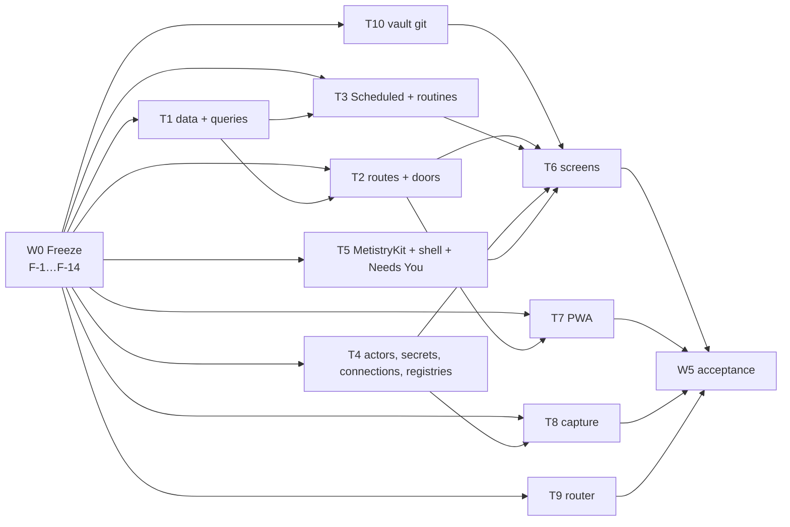

# Design round 0 — approved spec and execution plan

**Status: the approved spec**, rewritten for execution to the owner's rulings of
2026-09-26 on #260 and to **his answers to all 25 up-front questions** (§4, the same
day). It is what implement agents build the final design to
(`docs/product/design/`, merged as #263). Nothing in it waits on the owner except
the owner-hand steps scheduled in §3.4.

**Agents do not read this file whole.** Each ticket is one page under
`docs/product/tickets/`, generated from §3.3 by `ops/scripts/tickets.mjs`; the
standing rules are `docs/ops/agent-brief.md` (§3.6).

Written against `origin/main` at `0b20767` (#263's merge). Every code citation
was re-checked there (Appendix A).

---

## 0. How to use this spec

**Who reads what.** The coordinator reads all of it. An implement agent reads
**`docs/ops/agent-brief.md`, its ticket file under `docs/product/tickets/`, and
the §2 section the ticket cites** — every ticket is written to be buildable from
those three alone.

**Precedence.** This spec, then `docs/product/design/DEVELOPER-HANDOFF.md` §0's
order (the ratified C-rows, `design-system-amendments.md`, the screen and
component specs, `glossary.md`, the older product docs). Where this spec names a
reading of the design, build that reading (§1.4).

**The naming rule, on every line of code.** The design writes the assistant's
name, *Metis*, into labels. `CLAUDE.md` makes a hardcoded "Metis" in a path,
table, env var, package, class or function a bug, and C88 agrees for the
interface: every label templates `identity.yaml`'s `name`, served by
`GET /api/identity`. In code the assistant is `assistant`.

**Universal acceptance — every ticket, stated once (U1–U10).**

- **U1** CI green, including the job that applies migrations twice.
- **U2** Every new door ships its **misuse tests** (invariant 8): the four the
  console already asserts per route — 401 with no credential, 403 for an agent
  bearer, 403 for the capture owner token, the local owner token reaches it —
  plus the ticket's own, marked **bold** in its Tests line.
- **U3** Enforce at the tool, never by prompting: a refusal is a code path with a
  test, never a sentence in a prompt.
- **U4** Migrations additive, numbered from the reserved table (§2.9), each with a
  durability comment and a rollback note.
- **U5** No new dependency. `@modelcontextprotocol/sdk`, `pg`, `zod`, `yaml`,
  `chokidar`, `web-push`, `@simplewebauthn/*` are pre-approved; anything else
  goes back to the coordinator.
- **U6** Casing: the vault is TitleCase, `.metistry/` and the repo lowercase
  (`ops/scripts/check-path-case.sh`).
- **U7** A route, action or CLI verb that changes updates
  `docs/ops/client-api.md` (the contract, F-1) or `docs/ops/cli.md` in the same
  PR.
- **U8** A package change carries a changeset; a change with product
  significance carries one fragment under `docs/product/record/`.
- **U9** A view ticket meets §2.18 (keyboard, VoiceOver, Reduce Motion, largest
  text) and its screen's row of the state table (`components-03` §2), and is
  built against the recorded fixtures (F-7) before its routes land.
- **U10** A ticket that finds this spec wrong stops and reports the
  contradiction to the coordinator; it does not route around it.

---

## 1. Rulings

### 1.1 The owner's rulings of 2026-09-26, and where each lands

| # | Ruling (owner's words where quoted) | What it changes | Where |
| --- | --- | --- | --- |
| 1 | **One client API.** "the desktop app (and maybe the PWA) should use a similar interface so that we can expand the product to more clients… the desktop app is the main interface and the management interface so there are some actions that only that client can do… it's the only client with direct access to the CLI interface and the local filesystem" | One versioned API — the console's routes and the closed action set — for the Mac, the PWA and a future iPhone app; the Mac uses the CLI and filesystem **only** for enumerated management-only actions; `console session --stdio` for the Mac, HTTPS for the rest | §2.1, §2.2; F-1, F-12, F-13 |
| 2 | **Everything scheduled is a routine, under Scheduled.** "Timing of the standup should be driven by the time of the associated routine… The same should apply to morning brief and other scheduled things… Unify under that model." | Standup, Morning Brief, Tomorrow's Plan, the fold, the weekly review and every sync are routines with their own schedule and config; Variables hold no schedule; `Me/profile.md` keeps facts about the owner | §2.5; T3 |
| 3 | **Lid closed** is an administrator change: the app explains how, warns, and keeps the value | A dialog with the command, how to undo it and the risks ("not recommended"); the setting is stored; doctor reports whether it is in effect | §2.15; T4-20, T6-11 |
| 4 | **One actor model.** "keep the definition of agents generic… That's how they configure the 'actors' in the system, regardless of where they're used" | One Agent (actor) type — identity, definition, permissions, tools and connections, compute — referenced by chat, routines, crews and Metis itself | §2.4; F-2, T4-6 |
| 5 | **Calendar and mail connections** — ICS feeds, Google Calendar, Gmail | `calendar` and `mail` join the connection types; EventKit and Apple Mail stay read-only bridges; replying to an invitation and drafting mail become capabilities of specific transports | §2.6; T4-12…T4-17 |
| 6 | **Everything extendable.** "implement our internal models… in a way that assumes the plugin system is coming soon. Make things clean, keep interfaces simple… easy for a human to understand" | The extension model: a manifested directory per extensible kind, registries keyed by manifest instead of hardcoded lists, security vocabularies kept closed | §2.7; F-3, T4-5 |
| 7 | **C60** do not build. **C76** build the chosen UX. **C82** Areas rename approved. **C104** accept both names | No Chat pane; Window + audio + microphone *and* Audio only; `projects_overview` becomes Areas; `decision` and `decided` both accepted as the report kind | T1-14, T2-3, T8 |
| 8 | **Q1 — a dynamic router.** "Rather than routing to a model directly, Metis uses a DYNAMIC ROUTER that chooses the right operations and compute necessary… I'm willing to revise my statement on 'a model does not choose other models' if necessary." Tiers stay in Advanced | Rules stay the outer control; inside them a local policy picks operations and compute per request; the invariant-4 amendment is proposed for ratification; the composer wiring is gated on it | §2.8; T9 |
| Q2–Q10 | **Q2** leave as is · **Q3** secrets **per instance only** ("no bleed between instances… simpler and easier to test") · **Q4** standup settings are the Standup routine's · **Q5** yes (`connection_call`, and 26 → 28 tools) · **Q6** capture every permission meeting capture needs · **Q7** keep audio until transcribed and ingested, acceptable until after the fold; "check the audio again" must work · **Q8** phone settings mostly read-only, decided per setting by what is unsafe remotely · **Q9** start with *Open in Calendar*, add ICS/Google later · **Q10** Decline always sends `deny` | K7 closed with a migration; K8/K13 closed by ruling 2; `connection_call` is the fifth action kind; the TCC enum gains `screen_recording`, `microphone`, `audio_capture`; retention and a re-review tool; the remote-exposure table | §2.2, §2.3, §2.14, §2.15; T4-3, T4-9, T8 |
| 9 | **Execution.** "optimize how it's implemented so that you have the autonomy you need to oversee the sub-agents… enough parallelism and questions answered up front… several weeks… without significant oversight from me" | An interface-freeze wave, ten parallel tracks of self-contained tickets, a wave schedule with a release per wave, and the up-front questions | §3, §4 |

### 1.1a The answers of 2026-09-26, and the three additions

The owner answered §4 the same day (all 25; the record is §4) and asked for three
additions, each now a first-class part of the plan:

| Addition | Owner's words | Where |
| --- | --- | --- |
| **A — Real-time push** | "Should we add a way for the client to subscribe to live changes on the server? Things like agent communication, working indicators, status changes…" | §2.20; T2-18, T5-7, T7-7 |
| **B — Vault git** | "Metistry should manage this itself so changes are saved in a granular enough way to allow safe rollback… Metistry should also assume the user may commit and push themselves at any time." | §2.21; track T10 |
| **C — Token efficiency** | "the appropriate model for each sub-agent, scoping their session/context well, and maintaining your own context window size" | §3.6; one file per ticket, the agent brief, a model per ticket, a status per ticket |

Two answers moved the plan more than a yes: **Q7** (calendar replies — §2.6's
*Resolving Q7*) and **Q22** (Linear becomes a connection type built now — §2.6,
T4-24…T4-26). The ratified `CLAUDE.md` wording (Q1, Q3) is ticket **F-0**.

### 1.2 The decisions ledger

Every owner ruling in the design record — round 00's nineteen answers
(*Ratified — 2026-09-18*), review 01's eleven (C88–C98), every C-row marked
ruled, closed or ratified through C138, and rulings recorded inside screen
specs — with its status on main at `0b20767` and the ticket that builds it.
**Status**: Done · Partial · Not started · Ruled 09-26 (an owner answer from
§1.1 settled it).

**Navigation and shell**

| # | Decision | Recorded | Main today | Built by |
| --- | --- | --- | --- | --- |
| N1 | Feed is **Activity** | Ratified 09-18 #1 | Partial — MetistryKit `ActivityFeed`; PWA `data-view="feed"` (`index.html:23`) | T7-2 |
| N2 | **work** is a noun; the section stays Work | #2 | Done (glossary) | — |
| N3 | Sidebar **Today · Chat · Activity · Work ▸ · Knowledge ▸ · Agents · Scheduled**, then Pinned | C30, C50, C57, C113; owner 09-22 accepted extra rows | Not started — the Mac window has one destination, *Status* (`root-view.swift:17`) | T5-2 |
| N4 | **Needs You row** above Today only while something waits; the one badge; no Mac bell; ⌘0 | C110 | Not started | T1-7, T5-2 |
| N5 | **Usage gauge** top-right beside **+** (the owner's "System button"); *Insights* reserved | #5, #17, brand-kit round B, screen 17 | Not started | T5-6 |
| N6 | Chat as a persistent pane | C60 | **Ruled 09-26: do not build** | — |
| N7 | Window title is **Metistry** | brand-kit 09-19 | Not started (Mac) | T5-2 |
| N8 | Labels use **the configured name**; set in Settings ▸ Instance | C88, C123 | Partial — `GET /api/identity` serves it; `metistry identity` is read-only | T2-16, T5-2 |
| N9 | Dock carries the Needs You count; board escalations a footnote count | #11, C1, C36 | Not started | T5-2, T6-7 |
| N10 | Menu bar keeps four SF Symbols | #14 | Done | — |
| N11 | **Metistry** / `metistry` | #15 | Not started — manifest `name: "metistry"` | F-9 |
| N12 | No Rooms list; **Has Thread**; *Open Room* over Board | #4, C89 | Not started — PWA ships Rooms | T1-2, T6-7, T7-3 |

**Colour, type, motion**

| # | Decision | Recorded | Main today | Built by |
| --- | --- | --- | --- | --- |
| T1 | Quiet-fill roles; CI checks the **painted** ground | #6 | Partial — roles merged; `style.css:224, 285–297` not repointed; no painted-ground check | F-10, T7-1 |
| T2 | `stale` role and age pattern | #7 | Partial — role merged | T5-3 |
| T3 | **Accent pinned**, not `controlAccentColor` | #8, C11 | Not guarded | F-10 |
| T4 | Chart palette, judged at 3:1 | #9 | **Done** (#263's `NON_TEXT`) | — |
| T5 | The `--check` extension | #19 | Not started | F-10 |
| T6 | `ICON_PNG` in `build-app.sh` | #16, C9 | Not started (`ops/release/build-app.sh:130`) | F-9 |
| T7 | Motion: a closed list of two, both still under Reduce Motion | C16, C75 | Not started | T6-2, T8-5 |
| T8 | Agent prose: 2px rule in a transcript, wash elsewhere | C69 | Not started | T5-3 |
| T9 | Serif stack (web) / `.serif` (SwiftUI) | C32, C35 | Partial — tokens merged | T5-3, T7-1 |
| T10 | Painted-ground contrast; dimmer ink not opacity; `border-control` outlines; weight not two inks; glass floors | C49, C54, C63, C70, C73, C74 | Not started | T5-3, T8-5 |
| T11 | Light chart chroma | C87 | **Ruled 09-26: ship as merged** | — |
| T12 | HIG title case; values verbatim; 12-hour clocks | amendments §8.1, #12 | Not started | T5-3 |

**Needs You and requests**

| # | Decision | Recorded | Main today | Built by |
| --- | --- | --- | --- | --- |
| R1 | **Approve · Revise · Decline**, then Later; Skip bulk-only; Approve the one accent fill | C92 | Contradicts `docs/ops/reply-feedback.md`'s six verbs (K2) | F-14, T5-4 |
| R2 | `action` reads **action** | C80 | Not started (`pending_requests.yaml:79`) | F-5 |
| R3 | One pattern; closed set of bodies; **twelve types** | screen 3 §12 | Not started | F-5, T5-4 |
| R4 | Questions: several per request, *Something else…*, Revise free text, never executed | C105 | Partial — chat settles one question in free text (`server.ts:625–635`) | T2-3 |
| R5 | Questions **step one at a time** | screen 3 §13.2 | Not started | T5-4 |
| R6 | **Pull requests** reviewed in Metistry, posted as the owner, from agents and GitHub | C106, C107 | Not started | T2-13 |
| R7 | **Hub rule**: a sync raises a request only when the source names the owner; mirrors clear with the source | C108 | Not started | T1-8, T4-23 |
| R8 | Owner events become requests | C96 | Partial — budget stop is a report (`apps/assistant/src/budgets.ts`; X-13, W3 housekeeping); sync-conflict copies are `report` (`indexer.ts:286–302`) | T2-9 |
| R9 | Revise on access **only grants less** | C40 | Not started (`server.ts:1389–1390`) | T2-2 |
| R10 | A failed consequential operation leaves the request pending | C45 | Done in behaviour; not tested per door | T2-15 |
| R11 | Needs You is a **list-and-detail view** | C109 → C110 | Not started | T5-4 |
| R12 | A meeting is one card; Accept All one approval per item | C81 | Not started | T1-8, T8-7 |
| R13 | Report kind `decision` / `decided` | C104 | **Ruled 09-26: accept both** | T2-3 |
| R14 | Render `trust`, neutral | C22 | Not started | T5-4 |
| R15 | Decline always sends `deny`, with its consequences | Q10 | **Ruled 09-26** | F-14, T5-4 |

**Today and the daily flow**

| # | Decision | Recorded | Main today | Built by |
| --- | --- | --- | --- | --- |
| D1 | **One Morning Brief**, Today's first state; a machine-owned file | C97 | Not started | T3-6 |
| D2 | **Standup** and **Tomorrow's Plan** are routines; the brief presents the standup file | C111 | Not started | T3-5, T3-7 |
| D3 | **Ticking** in phase 1; **no confirm**; Undo; 409 on a changed line | C98, C99 | Not started | T2-4 |
| D4 | **Close the Day writes the vault** | C101 | Not started | T2-5, T2-8, T3-7 |
| D5 | **One writer per region** in the daily note | C102 | Not started (K5) | T2-6 |
| D6 | Generated prose outside fold templates | C103 | Not started | T3-6 |
| D7 | Metis moves meetings **after a warning** | C90 | Not started — eventkit has no move tool | T2-12 |
| D8 | The do-date reads **Planned** | C134 | Not started | T5-3 |
| D9 | Next Up, Slipping, three predictions a page | review-01 §5 | Not started — A1 partial: events carry `id, location, calendar`, attendee **names** (`ek-helper.swift:58–60`) | T2-11, T6-1 |
| D10 | Today's drag order stored server-side | C29 (developer's) | Decided here: `today_order` | T1-9 |

**Scheduled**

| # | Decision | Recorded | Main today | Built by |
| --- | --- | --- | --- | --- |
| S1 | **Scheduled**, tabs Routines and Syncs | C113 | Not started | T3-3, T6-6 |
| S2 | Everything scheduled visible and editable; **default** tag; Reset to Default | C111, C112 | Not started — schedules are product manifests read at start (`apps/console/src/main.ts:292–295`) | T3-1, T3-2 |
| S3 | Sync cadence and raise rules are instance config | C112, C113 | Not started | T3-2 |
| S4 | Inbox Sort, Usage Rollup as default routines | C113 | Not started | T3-2 |
| S5 | Routine display names | C55 | Not started | T3-2 |
| S6 | A routine is an **assignment** of an actor with a task | HANDOFF §3; ruling 4 | Not started | T3-8 |
| S7 | Routine runs are their own Activity group | C43 | Not started (`activity_feed.yaml:81–82`) | T1-3 |
| S8 | Routine suggestions are improvement requests | screen 8 §10.4 | Not started | T3-11 |
| S9 | **All timing lives on routines**; the profile holds owner facts | ruling 2, Q4 | **Ruled 09-26** | T3-4 |

**Connections, secrets, variables, permissions, agents**

| # | Decision | Recorded | Main today | Built by |
| --- | --- | --- | --- | --- |
| P1 | **Connection**, typed; *resource / target / source* retired | C114; ruling 5 adds calendar and mail | Not started | T4-8 |
| P2 | Per-tool **Allow · Ask First · Never**, grouped Reads · Changes things · Starts an agent | C114, C93 | Not started | T4-8, T4-9 |
| P3 | **Offer to agents** through the proxy; generated tools for non-MCP types | C115 | Not started | T4-10 |
| P4 | Known fields or HTTP / Command / Path; *What it sends*; host guards | C118 | Not started | T4-10, T6-13 |
| P5 | Ask = pause interactive, defer unattended; destructive defaults to Ask, may be On | C59, C61 | Not started (K4) | T4-9, T4-22 |
| P6 | Secrets in the Keychain, **per instance only**, `{{ secret.name }}` | C116; Q3 | **Ruled 09-26** — main scopes provider, AWS and Devin keys to the user (`packages/cli/src/secrets.ts:72–83`) | T4-1…T4-3 |
| P7 | Variables, plain, usable in instructions; **no scheduling** | C117; ruling 2 | Not started | T4-4 |
| P8 | Permissions: one table, absence is the denial | C58 | Not started | T4-6 |
| P9 | Metis is not on Agents | C52 | Partial — a view filter over `describeScope` | T6-5 |
| P10 | A project holds permissions; members inherit | screen 13, 09-22 | Not started | T1-13, T4-7 |
| P11 | Effective actions carry their reason | C46, C47 | **Done** (`packages/core/src/actions.ts:170–220`) | T7-1 (PWA stops recomputing) |
| A1 | One **actor** model; an agent's model and effort in its definition; tiers stay in Advanced | C128, C132; ruling 4; Q1 | **Ruled 09-26** | F-2, T4-6 |
| A2 | New Agent asks the kind; Run Now dimmed with its reason | C138 | Not started | T6-5 |
| A3 | Esc in the agent editor keeps a draft | C136 | Not started | T6-5 |
| A4 | The definition is the owner's hand; Metis never writes it | screen 7 §3.1 | Not started | T4-6 |
| A5 | The escalation ceiling is visible | C42 | Not started (`packages/mcp-brain/src/access.ts:86, :133`) | T2-2 |
| A6 | Approve on access states the tier trade | C41 | Partial (`agents.ts:600–616`) | T2-2 |

**Settings, work, knowledge, capture, accessibility, PWA**

| # | Decision | Recorded | Main today | Built by |
| --- | --- | --- | --- | --- |
| G1 | Settings: sidebar, **fixed 840 × 600**, panes scroll; *Connections* → **Account** | C62, C86 | Not started — `640 × 520`, seven tabs (`settings-view.swift:47`, `settings-model.swift:54–89`) | T6-11 |
| G2 | Instance · Services · Updates · Keyboard · Advanced panes | C123, C124, C126, C127 | Partial — `metistry instances`, `doctor`, `restart/stop/start/logs`, `update --rollback` exist | T6-11 |
| G3 | Keep Awake with two sub-switches; lid closed → dialog | C129; ruling 3 | **Ruled 09-26** | T4-20, T6-11 |
| G4 | Compute one column; one model dropdown; no fallback | C130–C132 | Partial — no fallback already enforced (`packages/core/src/compute.ts:107`) | T4-18, T6-12 |
| G5 | Spending limits **enforced** | C133 | **Done in the engine**; copy stale in the app and CLI | F-14 |
| G6 | Sessions kept 30 days, outside git; fold before expiry | C78, C91 | Not started | T1-11, T3-9 |
| W1 | Five columns; Blocked; Assigned; Reported a facet | C2, C38, C39 | Not started (`console-data.swift:585–593`) | T1-2, T6-7 |
| W2 | Board carries blocked-by | C37 | Not started — `day_work.yaml:107–108` has it | T1-2 |
| W3 | Every card click opens the detail popover | C84 | Not started | T6-7 |
| W4 | `work.description` | C85 | Not started | T1-1 |
| W5 | Autonomous / Review; the rollup says why | C83, C94 | **Done in data** (`projects.ts:30, 53–61`) | T6-8 |
| W6 | Artifact threads in the margin | screen 16, 09-23 | Not started | T6-9 |
| W7 | The per-area rollup is **Areas** | C82 | **Ruled 09-26: approved** | T1-14 |
| K-1 | Knowledge leads with the fold, then Needs your eye, Areas, one sources line | screen 10 | Not started | T1-6, T6-4 |
| K-2 | Two timestamps on a failure; an expired credential is failed | C48, C64, C95 | Not started | T1-5 |
| K-3 | Learned facts are proposals | C79 | Not started | T3-10 |
| K-4 | `partial` state | C28 | **Ratified 09-26** | T5-3 |
| C1 | Capture receipt is id + path | C23 | **Done** (`server.ts:550–579`) | — |
| C2 | Idempotency-Key minted by the composer | C24 | Partial | T5-5 |
| C3 | App captures carry `source: app` | C25 | Not started — no migration needed | T2-1 |
| C4 | The bar: an edge the owner picks, same conversation as the window | screen 11, 09-22 | Not started | T8-5 |
| C5 | A meeting is window + sound + voice; *Audio only* stays | C76 | **Ruled 09-26: build both** | T8-2, T8-3 |
| C6 | Jots anchor to (session, offset) | C77 | Not started | T8-7 |
| C7 | Up to 10 hours; ~150 MB/h; audio kept until ingested | C137; Q7 | **Ruled 09-26** | T8-2, T8-4 |
| X1 | Every shortcut a menu item; ⌘0–⌘7; ⌘9 retired | C119 | Not started | T5-2 |
| X2 | Shortcuts in any app off by default, conflict-checked | C120, C127 | Not started | T6-16 |
| X3 | A Spoken table per screen | C121 | Not started — six `accessibilityLabel`s in the Swift tree | U9 |
| X4 | Reduce Motion and the largest text size | C122 | Not started | U9 |
| X5 | First paint is the last data; three failures raise one request | C135 | Partial — runner streak exists | T5-3, T3-12 |
| X6 | Undo when reversible, confirm naming the cost when not | C136 | Not started | T5-3 |
| X7 | No dead-end buttons | C138 | Not started | T6-5, T5-6 |
| Q1 | PWA: tab bar Today · Chat · Work · Knowledge · More; bell and + in the header | screen 18, 09-24 | Not started | T7-2 |
| E1 | Clients get **live changes** pushed | addition A, 09-26 | Not started — clients poll today (`app.js:153–179`) | T2-18, T5-7, T7-7 |
| E2 | Metistry manages the vault's **commits, pushes and rollback** | addition B, 09-26 | Partial — the reconciler commits every 30 s and pushes on a schedule, but never fetches, so a push from anywhere else stalls it (§2.21) | T10 |
| E3 | **Linear** is a connection type, built now | §4 Q22 | Not started — the task grammar already reads `linear:` refs (`task-line.ts:80`) | T4-24…T4-26 |
| Q2 | PWA offline: one rule per verb | screen 18 §4 | Not started | T7-4 |
| Q3 | Phone settings mostly read-only | Q8 | **Ruled 09-26** | §2.3, T7-6 |
| Q4 | Python exempt for design tooling | owner 09-22 | Done (`CLAUDE.md:97–101`) | — |

### 1.3 Contradictions with merged rulings and code — how each is closed

| K | Design | Merged side | Closed by |
| --- | --- | --- | --- |
| **K1** | Eight rows, Today first, a conditional ninth | `daily-flow-spec.md` §10 "No new top-level section"; D19 | Owner 09-22 (rows accepted); the spec is bannered |
| **K2** | Three answers + Later; Skip bulk-only | `docs/ops/reply-feedback.md` "six verbs" | C92 + Q10: F-14 rewrites `reply-feedback.md` to §2.12's table; Decline is always `deny` |
| **K3** | Metis not on Agents | #235 lets the internal principal ask; `describeScope` renders it | A view filter; the triple stays for the CLI and the access card |
| **K4** | A destructive connection tool may be **On** | `CLAUDE.md` Packages: every bridge does preview-then-confirm on destructive tools | **Ratified 09-26** (§4 Q3); the sentence lands in `CLAUDE.md` through F-0 |
| **K5** | One writer per region in the daily note | daily-flow §5.1 one writer per file; #255's `isUserOwnedPath` refusal | C102; built as a reconciler section operation that proves the rest of the file unchanged (§2.13, T2-6) |
| **K6** | Deferring writes `⏳ <date>` / `#someday` | daily-flow D2/D3: the parser emits one form, English tokens (`task-line.ts:1–8`) | Write `do <date>` via `formatTaskLine`; add a `someday` token (T2-5) |
| **K7** | Secrets per instance | `SECRET_SCOPES` user scope, deliberate | **Q3 ruled per instance**; migration in §2.14, T4-3 |
| **K8** | Variables hold `standup_time`, `timezone` | `Me/profile.md` holds owner facts (daily-flow §6.6) | **Ruling 2**: scheduling lives on routines; the profile keeps facts (§2.5) |
| **K9** | The app configures connections, routines, secrets, identity | #258 §4.13 "no in-app editor"; the console may write two protected paths (`apps/reconciler/src/paths.ts:100–135`) | **Ruling 1**: one API plus enumerated management-only actions (§2.1–2.2) |
| **K10** | *Allow sleep when the lid is closed* can be off | `power.ts` `LID_CLOSED_NOT_AVAILABLE`; "lid close must always sleep" (09-19) | **Ruling 3**: keep the value, show the administrator steps and the warning (§2.15) |
| **K11** | Audio kept until the fold (C137) | screen 11 §8 "audio — never kept"; #253 frames dropped | **Q7**: kept until transcribed and ingested, at most until after the fold; screen 11's copy changes (§2.15) |
| **K12** | Metis uses one model | Invariant 4; the router's tiers incl. `intent` (#257) and `routine` | **Q1**: tiers stay in Advanced; the dynamic router (§2.8); the amended invariant 4 **ratified 09-26**, landed by F-0 |
| **K13** | Standup at a fixed time | daily-flow §7 "within the hour before `standup_time`" | **Ruling 2**: the routine's schedule decides — 8:00 AM by default (§4 Q12) |
| **K14** | Limits enforced | the Mac app and CLI say they are not | The engine is right; F-14 fixes the copy |
| **K15** | Mirrors clear with their source | `morning-brief` expires every pending row after 14 days (`run.ts:15, 251–255`) | Rows with a `source` are exempt (T1-8) |
| **K16** | Answer invitations in Metistry | EventKit cannot: `EKParticipant.participantStatus` is `readonly` and the framework has no response call — **verified in the macOS 26.5 SDK headers** | **Q9 + §4 Q7**: *Open in Calendar* first; replies through CalDAV with an app password, then Google with Metistry's own OAuth client (§2.6) |
| **K17** | *Draft Reply* in Mail | D17: Apple Mail bridge read-only | **Ruling 5 + §4 Q8**: an IMAP `mail` connection drafts (§2.6) |
| **K18** | Rename `decision` → `decided` | a published tool schema | **Ruled: accept both** (T2-3) |
| **K19** | Stale sentences in the designer's record (Rooms as a Work child, *Routines* row, the gauge "beside the bell") | C89, C113, C110 | Build the rulings; X-1 sweeps the docs |

### 1.4 Where the design disagrees with itself — the reading to build

| Topic | Disagreement | Build |
| --- | --- | --- |
| Revise | "always free text" vs access Revise = a narrowing control | Access: `accept_with_changes {area}` (narrower only). Every other type: `accept_with_changes {feedback}` |
| Dismiss / Not Mine | banned on requests by amendments §8.1; used by screen 3 §12.2 | As drawn in §12; both send `skip` |
| Approve as Work | folded into Approve (components-01) vs offered (glossary) | Approve sends `accept_as_work` when `payload.suggested_work` exists |
| Projects empty state | "no New Project" vs *New Project* | Projects appear on first use; the empty state links to Board |
| Tomorrow's Plan time | 7 PM vs the profile's evening gate | **Answered (§4 Q12):** 11:00 PM on the eve of a working day, after the fold; the close trigger earlier (§2.5) |

---

## 2. The frozen interfaces

Everything in this section is **frozen by Wave 0** (§3). A ticket that needs it
to change goes back to the coordinator (U10).

### 2.1 The client API

**One API for every client.** The console's routes and its closed action set
are the interface the Mac app, the PWA and a future iPhone app all speak. The
Mac reaches it through `metistry console session --stdio` (F-12: one long-lived
CLI child, newline-delimited JSON requests and responses, the owner token never
entering the app's process); the PWA and a future phone over HTTPS with a
passkey session. **Same routes, same bodies, same errors.**

**The contract is a document and a table** (F-1):

- `docs/ops/client-api.md` — every route, action and principal, its reach, its
  body, its error and conflict semantics, and the CLI-only operations (§2.2).
  `docs/ops/console-api.md`'s sections move into it, route by route.
- `packages/core/src/client-api.ts` — the same table as data:
  `{method, path, reach, principals, idempotent, conflict, cursor}` per route.
  The console's gate reads it, and a conformance test fails CI when the server
  serves a route the table does not list or the table lists one nothing serves.

**Reach — four classes, enforced at the gate, never by the client:**

| Reach | Who gets through | How it is proved |
| --- | --- | --- |
| `public` | anyone | the bootstrap: health, identity, the WebAuthn ceremony |
| `agent` | agent bearers, the capture owner token | `/mcp`, `POST /capture` |
| `owner` | the owner, from any client | a passkey session **or** the local owner token |
| `local` | the owner **on this Mac** | the local owner token only — accepted solely from a loopback peer (`apps/console/src/local-owner.ts`); a passkey session, even from the same Mac, is refused `403 local_only` naming the Mac app |

The gate is the existing `may(principalOf(auth), "act", {kind: "console", door:
"console_management", route})` (`server.ts:800`) plus one check from the table:
`reach === "local" && auth.kind !== "local_owner"` → `403 local_only` (F-13).

**Live changes.** `GET /api/events` is a Server-Sent Events stream at reach
`owner`: typed events carrying **ids, never bodies**, so a client learns *what*
changed and refetches it through the route that already enforces who may read it
(§2.20). `GET /api/identity` advertises it as the `events` capability; polling with
`since` cursors stays the fallback.

**Versioning.** `api_version: 1` in `GET /api/identity` and `GET /health`, and a
`Metistry-API-Version` response header. An additive change (a route, a field, a
value) keeps the version; removing or changing the meaning of anything is
version 2, served beside version 1 for at least one release. A client refuses a
console below its minimum with an upgrade sentence, never a crash.

**Errors.** `packages/core`'s envelope `{error: {code, message}}` on every
refusal; `409` carries `reason` and the row as it stands; `Idempotency-Key` is
honoured where the table says `idempotent`; list routes take a `since` cursor
where it says `cursor`.

**The closed action set** (invariant 10; what an agent may *propose* and an
owner's Approve runs): `dispatch`, `task_update`, `comment`, `capture`, and — by
Q5 — **`connection_call`**, args closed to `{connection, tool, args,
confirm_token}`, whose effective mode is never `allow` in its first release.

**The route table.** *Existing* routes keep their behaviour; their reach is
recorded. *New* routes cite their ticket. All `owner` unless marked.

| Route | Reach | Notes | Status |
| --- | --- | --- | --- |
| `GET /health`, `GET /api/identity` | public | + `api_version` | exists; F-1 |
| `POST /auth/enroll/{start,finish}`, `POST /auth/login/{start,finish}` | public | | exists |
| `POST /auth/logout`, `GET /api/whoami` | owner | | exists |
| `POST /capture` | agent · owner | `Idempotency-Key`; `source: app` for owner credentials | exists; T2-1 |
| `/mcp` | agent | | exists |
| `POST /message`, `GET /api/messages`, `POST\|DELETE /api/messages/:id/feedback` | owner | `tier` hint | exists |
| `GET /api/push/vapid-key`, `POST /api/push/subscribe` | owner | | exists |
| `GET /api/status`, `GET /api/devices`, `POST /api/devices/:id/revoke` | owner | | exists |
| `GET /api/proposals`, `POST /api/proposals/batch` | owner | cursor; per-row results | exists |
| `POST /api/proposals/:id` | owner | `if_unchanged` → 409; question answers v2 | exists; T2-3 |
| `GET /api/agents` | owner | + `permissions` rows | exists; T4-6 |
| `POST /api/agents`, `POST /api/agents/:id/rotate` | **local** | mint a bearer — a new credential is a boundary change | exists; **reach changes**, F-13 |
| `PUT /api/agents/:id/{grants,projects,autonomy}`, `POST /api/agents/:id/{revoke,approve}` | owner | widenings audited and alerted, as today | exists |
| `GET /api/agents/:id/definition` | owner | read-only; the write is CLI (§2.2) | new; T4-6 |
| `GET /api/projects`, `PUT /api/projects/:slug` | owner | | exists |
| `GET /api/targets`, `POST /api/tasks/:id/dispatch` | owner | targets become Agent connections (T4-11) | exists |
| `PATCH /api/tasks/:id`, `POST /api/tasks/:id/{claim,release,renew}` | owner | + `description` | exists; T1-1 |
| `/api/artifacts/**`, `POST /api/dispatches`, `/api/work/:id/{thread,comments,thread/resolve,thread/reopen}` | owner | | exists |
| `GET /api/runs/export`, `GET /api/runs/:id` | owner | | exists |
| `GET /api/instances`, `GET /api/commands` | owner | | exists |
| `GET /api/compute`, `GET /api/compute/models`, `POST /api/compute/{assign,budget,providers/test}` | owner | budgets are designed onto the phone | exists |
| `GET /api/compute/catalogue`, `POST /api/compute/unassign` | owner | the catalogue grouped by model; `default` is reassigned, never unassigned (W2 housekeeping) | T4-18 |
| `GET /api/knowledge/{search,page,pages,links}` | owner | | exists |
| `GET /api/q/:name` | owner (agents via `queries_run`) | `expose: generic` only | exists |
| `GET /api/needs-you/count` | owner | the sidebar row, the Dock badge | T1-7 |
| `GET /api/today`, `GET /api/vault-tasks`, `PUT /api/today/order` | owner | | T2-7 |
| `POST /api/vault-tasks/:task_key/check`, `…/schedule` | owner | `seen_text` → 409; replayable from an outbox | T2-4, T2-5 |
| `POST /api/today/close` | owner | | T2-8 |
| `POST /api/meetings/:event_id/note` | owner | idempotent per event | T2-11 |
| `POST /api/calendar/events/:id/move` | owner | preview → confirm, token single-use | T2-12 |
| `POST /api/calendar/invitations/:id/respond`, `POST /api/mail/messages/:id/draft` | owner | through the connection that can; never sends mail | T4-17 |
| `GET /api/knowledge/{fold,drafts,areas}`, `POST /api/knowledge/conflicts/resolve` | owner | 409 | T1-6, T2-10 |
| `GET /api/scheduled`, `GET /api/scheduled/{routines,syncs}/:name` | owner | | T3-3 |
| `PUT /api/scheduled/routines/:name/schedule`, `POST …/{pause,resume,run}`, `DELETE /api/scheduled/routines/:name` | owner | Reset to Default is the DELETE | T3-3 |
| `PUT /api/scheduled/routines/:name/assignment`, `POST /api/scheduled/routines` | **local** | the actor, the task and the per-run grants change what runs | T3-3, T3-8 |
| `PUT /api/scheduled/syncs/:name`, `POST /api/scheduled/syncs/:name/run` | owner | cadence, pause, raise toggles | T3-3 |
| `GET /api/turns/:turn_id/progress`, `GET /api/sessions/:id` | owner | | T2-17 |
| `POST /api/sessions/purge` | **local** | irreversible; the confirm names unfolded sessions and offers *Fold First* | T3-9 |
| `GET /api/connections`, `GET /api/connections/:name` | owner | read-only; every write is CLI | T4-8 |
| `GET /api/secrets`, `GET /api/variables` | owner | names, hosts, grants, last used — **never a secret value** | T4-1, T4-4 |
| `GET /api/recordings/:id` | owner | retention state | T8-4 |
| `POST /api/github/pulls/:owner/:repo/:number/review`, `…/threads/:id/{reply,resolve}` | owner | head SHA must match | T2-13 |
| `POST\|DELETE /api/prose/:id/feedback` | owner | | T1-12 |
| `GET /api/events` | owner | SSE; `Last-Event-ID` resumes; ids only (§2.20) | T2-18 |
| `GET /api/vault/status` | owner | ahead/behind, last commit, last push, conflict | T10-2 |
| `GET /api/knowledge/history?path=`, `GET /api/knowledge/version?path=&sha=` | owner | a file's commits; one file at one commit | T10-4 |
| `POST /api/knowledge/restore` | **local** | raises a Needs You request; Approve restores as `user` (§2.21); not reachable from the phone — §2.3 wins (ruled 2026-09-27) | T10-5, X-9 |
| `POST /api/vault/rollback` | **local** | raises a Needs You request with the preview; Approve reverts as `user` | T10-6 |
| `POST /api/trackers/:connection/issues`, `POST /api/trackers/:connection/issues/:key/complete` | owner | through a `tracker` connection's capability (Linear first) | T4-25, T4-26 |
| `POST /api/vault-tasks/:task_key/link` | owner | adds one `linear:` (or `gh:`) ref to one line; 409 | T4-25 |

**The console writes exactly three protected paths**: the two it writes today
(`.metistry/assistant-prompt.md`, `.metistry/compute.yaml`) and
**`.metistry/scheduled.yaml`** (T3-2). Every other protected path is written by
the CLI with the owner caller class (`apps/reconciler/src/paths.ts:132–135`).

### 2.2 Management-only — exactly what the Mac does outside the API

The Mac app uses the CLI or the filesystem **only** for these, each because the
console cannot or must not do it (credentials, the machine, code that runs):

| # | Action | CLI verb (owner caller class) | Why not the API |
| --- | --- | --- | --- |
| M1 | Install, first run, runtime seed | `metistry init`, `runtime install`, `up`, `down`, `migrate-*` | the console is not running yet, or is what is being installed |
| M2 | Update and roll back the runtime | `metistry update [--channel\|--version\|--rollback]` | replaces the console itself |
| M3 | Deployment shape | `metistry deployment set-shape` | moves the data between shapes |
| M4 | Keep awake, and the lid-closed setting | `metistry deployment set-keep-awake` (object form, T4-20) | a machine setting; the lid dialog never runs a command |
| M5 | Service lifecycle and logs | `metistry restart\|stop\|start [service]`, `logs` | the supervisor's local socket; a remote stop locks the owner out |
| M6 | Doctor | `metistry doctor --json` | local probes: launchd, containers, TCC |
| M7 | Secrets | `metistry secrets set\|replace\|remove\|hosts\|grant\|migrate-scope\|purge-shared` | the login Keychain; a value never crosses the API |
| M8 | Instance repository | `metistry connect-repo` | git remote and credentials |
| M9 | Connect a local tool | `metistry connect <tool>` | writes the tool's own config files |
| M10 | The assistant's identity | `metistry identity set` (T2-16) | `.metistry/identity.yaml` |
| M11 | Linked instances | `metistry instances add\|remove\|refresh` | a trust relationship with another origin |
| M12 | Agent definitions | `metistry agents define <id>` (T4-6) | `.metistry/agents/**` — how an actor behaves |
| M13 | Connections | `metistry connections add\|set\|remove\|policy\|test` (T4-8) | `.metistry/connections/**` — hosts, commands, credentials, tool modes, the offer switch |
| M14 | Variables | `metistry variables set\|unset` (T4-4) | `.metistry/variables.yaml` — text agents read |
| M15 | Extensions | `metistry extensions add\|remove\|list` (T4-5) | `.metistry/extensions/**` — what the product loads |
| M16 | Compute providers | `metistry compute providers add\|remove\|set` | keys and base URLs — where prompts go |
| M17 | Models on this Mac | `metistry compute models install\|load\|unload` | this Mac's disk and memory |
| M18 | The vault's git policy and rollback | `metistry vault settings`, `metistry vault rollback <commit\|--to date\|--file path>` (T10-2, T10-6) | the repository's history and its remote; a rollback still waits for Approve in Needs You |
| M19 | Add a phone: mint a passkey enrolment code | `metistry enroll [--json]`, `metistry enroll --cancel <id>` (X-75; §2.22) *(ruled 2026-09-28)* | a first credential for a new device; shell access to this Mac is its root of trust (plan §4.2), so no HTTP route mints one |
| M20 | Remote access: the provider the phone reaches this Mac through | `metistry remote [status]\|set\|authorize\|test\|off` (X-105…X-114; §2.23) *(ruled 2026-09-30)* | the provider's credentials live in the login Keychain, and it decides what is exposed to the internet |

**Device-local, no CLI and no API:** global hot keys, the capture bar's placement
and window preferences, the login item, reading TCC state, the instance chooser
and recents, and **controlling a recording** — the app talks to the local
live-capture bridge directly; what a recording produces reaches Metistry through
`POST /capture` like any capture.

### 2.3 What a remote client may do — the Q8 table

**The line:** *a remote client may act inside the boundary; only the Mac may
change the boundary itself* — what runs, where data may go, which credentials
exist. Reach (§2.1) enforces it; a client hiding a control is never the control.

| Setting or act | Phone / PWA | Mac | Why |
| --- | --- | --- | --- |
| Needs You answers, ticks, defers, Close the Day, captures, chat | write | write | the daily acts |
| Board, projects (mode, daily budget), rooms, artifact comments | write | write | inside the boundary |
| Agents: grants, projects, autonomy, revoke, approve an enrolment | write (audited and alerted, as today) | write | who may do what, inside the boundary |
| Agents: register or rotate a bearer; edit a definition | read | write | a new credential; how an actor behaves |
| Scheduled: pause, resume, Run Now, a schedule, Reset, sync cadence and raise toggles | write | write | timing, inside budgets |
| Scheduled: a routine's actor, task or per-run grants; New Routine | read | write | changes what runs |
| Compute: Metis's model and effort, spending limits | write | write | spends within configured providers |
| Compute: providers, keys, base URLs, installing models | read | write | where prompts and keys go; this Mac's disk |
| Connections: status, tools, used by | read | read | — |
| Connections: add, configure, tool modes, Offer to agents | — | write | hosts, commands, credentials, agent reach |
| Secrets: names, hosts, grants, last used | read | read | a value is never shown anywhere |
| Secrets: set, replace, remove | — | write | the Keychain |
| Variables | — | write | Mac-only by design |
| Instance: name, mention, mark | read | write | |
| Instance: path, ports, linked instances | — | write | local filesystem; trust with other origins |
| Services: health (`GET /api/status`); Doctor on the Mac | read | read | Doctor's probes are local (M6) |
| Services: restart, stop, start, logs; Keep Awake | — | write | the machine; a remote stop locks the owner out |
| Updates: versions | read | read | |
| Updates: update, roll back, runtime source | — | write | replaces running code |
| Devices: the list, remove a device, Sign Out Everywhere (in Account until §2.22) | write | write | a lost phone is revoked from another device |
| Devices: Add a Phone (an enrolment code, M19) | — | write | a new credential; shell access to the Mac is the root of trust *(ruled 2026-09-28, §2.22)* |
| Account: console sign-in, instance repository | — | write | |
| Sessions: *Let Metis learn*, retention | write | write | the session-fold and purge routines' settings, through the Scheduled doors (§2.5) |
| Sessions: Purge Now | — | write | irreversible |
| Live Capture, Keyboard, Advanced | — | write | this Mac |
| Live changes (`GET /api/events`) | read | read | ids only |
| Linear: create an issue from a task, close one, link a task | write | write | the daily acts, through the connection's own tool modes |
| Vault: history of a file, the sync status | read | read | |
| Vault: restore a file, roll back, the push and pull policy | — | write | history and the remote are the boundary; each rollback still waits for Approve |

### 2.4 The actor model

**One type for everything that acts** (ruling 4): Metis, a crew Metis delegates
to, and an external agent that connects in. Chat runs the assistant actor; a
routine names an actor and a task; a crew run is an actor with a brief; the
permissions table renders an actor. Storage does not move — one resolver
composes what already exists, so this is a model, not a migration.

```ts
// packages/core/src/actor.ts (F-2)
interface Actor {
  id: string;                       // agents.id — a slug, never the assistant's name
  kind: "assistant" | "crew" | "external";   // agents.kind internal | crew | external
  displayName: string;              // the assistant: identity.yaml name
  definition: ActorDefinition | null;        // external: null — someone else's code
  permissions: {                    // describeScope's triple + provenance per line
    role: Role; scope: Scope; autonomy: ActionAutonomy;
    lines: PermissionRow[];         // describePermissions(): Resource × Read × Write
  };
  tools: { groups: CrewToolGroup[]; connections: string[] };  // brain groups + granted connections
  compute: { kind: "router" } | { kind: "model"; ref: `${string}/${string}`; effort: Effort }
         | { kind: "same_as_assistant" } | null;             // external: null
  limits: { maxTurns: number; budgetUsdPerRun: number } | null;
}
```

| Actor | Definition from | Permissions from | Compute |
| --- | --- | --- | --- |
| **assistant** (Metis) | `identity.yaml` (name, mention, mark) + `CLAUDE.md` + `.metistry/assistant-prompt.md` | unscoped by default (C52); `METISTRY_ASSISTANT_AREAS` narrows it; `agent_grant_overrides` (0023) merge on top — as `ensureInternalAgent` does today (`agents.ts:421`) | **`router`** — the dynamic router over `compute.yaml`'s assignments and `rules.yaml`'s tiers (§2.8) |
| **crew** | `.metistry/agents/<area>/<id>.md` — frontmatter + prompt | the frontmatter's `scope`, `projects`, `autonomy`, `uses`, plus connections it is granted; synced to its `agents` row (`crews.ts`) | frontmatter `model: <provider>/<model>` and `effort`, or `same_as_assistant` (Metis's **default tier model**, not the router — §4 Q14); the legacy `haiku \| sonnet \| opus` values resolve through `compute.yaml`'s `assignments.crews` for one release |
| **external** | none | the registry row (`agents.grants`, `projects`, `autonomy`) | none — it runs elsewhere |

**Where tiers go (Q1).** `rules.yaml`'s `tiers:` and `compute.yaml`'s
`assignments.tiers` stay, as the **allow-list the dynamic router chooses from**,
edited in Settings ▸ Compute ▸ Advanced. `assignments.crews` moves into crew
definitions (read as a fallback for one release, then warned by doctor).
**Metis uses** in Compute is `assignments.default`.

### 2.5 The Scheduled model — everything recurring, in one place

**Every scheduled thing is a routine or a sync, and all of their timing and
configuration lives under Scheduled** (ruling 2). Standup, Morning Brief,
Tomorrow's Plan, the Knowledge Fold, Reply Review, the Weekly Review, Inbox Sort,
Usage Rollup, and every sync.

**Layers**, resolved per field with its origin shown in the UI (*default* ·
*from your profile* · *yours*):

1. the **manifest** — a product routine or collector, or an extension (§2.7):
   the default schedule, the config schema, what it reads and writes;
2. **`Me/profile.md`** — facts about the owner a schedule may *follow*;
3. **`.metistry/scheduled.yaml`** — the owner's changes, written only through
   the Scheduled doors (T3-3); **Reset to Default** deletes an entry.

```yaml
# .metistry/scheduled.yaml (F-4 freezes the schema)
routines:
  standup:
    schedule: { days: working_days, at: ["08:00"] }   # or days: [mon, tue, …]
    paused: false
    config: { template: Templates/Standup.md, skip_without_calendar_event: false }
  vendor-sweep:                       # a New Routine: an assignment, no product code
    actor: vendor-research
    task: "Summarise everything added to Areas/Finance since yesterday…"
    grants: { read: [Areas/Finance] }   # per-run grants are read-only; Journal/Digest/ is the routine's own subfolder — ownership, not a grant (below)
    schedule: { days: [mon, tue, wed, thu, fri], at: ["07:00"] }
syncs:
  github-state:
    connection: github
    every: 15m                        # 5m | 15m | 1h | 6h
    raise: { review_requested: true, assigned: true }
```

**A sync's first `connection:`** is written by the connection setup flow
(`metistry connections add`, T4-9/T4-10) into `scheduled.yaml`; the Scheduled
door keeps refusing to set it (ruled 2026-09-27, the coordinator's call).

**Schedule shape (closed):** `{days, at, tz?}` — `days` is a list of weekdays,
`working_days`, or `eve_of_working_days` (every day whose next day is a working
day); `at` one or more `HH:MM`; `tz` defaults to the profile's
timezone — or `{every: 5m|15m|1h|6h}`. Cron strings in product manifests are
accepted for one release. The next-occurrence function is hand-rolled in
`packages/core/src/schedule.ts` over `Intl` (U5), with DST tested.

**How profile facts are read (and only read).** `Me/profile.md` keeps
`timezone`, `working_days`, `working_hours`, `daily_capacity_min`,
`task_size_minutes`, `today_cap` — facts about the owner, never written by
Metistry. A schedule whose `days` is `working_days` **follows the profile** until
the owner sets days on the routine; Close the Day's window reads `working_hours`;
a routine with `working_days` and no profile writes nothing and says so (§6.4's
absent state). **`standup_days` and `standup_time` move to the Standup routine**
(§4 Q13): T3-4 reads them once into `scheduled.yaml`, then **raises a proposal** —
*Tidy Me/profile.md: these two lines now live on the Standup routine* — with the
before and after. `Me/` is the owner's alone (#255), so nothing edits it
mechanically: Approve writes the change as `user` through the same proposal path
the session fold uses (C79), refused if the file changed since; Decline leaves the
keys, which are ignored, and doctor carries one info-level line naming them. The
seeded profile drops them. Today's code reads profile keys in one place
(`routines/plan-tomorrow/run.ts`), so the change is small.

**Defaults** (§4 Q12, as answered): **Morning Brief** working days 7:00 AM ·
**Standup** working days 8:00 AM · **Knowledge Fold** 9:00 PM · **Tomorrow's Plan**
`eve_of_working_days` 11:00 PM (and at Close the Day) · Reply Review 11:00 PM ·
Weekly Review Sunday 6:00 PM · Inbox Sort every 5 min · Usage Rollup hourly. The
manifests carry these (T3-2).

**Two consequences of the order, designed rather than left:**

- **The brief (7:00) now runs before the standup (8:00).** The brief *presents*
  the standup (C111) by reference, never by copy: its file embeds
  `![[Journal/Standup/<date>]]`, and Today's Standup section shows *Standup at
  8:00 AM* until the file lands, then the file — refreshed by the
  `routine.status` event (§2.20). Nothing is regenerated.
- **Tomorrow's Plan (11:00 PM) now runs after the fold (9:00 PM)**, for full
  context: it links tonight's `Journal/Fold/<date>.md` and lists the fold's
  `decisions:` frontmatter as a section — still model-free. Its old gate
  ("after the day end, on the eve of a working day, hourly") becomes the schedule
  itself (`eve_of_working_days`, 23:00) plus a guard that records
  `skipped:not_a_working_eve`. Close the Day still renders it early; the 11:00 PM
  run supersedes that render with the fold's context. The fold's own "after
  18:00" gate becomes the 9:00 PM schedule.

**Runs.** Every routine writes `meta.outcome` — `acted`, `silent` or
`skipped:<reason>` (D7). Activity shows `acted` and absent skips, never a silent
tick; Scheduled's history shows all three.

**A routine is an assignment** (ruling 4). A product routine with code names the
assistant as its actor (*run by Metis*). A **New Routine** is an actor + a task +
per-run grants + a schedule, with no code: the generic agent-routine runner (T3-8)
composes the actor's definition and the task (appended, never replacing), grants
the run its `grants` for that run only, and enqueues one crew run — the shape
`knowledge-fold` already uses for the assistant. **Per-run grants are read-only.**
A routine's reserved subfolder — `Journal/Plan/` for `plan-tomorrow`,
`Journal/Digest/` for a Digest routine — is an **ownership** fact about the
routine, not a grant: the routine writes there through the reconciler under its
own principal, and nothing a run is granted widens it (owner ruling, W1,
`decisions-log.md`).

### 2.6 The connection model — including calendar and mail

A **connection** is anything outside Metistry it reaches for the owner
(C114). Its **type** says what kind of thing it is; its **provider** is the
connection-type plugin (§2.7) that knows how to reach it.

| Type | Is | Consumed natively by |
| --- | --- | --- |
| `mcp` | a server that offers tools | the proxy (agents), Metis |
| `agent` | somewhere work is sent — A2A, ACP, Devin, a local crew runner (today's `targets/`) | dispatch |
| `api` | an HTTP service with a key | generated tools, syncs |
| `feed` | RSS / Atom | generated tools, syncs |
| `files` | a folder, a file, a web page | generated tools |
| **`calendar`** *(ruling 5)* | events and invitations | Today, Next Up, invitation requests |
| **`mail`** *(ruling 5)* | messages | message requests, Draft Reply |
| **`tracker`** *(§4 Q22)* | issues and tasks another system tracks — Linear first | the Board, `task` requests, Today, a task's `linear:` ref |

```yaml
# .metistry/connections/<name>.yaml (F-3 freezes the schema; written only by the CLI, M13)
name: work-calendar
type: calendar
provider: google-calendar          # a connection-type id, or "custom"
reach: { http: { url: …, auth: oauth } }   # http | command | path (C118)
secrets: [google_calendar_token]   # names only — never a value
variables: []
tools:                             # per tool: group + mode (C114)
  list_events:        { group: reads,   mode: on }
  respond_invitation: { group: changes, mode: ask }
offer_to_agents: false
```

Syncs for a connection live in `scheduled.yaml` (§2.5), never in the connection
file. The tool modes and the offer switch are the owner's per-tool policy (K4).

**Calendar and mail providers — what each can do, verified where it matters.**
Capabilities are a closed vocabulary per type; Today and Needs You consume
capabilities, never provider names.

| Provider | Type | Capabilities | Auth | Evidence |
| --- | --- | --- | --- | --- |
| `eventkit` (the existing bridge) | calendar | `read`, `write_own` (preview-then-confirm) | TCC | **no reply to invitations** — `EKParticipant.participantStatus` is `readonly` and EventKit has no response call (macOS 26.5 SDK headers, checked 2026-09-26) |
| `ics` | calendar | `read` | none, or a secret URL | a subscription feed is read-only by construction |
| `caldav` | calendar | `read`, `write_own`, **`rsvp`** | an app-specific password | RFC 6638: an attendee changes `PARTSTAT` in their copy and "the server MUST deliver an iTIP REPLY"; requires a server that implements scheduling |
| `google-calendar` | calendar | `read`, `write_own`, **`rsvp`** | OAuth — Metistry's shipped public client, or the owner's own | Calendar API v3: `attendees[].responseStatus` is writable; `attendeesOmitted` "can be used to only update the participant's response" |
| `apple-mail` (D17 bridge) | mail | `read` | TCC | read-only by ruling |
| `imap` (§4 Q8) | mail | `read`, **`draft`** (APPEND to Drafts) | an app password | IMAP APPEND; no SMTP, so nothing can send. **Gmail over IMAP** needs 2-Step Verification and an app password — Google names app passwords as the one exception to its March 2025 end of password access for IMAP and CalDAV; confirm on the owner's account in T4-15 |
| `linear` (§4 Q22) | tracker | `read`, **`create`**, **`complete`** | a personal API key, as a secret | GraphQL at `https://api.linear.app/graphql`; "pass the API key with header: `Authorization: <API_KEY>`" (Linear, *GraphQL*) — no `Bearer`, which OAuth tokens take |

**Nothing sends mail.** No provider gets a `send` capability; the action set has
no send (`docs/ops/actions.md`). *Draft Reply* is a draft the owner sends. The
Gmail API is not built in this program (§4 Q8, §5).

**Resolving Q7 — replies without making every user a Google Cloud developer.**
The owner's question: does Google mean each user sets up their own OAuth app?
Verified 2026-09-26:

- **Google's CalDAV takes OAuth 2.0 only.** "The CalDAV server refuses to
  authenticate a request unless it arrives over HTTPS with OAuth 2.0
  authentication… Basic Authentication results in an HTTP 401", it requires a
  registered Google Cloud project, and the old `google.com/calendar/dav`
  endpoint is gone (Google CalDAV API v2 guide). So **an app password cannot
  reach Google Calendar** — CalDAV with an app password works for iCloud,
  Fastmail and any RFC 6638 server, not for Google.
- **Installed apps cannot keep a secret, and Google says so**: the desktop flow
  treats the client secret as optional, supports **PKCE**, and recommends a
  **loopback redirect** (`http://127.0.0.1:<port>`) (Google, *OAuth 2.0 for
  iOS & desktop apps*). So Metistry can ship **one public OAuth client id** —
  not a secret — that every install uses, and **no user ever creates a Cloud
  project**.

**What that costs, honestly:**

| Consequence | Why | What the plan does |
| --- | --- | --- |
| Until Google verifies Metistry, every user sees *Google hasn't verified this app* and clicks through *Advanced → Go to Metistry* | `calendar.events` is a **sensitive** scope; Google shows the warning for sensitive scopes until verification completes | the connection sheet says so before the browser opens |
| An unverified app has a **user cap** on sensitive scopes (documented as 100 users — confirm when submitting) | Google's policy for unverified apps | fine for the owner's two instances; verification before any wider release |
| A consent screen left in **Testing** makes refresh tokens **expire after seven days** ("Authorizations by a test user will expire seven days from the time of consent") | Google's rule for Testing | the owner publishes the consent screen to **In production** once, at creation (§3.4) |
| Verification needs a homepage, a **privacy policy**, a verified domain and a demo | Google's verification requirements | metistry.ai (owned) — a homepage and a policy page; the maintainer submits (§3.4) |
| The refresh token is a credential | — | stored in the Keychain as a secret of the connection (§2.14); never shown |

**The order: CalDAV and ICS first, Google second.**

1. **W3 — ICS feeds (read, every provider, including Google's secret iCal
   address) and CalDAV with an app password (read + reply)** for iCloud,
   Fastmail and any RFC 6638 server (T4-12, T4-13). No developer account
   anywhere; a Google user has read-only Google through ICS on day one.
2. **W4 — Google Calendar through Metistry's shipped client** (T4-10 for the PKCE
   loopback flow, T4-14 for the provider): read, write own, reply. The **project
   owner creates the Metistry OAuth client once**, in Folded Space Labs' Google
   Cloud project, publishes the consent screen to production and starts
   verification — **before W2**, because verification takes weeks (§3.4). Users
   never touch Google Cloud.

**OAuth without every user registering an app.** The owner's follow-up: should
the maintainer run a hosted OAuth proxy on metistry.app, registered and verified
with each provider, so no user registers anything — with the constraint that
**the maintainer never sees user data**? Checked against each provider's current
documentation on 2026-09-26:

| Provider | Public client (no secret) with PKCE? | Redirect | So Metistry needs | Evidence |
| --- | --- | --- | --- | --- |
| **Google** | **yes** — "Installed apps… cannot keep secrets", the secret is optional, PKCE supported | loopback `http://127.0.0.1:<port>` recommended | **a shipped client id, no hosted component** | Google, *OAuth 2.0 for iOS & desktop apps* |
| **Microsoft** (Entra ID) | **yes** — "Public clients… must not use secrets or certificates when redeeming an authorization code"; PKCE recommended | `http://localhost` for system-browser apps | a shipped client id, no hosted component | Microsoft identity platform, *OAuth 2.0 authorization code flow* |
| **Linear** | **yes** — "Linear supports the PKCE flow", `client_secret` optional with it | localhost shown in the docs | nothing hosted; and **this plan uses a personal API key** (`Authorization: <API_KEY>`), so no OAuth at all | Linear, *OAuth 2.0 authentication*; *GraphQL* |
| **Slack** | **no** — `oauth.v2.access` needs the client secret ("you have to prove… that you have your app's client secret") | "The `redirect_uri` must use HTTPS" | the broker | Slack, *Installing with OAuth* |
| **Notion** | **no** — the token request uses HTTP Basic with `CLIENT_ID:CLIENT_SECRET`; PKCE not documented | not stated | the broker | Notion, *Authorization* |
| **Atlassian** (Jira, Confluence) | **no** — `client_secret` "(_required_)"; PKCE not documented | not stated | the broker | Atlassian, *OAuth 2.0 (3LO) apps* |

**The recommendation.**

1. **Google needs no hosted proxy.** A *Desktop* OAuth client is a public client:
   its id ships in the `google-calendar` connection type's manifest, the flow is
   PKCE with a loopback redirect the Mac app opens, and tokens go straight from
   Google to the instance — no Metistry server is ever in the path. The
   maintainer registers the client **once**, publishes the consent screen to
   **In production** (Testing expires refresh tokens after seven days), completes
   **brand verification** with a homepage and privacy policy on metistry.ai, and
   passes verification for Calendar's **sensitive** scope. Gmail's scopes are
   **restricted**, which requires an **annual security assessment** ("applications
   requesting access to restricted scopes must undergo an annual security
   assessment", Google Cloud help) performed by a third-party lab — **avoid them**;
   the IMAP decision (§4 Q8) already does.
2. **Every OAuth connection accepts a bring-your-own client id** (and secret,
   where the provider needs one), per instance, stored as a secret. Nobody is
   forced through Metistry's registration — including anyone who distrusts it.
3. **A hosted component is needed only for providers that require a confidential
   secret or an https redirect** — today Slack, Notion and Atlassian, none of
   which this program builds. For them, a **token broker** is **designed now and
   built when the first such provider is scheduled** (§5).

**The token broker, `auth.metistry.app` — designed, not built in this program.**

- **What it holds:** the provider **client secrets**, nothing else. No accounts,
  no database of users, no logs beyond error counters.
- **What it does:** the **code → token** exchange and **refresh** exchanges, and
  nothing more. It never calls a provider's **data** APIs.
- **How a flow works, with no inbound path to the instance:**
  1. The instance generates, for this flow only, a PKCE verifier and an
     **ephemeral key pair** (ECDH P-256; Node's `crypto` and WebCrypto both have
     it — no dependency). It opens the browser at the provider with
     `redirect_uri = https://auth.metistry.app/cb/<provider>` and a `state` that
     carries its public key and a hash of the verifier, sealed by the broker's own
     key so the broker needs no storage for the redirect.
  2. The provider redirects to the broker; the broker opens `state`, exchanges the
     code with the secret, **encrypts the token response to the instance's
     ephemeral public key** (HKDF + AES-256-GCM), keeps only that ciphertext for
     five minutes keyed by the verifier's hash, and tells the browser tab it can
     close.
  3. The instance **polls** the broker with its verifier, receives the ciphertext,
     decrypts it, and stores the refresh token in the Keychain. The broker deletes
     the ciphertext on first read or at five minutes.
  4. A **refresh** is a POST of the refresh token; the new tokens come back
     encrypted to a fresh ephemeral key the instance sent with it.
- **Deployment:** one small open-source file in this repository, deployed to a
  free-tier edge worker (cost ≈ 0 at any user count); the **deployed build's hash
  is published** beside the source so anyone can compare; anyone can run their own
  and point their instance at it.
- **Availability:** broker down ⇒ refreshes fail ⇒ the connection turns `failed`
  with both timestamps and raises one access request (C95, C96) — **never data
  loss**, and bring-your-own-client bypasses the broker entirely.
- **What the broker CAN see — the honest privacy statement:** the caller's **IP
  address**, **which provider** and **when**; and, **in memory during an
  exchange or refresh, the tokens themselves** — it cannot perform the exchange
  without handling them. It **stores and logs none of it**, never sees the
  instance id (flows are keyed by random values), and calls no data API. What
  stops a malicious deploy from doing otherwise is **not** cryptography but
  openness: the source is small and public, the build hash is published, the
  scopes requested are the minimum, and the bring-your-own-client path means
  nobody has to trust it. The design says so where the user connects.
- **The PWA later:** a flow started from the phone has no loopback to redirect to
  and needs an https callback — a second use of the same broker, when the PWA
  gains connection setup (not in this program; connection setup is Mac-only,
  §2.3).


**Until an `rsvp` provider is connected** an invitation request shows *Open in
Calendar* (Q9). Invitation and message requests are **mirrors** (C108): they
exist while the source says the owner is needed and clear when it stops.

**The proxy** (C115, #258): agents reach connections through a lazy pair on
`/mcp` — `connections_list`, `connections_call` — and `mcp-brain` moves from 26
to 28 eager tools (Q5). Every call is grant-checked, has its secrets filled at
egress, is redacted on the way back, and writes a `runs` row
`kind = connection_call`. An **Ask** call returns a preview and raises an
`action` of kind `connection_call`; Approve runs the server-held payload. An
unattended run defers the call and reports what it skipped (C59).

### 2.7 The extension model

**A plugin is a directory with a manifest** (invariant 5). Everything the owner
asked to be extendable — connections, compute providers, bridges, routines,
syncs — is a kind with a manifest schema in `packages/core/src/manifest.ts`, a
contract, and a registry that is built from manifests rather than from a list
in code. **Product-shipped units and extensions go through the same registry.**

**Where units live:** product units in the repo (`seed/`, `routines/`,
`collectors/`, `packages/mcp-*`); an owner's extensions in
**`.metistry/extensions/<name>/`** — already reserved and protected
(`packages/core/src/instance-layout.ts:53, :77`), so adding one is the owner's
hand (M15).

| Kind | Unit | Contract | Registry (replaces) |
| --- | --- | --- | --- |
| `connection-type` *(new)* | `manifest.yaml`: `type`, `transports`, config **fields** (a closed field-kind vocabulary: text · secret · variable · url · choice · oauth), **capabilities**, tools with their group, optional sync, `implementation` | `check()`; the bridge wire contract when it runs as a process | connection types (new); known-service forms (the app renders fields — no per-service Swift) |
| `provider` (compute) | one YAML: base URL, auth as a secret reference, `billing`, locality, data policy, catalogue endpoint | `providers test` | `COMPUTE_TEMPLATES` (`packages/cli/src/compute.ts:75`) → `seed/compute-templates/` + extensions |
| `bridge` | `packages/mcp-*/manifest.yaml` | the wire contract, `check()`, lazy discovery, preview-then-confirm, redaction; **`requires_tcc` from a closed enum** | bridge discovery by manifest |
| `routine` | manifest + code (product), or **no code** (an assignment in `scheduled.yaml`) | declared `config` fields, default `schedule`, **declared output paths**, `requires` | `routines/index.ts`'s array |
| `collector` / sync | manifest + code | declared `needs_you` raise rules, the connection type it reads | `collectors/index.ts`'s array |
| `agent` (actor) | `.metistry/agents/**.md` | the agent manifest | exists |
| named query | `queries/*.yaml` | `expose`, params | exists (overlay) |
| target | — | folds into connection type `agent` | `targetManifest.transport` enum (`manifest.ts:336`) |

**Closed on purpose — a change is a product change, never a manifest:**
`ACTION_KINDS`, the `Resource` union in `may()` (one new `connection` variant,
T4-8), `tccGrant`, `INTENTS`, `BUDGET_ACTIONS`, `EXPOSURES`, `EFFORTS`, the
request **body** kinds, the template directives and filter flags, each type's
**capability** vocabulary, the reach classes, the field-kind vocabulary. These
are the security and language boundaries; a plugin names values from them and
never adds one.

**Enums that become registries** (T4-5): `collectors/index.ts` and
`routines/index.ts` (static arrays), `targetManifest.transport`, `CREW_MODELS`
(→ compute references), `COMPUTE_TEMPLATES`, `DEVIN_PURPOSES`
(`apps/console/src/devin.ts:35` → the Devin connection type), `SECRET_SCOPES`
(→ removed, §2.14), the proposal kind → request type mapping (→ the F-5 table,
open to new types that pick a closed body), the connection known-service list,
`inbox.source` values (a capture-source registry), and Swift's per-service
setting forms (→ rendered from field schemas).

**Code from an extension never runs inside the console.** Product units run
in-process (reviewed product code). An extension that needs code runs as a
**process** — a stdio or HTTP MCP child under the supervisor, behind the egress
allowlist, speaking the bridge wire contract — and is loaded through the same
registry. **In this program:** the registries and data-only extensions ship;
process extensions are designed in §5's roadmap and built after this program
(§4 Q10).

**Edge cases decided now, because each is a design problem if left:**

- **A name collision** between a product unit and an extension: the extension
  wins (D4 overlay), doctor says so, and Reset to Default restores the product's.
- **An extension removed while referenced** (a routine's actor, a connection's
  provider): the referrer turns `absent` naming the missing unit; nothing is
  deleted.
- **A manifest that fails validation** is skipped with its reason, never fatal —
  the runner's rule today (`runner.ts:153–185`).
- **Versioning:** every manifest carries `schema: 1`; an unknown major is refused
  with the version named.

### 2.8 The dynamic router

**What the owner asked (Q1):** Metis chooses the operations and the compute a
request needs, simply for the owner and efficiently in tokens and money. Tiers
stay, in Advanced.

**Shape: rules outside, a policy inside.**

1. **The rules (the owner's, deterministic, first).** Commands, `/note`, fast
   paths, explicit overrides (`/deep`, the picker's `tier`), budgets (the engine's
   guard, `apps/assistant/src/budgets.ts`), the **allow-list** of tiers and models
   (`rules.yaml` `tiers:`, `compute.yaml` `assignments`), and **hard caps per
   request** (tokens, tool calls, cost). Everything the router does is inside
   these, and they win.
2. **The policy (local, cheap, inside the rules).** Features: PoC-20's intent
   verdict (`packages/core/src/intent.ts`, closed enum with confidence), length,
   attachments, thread size, recent failures and re-asks. Output, from closed
   vocabularies: an **operation plan** — `answer | fast_path:<query> |
   retrieve:<knowledge|queries> | delegate:<crew> | tools` — and a **tier** from
   the allow-list, with an effort and a tool-call budget. The policy is a table
   in `rules.yaml` (owner-editable) over the features; a local planner model may
   supply a feature or propose a tier, and the table clamps it.
3. **The record.** Every decision is a `runs` row (`kind: route`) with the
   features, the plan, the rule that bounded it and the chosen tier — readable in
   Run detail and summarised by `route-report`.
4. **Absent or failing = today.** No policy, a timeout, or a proposal outside the
   allow-list, and the request takes the rules' default — tested (P3 of the
   research's §3.2).

**Rollout.** T9-1 logs the policy's decision beside the real one on every turn
(shadow) using the stage-2 shadow machinery (`assignments.default.shadow`,
`shadow_agreement`); T9-3 runs PoC-15's confirmatory eval — at least 50 deep items
authored independently of the rubric — against quality and cost; **T9-4 wires the
policy into the composer only after the eval clears the bar the owner accepted**
(§4 Q2); the invariant itself is ratified (§4 Q1) and landed by F-0. The capture door already uses the intent tier and
needs no ruling.

**The amended invariant 4 — ratified by the owner on 2026-09-26** (§4 Q1); F-0
lands it in `CLAUDE.md` and in `metistry-build-plan.md` §1, which is kept in sync:

> **4. Routing is bounded by rules and always audited.** Rules the owner writes
> decide what may run — which tiers and models, what a request may cost, and
> every hard limit — and they always win: commands, overrides and budgets come
> first. Inside those bounds a local policy may choose the operations and the tier
> for a request; it can never choose outside them, every choice is recorded with
> its reasons, and with the policy absent or failing every request takes the
> rules' default.

### 2.9 Data model and the reserved migrations

**Reserved numbers**, so parallel tickets cannot collide (F-6):

| # | File | What | Durability | Ticket |
| --- | --- | --- | --- | --- |
| 0026 | `work_description.sql` | `work.description text` | durable where the owner wrote it | T1-1 |
| 0027 | `proposal_group_and_source.sql` | `proposals.group_id text`, `proposals.source jsonb {kind, external_ref, person}`, unique index on `(source->>'kind', source->>'external_ref') WHERE decision = 'pending'`; `resolved_at_source` needs no DDL | durable | T1-8 |
| 0028 | `today_order.sql` | `today_order (day, task_key, position)` | durable | T1-9 |
| 0029 | `meeting_refs.sql` | `vault_meeting_refs (event_id, path)`, `people_emails (email, path)` — derived by the reconciler | derived | T1-10 |
| 0030 | `session_archive.sql` | `session_archive (id, session_id, thread, turn_id, ts, system_prompt, messages jsonb, tool_calls jsonb, folded_at, expires_at)` | **ephemeral** — a 30-day cache in Postgres, lost on `down -v` (§4 Q16) | T1-11 |
| 0031 | `prose_feedback.sql` | `prose_feedback (prose_id UNIQUE, rating, note, ts)` | durable | T1-12 |
| 0032 | `project_grants.sql` | `projects.grants jsonb` | durable | T1-13 |
| 0033 | `capture_sessions.sql` | `capture_sessions (id, event_id, started_at, ended_at, media_bytes, transcript_capture_id, folded_at, audio_deleted_at)` — retention state; media stays on the Mac under `.metistry/state/capture/` | derived | T8-4 |
| 0034 | `calendar_events.sql` | `calendar_events (connection, event_id, ical_uid, series_id, starts_at, ends_at, all_day, title, location, organizer, attendees jsonb, self_status, updated_at)` + `sync_state (connection, key, value, updated_at)` — **every** calendar source syncs here, so Today has one read path; `all_day` added (W2 housekeeping — the F-7 Today fixture's field) | derived | T2-11 |
| 0035 | `event_notify.sql` | `metistry_notify()` and `AFTER INSERT OR UPDATE` triggers on `runs`, `proposals`, `work`, `inbox`, `artifact_comments`, `outbound_messages`, `agents` — `pg_notify` with `{table, op, id}` only (§2.20) | no data | T2-18 |
| 0036 | — | spare | | |
| 0037 | — | spare | | |
| 0038 | `passkey_revocation.sql` | `passkeys.revoked_at timestamptz` — a removed device's passkey never signs in again (§2.22) *(ruled 2026-09-28)* | durable, like `auth_sessions.revoked_at` | X-76 |
| 0039 | `passkey_rp_id.sql` | `passkeys.rp_id text` — the host a passkey was created for; null reads as the first origin's host (§2.23) *(ruled 2026-09-30)* | durable | X-104 |
| 0040 | `enrollment_opened.sql` | `auth_enrollment_codes.opened_at timestamptz`, `opened_via text` — the phone reached the Mac with this code, and through which listener (§2.23) *(ruled 2026-09-30)* | durable, like `used_at` | X-114 |

**No migration needed:** `inbox.source = 'app'` (no CHECK); `runs.kind` values
`connection_call`, `route`, `config_write`, `access_ceiling`; `runs.meta.outcome`;
new proposal kinds.

**Configuration files** — git is the record; all protected:

| File | Holds | Written by |
| --- | --- | --- |
| `.metistry/scheduled.yaml` *(new)* | §2.5 | console (Scheduled doors) |
| `.metistry/connections/<name>.yaml` *(new)* | §2.6 | CLI (M13) |
| `.metistry/secrets.yaml` *(new)* | names → Keychain items, *Sent only to*, grants, expiry; never a value | CLI (M7) |
| `.metistry/variables.yaml` *(new)* | name → plain value; no scheduling | CLI (M14) |
| `.metistry/extensions/<name>/` | §2.7 | CLI (M15) |
| `.metistry/identity.yaml` | name, mention, mark | CLI (M10) |
| `.metistry/deployment.yaml` | `keep_awake` gains `{enabled, sleep_on_battery, sleep_lid_closed}`; the four values stay valid; `remote:` — provider, origin, non-secret settings (§2.23), never a credential | CLI (M4) |
| `.metistry/compute.yaml` | providers gain `enabled`, `billing`; `auth.secret` takes `{{ secret.x }}` | console + CLI (existing) |
| `.metistry/agents/<area>/<id>.md` | `model:` takes `<provider>/<model>` | CLI (M12) |
| `seed/model-identities.yaml` *(new)* | provider model id → one identity (C131); overlayable | product |

**Vault:** `Journal/Brief/` joins `JOURNAL_MACHINE_DIRS`; `Templates/Brief.md` is
seeded; `Templates/Daily.md` gains the `<!-- metistry:day -->` markers.

### 2.10 Named queries

Every new read is a named query run by `packages/queries` (invariant 3);
`expose: route` wherever the owner's route is the only door, so the generic door
cannot hand an agent with `queries: true` the owner's data.

| Query | Params | `expose` | Serves |
| --- | --- | --- | --- |
| `pending_count` | — | route | `GET /api/needs-you/count` → `{waiting, oldest_ts}` |
| `collector_health` | `component` | route | last ok, last failure, last error, streak |
| `knowledge_fold_latest` | `date` | route | newest `Journal/Fold/*.md` + its links |
| `knowledge_drafts` | `limit`, `offset` | route | owner-only drafts |
| `knowledge_areas` | — | route | area → index description, count, last change, named by the fold |
| `vault_task_by_key` | `task_key` | route | the row the Tick and Defer doors act on |
| `today_order` | `day` | route | Today's order |
| `day_events` | `day`, `connection` | route | `calendar_events` for a day, every source |
| `calendar_event` | `event_id` | route | one event by id, any source — the meeting-note door (T2-11; W2 housekeeping) |
| `day_work` | `day`, `project`, `flags`, `combine`, `limit` | route | the `work` side of a day, `blocked_by` surfaced (T2-7; W2 housekeeping) |
| `day_close` | `day`, `tz`, `limit` | route | what Close the Day writes: done, and what moved and to when (T2-8; W2 housekeeping) |
| `routine_history` | `component`, `limit` | route | runs with outcome, cost, steps |
| `turn_progress` | `turn_id` | route | running tool names for Chat |
| `spend_by_actor` | `days` | generic | Usage's *Where it went* |
| `session_detail` | `session_id`, `turn_id` | route | Run detail's conversation |
| `people_by_email` | `email` | route | attendees → person pages, never guessed |
| `connection_calls` | `connection`, `principal`, `since`, `ok` | route | audit and *Used by* |
| `areas_overview` | as `projects_overview` | generic | C82's rename; `projects_overview` kept as an alias for one release |

**Modified:** `board` (+blocked-by, `thread_count`, five columns),
`activity_feed` (+`ok`, `routine` group, `turn_id`, `config_write`),
`pending_requests` (the F-5 table, `source`, `group_id`). **Not widened:**
`GET /api/proposals` reads `proposals` in inline SQL (`server.ts:968–990`); new
reads do not copy it.

### 2.11 The owner's doors

Every mutating route of §2.1 is a door onto an existing service, gated as §2.1
says, with the misuse tests of U2 plus its own. The ones with a write worth
spelling out:

| Door | Service | Writes | Guard |
| --- | --- | --- | --- |
| Tick | core `task-line` + vault bridge as `user` | `[x]` and `done <date>` on one line; Undo the reverse | `seen_text` → 409; nothing else on the line changes |
| Defer | same | `do <date>` or `someday` (K6) | 409 |
| Close | the reconciler **section operation** as `user` + enqueue `plan-tomorrow` | the daily note's section | markers missing → a `note` request, no write |
| Meeting note | render `Templates/Meeting.md`, write as `user` | one new note | one per `event_id` |
| Move a meeting | eventkit `move_event` | the calendar | attendees in the preview; a confirm without the owner-door token is refused at the bridge for events with others in them (B10) |
| Respond / Draft | the connection's `rsvp` / `draft` capability | the source | never sends mail; mirror clears when the source changes |
| Resolve a conflict | vault bridge as `user` | one note | 409; only a path in `conflict` |
| Scheduled edits | `scheduled.yaml` through the reconciler (console authority) | one protected file | schema-validated; a product manifest is never written |
| PR review | an owner-only GitHub client with the `github_write` secret | GitHub | the head SHA shown must match |

### 2.12 Needs You and requests

**One type table in core** (F-5), read by the console, `pending_requests`, the
morning brief and every client — replacing the two copies of the kind → word
mapping that exist today:

| Type | Stored kind | Body | Primary | Revise | Decline |
| --- | --- | --- | --- | --- | --- |
| question | `decision` (v2) | choices | Send Answers → per-question answers | `accept_with_changes` + text | `deny` |
| pull request | `pull_request` | diff · thread | Approve / Reply → PR door | Request Changes (text required) | — |
| access | `access_request`, `grant_elevation`, secret failure | before and after | `allow` | `accept_with_changes {area}` (narrower only) | `deny` |
| action | `action` (+ `connection_call`) | preview (the payload shown) | `allow` | `accept_with_changes` | `deny` |
| meeting | `group_id` over note, to-do and transcript rows | to-dos | Accept All = one `allow` per row, in order | `accept_with_changes` | Decline All = one `deny` per row after a 10 s client-held Undo |
| review | `review`; knowledge conflict | before and after · preview | `allow` / Keep Mine | Take the Other | `deny` |
| note | `knowledge`, `draft_settle` | preview | `allow` | `accept_with_changes` | `deny` |
| improvement | `improvement` (+ routine suggestions) | before and after | `allow` | `accept_with_changes` | `deny` |
| report | `report`; failed routine | excerpt | its act (Try Again, Reconnect); Acknowledge → `acknowledge` when it names none (X-10, W3 housekeeping) | — | Dismiss → `skip` |
| invitation | `invitation` (calendar mirror) | preview | Accept (→ `rsvp`) | Maybe | Decline |
| task | `task` (tracker mirror) | excerpt | Add to Today | — | Delegate |
| message | `message` (Metis, from mail) | excerpt + reason | Draft Reply (→ `draft`) | — | Not Mine → `skip` |

**The answer set**, one table for `docs/ops/reply-feedback.md` (F-14):

| The owner presses | Wire |
| --- | --- |
| Approve | `allow`, or `accept_as_work` where `payload.suggested_work` exists |
| Revise | `accept_with_changes` + `feedback` (access: + `area`, narrower only) |
| Decline | `deny`, **always**, with its consequences (Q10) |
| Later | `snoozed_until` |
| Skip | `deny` + `SKIP_FEEDBACK` — the bulk list only, ≤ 100 "on this page" |
| an option, *Something else…* | the option, or `other` + text |
| (the source cleared it) | `resolved_at_source` — mirrors only |
| (14 days pass) | `expired` — rows without a `source` |

**The sidebar row** exists while `pending_count` is above zero and leaves on the
next navigation after it reaches zero. **Stale** (amendments §9): a request whose
subject changed while open is refused `409 stale` and sends nothing — PR head
SHA, task line text, work row `updated_at` (T2-14).

### 2.13 Today — what each piece writes

| File | Writer | How |
| --- | --- | --- |
| `Journal/Standup/<date>.md` | the routine, `source: standup` | the routine renders `Templates/Standup.md` and writes the file itself; the assistant fills its marked prose slots afterwards through `knowledge_write`; the routine calls no model (W2 housekeeping: an assistant-turn fill as the file's writer was unbuildable — T3-5) |
| `Journal/Brief/<date>.md` | the routine, `source: morning-brief` | the same pattern — the routine writes the file; each meeting's Next Up line is a marked prose slot the assistant fills through `knowledge_write` (W2 housekeeping, T3-6) |
| `Journal/<date>.md`, between `<!-- metistry:day -->` markers | `morning-brief` at 7:00 AM (model-free: plan, meetings, the standup's embed); `user` at Close the Day | the reconciler **section operation** |
| a ticked or deferred line | `user` | the Tick and Defer doors |
| `Journal/Plan/<tomorrow>.md` | `plan-tomorrow` | on close, or at its scheduled time |

**The assistant may create files** in `Journal/Brief/`, `Journal/Standup/` and
`Journal/Plan/` again (ruled 2026-09-27): T3-6's create refusal is relaxed (X-11). The routine
still writes its own file, and the marked-slot fill of a file the routine wrote
stays as above.

**The section operation, enforced at the tool:** `POST /vault/section
{path, marker, body, principal, expected_outer_sha}`. It refuses unless the path
is `Journal/<date>.md`, the file has exactly one well-formed marker pair outside a
code block, and the bytes outside the markers hash to `expected_outer_sha`; it
replaces only the bytes between them (appending `## Today · Metistry` with the
markers the first time). `writeAllowed` keeps refusing every other non-user write
to the file. Generated prose never enters the owner's own note.

### 2.14 Secrets and variables — per instance

**Model.** A secret has an owner-chosen lowercase **name**, a value in the login
Keychain under service `metistry:secret:<name>`, account `<instance_id>` — **one
instance, one account, no shared scope** (Q3) — and a policy in
`.metistry/secrets.yaml`: *Sent only to* hosts, *Who may use it* (Allow · Ask First ·
Never per connection and actor), expiry where the service reports it. It is referenced
as `{{ secret.name }}` in connection files, compute providers and manifests
(`env:NAME` accepted for one release). **Filled at egress**, checked against the
host list (`packages/core/src/egress.ts`), **redacted on the way back**
(`core/redact.ts`); a model never receives a value; a local agent gets a granted
secret as an environment variable.

**Migration from the shared scope** (T4-3), run by `metistry update` and
re-runnable as `metistry secrets migrate-scope`:

1. For each item `SECRET_SCOPES` put in the user scope (`METISTRY_AWS_*`,
   `METISTRY_DEVIN_API_KEY`, `METISTRY_*_API_KEY`), copy it into this instance's
   account under its new name (`METISTRY_DEVIN_API_KEY` → `devin_api_key`), and
   record the name in `secrets.yaml`. Idempotent: an existing instance item wins.
2. Rewrite references (`auth.secret`, `requires.env`) to `{{ secret.name }}`
   through the protected write, preserving comments.
3. Stop reading the user account. `SECRET_SCOPES` is deleted.
4. Leave the shared originals: doctor lists them with
   `metistry secrets purge-shared`, which removes only items no longer copied
   into any instance this Mac knows (§4 Q9).

**Misuse tests** (T4-1, T4-2): a secret bound for an unlisted host is blocked; a
secret in a URL is flagged; one instance can never read another's item; a model
request body never contains a value; a transcript shows the name.

**Variables** are plain shared values (`{{ variable.name }}`) usable anywhere,
including an actor's instructions; a value that looks like a key is refused with
*Store as Secret*. **No schedule or time lives in a variable** (ruling 2).

### 2.15 Capture: permissions, recording, retention, re-review, the lid

**Permissions (Q6).** The manifest TCC enum (`packages/core/src/manifest.ts:30`)
gains **`screen_recording`, `microphone`, `audio_capture`** (T8-1), and the
live-capture bridge declares all three. The bridge has **no `exposes` entry that
starts a recording** (invariant 9) — the owner's hand starts one, from the bar.

**What it records (C76).** *Window* or *Screen*: `SCStream` with `capturesAudio`
and `captureMicrophone` (macOS 15; a second session below), one filter-building
path. *Audio only*: a Core Audio process tap, per-process by construction.
Lifecycle per C137 (reminders every 2 h, stop at 10 h, disk warn 10 GB / stop
5 GB, sleep pauses and marks the gap, a crash saves up to the crash and raises one
report). Transcription on the Mac, **as it records** (SpeechTranscriber, macOS 26
— §4 Q18).

**Retention (Q7).** Audio (and screen frames) stay under
`.metistry/state/capture/<session>/` until the transcript is ingested — the
meeting proposal group approved or the fold has read the session — **plus 7 days,
never more than 30** (§4 Q6); then the media is deleted and
`capture_sessions.audio_deleted_at` set. Transcripts: 30 days (C91). Settings ▸
Live Capture shows it and *Purge Now* (Mac only). Screen 11 §8's "audio — never
kept" changes to this.

**Re-review — "check the audio again" (Q7).** A read-only bridge tool,
`recording_review {session_id, from_s, to_s, question?}`, re-transcribes a span
with the on-device transcriber's most careful setting and returns text with
timestamps — **text, never audio, to a model**. Only the assistant actor may call
it (never a crew: it joins `CREW_NEVER_TOOLS`), and while a capture session is in
scope the assistant's turn runs on the `private` tier (an `on_machine` provider,
refused off-machine at `metistry compute assign`). After deletion it answers
*Audio deleted on <date> after the fold; the transcript remains.*

**The lid (ruling 3).** `keep_awake.sleep_lid_closed: false` is stored. Turning
the switch off opens a dialog: *Keeping a closed Mac awake needs an
administrator setting Metistry will not change for you* — the command
(`sudo pmset -a disablesleep 1`) with **Copy**, how to undo it
(`sudo pmset -a disablesleep 0`), and the warning, **not recommended**: it applies
to the whole Mac and every app, persists across restarts, can overheat a laptop
in a bag and run the battery flat. The app never runs the command. Doctor reads
`pmset -g` and reports whether the setting is in effect (P5), so the switch says
*not in effect* until it is.

### 2.16 MetistryKit — the store interface

F-7 freezes one Swift protocol per domain, each method one route of §2.1, over
`ConsoleCallTransport` (the session transport of F-12 in production, recorded
fixtures in tests): `NeedsYouStore`, `TodayStore`, `ChatStore`, `ActivityStore`,
`KnowledgeStore`, `AgentsStore`, `ScheduledStore`, `WorkStore`, `ArtifactsStore`,
`UsageStore`, `SettingsStore`, `CaptureStore`, `EventsStore` (§2.20), `VaultStore`
(§2.21); plus `ManagementRunner` for §2.2's
CLI verbs over the existing `CommandRunner`, and `LiveCaptureClient` for the local
bridge. Fixtures: one recorded JSON per route under
`apps/macos/tests/kit/fixtures/<method>-<path>.json`, generated from the
contract, so every view is built and tested before its route lands (U9).

Existing methods stay (`console-api.swift:194–459`: identity, whoami, activity,
run, requests, answer, board, task verbs, rooms, agents, presence, autonomy,
compute, knowledge, commands); the new ones follow §2.1 route for route.

### 2.17 The PWA

A tab bar — Today · Chat · Work · Knowledge · More — with + and the bell in the
header; sheets for the bell, Capture, Usage and threads; pushes for cards, rooms,
agents and More rows; the Mac layout at 900px (`style.css:131`); glyphs for the
emoji (`style.css:118–128`). It **stops recomputing** the effective actions table
(`app.js:752–770`, read `scope.autonomy.detailed`), the four states (`:433`), the
title-case allow-list (`:1446`) and the quiet fills. **Offline:** an outbox for
captures and ticks, replayed with `Idempotency-Key` and the Tick door's 409;
answers, moves, Run Now and grants are not offered offline. **Install:**
`manifest.webmanifest` `name: "Metistry"`, colours per scheme, PNG icons, a 180px
`apple-touch-icon`. **Settings:** §2.3's table.

### 2.18 Accessibility — acceptance for every view (C119–C122)

1. Every shortcut is a menu item — Go (⌘0 Needs You while shown, ⌘1 Today … ⌘7
   Scheduled, ⌘[ ⌘], ⌘K, ⌘F), Capture (⌘N and the any-app five), Item (↩, ⌘O,
   A R D L, Space, M, ⇧⌘P, ⌘R, ⌥⌘P), View (⌥⌘T, ⌃⌘S), Help ▸ Keyboard
   Shortcuts ⌘/. Single-letter keys only while a list has focus; ⌘9 unbound;
   New Conversation ⇧⌘N.
2. Any-app shortcuts register nothing until on and every row is clear;
   `eventHotKeyExistsErr` and the symbolic-hotkeys domain name the conflict.
3. The screen's **Spoken** table is implemented verbatim; glyph-only controls
   speak their name and shortcut; meaningful marks speak in their row; charts
   speak one sentence with a rotor table; the badge announces once; landmarks
   sidebar, list, detail, capture bar; each detail section a heading.
4. Reduce Motion: questions cross-fade, the Needs You row appears without
   sliding, the waiting dots hold flat, the recording mark holds still.
5. The largest macOS text size: nothing clips; Settings panes grow longer, never
   wider.
6. Full Keyboard Access: the accent focus ring on every custom control.
7. A SwiftUI accessibility test per view fails on an unlabeled control.

The PWA adds no shortcuts (C119) and keeps the browser's text size and
`:focus-visible`.

### 2.19 Tokens, after #263

#263 merged clean: tokens 2.6.2 (28 roles added, none removed, 18 repointed —
warm light ground, teal accent) in both apps; CI passes because `NON_TEXT` judges
`border-control` and `chart-1…5` at 3:1, which leaves **two pairs at no margin**
(`border-control` on dark `elevated` 3.00:1, on light `sunken` 3.01:1 — any change
to either token needs a full re-check). **Still to do (F-9, F-10):** the PWA
manifest and icons still carry the old theme colour and placeholder mark;
decision 19's `--check` extension (painted grounds, every design SVG hex a token)
and decision 16's `ICON_PNG` never shipped; `affirmative` / `on-affirmative` are
unused since C92 (drop them).

---

### 2.20 Real-time events — the server tells the client what changed

**Addition A.** Today every client polls: Chat every 1–2.5 s, Activity and Board
every 10 s (`apps/console/web/app.js:153–179, 1540–1545`), and the Mac would spawn
a poll per view. A working indicator, an agent's reply, a new request and a
board move should reach the screen when they happen.

**Server-Sent Events, not WebSocket.** `GET /api/events` returns
`text/event-stream`.

- **The need is one-way.** Every client *act* already has a route with its gate,
  its 409 and its idempotency. A WebSocket would be a second, bidirectional door
  onto the same acts, needing its own gate, its own framing and — in Node — a new
  dependency or a hand-rolled upgrade handler (U5). Nothing in the design needs a
  client to *send* over a live channel.
- **It is plain HTTP.** The same credential — the passkey session cookie, or the
  local owner token — passes the same reach gate as every other `owner` route
  (§2.1). It works through the home gateway and every proxy that passes HTTP.
- **Reconnect is built in.** The browser's `EventSource` reconnects on its own
  and sends `Last-Event-ID`; the server replays from a ring buffer (the last
  1,000 events or 10 minutes) and sends `resync` when the gap is larger. A native
  or iPhone client uses a streaming fetch with the same headers.
- **The Mac gets the same frames.** Through `metistry console session --stdio`
  (F-12), a request marked `stream: true` returns `{id, event}` lines until it is
  cancelled. One subscription per app.

**Ids, never bodies.** An event says *what* changed; the client refetches
through the route that already enforces who may read it. So the event stream
opens no new read path (invariant 3) and can leak nothing the routes would not.

**Where events come from.** Migration **0035** adds `AFTER INSERT OR UPDATE`
triggers calling `pg_notify('metistry_events', …)` with `{table, op, id}` on
`runs`, `proposals`, `work`, `inbox`, `artifact_comments`, `outbound_messages`
and `agents` (`last_seen_at` throttled). The console holds one `LISTEN`, maps each
notice to a typed event, coalesces bursts (250 ms per type), numbers it, and fans
it out to subscribers. Other processes — the engine, the reconciler, collectors —
need no change: they already write the tables.

**The catalogue** (frozen by F-1, typed in `packages/core/src/events.ts`); every
event's reach is `owner`, and none reaches an agent:

| Event | Payload | Emitted when | The client refetches |
| --- | --- | --- | --- |
| `run.started`, `run.finished` | `{run_id, kind, turn_id?}` | a `runs` row starts or finishes | `GET /api/runs/:id` |
| `turn.progress` | `{turn_id}` | a tool call in a turn starts or ends | `GET /api/turns/:turn_id/progress` — the working indicator |
| `message.new` | `{message_id, thread}` | a reply is stored | `GET /api/messages?since=` |
| `presence.changed` | `{agent_id}` | a claim, a lease, a heartbeat (throttled) | `GET /api/q/agent_presence` |
| `needs_you.changed` | `{waiting}` — a count, which is not a body | a proposal is raised, decided, snoozed | `GET /api/proposals?since=` |
| `work.changed` | `{work_id}` | a task moves or changes | `GET /api/q/board` |
| `thread.changed` | `{work_id \| artifact_id}` | a room or thread gets a message | the thread route |
| `capture.new` | `{inbox_id}` | a capture lands or is classified | Activity |
| `vault.reconciled` | `{changed}` | a reconcile pass finishes with changes | Today, Knowledge |
| `vault.sync` | `{state}` | a commit, push, pull or conflict (§2.21) | `GET /api/vault/status` |
| `routine.status`, `sync.status` | `{name}` | a routine or sync run finishes | the Scheduled routes |
| `connection.health` | `{connection}` | a check or a call fails or recovers | `GET /api/connections/:name` |
| `config.changed` | `{file}` | a protected write (`config_write`) | the pane showing it |
| `budget.state` | `{scope}` | a limit is crossed | `GET /api/compute` |
| `release.available` | `{version}` | the daily Update Check routine finds a newer runtime | `GET /api/identity` |
| `resync` | `{}` | the replay gap was too large | every visible screen |

**Polling stays**, as the fallback: when the stream is down the clients poll with
the `since` cursors they have today, and the PWA's offline band (§2.17) is driven
by the stream's state. Token-by-token streaming of reply prose is **not** in v1 —
it would put bodies in the stream; `turn.progress` at tool granularity and
`message.new` carry the waiting states (C16).

### 2.21 Vault git — commits, sync, rollback

**Addition B.** What exists (after W1): the reconciler is the **sole committer**
(D5, `docs/ops/reconciler.md`). It flushes every `METISTRY_COMMIT_INTERVAL_SEC`
(30 s) into **one commit per act** — a write, an agent turn, a routine run or a
sweep (T10-1) — with `Brain-Source:`, `Metistry-Run:` and `Metistry-Turn:`
trailers; edits made outside it (Obsidian, an editor) are swept into one `user`
commit, *Edits from Obsidian: …*. It **integrates before every push** and on the
pull schedule (T10-3): fetch, then fast-forward, or replay its own unpushed
commits off the working tree (`git merge-tree --write-tree` + `commit-tree`,
git ≥ 2.38); a conflict holds the push and raises one report, and a remote commit
touching a protected path is refused and reported (#324). Push and pull follow
`.metistry/deployment.yaml`'s `vault:` policy (T10-2). **What is missing:**
rollback — file history, restore and roll back (T10-4…T10-6).

**Commits (T10-1).** One commit per **write, turn, routine run or sweep**: the
`group` becomes the turn or run id (the turn id already rides in `_meta`), so a
fold, a brief or one agent turn is one commit. Message: the intent as subject;
trailers `Brain-Source: <principal>`, `Metistry-Run: <runs.id>`,
`Metistry-Turn: <turn_id>` where known. A sweep's subject names its files
(*Edits from Obsidian: 3 notes*).

**Sync policy (T10-2)**, in `.metistry/deployment.yaml` (M18), shown in
Settings ▸ Instance and in doctor:

```yaml
vault:
  push: after_commit        # after_commit | every: 15m | manual
  pull: every: 5m           # fetch and integrate; never "never" while a remote exists
```

`METISTRY_PUSH_SCHEDULE` stays an override for one release. `GET /api/vault/status`
reports branch, ahead/behind, last commit, last push, and any conflict.

**The owner may commit and push at any time (T10-3).** The rules:

1. **Never force, never rewrite published history.** No `--force`, no reset of a
   pushed commit, ever — a test greps the argv.
2. **Integrate before every push, and on the pull schedule:** commit pending
   intents and sweep first, then `git fetch`; if the remote is ahead,
   fast-forward; if both moved, **rebase only the reconciler's own unpushed
   commits** onto the remote (they were never published), else merge. The
   working tree is only ever touched through git.
3. **A conflict stops, never guesses.** Abort the rebase or merge, stop pushing,
   set `vault.state = conflict`, and raise **one** Needs You `report` naming the
   paths and the two sides — resolved in Obsidian or a terminal; the next clean
   integrate clears it. Writes keep committing locally meanwhile.
4. **The owner's own commits in the working tree** are ordinary history: the
   reconciler commits only what its intents and its sweep touch.
5. After an integrate that changed files, **re-walk** them (the index, tasks,
   embeddings) and emit `vault.reconciled`.

**Rollback (T10-4…T10-6)** — history is preserved, always:

- **History reads:** `GET /api/knowledge/history?path=` (the file's commits,
  through the bridge's existing `GET /vault/log`) and
  `GET /api/knowledge/version?path=&sha=` (a new reconciler `GET /vault/show`).
  `GET /vault/log` is narrowed to the owner like `/vault/show`: its `.metistry/`
  subjects never reach an agent bearer (ruled 2026-09-27, X-6).
- **Restore one file:** `POST /api/knowledge/restore {path, sha, seen_sha}` raises
  a Needs You request carrying the before and after; **Approve** writes the old
  bytes as a **new** commit as `user` (*Restore <path> to <date>*), 409 if the
  file changed meanwhile. Knowledge shows the request inline — answering it there
  answers it in Needs You (the drafts pattern, screen 10 §3.1).
- **Roll back:** `metistry vault rollback <commit> | --to <date> | --file <path>`
  (M18) or the app, through `POST /api/vault/rollback` (reach `local`), raises a
  Needs You request with the preview (files, commits undone); **Approve** runs a
  reconciler `POST /vault/revert` that makes **revert commits** — `git revert`
  for a commit, or one commit restoring every changed path's content at `<date>`.
  Undo is reverting the revert.
- **What a rollback touches:** files only. Postgres is derived (invariant 1):
  the re-walk rebuilds the index, tasks and embeddings from the new tree; durable
  rows (decisions, feedback, grants) are not rolled back, and a row that points at
  a file the rollback removed turns `absent`.
- **Boundaries, enforced at the tool:** a console-initiated revert **refuses every
  `.metistry/` protected path**; reverting configuration needs the CLI's owner
  caller class and an explicit `--include-config` — the same protected-write door
  as any other config change. **No agent principal can roll back or restore**: no
  tool exposes it, the rollback route is `local`, and the reconciler refuses the
  revert operation for any principal but `user`.

### 2.22 Add a Phone — enrolment from the Mac *(ruled 2026-09-28)*

**Why this exists.** The metistry.ai Download page (`foldedspacelabs/metistry-website`,
`design/Download.dc.html`, section *Phone*; the *Phone · Download* board in
`Phone Layouts.dc.html`) promises a phone setup that the product did not have:

> **Add your phone.** Once Metistry is running on your Mac, your iPhone can use it
> too, as a web app on your Home Screen. It's the same instance, so everything
> stays in sync.
>
> 1. **Let your phone reach your Mac** *(BEING DESIGNED)* — Metistry only answers
>    on your home network to start with. To use it from anywhere, connect your
>    devices privately with a service like Tailscale, or forward a port on your
>    router.
> 2. **Start from your Mac** — In Metistry, open Settings, then Devices, and
>    choose Add a Phone. A QR code appears.
> 3. **Scan it with your iPhone** — Open the link, then choose Add to Home Screen
>    from the share menu.
> 4. **Sign in with Face ID** — Your phone gets its own passkey. You can remove
>    it from Devices anytime.

The owner ruled to **build the flow rather than cut it from the site**. Today
enrolment is `apps/console/scripts/enroll.mjs`, run from the wizard's step 6, which
shows a URL and takes a pasted code; `docs/ops/mac-app.md` lists *Minting an
enrolment code* and *A QR code* under "Not yet". This section is what closes both.
Step 1 — reaching the Mac from outside — is **not** this section: it is §2.23,
*Remote access — the owner's choice*.

**The root of trust does not move.** Plan §4.2: shell access to the host is the
root of trust for a first passkey, so **no HTTP route mints an enrolment code** —
not an unauthenticated one, and not a `local` one either. The Mac app already
drives the CLI for exactly this class of act (§2.2), so minting is a CLI verb, M19,
and the app runs it through the transport it uses for every other management verb.

**Entry point (Mac).** Settings gains a **Devices** pane in the ACCESS group —
`Account · Devices · Connections · Secrets · Variables` — which takes the device
list and **Sign Out Everywhere** from Account (screen 15 §1 draws no Devices pane;
this ruling adds it, so the website's "Settings, then Devices" is the product's
path). The pane's primary button is **Add a Phone…**; the app menu's *Set up…*
and the wizard's step 6 open the same sheet, so there is one way in, drawn once.

**Minting — `metistry enroll` (M19).**

- Runs where `enroll.mjs` runs today and calls the same `mintEnrollmentCode`
  (`apps/console/src/auth-store.ts`): **single-use, 10 minutes, stored hashed**
  (`auth_enrollment_codes`, `0003`). No new table, no new lifetime; the 10 minutes
  stays a fixed security parameter.
- Prints the enrolment URL — `<first METISTRY_ORIGIN entry>/#enroll=<code>` — and
  its expiry. `--json` writes exactly one document: `{url, code_id, origin,
  expires_at}`. `code_id` is the row's id, never the code.
- `metistry enroll --cancel <code_id>` expires an unused code at once; the Mac's
  sheet runs it when it closes, so a QR left on screen or in a screenshot is dead
  as soon as the owner is done with it.
- **Refuses before minting** when the phone cannot possibly complete the ceremony
  (below). A refusal mints nothing.
- `enroll.mjs` keeps `--owner-token` (the capture Shortcut) and its code path for
  enrolment calls the same function, so the two can never disagree; `docs/ops/cli.md`
  drops `metistry enroll` from "Not yet".
- The CLI prints the URL only. **A terminal QR is not in scope**: it needs an
  encoder, a dependency nobody has asked for (open question 1, below).

**The QR code (Mac).** Rendered with CoreImage's `CIQRCodeGenerator` — part of
macOS, **no dependency** (the objection `mac-app.md` recorded was to an encoder
package, which this avoids). Error-correction level `M`; scaled by an integer
factor with no interpolation so the modules stay sharp; drawn dark-on-light in
both appearances with a quiet zone (scanners need contrast, not the theme). The
URL is printed selectable under the code, with **Copy Link**, for a phone that
cannot scan. VoiceOver reads the image as "QR code for adding a phone" and the URL
is the accessible alternative (§2.18).

**The sheet (Mac), in order.**

1. **Checking** — the app runs `metistry enroll --json`.
2. **Refused** — the refusal's own words, the fix it names, and **Learn How**
   (the phone guide, `docs/ops/phone.md`, X-79). No QR is drawn.
3. **Ready** — the QR, the URL, *Expires in 9:41* counting down, **Make a New
   Code** (cancels the old one first) and **Done**.
4. **Expired** — the QR is replaced, not dimmed, by *This code expired* and
   **Make a New Code**.
5. **Opened on your phone** — the phone's request for this code arrived through
   the proxy listener (§2.23, X-114): the proof the phone reached the Mac.
6. **Added** — when `GET /api/devices` (refetched on `GET /api/events`, polled
   while the stream is down, §2.20) shows a passkey enrolled after the sheet
   opened: *"iPhone" was added* with the label the phone chose, and **Done**.

Closing the sheet from any state runs `--cancel` for a code that is still live.

**When `METISTRY_ORIGIN` is not reachable from the phone.** The Mac cannot prove
a phone can reach it, but it can prove when a phone **cannot**, and it refuses
those cases by name rather than drawing a QR that leads nowhere. The first
`METISTRY_ORIGIN` entry is checked; each refusal is a code path with a test (U3):

| Case | Refusal (the wording to build) |
| --- | --- |
| host is loopback (`127.0.0.0/8`, `::1`, `localhost`) — **every install's default** (`init` writes `http://127.0.0.1:<port>`, and the console binds `METISTRY_CONSOLE_HOST=127.0.0.1`) | "Your phone can't reach this Mac yet: Metistry only answers on this Mac. Choose how your phone reaches it in Settings ▸ Remote Access (`metistry remote set`)." — the remote-access choice is None (§2.23) |
| scheme is `http:` | "A passkey needs HTTPS. METISTRY_ORIGIN is <origin>; set it to the https:// address your phone will open." |
| host is an IP literal | "A passkey needs a name, not an IP address. METISTRY_ORIGIN is <origin>; set it to a hostname your phone can open." |
| `GET <origin>/health` does not answer from this Mac within 5 s, or `GET <origin>/api/identity` (public) names another instance's `instance_id` | "<origin> doesn't answer from this Mac, so your phone won't reach it either. Settings ▸ Remote Access shows what <provider> reports." — naming the provider `metistry remote` records, and its first failing doctor row |

Every refusal ends with the same pointer: Settings ▸ Remote Access on the Mac
(`metistry remote` in the CLI), and the phone guide, which links
`docs/ops/remote-access.md` (§2.23, X-105).
The checks are necessary, not sufficient: a name that resolves only on this Mac
still passes, which is why the sheet says under the QR *"Your phone must be able
to open <host>."* and the phone's own wall says the rest (below).

**The phone, in order.** The ceremony happens in Safari, because an installed
web app on iOS does not share Safari's storage and the code lives in the URL:

1. **Scan** — the Camera opens `<origin>/#enroll=<code>` in Safari. The PWA reads
   the code, then **removes it from the address bar** (`history.replaceState`), so
   Add to Home Screen never saves a spent code and it never sits in history.
2. **Create the passkey** — the enrolment wall (exists: `app.js`, *auth: a wall*)
   with the device's name prefilled; one **Face ID** (Touch ID, or the passcode)
   creates this phone's own passkey, bound to `METISTRY_ORIGIN`'s rpID.
3. **Add to Home Screen** — when not running standalone, the wall is followed by
   screen 18 §6's install sheet (Share → Add to Home Screen → open it), the
   T7-5 sheet, not a new one. Safari has no install prompt; push needs the
   installed app.
4. **Sign in with Face ID** — the installed app opens on the sign-in wall
   (*Welcome to Metistry · Sign In with Face ID*, the *Phone* board) and signs in
   with the passkey from step 2 — a login ceremony, not a second enrolment.
5. **Notifications** — asked **in context, the first time something reaches Needs
   You**, never during setup (screen 18 §6, ratified). The install sheet's last
   line says so, so the owner is not surprised by the question later.

If the phone cannot load the origin, Safari shows its own error — the product
cannot draw anything there. What it can do is the Mac's refusal above and a
guide that tells the owner what the Mac's line *"Your phone must be able to open
<host>"* means.

**Devices — the list and removal.** A device is a **passkey**, with its sessions
under it. `GET /api/devices` today lists session rows and `POST
/api/devices/:id/revoke` revokes one session — the passkey stays valid and the
phone can sign straight back in, so the website's *"You can remove it from Devices
anytime"* is not yet true. X-76 makes it true: **Remove** revokes the passkey
(`passkeys.revoked_at`, migration `0038`) and every session under it, and drops
their push subscriptions; a revoked passkey's login is refused with the same
uniform 401 as an unknown one (no existence leak). The Mac's Devices pane and the
PWA's Settings (T7-6) list each device's label, when it was added, when it was
last seen, and *This device* on the caller's own row; **Remove** is irreversible,
so it confirms naming the device (C136). **Sign Out Everywhere** keeps its meaning:
sessions only, passkeys kept. Every add and remove lands in `runs` (`auth`).

**CLI parity.** Every app act is a CLI verb:

| App | CLI |
| --- | --- |
| Add a Phone… (mint, show) | `metistry enroll [--json]` |
| closing the sheet, Make a New Code | `metistry enroll --cancel <code_id>` |
| the device list | `metistry console call GET /api/devices` |
| Remove | `metistry console call POST /api/devices/<id>/revoke` |

The list and Remove stay client-API acts (§2.3: the phone may do them too), so
their CLI form is `console call` like every other API act; only minting is a
management verb.

**Acceptance — the flow is done when:**

- On a fresh install (loopback origin), **Add a Phone…** draws no QR and shows the
  loopback refusal naming `METISTRY_ORIGIN`; `metistry enroll` prints the same
  refusal and exits non-zero; no row is written to `auth_enrollment_codes`.
- With an HTTPS origin the phone can open, scanning the QR on a real iPhone
  enrols a passkey, the Mac's sheet turns to *Added* by itself, and the installed
  app signs in with Face ID — the four website steps, end to end, on the owner's
  second instance.
- A code works once, for 10 minutes; closing the sheet or **Make a New Code**
  kills the old one at once (**a cancelled code's URL is refused**).
- **No console route mints a code** — a test enumerates the route table.
- **A removed phone cannot sign in again** with its passkey; its push stops.
- The enrolment URL is gone from the phone's address bar and history once read.
- `docs/ops/cli.md`, `docs/ops/auth.md`, `docs/ops/mac-app.md` and
  `docs/ops/client-api.md` say what shipped, and `mac-app.md`'s two "Not yet" rows
  (minting, the QR) are gone.
- **The metistry.ai Download page's copy is re-checked against the shipped flow**
  (X-79) and every difference is fixed on the site or here.

**What the site says that the product does not, as of this ruling** — for X-79 to
settle, not for the site to fix blind:

1. Step 1 says Metistry "only answers on your home network to start with". It
   answers **only on this Mac** (loopback), and a home-network address cannot hold
   a passkey anyway (HTTPS and a hostname are required). Step 1 is a prerequisite
   for **every** phone, not only for "from anywhere".
2. Steps 3–4 put Add to Home Screen before Face ID. The passkey is created in
   Safari **before** installing (step 2 above); Face ID in the installed app signs
   in with it. The copy can stay four steps if step 3 reads "Open the link and use
   Face ID to create your phone's passkey, then Add to Home Screen" — the designer's
   call.
3. "Settings, then Devices" is true once X-77 lands; "remove it from Devices
   anytime" once X-76 lands.

**Open for the owner.**

1. A terminal QR for `metistry enroll` (plan §4.2 says "QR/URL in the terminal")
   needs an encoder package, or a hand-rolled one. Until ruled, the CLI prints the
   URL only.
2. Settings ▸ Devices and the Add a Phone sheet are not drawn on any board. X-77
   builds them from this section with screen 15's pane grammar unless the designer
   draws them first.
3. Approving another device from an already signed-in phone (plan §4.2, *More
   devices*) stays out: it would be an HTTP route that mints, and this ruling
   keeps minting on the Mac.

### 2.23 Remote access — the owner's choice *(ruled 2026-09-30)*

**Why this exists.** Add a Phone (§2.22) refuses until the phone can open an
HTTPS origin with a stable name, and every install starts loopback-only. The
2026-09-28 ruling asked for research into an FSL-run opt-in relay; the owner
read it and on 2026-09-30 ruled against any FSL-hosted service — *"I don't want
to pay to host a service that scales up in cost as user counts grow when I'm
not charging anything for the app"* — and for a choice: **the owner picks a
provider at setup, can change it later in Settings, and Metistry makes each one
as close to *sign in, authorize, done* as the provider allows.** A follow-up
ruling the same day made **Tailscale Funnel the recommended path**, **added
zrok**, and **allowed Metistry to bundle or install provider tools** — *"If
there are things we can do to make it easier on the user, let's do that as
well."* The facts behind every row, with sources and dates checked, are in
`docs/research/2026-09-28-reaching-your-mac-remotely.md` (revised 2026-09-30).
No choice is an FSL service, and no choice sends anything to FSL.

**The choices** — in this order wherever they are listed:

| Choice | Reachable from | TLS ends at — who can read traffic | Origin it yields | Cost to the owner |
| --- | --- | --- | --- | --- |
| **None** *(default)* | this Mac only | — | — (`METISTRY_ORIGIN` stays loopback) | $0 |
| **Tailscale — Any browser (Funnel)** *(recommended)* | the internet; the phone needs **no app** | **the Mac** (Funnel's relays "do not decrypt the traffic") | `https://<node>.<tailnet>.ts.net` | $0 (all plans) |
| **Tailscale — Only my devices** | the owner's tailnet; the phone needs the Tailscale app | **the Mac** | same name | $0 |
| **Cloudflare Tunnel** | the internet | **Cloudflare** | `https://<name>.<owner's domain>` | $0 + a domain (~$10/yr) |
| **zrok** | the internet | **zrok's frontend** (NetFoundry) | `https://<name>.share.zrok.io` | $0 (5 GB/day; warning page unless a card is verified) |
| **ngrok** | the internet | **ngrok** | `https://<dev-domain>.ngrok-free.dev` | $0 with a weekly warning page; $10/mo removes it |
| **Port forwarding** | the internet | **the Mac** | `https://<name>.dedyn.io[:port]` | $0; impossible behind CGNAT |

**How each is set up — what is bundled, installed or pasted.** Metistry
fetches a provider's tool only when the owner picks that provider, through the
runtime pack's channel (X-112): pinned version and sha256, signed in CI with
the Folded Space Labs identity, verify-then-unpack, moved forward by `metistry
update` (`docs/ops/bundled-runtime.md`).

| Provider | The tool, and how Metistry gets it | The credential, and where it lives | What the owner does | What Metistry automates |
| --- | --- | --- | --- | --- |
| None | — | — | nothing | nothing |
| Tailscale | **bundled:** upstream `tailscaled` + `tailscale` (BSD-3), built from a pinned tag, run unprivileged with `--tun=userspace-networking`, its own `--statedir` and `--socket`, as a supervised job — **no Tailscale app or system extension on the Mac**. The owner's existing Tailscale app is detected and offered as the alternative. | the node's state (its machine key) in `.metistry/state/tailscale/`, 0700; no account credential | signs up or in at Tailscale's page (Google, Apple, Microsoft, GitHub…); clicks Tailscale's *approve HTTPS* and *approve Funnel* pages if asked; tailnet mode: installs Tailscale on the iPhone | starts the node as `metistry-<instance>`, opens the login URL, waits for `Running`, runs `serve` or `funnel` to the proxy listener, surfaces each approval link, waits for public DNS (up to 10 min) |
| Cloudflare Tunnel | **bundled:** `cloudflared` (Apache-2.0), the official release binary (published SHA-256), pinned and re-signed with FSL's Developer ID — the upstream macOS binary is not reliably notarized | OAuth refresh token (PKCE, if R-1 passes), else `cert.pem` from `tunnel login`, else a pasted API token — Keychain; the tunnel token — Keychain, passed as `TUNNEL_TOKEN`, never argv | has a Cloudflare account **with a domain on it**; clicks *Connect to Cloudflare* (or the browser sign-in); picks a hostname | creates the tunnel, ingress and DNS record over the API; runs `cloudflared` supervised |
| zrok | **bundled:** the zrok CLI (Apache-2.0; v2 ships as `zrok2`), pinned and re-signed | the account token, pasted once (no OAuth exists), used for `enable`; the environment in `.metistry/state/zrok/` | signs up at zrok.io (no card); pastes the account token; optionally verifies a card to remove the warning page | enables an environment, creates a reserved name in the `public` namespace, runs the share headless and supervised |
| ngrok | **not bundleable:** the agent is closed-source and may not be redistributed to users with their own accounts. Either the owner's `ngrok` install (Homebrew or ngrok's zip), or the `@ngrok/ngrok` SDK (MIT/Apache-2.0, a native addon) — a dependency (U5), and ngrok's terms require its written consent to distribute the agent to users with their own accounts, which may extend to the SDK (R-3) | the authtoken, pasted (no OAuth or device flow exists) — Keychain | creates an account; pastes the authtoken; a paid plan to remove the warning page | reads the dev domain; runs the forwarder supervised |
| Port forwarding | **in-process:** NAT-PMP/PCP (+ UPnP) and ACME — dependencies still the owner's call | the DDNS token, pasted — Keychain; the ACME account key — Keychain | allows NAT-PMP/UPnP on the router (or forwards by hand); creates a deSEC name | maps, detects CGNAT, updates DNS, obtains and renews the certificate, serves TLS |

**Two fixes come first, and the internet-facing rules after them.** The research
found two gaps that make every proxy path unsafe or broken today, and every
choice but None and tailnet mode puts the sign-in page on the internet:

1. **The proxy listener (X-103).** Every provider's agent — `tailscaled`,
   `cloudflared`, zrok, ngrok, a TLS terminator for port forwarding — connects
   to the console from `127.0.0.1`, so the loopback-only
   `METISTRY_LOCAL_OWNER_TOKEN` would be honoured for anything arriving through
   a tunnel, including the `local` routes that mint agent bearers. The console
   gains a **second listener for proxies only**: a Unix socket
   (`.metistry/state/console-proxy.sock`, 0600) for agents that can dial one, and
   a loopback TCP port (`METISTRY_CONSOLE_PROXY_PORT`, default the console port +
   1) for the rest (Tailscale Serve documents only `http://127.0.0.1` targets;
   zrok's proxy backend takes an HTTP URL). A request on either is **remote by
   construction**: the local owner token is never honoured, no `local` route
   answers, and its `Host` must be the configured remote host. Doctor fails any
   provider whose upstream is the main port.
2. **Passkeys per origin (X-104).** `rpFromOrigin` takes the rpID from the
   first `METISTRY_ORIGIN` entry, so a second origin on another host can never
   finish a ceremony. The rpID becomes **per request**, verification takes the
   list (`expectedRPID` as an array, `@simplewebauthn/server` 13), and migration
   `0039` (`passkeys.rp_id`) records the host each passkey was created for.
3. **A console on the internet (X-111).** Funnel, Cloudflare Tunnel, zrok,
   ngrok and port forwarding all put the sign-in page where any scanner can reach
   it. Before any of them ships, the proxy listener adds per-client rate limits
   on every unauthenticated route (keyed on the provider's client-address header,
   read **only** on the proxy listener and only for limiting, never for identity),
   a global ceiling, security headers (HSTS without preload, CSP,
   `X-Content-Type-Options`, `Referrer-Policy`, frame denial), and one audit row
   per refused burst. Tailnet mode does not need it, but ships with it.

**Where the choice lives.** `.metistry/deployment.yaml` gains `remote:` —
`provider: none | tailscale | cloudflare | zrok | ngrok | port-forward`, `mode`
(Tailscale: `funnel | tailnet`), the `origin` it yields, and non-secret settings
(node name, tunnel id, hostname, zrok name, the mapped port), written by the
protected write with preview-then-confirm, as `deployment set-keep-awake` is
(M4). **No credential is in that file** — each lives where the table above
says.

**How the origin flows.** The environment renderer (`up`, `secrets sync --to
env`) derives `METISTRY_ORIGIN` from the record: **the remote origin first**,
the loopback origin `init` wrote second. So `metistry enroll` — which mints for
the first entry (§2.22) — and the Add a Phone QR use the remote origin with no
change to their spec. With **None** the list is the loopback origin alone. A
passkey is bound to the host it was created on, so **changing provider strands
the phones added under the old one**: the pane says so before it changes
anything, and Devices marks each passkey whose host is no longer configured
(*"Added for old.example.com. Remove it and add this phone again."*). The
bundled Tailscale node's name is Metistry's (`metistry-<instance>`), so renaming
the Mac no longer changes it.

**Set Up Remote Access — the guided flow.** One flow, the same in the wizard's
**Remote Access** step (new, between *Services* and *Door*) and behind Settings
▸ Remote Access ▸ **Change…**:

1. **Choose.** *"How should your phone reach this Mac?"* The choices as a list,
   **None** selected; **Tailscale — Any browser** carries *Recommended*. Each
   row names what it needs (an account, a domain, a router), who can read the
   traffic, and the cost. Continuing with None satisfies the step.
2. **Get the tool.** Metistry fetches and verifies the provider's pack (X-112),
   with progress; a checksum mismatch stops here and changes nothing.
3. **Sign in.** Metistry opens the provider's own sign-up or sign-in page in
   the browser — Tailscale's login URL, Cloudflare's consent page, zrok's or
   ngrok's dashboard page for the token — and **detects completion** itself:
   Tailscale's `BackendState` reaching `Running`, the OAuth callback on
   `127.0.0.1`, a pasted token that `enable`s or authenticates. Metistry never
   asks for a provider password.
4. **Approve.** Where the provider asks a one-time question of its own —
   Tailscale's *enable HTTPS* and *enable Funnel* pages — the flow shows that
   link as the one step and waits for it.
5. **Expose.** The adapter's `configure` points the provider at the proxy
   listener and records the origin. For Funnel, *"Waiting for <name> to appear
   on the internet — this can take up to 10 minutes."*
6. **Check.** The provider's own status (Tailscale's funnel status, the
   Cloudflare tunnel's connections, the zrok share, the ngrok endpoint), then
   `GET <origin>/health` from the Mac returning this instance's `instance_id`.
   This is said as *"answers from this Mac"*, never as *"reachable from your
   phone"*: a Mac on the same tailnet may reach a Funnel name over the tailnet,
   and a router may hairpin a forwarded port. **No FSL or third-party probe
   service is used.**
7. **Add a Phone.** Only now is **Add a Phone…** offered. Its sheet (§2.22)
   gains one state between *Ready* and *Added* (X-114): **Opened on your
   phone** — the console saw this code's `POST /auth/enroll/start` arrive
   through the proxy listener — which is the proof from outside: *"Your phone
   reached this Mac through <provider>."* If the code expires without it, the
   sheet says *"Your phone didn't reach <origin>. Open it in Safari on your
   phone with Wi-Fi off to see what it says."*

**Settings ▸ Remote Access.** A pane in ACCESS, before Devices — `Account ·
Remote Access · Devices · Connections · Secrets · Variables` (screen 15 §1 gains
it): the choice and mode, the origin, the provider's doctor rows with when they
were checked, **Change…** (the guided flow), **Test** (step 6) and **Turn Off**
(back to None, running the adapter's revoke after a confirm naming what it
undoes and what is left for the owner at the provider).

**The provider adapter.** One interface in `packages/cli/src/remote/`, one
module per provider; the CLI is the only implementation and the Mac drives it
over the CLI transport (§2.2, M20):

```ts
interface RemoteProvider {
  id: "none" | "tailscale" | "cloudflare" | "zrok" | "ngrok" | "port-forward";
  /** Read-only: is the tool here (pack or owner install), signed in, and what would configure change? */
  detect(ctx: RemoteContext): Promise<Detection>;
  /** Idempotent. Fetch the tool (X-112), sign in or hand the owner the provider's sign-in,
   *  expose the proxy listener, return the stable origin. Writes nothing on failure. */
  configure(ctx: RemoteContext, opts: ProviderOptions): Promise<{ origin: string; settings: Record<string, string> }>;
  /** Doctor rows: core CheckResult, kind "remote", each with a remediation and, where it can name one, an action. */
  status(ctx: RemoteContext): Promise<CheckResult[]>;
  /** Undo exactly what configure created; name what only the owner can undo at the provider. */
  revoke(ctx: RemoteContext): Promise<{ undone: string[]; left_for_owner: string[] }>;
}
```

**Switching configures the new provider first and revokes the old one only once
the new origin answers**, so the phone is never left with nothing mid-change.

**CLI parity** (`docs/ops/cli.md`, U7). Every verb takes `--instance` and
`--json`, the writing ones `--dry-run`:

| App | CLI |
| --- | --- |
| the pane's status | `metistry remote [status] [--json]` |
| the guided flow, a provider picked | `metistry remote set <none\|tailscale\|cloudflare\|zrok\|ngrok\|port-forward> [provider flags] [--yes]` |
| a provider's browser sign-in | `metistry remote authorize <tailscale\|cloudflare> [--no-browser] [--timeout 300]` |
| a pasted token | `metistry remote set zrok\|ngrok`, `metistry remote set cloudflare --token` — on stdin, hidden at a prompt in a terminal, **never in argv** (the `secrets set` rule) |
| Test | `metistry remote test [--json]` — step 6 |
| Turn Off | `metistry remote off [--yes]` — `set none`, with revoke |

Provider flags: `tailscale [--mode funnel\|tailnet] [--use-app]`; `cloudflare
--hostname <name.domain> [--access]`; `zrok [--name <name>]`; `ngrok [--domain
<name>]`; `port-forward [--ddns desec\|cloudflare] [--hostname <name>] [--manual
<external-port>]`.

**Doctor rows.** Kind `remote`, one row per thing that can be wrong, in the
product's voice — reported state, each absence its own sentence naming the fix.
**None** is one `ok` row: *"Remote access: none. Your phone can't reach this
Mac. Choose a way in Settings ▸ Remote Access."* Every provider adds *tool
present* (the pack's version, or the owner's install), *proxy listener* (`failed`
when the upstream is the main port: *"<provider> is forwarding to the console's
main port, which accepts this Mac's owner token. Run `metistry remote set
<provider>`."*) and *answers from this Mac*, plus its own rows below.

**Per provider — what is detected and accepted.**

*None.* Nothing is exposed; no PWA, no web push, no capture Shortcut from the
phone. A home-network-only mode is not offered: a passkey needs HTTPS and a
stable name, which a LAN address lacks. *Accept:* a fresh install's `metistry
remote` says *none*, its row is `ok`, `METISTRY_ORIGIN` is loopback only, and
Add a Phone refuses, naming Settings ▸ Remote Access.

*Tailscale* (X-106). Two modes of one provider, **Funnel the default**. No
third-party OAuth exists for a tailnet and none is needed: Tailscale's own login
page signs the node in. Funnel needs MagicDNS, HTTPS certificates and the
`funnel` attribute in the tailnet's policy file; `tailscale funnel` "triggers a
web interface that prompts you to approve enabling Funnel", which the flow shows
as its step 4. Funnel listens on 443, 8443 or 10000 only, under bandwidth limits
Tailscale does not publish. **Rows:** node running · signed in (`NeedsLogin` →
*"This Mac's Metistry node isn't signed in to Tailscale. Sign in again."*) ·
HTTPS certificates · Funnel allowed (mode funnel) · handler → proxy listener ·
public name resolves (mode funnel) · node key expiry (`degraded` within 14 days).
In tailnet mode the sheet adds *"Your phone must be signed in to the same
Tailscale account."* **Revoke:** turn off the handler, stop the node, and
`tailscale logout` it; removing the node from the admin console is listed for
the owner. *Accept:* on the owner's second instance with no Tailscale app
installed, the guided flow from a new Tailscale account ends with a real iPhone,
on cellular, with no Tailscale app, showing *Opened on your phone* and then
*Added*; tailnet mode does the same with the iPhone app; `remote off` leaves no
handler and a logged-out node.

*Cloudflare Tunnel* (X-108). **Needs a domain on the owner's Cloudflare DNS**
(partial zones are Business-plan only). A **Quick Tunnel is refused** — its
hostname changes every run, and it does not carry Server-Sent Events. Sign-in,
best first: *Connect to Cloudflare* (self-managed OAuth with PKCE, one public FSL
client verified on `metistry.ai`, no FSL server — gated on R-1), then
`cloudflared tunnel login`, then a pasted API token. A remotely-managed tunnel,
ingress to the proxy socket, the proxied CNAME, `cloudflared tunnel run` with
the token from the Keychain. `--access` adds Cloudflare Access, off by default
until R-2. **Rows:** allowed into the account · zone present · tunnel connected ·
DNS record → this tunnel · ingress → proxy listener. **Revoke:** delete the
tunnel and the record by id; revoking the grant or token is the owner's.
*Accept:* with a test zone, the guided flow reaches *Opened on your phone*; a
Quick Tunnel is refused with its reasons.

*zrok* (X-113). No OAuth: the owner pastes the account token once and Metistry
runs `enable` into its own environment directory. A **reserved name in the
public namespace** gives `https://<name>.share.zrok.io`, stable across runs
(zrok v2's names replace v1's reserved shares); custom domains are not on the
free hosted plan. Public shares terminate TLS at zrok's frontend. The free plan
shows browsers a warning page about once a week unless the owner verifies a card
(no charge); the chooser says so, and R-5 checks a Home Screen app gets past it.
**Rows:** environment enabled (401 `enableUnauthorized` → *"zrok didn't accept
the account token. Copy it again from zrok.io."*) · name reserved · share running
· daily limit (*"Your zrok plan's daily limit is used up."*). **Revoke:** stop
the share, delete the name and `disable` the environment. *Accept:* with a free
zrok.io account, the guided flow reaches *Opened on your phone*.

*ngrok* (X-109). No OAuth or device flow: the owner pastes the authtoken. The
agent cannot be bundled; the adapter uses the owner's `ngrok` install or — if
the owner approves it — the `@ngrok/ngrok` SDK in-process. The free plan's
weekly warning page cannot be skipped by a Safari navigation; if R-3 finds a Home
Screen app cannot get past it, the chooser offers ngrok only on a paid plan.
**Rows:** authtoken accepted (`ERR_NGROK_105`/`107`) · endpoint online
(`ERR_NGROK_334` → *"<domain> is already in use by another ngrok agent."*) ·
plan quota. *Accept:* as zrok's, with an ngrok account.

*Port forwarding* (X-110). PCP → NAT-PMP → UPnP-IGD with renewal; **CGNAT and
double NAT refused by name before anything is mapped** (*"Your internet provider
shares one public address among many customers, so nothing outside can reach
this Mac. Choose Tailscale or a tunnel."*); a deSEC name kept current; ACME
DNS-01 renewed in ARI's window; TLS served to the proxy socket. **Rows:** router
mapping · public address · DNS name → address · certificate expiry. *Accept:* on
a NAT-PMP or UPnP router with a public IPv4, the guided flow reaches *Opened on
your phone*; on a CGNAT line it refuses before mapping.

**Order — recommended.**

1. **X-103, X-104, X-111.** The two gaps are bugs whatever the owner picks; the
   recommended default (Funnel) is public, so the hardening comes with them.
2. **None, Tailscale (Funnel and tailnet), the packs, the guided flow and
   *Opened on your phone*** (X-105, X-112, X-106, X-107, X-114). Funnel removes
   the biggest friction of plain Tailscale — an app and a VPN on the phone —
   while TLS still ends on the Mac; the bundled node removes the Mac app too;
   the owner's only steps are Tailscale's own sign-in and two one-click approvals.
3. **Cloudflare Tunnel** (X-108): no warning page and the owner's own domain,
   but the domain is a prerequisite and Cloudflare reads the traffic.
4. **zrok** (X-113): bundleable, open source, self-hostable, 5 GB a day free and
   a warning page removable by verifying a card — ahead of ngrok on every count
   but maturity.
5. **ngrok** (X-109): a pasted token, a closed agent Metistry cannot bundle,
   1 GB a month free, and a warning page only a paid plan removes.
6. **Port forwarding** (X-110): the most code, the most exposure (the home
   address in public DNS), dependencies to approve, and impossible behind CGNAT.

**To verify before the ticket that relies on it** (hands-on checks, no product
code; the research's §7):

- **R-1** (X-108): a private Cloudflare OAuth client accepts a loopback redirect,
  and tunnel and DNS permissions are grantable scopes.
- **R-2** (X-108 `--access`): Cloudflare Access in front of a Home Screen app.
- **R-3** (X-109): ngrok's free warning page on a Home Screen app; and whether ngrok's terms let an app embed the SDK for users with their own accounts without written consent.
- **R-4** (X-110): PCP/NAT-PMP/UPnP on the owner's router, and one CGNAT line.
- **R-5** (X-113): zrok v2's `zrok2` name and commands, SSE through a public
  share, the warning page on a Home Screen app, and whether the release binaries
  are signed.
- **R-6** (X-106, X-112): upstream `tailscaled` built from source on macOS,
  unprivileged with `--tun=userspace-networking`, serving Funnel to the proxy
  port, beside an installed Tailscale app; `GET /api/events` (SSE) held open through
  Funnel; and the binary sizes the packs add.

**Open for the owner.**

1. **The Tailscale node:** a bundled userspace `tailscaled` (recommended) or
   only the owner's Tailscale app. The alternative to both, a tsnet helper (Go;
   `ListenFunnel` exists), would add FSL-written Go to the product.
2. **Dependencies for port forwarding** (U5): hand-roll NAT-PMP and PCP, and for
   UPnP and ACME approve packages or run Caddy. Until ruled, X-110 is not
   dispatched.
3. **The ngrok route:** the `@ngrok/ngrok` SDK (a native addon, U5; ngrok's
   consent may be needed, R-3) or the owner's own agent.
4. **FSL's Cloudflare OAuth client:** making it public is permanent and needs
   domain verification on `metistry.ai` — the maintainer's act, after R-1.
5. **Free-plan warning pages** (ngrok, zrok), if R-3 or R-5 fail: refuse the free
   plan, or offer it with the warning.

---

## 3. Execution plan

### 3.1 Waves, tracks and the graph

**Six waves, a release at the end of each, ten parallel tracks after a freeze.**

| Wave | Goal | Agent-days | Checkpoint, at ~12 agents |
| --- | --- | --- | --- |
| **W0** Freeze | every interface in §2 as documents and types; the transport; the reach gate; tokens; the ratified wording | 38 | end of week 1 |
| **W1** Foundations | data, the first doors, the scheduler, per-instance secrets, the actor model, the Mac shell, live events, commits and sync; the W0 freeze fixes | 119.5 | week 3 |
| **W2** The day | Needs You, Today, Chat, Activity; Scheduled routes and the day's routines; connections P1; Linear; file history and rollback | 128.5 | week 5 |
| **W3** Work and agents | Knowledge, Agents, Scheduled, Board, Projects, Artifacts, Run detail, the Settings window; connections P2; ICS and CalDAV; sessions; PR reviews; the recorder | 105 | week 6½ |
| **W4** Reach | CI stability (X-24, X-29, X-31, X-32, X-41); connections P3, Google Calendar, IMAP, the remaining panes, the capture bar, the router wiring | 73 | week 7½ |
| **W5** Acceptance | the owner's walkthrough, the doc sweep, the 1.0 decision | 1 | week 8 |

**Waves are checkpoints, not start gates.** A ticket starts the moment its
dependencies have merged; the wave says which release it lands in. The
**critical path** is F-3 → T4-1 → T4-2 → T4-8a → T4-8b → T4-9 → T4-10 → T4-11 —
secrets into connections P1–P3, **35 agent-days** — and 457 agent-days over ~12
concurrent agents is ≈ 38 working days, so the plan runs **≈ 8 weeks**.



**Views never wait for routes.** Every view builds against F-7's recorded
fixtures and integrates at the wave checkpoint (U9); that is what lets T5–T7 run
in the same wave as T1–T4.

**Checkpoint at the end of every wave** (the coordinator runs it):

1. every ticket in the wave merged, main green;
2. a **scratch instance** — `metistry init` in a temporary directory with
   `--namespace` ports, never the live instance — upgraded from the previous
   release, migrations applied twice;
3. the contract conformance test: every route in `client-api.ts` served, every
   reach enforced;
4. the Mac fixture suite and a smoke of each new view against the scratch
   instance;
5. a release through changesets (a `release/0.x.0` PR); the owner installs it on
   the live instance (§3.4).

**Merging** (§4 Q24): tickets of this approved spec merge after CI and a review
agent's pass, per the PR close rule; the owner reviews at checkpoints.

### 3.2 Waves, ticket by ticket

| Wave | Tickets (running concurrently unless a dependency says otherwise) |
| --- | --- |
| W0 | F-0, F-1…F-14, T1-4, T1-5, T7-1, T8-1 |
| W1 | T1-1, T1-2, T1-3, T1-6, T1-7, T1-8, T1-9, T1-11, T1-12, T1-14, T1-15 · T2-1, T2-2, T2-4 → T2-5, T2-6, T2-15, T2-16, T2-17, T2-18 · T3-1, T3-2, T3-4, T3-9 · T4-1 → T4-2, T4-3; T4-4, T4-5, T4-6, T4-20, T4-21 · T5-1, T5-2, T5-3 · T7-2 · T9-1 · T10-1 → T10-3, T10-2 · X-2, X-3, X-4, X-5 |
| W2 | T1-10, T1-13 · T2-3, T2-7, T2-8, T2-9, T2-10, T2-11, T2-14 · T3-3, T3-5 → T3-6, T3-7, T3-12 · T4-7, T4-8a → T4-8b, T4-24; T4-18 · T5-4a, T5-4b, T5-5, T5-6, T5-7 · T6-1a, T6-1b, T6-2, T6-3 · T7-3a, T7-3b, T7-7 · T9-2 · T10-4 → T10-5, T10-6 |
| W3 | T2-12, T2-13 · T3-8, T3-10, T3-11 · T4-9, T4-12 → T4-13, T4-19, T4-22, T4-23, T4-25, T4-26 · T6-4…T6-11 · T7-4, T7-5 · T8-2a → T8-2b, T8-6 · T9-3 · T10-7 · X-6…X-23 |
| W4 | X-24, X-29, X-31, X-32, X-41 (CI stability, dispatched first — owner 2026-09-30) · T4-10 → T4-11, T4-14; T4-15 → T4-17 · T6-12, T6-13a, T6-13b, T6-14, T6-15, T6-16 · T7-6 · T8-3, T8-4, T8-5, T8-7 · T9-4 (merges after the eval clears its bar) |
| W5 | X-1 |
| Candidates | X-25…X-28, X-30, X-33…X-40, X-42…X-74, X-80…X-102 — specified, not scheduled; the owner assigns each a wave at a checkpoint (W3 housekeeping; five CI-stability candidates went to W4 on 2026-09-30; X-80…X-102 added at W4 housekeeping) · X-75…X-79 — Add a Phone (§2.22), ruled 2026-09-28, not yet scheduled · X-103…X-114 — Remote access (§2.23), ruled 2026-09-30, not yet scheduled |

### 3.3 The tickets

Sizes (agent-days, ±30 %): **S** 1 · **M** 2.5 · **L** 5 · (no ticket is larger;
the XL work is split). Every ticket also meets U1–U10.

#### W0 — Freeze

**F-0 · Conventions: the ratified wording** · S · deps —
*Spec:* The owner ratified two sentences on 2026-09-26 (§4 Q1, Q3). **The
coordinator opens this PR, not an implement agent** — `CLAUDE.md` is the owner's
file — one line per rule, nothing else in it. Invariant 4 is also stated in
`metistry-build-plan.md` §1, which `CLAUDE.md` says is kept in sync, so the same PR
changes both:
```diff
--- a/CLAUDE.md
+++ b/CLAUDE.md
@@ invariants
-4. **The router is deterministic.** No model decides which model to use.
+4. **Routing is bounded by rules and always audited.** Rules the owner writes
+   decide what may run — which tiers and models, what a request may cost, and
+   every hard limit — and they always win: commands, overrides and budgets come
+   first. Inside those bounds a local policy may choose the operations and the
+   tier for a request; it can never choose outside them, every choice is
+   recorded with its reasons, and with the policy absent or failing every
+   request takes the rules' default.
@@ Packages
   tools, secret redaction by default — and Swift TCC bridges implement the
   spec, held to it by the same conformance tests.
+- Preview-then-confirm on destructive tools binds every bridge; a proxied
+  connection tool's On · Ask · Off is the owner's per-tool policy and defaults
+  to Ask.
--- a/metistry-build-plan.md
+++ b/metistry-build-plan.md
@@ §1 invariants
-4. **The router is deterministic.** No model decides which model to use.
+4. **Routing is bounded by rules and always audited.** (the same text as above)
```
*Files:* `CLAUDE.md`, `metistry-build-plan.md`.
*Tests:* — (prompt-lint and path-case stay green).
*Accept:* the owner merges it; T9-4 and T4-9 cite it.


**F-1 · Client API contract v1** · L · deps —
*Spec:* Write `docs/ops/client-api.md` from §2.1: every route in the table with
method, path, reach, principals, body, response, errors, idempotency, cursor and
409 semantics; the action set; §2.2's management-only list; §2.3's table; the
versioning rule; **§2.20's event catalogue** as `packages/core/src/events.ts`
(types and reach) and the `events` capability. Move `docs/ops/console-api.md`'s
sections into it and leave that file as a pointer. Add
`packages/core/src/client-api.ts` exporting the table as data — **landed in the
first commit**, because F-7 and F-13 start from it — and `api_version` to
`GET /api/identity` and `/health`.
*Files:* `docs/ops/client-api.md`, `docs/ops/console-api.md`,
`packages/core/src/client-api.ts`, `packages/core/src/events.ts`,
`apps/console/src/server.ts`.
*Tests:* a conformance test — every route the server dispatches is in the table
and every table row is served; `api_version` present.
*Accept:* the table in code and the document agree line for line.

**F-2 · The actor model** · M · deps —
*Spec:* §2.4. Add `packages/core/src/actor.ts` with the `Actor` type, the
`ActorDefinition`, `PermissionRow`, and a `resolveActor(id, sources)` signature
with its source mapping documented; write `docs/ops/actors.md`. No behaviour
change: the implementation is T4-6.
*Files:* `packages/core/src/actor.ts`, `docs/ops/actors.md`.
*Tests:* type-level tests; the mapping table covers `internal`, `crew`,
`external`.
*Accept:* an agent can implement T4-6 from the file and the doc alone.

**F-3 · Connection and extension model** · M · deps —
*Spec:* §2.6 and §2.7. Add manifest schemas for `connection-type` and for a
connection file, the closed capability and field-kind vocabularies, a generic
`Registry<Kind>` interface (load from directories, overlay by name, validate,
report skips), the **OAuth client model** for the `oauth` field kind
(`{client_id, pkce, redirect: loopback | broker, bring_your_own: allowed}`,
§2.6), and `docs/ops/extensions.md` with the kinds table, the closed list and the
enums-to-registries list.
*Files:* `packages/core/src/manifest.ts`, `packages/core/src/registry.ts`,
`packages/core/src/connections.ts`, `docs/ops/extensions.md`.
*Tests:* schema tests incl. **an unknown capability or field kind is refused**;
a registry test for overlay, skip-with-reason and `schema: 1`.
*Accept:* the Google Calendar row of §2.6 validates as a `connection-type`.

**F-4 · The Scheduled model** · M · deps —
*Spec:* §2.5. Add the `scheduled.yaml` schema, the closed schedule shape, the
field-origin type, and the signature of the next-occurrence function (implemented
in T3-1); write `docs/ops/scheduled.md`.
*Files:* `packages/core/src/schedule.ts`, `packages/core/src/scheduled.ts`,
`docs/ops/scheduled.md`.
*Tests:* schema tests incl. **`every` outside the closed set refused**.
*Accept:* §2.5's example file validates.

**F-5 · The request type table** · M · deps —
*Spec:* §2.12. `packages/core/src/requests.ts`: stored kind → type, body kind
(closed), primary verb, allowed decisions; `pending_requests.yaml` and
`routines/morning-brief/run.ts` read it; `action` reads *action* (C80).
*Files:* `packages/core/src/requests.ts`, `seed/queries/pending_requests.yaml`,
`routines/morning-brief/run.ts`.
*Tests:* every stored kind maps; an unknown kind renders `excerpt`.
*Accept:* the two old mappings are gone.

**F-6 · Migration numbering** · S · deps —
*Spec:* Record §2.9's reserved table in `db/migrations/README.md`; a CI check that
a new migration's number is reserved.
*Files:* `db/migrations/README.md`, `ops/scripts/`.
*Tests:* the check fails on an unreserved number.
*Accept:* two agents cannot pick the same number.

**F-7 · MetistryKit store interface and fixtures** · M · deps F-1 (its `client-api.ts` lands first) —
*Spec:* §2.16. Swift protocols per domain, method per route; a fixture recorder
that writes one JSON per route from the scratch console; a fake transport that
serves fixtures.
*Files:* `apps/macos/sources/kit/stores/*.swift`,
`apps/macos/tests/kit/fixtures/`.
*Tests:* every protocol method has a fixture.
*Accept:* a view can be built with no console running.

**F-8 · Dynamic router spec** · M · deps —
*Spec:* §2.8 as `docs/ops/dynamic-router.md`: the rules, the policy table's
shape in `rules.yaml`, the closed operation vocabulary, the `route` run row, the
shadow and eval plan, the proposed invariant text.
*Files:* `docs/ops/dynamic-router.md`.
*Tests:* —
*Accept:* T9's tickets reference it and nothing else.

**F-9 · PWA manifest, icons, `ICON_PNG`** · S · deps —
*Spec:* §2.19: `name: "Metistry"`, theme and background per scheme from tokens,
PNG icons and a 180px `apple-touch-icon` from `docs/product/design/brand/`;
`ICON_PNG` in `build-app.sh` with the generator as fallback (C9, C12, C13).
*Files:* `apps/console/web/{manifest.webmanifest,index.html,icon.svg}`,
`ops/release/build-app.sh`.
*Tests:* the PWA integration test asserts name, colours, PNG.
*Accept:* no hardcoded `#f6f7f9` remains.

**F-10 · The `--check` extension** · M · deps —
*Spec:* Decision 19: declared painted-ground pairs for every quiet fill; every
hex in `docs/product/design/*.svg` and the web CSS is a token; `accent` never
mapped to `controlAccentColor`; drop `affirmative` / `on-affirmative`.
*Files:* `ops/scripts/build-design-tokens.mjs`, `docs/product/design/tokens.json`,
tests.
*Tests:* a stray hex and an undeclared painted pair each fail the check.
*Accept:* `--check` green on main.

**F-11 · `console call` prints the error body** · S · deps —
*Spec:* With `--json`, a ≥ 400 answer prints the console's body on stdout (so a
409's `reason` and row survive) and still exits non-zero.
*Files:* `packages/cli/src/main.ts`, `apps/macos/sources/kit/console-api.swift`.
*Tests:* CLI test for a 409 body; Swift decodes it.
*Accept:* `ConsoleError.conflictBodyIsUnavailable` is gone.

**F-12 · The Mac session transport** · M · deps F-11 —
*Spec:* Measure one `console call` first and record it. Add
`metistry console session --stdio`: one long-lived child; each line
`{id, method, path, body?, idempotency_key?, stream?}` in, `{id, status, body}`
out — and, for `stream: true` (`GET /api/events`), `{id, event}` frames until a
`{id, cancel: true}` (§2.20); the local owner token resolved once and never
printed. Implement
`ConsoleCallTransport` over it in MetistryKit, with restart on child exit.
*Files:* `packages/cli/src/console-client.ts`, `packages/cli/src/main.ts`,
`apps/macos/sources/kit/console-api.swift`.
*Tests:* **refuses a non-loopback console; the token never appears in output;
responses match by id; a crashed child fails in-flight calls, never hangs**; the
Swift source scan (no credential header, no Keychain API) still passes.
*Accept:* 100 sequential calls well under one second each on the scratch
instance.

**F-13 · The reach gate** · M · deps F-1 (its `client-api.ts` lands first) —
*Spec:* §2.1's `local` reach, read from `client-api.ts`: a `local` route refuses
any credential that is not the local owner token with `403 local_only`, the
message naming the Mac app. `POST /api/agents` and `…/rotate` become `local`.
*Files:* `apps/console/src/server.ts`, `packages/core/src/client-api.ts`,
`docs/ops/client-api.md`.
*Tests:* **a passkey session from 127.0.0.1 is refused on every `local` route; the
local owner token from a non-loopback peer is refused as today; `metistry connect`
still works**.
*Accept:* the conformance test checks reach for every route.

**F-14 · Copy and the answer set** · S · deps —
*Spec:* Remove "Recorded, not enforced" (`compute-model.swift:451`,
`compute-facts.swift:191`) and "Nothing dials a provider or enforces a budget yet"
(CLI help); rewrite `docs/ops/reply-feedback.md`'s six-verb section as §2.12's
answer table (Decline is always `deny`); fix the glossary's *Approve as Work* and
"beside the bell".
*Files:* those files, `docs/product/glossary.md`.
*Tests:* snapshot of the new copy.
*Accept:* no surface says limits are not enforced.

#### T1 — Data and queries

**T1-1 · `work.description`** · M · W1 · deps F-6 —
*Spec:* Migration 0026; `TasksService` create and update carry `description`
(capped); `tasks_create` accepts it; `PATCH /api/tasks/:id` edits it.
*Files:* `db/migrations/0026_work_description.sql`, `packages/tasks`,
`packages/mcp-brain`, `apps/console/src/task-routes.ts`.
*Tests:* migration twice; **an agent may set it at create and never edit it**.
*Accept:* the card detail can show and edit it.

**T1-2 · The board query** · M · W1 · deps —
*Spec:* Port `blocked_by_task`, `blocked_by_task_open` from `day_work.yaml:107–108`;
add `thread_count`; five columns with `reported` a flag on Done; labels *Blocked*,
*Assigned* in `console-data.swift:585–593` and `app.js`; update
`docs/ops/board.md`.
*Files:* `seed/queries/board.yaml`, `apps/macos/sources/kit/console-data.swift`,
`apps/console/web/app.js`, `docs/ops/board.md`.
*Tests:* seed-query test for the five columns and the new fields.
*Accept:* no "Addressed to" anywhere.

**T1-3 · The activity query** · M · W1 · deps T1-4 —
*Spec:* Add `ok`; admit `routine_run` with group `routine` and exclude
`meta.outcome = 'silent'`, reading both `ok`/`error` and `meta.outcome` (a failed
run carries no `meta.outcome`, T1-4); a `turn_id` param; `config_write` rows in
group `run`;
drop `work_history` from the PWA's title-case allow-list (`app.js:1446`).
*Files:* `seed/queries/activity_feed.yaml`, `apps/console/web/app.js`.
*Tests:* a silent tick has no row; a failed routine shows `ok = false`.
*Accept:* the eight chips resolve.

**T1-4 · Routine outcome** · S · W0 · deps —
*Spec:* Every routine and the runner write `meta.outcome`
(`acted | silent | skipped:<reason>`).
*Files:* `routines/*/run.ts`, `apps/console/src/runner.ts`.
*Tests:* each outcome recorded.
*Accept:* no routine row lacks an outcome.

**T1-5 · `collector_health`** · S · W0 · deps —
*Spec:* §2.10; two timestamps per sync.
*Files:* `seed/queries/collector_health.yaml`.
*Tests:* a failing sync shows last ok and last error.
*Accept:* Knowledge's sources line can say *current* honestly.

**T1-6 · Knowledge reads** · M · W1 · deps —
*Spec:* `knowledge_fold_latest`, `knowledge_drafts`, `knowledge_areas` and
`GET /api/knowledge/{fold,drafts,areas}` (§2.10).
*Files:* `seed/queries/`, `apps/console/src/knowledge-routes.ts`.
*Tests:* **drafts are never reachable at the generic door or through `/mcp`**.
*Accept:* all three fixtures recorded.

**T1-7 · The Needs You count** · S · W1 · deps F-1 —
*Spec:* `pending_count` and `GET /api/needs-you/count`.
*Files:* `seed/queries/`, `apps/console/src/server.ts`.
*Tests:* U2's four; a snoozed row is not counted.
*Accept:* matches `GET /api/proposals`' length.

**T1-8 · Groups and sources** · M · W1 · deps F-6 —
*Spec:* Migration 0027; `resolved_at_source`; the morning brief's 14-day expiry
skips rows with a `source` (K15).
*Files:* `db/migrations/0027_proposal_group_and_source.sql`,
`routines/morning-brief/run.ts`.
*Tests:* dedupe on `external_ref`; a mirror never expires.
*Accept:* two raises for one PR make one row.

**T1-9 · Today's order** · S · W1 · deps F-6 —
*Spec:* Migration 0028 and `today_order`.
*Files:* `db/migrations/0028_today_order.sql`, `seed/queries/today_order.yaml`.
*Tests:* migration twice.
*Accept:* read by T2-7.

**T1-10 · Meeting refs and people emails** · M · W2 · deps F-6 —
*Spec:* Migration 0029; the reconciler's walk derives `event_id` from meeting-note
frontmatter and `email:` from People pages; `people_by_email`.
*Files:* `db/migrations/0029_meeting_refs.sql`, `apps/reconciler/src/indexer.ts`,
`seed/queries/`.
*Tests:* rebuilt exactly after a wipe (derived); **an unmatched attendee never
resolves to a page**.
*Accept:* Next Up can link a person.

**T1-11 · The session archive table** · S · W1 · deps F-6 —
*Spec:* Migration 0030 and `session_detail` (the writer is T3-9).
*Files:* `db/migrations/0030_session_archive.sql`, `seed/queries/`.
*Tests:* expired rows are not returned.
*Accept:* —

**T1-12 · Prose feedback** · S · W1 · deps F-6 —
*Spec:* Migration 0031 and `POST|DELETE /api/prose/:id/feedback`.
*Files:* `db/migrations/0031_prose_feedback.sql`, `apps/console/src/server.ts`.
*Tests:* U2; an unknown id refused.
*Accept:* —

**T1-13 · Project grants table** · S · W2 · deps F-6 —
*Spec:* Migration 0032; `PUT /api/projects/:slug` accepts `grants` (validated as
an agent area grant).
*Files:* `db/migrations/0032_project_grants.sql`, `apps/console/src/projects.ts`.
*Tests:* **a grant outside the vault's content is refused**.
*Accept:* inheritance is T4-7.

**T1-14 · Areas** · S · W1 · deps —
*Spec:* C82: `areas_overview` (a copy of `projects_overview` under the right
name); the old name an alias for one release; the brief's section and the
dashboard say *Areas*.
*Files:* `seed/queries/`, `routines/morning-brief/run.ts`,
`apps/console/web/app.js`.
*Tests:* both names return the same rows.
*Accept:* —

**T1-15 · Small queries** · S · W1 · deps —
*Spec:* `turn_progress`, `spend_by_actor`, `routine_history` (§2.10).
*Files:* `seed/queries/`.
*Tests:* seed-query tests.
*Accept:* —

#### T2 — Console routes and doors

**T2-1 · Captures from the apps** · S · W1 · deps —
*Spec:* An owner credential's capture records `source: "app"` (`server.ts:576`).
*Files:* `apps/console/src/server.ts`.
*Tests:* an agent bearer still records its own source.
*Accept:* Activity can tell the owner's captures apart.

**T2-2 · Access hardening** · M · W1 · deps —
*Spec:* C40: `accept_with_changes` on an access request refuses any area not
under the asked one. C41: the answer carries the prior tier. C42: the ceiling
refusal writes a `runs` row `access_ceiling`, shown on Agents.
*Files:* `apps/console/src/server.ts:1380–1400`, `apps/console/src/agents.ts`,
`packages/mcp-brain/src/access.ts`.
*Tests:* **a wider or sibling area is refused and nothing is written**.
*Accept:* —

**T2-3 · Questions v2 and both report names** · L · W2 · deps F-5 —
*Spec:* Decision block v2 (several questions, pick one or any, `allow_other`),
hand-rolled and bounded like v1; agents raise questions through `requests_create`
kind `question` (no new tool — the brain stays at its budget); answers stored per
question, free text as `other`; Revise on a question is `accept_with_changes`;
`decided` accepted alongside `decision` (C104). `decideProposal` (`server.ts`) stops
building its own option list — today a report can take `allow` — and reads the
decisions from F-5's table (`describeRequest(kind, payload).decisions`, `later`
aside).
*Files:* `packages/core/src/decision-block.ts`,
`packages/mcp-brain/src/report.ts`, `apps/console/src/server.ts`.
*Tests:* **an answer outside the options without `other` is refused; free text
never executes; a report cannot take `allow`; the tool-surface check holds**.
*Accept:* a three-question request round-trips.

**T2-4 · The Tick door** · M · W1 · deps F-13 —
*Spec:* §2.11: `POST /api/vault-tasks/:task_key/check {checked, seen_text}`;
writes exactly `[x]` and `done <date>` (or the reverse) through the vault bridge
as `user` with the file's hash; 409 `stale` with the current line.
*Files:* a vault-task route module, `packages/core/src/task-line.ts`,
`seed/queries/vault_task_by_key.yaml`.
*Tests:* **a byte diff shows only the two tokens; a changed line is refused; agent
and capture tokens refused; a key under `.metistry/` refused**.
*Accept:* Undo is the same door.

**T2-5 · The Defer door** · M · W1 · deps T2-4 —
*Spec:* `…/schedule {do | someday, seen_text}`; writes `do <date>` via
`formatTaskLine`; adds a `someday` token to the grammar and a filter flag (K6).
*Files:* as T2-4, `packages/core/src/task-filter.ts`.
*Tests:* 409; round-trips through the parser; **no emoji is ever written**.
*Accept:* —

**T2-6 · The section operation** · L · W1 · deps —
*Spec:* §2.13, on the reconciler.
*Files:* `apps/reconciler/src/{server,paths,vault}.ts`.
*Tests:* **bytes outside the markers identical after every write; two pairs, one
marker, or markers inside a code block → `section_missing`; a non-user principal
cannot write the note any other way; a mismatched outer hash is refused**.
*Accept:* the Morning Brief and Close can both use it.

**T2-7 · Today routes and order** · L · W2 · deps T1-9, T2-4, T2-11 —
*Spec:* `GET /api/today?date=` composes `vault_tasks_query` (today preset),
`day_work`, `today_order`, `day_events`, and the brief, standup and plan paths;
`GET /api/vault-tasks?where=` via `compileTaskFilter` with Slipping · Owed ·
Waiting on Others; `PUT /api/today/order`. Note: `vault_tasks_query`'s `unscheduled`
flag also counts `someday` lines (T2-5) — a someday line carries no date.
Today's preset is the open lines due or do ≤ D plus the lines ticked on D, with
someday dropped; the `day_work` flags stand as built (#378) (ruled 2026-09-27).
*Files:* `apps/console/src/`, `seed/queries/`.
*Tests:* U2; **order keys outside the day are refused**.
*Accept:* F-7's Today fixture matches.

**T2-8 · Close the Day** · M · W2 · deps T2-5, T2-6 —
*Spec:* `POST /api/today/close {day, line?}`: the section write as `user`, then
enqueue `plan-tomorrow`.
*Files:* `apps/console/src/`.
*Tests:* **markers missing → a `note` request and no write**.
*Accept:* closing twice re-renders tomorrow's plan.

**T2-9 · Events become requests** · M · W2 · deps T1-8, F-5 —
*Spec:* C96: a failed routine → `report` with two timestamps; a failed secret →
one `access` request naming what it stopped; `knowledge_files.status = 'conflict'`
→ `review` with both versions.
*Files:* `apps/console/src/runner.ts`, `apps/reconciler/src/indexer.ts`.
*Tests:* one request per signature, deduped.
*Accept:* —

**T2-10 · Resolve a conflict** · M · W2 · deps T2-9 —
*Spec:* `POST /api/knowledge/conflicts/resolve {path, keep, seen_sha}`.
*Files:* `apps/console/src/knowledge-routes.ts`, reconciler.
*Tests:* **a path not in `conflict` is refused**; 409.
*Accept:* the Undo is client-held (C136).

**T2-11 · Calendar fields and the meeting note** · L · W2 · deps T1-10 —
*Spec:* `ek-helper` returns attendee email and status, organizer, notes
(owner-only), series; migration 0034 creates `calendar_events` and `sync_state`
and `day_events` reads them (§2.9, §2.10); an eventkit sync writes the owner's
events into it, so every later calendar source lands in the same table;
`POST /api/meetings/:event_id/note` renders `Templates/Meeting.md` as `user`.
*Files:* `packages/mcp-eventkit/helper/ek-helper.swift`, `packages/mcp-eventkit/src`,
`db/migrations/0034_calendar_events.sql`, `seed/queries/day_events.yaml`,
`apps/console/src/`.
*Tests:* **notes never reach an agent**; a second note call returns the first path.
*Accept:* the owner re-grants Calendar if the helper's signature changed (§3.4).

**T2-12 · Move a meeting** · M · W3 · deps T2-11 —
*Spec:* eventkit `move_event` (destructive; preview returns attendees and the new
time); the door; the bridge refuses a confirm for events with others in them unless
it carries the owner-door token.
*Files:* `packages/mcp-eventkit`, `apps/console/src/`.
*Tests:* **the engine's own confirm is refused for an event with attendees**.
*Accept:* an owner-only event moves without the warning.

**T2-13 · Pull requests** · L · W3 · deps T1-8, T4-1 —
*Spec:* `github-state` raises `pull_request` mirrors for `needs_my_review` and
collects review threads; agents raise them through `requests_create`; the owner
PR doors post through a client holding the `github_write` secret, each checking
the head SHA shown; the mirror resolves when the review lands.
*Files:* `collectors/github-state`, `apps/console/src/`.
*Tests:* **refused without the SHA shown; no agent credential reaches the write
client; the collector's PAT stays read-only**.
*Accept:* the owner has stored `github_write` (§3.4).

**T2-14 · Stale requests** · M · W2 · deps T1-8 —
*Spec:* A subject fingerprint per type (PR head SHA, task line text, work row
`updated_at`) checked on answer → `409 stale`, nothing sent.
*Files:* `apps/console/src/server.ts`, `packages/core/src/requests.ts`.
*Tests:* **each subject change refuses the answer**.
*Accept:* —

**T2-15 · C45, tested per door** · M · W1 · deps —
*Spec:* For every consequential door, a test that a refusal leaves the row pending
with `payload.error`.
*Files:* `apps/console/test/`.
*Tests:* as spec.
*Accept:* extended by each later door.

**T2-16 · Identity and the config record** · M · W1 · deps —
*Spec:* `metistry identity set --name --mention --mark` (M10) through the
protected write; the reconciler writes a `config_write` runs row for every
protected-path write, so Activity shows it whichever door made it.
*Files:* `packages/cli/src/identity.ts`, `apps/reconciler/src/server.ts`.
*Tests:* an invalid identity is refused and nothing is written.
*Accept:* a rename appears in Activity.

**T2-17 · Turn progress and sessions** · S · W1 · deps T1-11, T1-15 —
*Spec:* `GET /api/turns/:turn_id/progress`, `GET /api/sessions/:id`.
*Files:* `apps/console/src/server.ts`.
*Tests:* U2.
*Accept:* —

**T2-18 · Live events** · L · W1 · deps F-1, F-6 —
*Spec:* §2.20: migration 0035's notify triggers; one `LISTEN` in the console;
`GET /api/events` (`text/event-stream`, reach `owner`) with typed events from
`packages/core/src/events.ts`, coalescing, a ring buffer and `Last-Event-ID`
replay, `resync`, a heartbeat; the daily **Update Check** routine emitting
`release.available`.
*Files:* `db/migrations/0035_event_notify.sql`, `apps/console/src/events.ts`,
`apps/console/src/server.ts`, `routines/update-check/`.
*Tests:* U2's four on the stream; **a payload never carries a body — only ids and
counts; an agent bearer is refused; a reconnect with `Last-Event-ID` replays
exactly the missed events**.
*Accept:* a tool call in a chat turn reaches a subscriber within a second.

#### T3 — Scheduled and routines

**T3-1 · The scheduler** · L · W1 · deps F-4 —
*Spec:* The next-occurrence function (§2.5), DST and TZ correct; the runner reads
manifests ⊕ `scheduled.yaml` every tick and runs what is due; time-of-day routines
drop their hourly gates (the working-day guard stays).
*Files:* `packages/core/src/schedule.ts`, `apps/console/src/runner.ts`,
`routines/*`.
*Tests:* DST spring-forward and fall-back, a timezone change, a missed tick while
the Mac slept.
*Accept:* the default schedules fire once, at their time.

**T3-2 · The overlay** · M · W1 · deps F-4, T3-1 —
*Spec:* Load and validate `scheduled.yaml`; add it to `CALLER_AUTHORITY.console`;
manifests gain `display_name`, `config` fields and collector `needs_you` rules,
and carry **§2.5's default schedules as answered**: Morning Brief working days
7:00 AM, Standup working days 8:00 AM, Knowledge Fold 9:00 PM, Tomorrow's Plan
`eve_of_working_days` 11:00 PM, Reply Review 11:00 PM, Weekly Review Sunday
6:00 PM, Inbox Sort 5 min, Usage Rollup hourly; Inbox Sort and Usage Rollup
present as routines.
*Files:* `packages/core/src/scheduled.ts`, `apps/reconciler/src/paths.ts`,
`routines/*/manifest.yaml`, `collectors/*/manifest.yaml`.
*Tests:* **the console still cannot write any other protected path**; each
default resolves to its first occurrence correctly, through T3-1's `nextOccurrence`.
*Accept:* Scheduled lists the eight defaults at those times.

**T3-3 · Scheduled routes and doors** · M · W2 · deps T3-1, T3-2, F-13 —
*Spec:* §2.1's Scheduled rows, reach as listed; Reset deletes the entry; Run Now
runs the runner's tick for one component under the budget preflight.
*Files:* `apps/console/src/`, `seed/queries/routine_history.yaml`.
*Tests:* U2; **the assignment route refuses a passkey session; a product manifest
is never written; a paused routine's Run Now says why**.
*Accept:* F-7's Scheduled fixtures match.

**T3-4 · Profile facts and the standup move** · M · W1 · deps F-4, T1-8 —
*Spec:* §2.5 (§4 Q13): `working_days` follows the profile until set; read
`standup_days` / `standup_time` once into the Standup routine's entry; then raise
**one proposal** — *Tidy Me/profile.md* — with the before and after removing the
two keys; **Approve** writes it as `user` through the proposal path (refused if
the file changed since); **Decline** leaves them, ignored, with one info-level
doctor line. The seeded profile drops them.
*Files:* `packages/core/src/scheduled.ts`, `routines/plan-tomorrow/run.ts`,
`seed/vault/Me/profile.md`, `packages/cli/src/doctor.ts`, `apps/console/src/server.ts`.
*Tests:* a profile with no working days → the routine is absent, not guessed;
**nothing edits `Me/profile.md` before Approve**; the proposal is raised once.
*Accept:* —

**T3-5 · The Standup routine** · M · W2 · deps T3-1 —
*Spec:* §2.13: working days 8:00 AM; skeleton from `Templates/Standup.md`, one
assistant turn, writes `Journal/Standup/<date>.md` as `source: standup`; emits
`routine.status` so Today swaps *Standup at 8:00 AM* for the file.
*Files:* `routines/standup/`, `routines/index.ts` (until T4-5).
*Tests:* nothing written without working days.
*Accept:* —

**T3-6 · The Morning Brief** · L · W2 · deps T2-6, T3-5 —
*Spec:* §2.13, §2.5: working days 7:00 AM — **before** the standup, so the brief
presents it by embed (`![[Journal/Standup/<date>]]`), never by copy;
`Journal/Brief/<date>.md` with Next Up lines from one turn; the model-free
daily-note section; `Journal/Brief` in `JOURNAL_MACHINE_DIRS` and the seed; prose
legal in `Templates/Brief.md` and `Templates/Standup.md` (C103). The assistant's
create refusal in the routine folders is relaxed (ruled 2026-09-27); the marked-slot fill
stays (X-11, §2.13).
*Files:* `routines/morning-brief/`, `packages/core/src/instance-layout.ts`,
`seed/vault/`.
*Tests:* **no generated text is ever written between the markers**; the brief
renders correctly when the standup file does not exist yet.
*Accept:* —

**T3-7 · Tomorrow's Plan after the fold** · M · W2 · deps T3-1 —
*Spec:* §2.5: `eve_of_working_days` at 11:00 PM, after the 9:00 PM fold; link
tonight's `Journal/Fold/<date>.md` and list its `decisions:` frontmatter
(model-free); the old hourly evening gate becomes a guard that records
`skipped:not_a_working_eve`; the Close the Day trigger renders early and the
11:00 PM run supersedes it.
*Files:* `routines/plan-tomorrow/`.
*Tests:* a second close re-renders; with Monday–Friday working days, a Sunday
11:00 PM run plans Monday and a Thursday one plans Friday; a Friday or Saturday run
is skipped with its reason (`eve_of_working_days`, §2.5).
*Accept:* —

**T3-8 · Agent routines** · L · W3 · deps T4-6, T3-3 —
*Spec:* §2.5's New Routine: actor + task + per-run grants; the runner composes the
definition and the task, grants for the run only, enqueues one crew run;
`POST /api/scheduled/routines` (local). Build to the owner's W1 ruling
(`decisions-log.md`): per-run grants are **read-only**; a routine's reserved
subfolder (`Journal/Digest/`) is a routine ownership fact, written through the
reconciler under the routine's own principal — never a per-run grant. T3-8
removes `grants.write` from `routineAssignmentSchema` and from `scheduled.md`'s
example (ruled 2026-09-27).
*Files:* `apps/console/src/runner.ts`, `apps/assistant/src/crew-drain.ts`,
`packages/core/src/scheduled.ts`, `docs/ops/scheduled.md`.
*Tests:* **a per-run grant is gone after the run; outside it the actor cannot read
the area**.
*Accept:* —

**T3-9 · Writing the session archive** · M · W1 · deps T1-11 —
*Spec:* The engine appends each turn (system prompt as sent, messages, tool calls
with arguments and results, redacted) with `expires_at` 30 days out; a purge
routine whose retention is its Scheduled config; `POST /api/sessions/purge`
(local) for Purge Now.
*Files:* `apps/assistant/src/`, `routines/`.
*Tests:* **arguments and results pass through `core/redact.ts`**.
*Accept:* —

**T3-10 · The session fold** · L · W3 · deps T3-9 —
*Spec:* C79: a routine reads sessions not yet folded (before expiry), enqueues one
turn that proposes lessons, preferences and profile facts; Approve writes the
owner's words to `Me/Working Style.md` or `Me/profile.md` as `user`.
*Files:* `routines/session-fold/`.
*Tests:* **nothing reaches `Me/` without an Approve**.
*Accept:* the owner reviews the fold prompt (§3.4).

**T3-11 · Routine suggestions** · M · W3 · deps T3-3 —
*Spec:* Improvement proposals carry a before-and-after of an overlay entry;
Approve writes it through the Scheduled door as `user`.
*Files:* `routines/reply-review` pattern, `apps/console/src/`.
*Tests:* **nothing is written before Approve**.
*Accept:* —

**T3-12 · Three strikes and a Stop limit** · M · W2 · deps T2-9 —
*Spec:* A component failing three times stops and raises one request (C135); a
Stop limit pauses routines and raises one request (C133).
*Files:* `apps/console/src/runner.ts`, `apps/console/src/main.ts`.
*Tests:* one request per signature per window.
*Accept:* —

#### T4 — Actors, secrets, connections, compute, registries

**T4-1 · Per-instance secrets** · L · W1 · deps F-3 —
*Spec:* §2.14's store: names, Keychain naming, `secrets.yaml`, the
`{{ secret.x }}` resolver, the CLI verbs (M7), `GET /api/secrets` (never a value).
*Files:* `packages/cli/src/secrets.ts`, `packages/core/src/secrets.ts`.
*Tests:* **one instance can never read another's item; `GET /api/secrets` never
carries a value**.
*Accept:* —

**T4-2 · Egress guard and redaction** · M · W1 · deps T4-1 —
*Spec:* Fill at egress only to listed hosts; flag a secret in a URL; redact on the
way back.
*Files:* `packages/core/src/{egress,redact}.ts`.
*Tests:* **an unlisted host is blocked; a model body never contains a value**.
*Accept:* —

**T4-3 · Migrating the shared scope** · M · W1 · deps T4-1 —
*Spec:* §2.14's four steps, in `metistry update` and `metistry secrets
migrate-scope`; `purge-shared`.
*Files:* `packages/cli/src/{secrets,update}.ts`.
*Tests:* idempotent; an instance item wins; **no item is deleted by the
migration**.
*Accept:* the owner runs it on each instance (§3.4).

**T4-4 · Variables** · M · W1 · deps F-3 —
*Spec:* `variables.yaml`, `{{ variable.x }}`, the key-shape refusal, `metistry
variables` (M14), `GET /api/variables`.
*Files:* `packages/core`, `packages/cli`.
*Tests:* **a key-shaped value is refused**.
*Accept:* —

**T4-5 · Registries** · L · W1 · deps F-3 —
*Spec:* §2.7's enums-to-registries: collectors, routines, provider templates,
connection types and targets load through `Registry`; every product manifest carries
`schema: 1`, which `Registry<Kind>` requires (F-3); data-only extensions load
from `.metistry/extensions/`; `metistry extensions add|remove|list` (M15).
*Files:* `collectors/index.ts`, `routines/index.ts`, `packages/core/src/registry.ts`,
`packages/cli`.
*Tests:* overlay, skip-with-reason, **an extension cannot add an action kind, a
capability, a TCC grant or a field kind**.
*Accept:* no static array of components remains.

**T4-6 · Actors** · L · W1 · deps F-2 —
*Spec:* `resolveActor` over §2.4's sources; `describePermissions()` beside
`describeScope`; `GET /api/agents` carries permission rows; crew `model:` as a
compute reference, legacy values through `assignments.crews`;
`GET /api/agents/:id/definition`; `metistry agents define` (M12); `POST /api/agents`
refuses `kind: internal`; the tool→cell mapping of `docs/ops/actors.md` is encoded
beside `RULED_TOOLS`.
*Files:* `packages/core/src/{actor,access,manifest}.ts`, `apps/console/src/crews.ts`,
`packages/cli`.
*Tests:* **Knowledge Write never appears for a non-assistant role; `null` and `[]`
scopes render differently; the assistant never renders as a grant; `POST /api/agents`
with `kind: internal` is refused and nothing is written; every ruled tool maps to
exactly one cell (an enumeration test)**.
*Accept:* the CLI, the console and MetistryKit print one table.

**T4-7 · Project grants inherited** · M · W2 · deps T4-6, T1-13 —
*Spec:* A member's effective reach is its own ∪ its projects', with *via project*
provenance.
*Files:* `packages/core/src/access.ts`, `apps/console/src/projects.ts`.
*Tests:* **leaving the project removes the inherited reach**.
*Accept:* —

**T4-8a · Connections P1: registry and client** · L · W2 · deps T4-1, T4-2, T4-5 —
*Spec:* Connection files (§2.6), a pooled stdio/HTTP MCP client under the
supervisor behind the egress allowlist, `check()` into doctor, `metistry
connections` (M13), `GET /api/connections(/:name)`.
*Files:* `packages/connections/` (new package), `packages/cli`, `apps/console`.
*Tests:* **an unlisted tool is refused before dialling; the agent's bearer is
never forwarded upstream**.
*Accept:* —

**T4-8b · Connections P1: the lazy pair** · L · W2 · deps T4-8a —
*Spec:* `connections_list`, `connections_call` on `/mcp` (reads, `on | off`);
`COUNT_ACKNOWLEDGED` 26 → 28 with its reason; `runs` rows `connection_call`;
`connection_calls` query; a `{kind: "connection"}` variant in `Resource`. P1 is
Reads set to Allow only, accepted until T4-9 (ruled 2026-09-27).
*Files:* `packages/mcp-brain`, `packages/core/src/access.ts`,
`ops/scripts/check-tool-surface.mjs`.
*Tests:* the surface check; **a crew needs both `uses: [connections]` and a grant**.
*Accept:* —

**T4-9 · Connections P2: Ask** · L · W3 · deps T4-8b —
*Spec:* Preview-then-confirm; `connection_call` joins `ACTION_KINDS` (never
`allow` yet); Approve runs the server-held payload; rate limits from `runs`.
*Files:* `packages/core/src/actions.ts`, `apps/console/src/actions.ts`.
*Tests:* **an approved call runs the server's payload, never the client's; a
replayed confirm token is refused**.
*Accept:* —

**T4-10 · Connections P3: HTTP, OAuth, generated tools** · L · W4 · deps T4-9 —
*Spec:* HTTP with the auth shortcuts; **OAuth as a public client** — PKCE, a
loopback redirect the Mac app opens, the client id from the connection type's
manifest, and a per-instance **bring-your-own client id** (and secret) override
stored as a secret (§2.6); the broker redirect mode is modelled but not built;
generated tools for API, Feed, Files; the permissions row *Through Metistry*; a
client model for OAuth on a **custom** connection (C118), where no connection type's
manifest supplies the client id. The setup flow (`metistry connections add`)
writes a sync's first `connection:` into `scheduled.yaml`; the Scheduled door
keeps refusing to set it (ruled 2026-09-27, the coordinator's call; §2.5).
*Files:* `packages/connections`, `packages/cli`.
*Tests:* **the assistant cannot start an OAuth flow; the loopback listener binds
127.0.0.1 only and closes after one callback; `state` and the PKCE verifier are
checked**.
*Accept:* —

*Ruling 2026-09-30 (Q10):* the console still builds no `ConnectionPool` (`apps/console/src/main.ts`, open since #374), so proxied connection tools answer `not_available` outside tests; wiring it is this ticket's first task.

**T4-11 · Targets and syncs as connections** · L · W4 · deps T4-10 —
*Spec:* Targets become Agent connections behind an adapter (dispatch unchanged);
collectors become syncs bound to a connection and its secret; Devin's purposes
move into its connection type.
*Files:* `apps/console/src/dispatch.ts`, `collectors/*`.
*Tests:* dispatch integration tests unchanged.
*Accept:* —

**T4-12 · Calendar: ICS feeds** · M · W3 · deps T2-11, T4-8a —
*Spec:* An `ics` connection type (§2.6) and its sync writing `calendar_events`
(read-only; created by T2-11). `collectors/eventkit-calendar` is the precedent
(ruled 2026-09-27).
*Files:* `packages/connections`, `collectors/`.
*Tests:* a feed with recurrence and a time zone parses; **the feed URL is a
secret when it carries a token**.
*Accept:* Today reads one table for every source.

**T4-13 · Calendar: CalDAV with replies** · L · W3 · deps T4-12 —
*Spec:* §2.6 (§4 Q7, first): `caldav` type with an **app password** as a secret —
iCloud, Fastmail, any RFC 6638 server: read, `write_own`, `rsvp` by changing the
owner's `PARTSTAT`. Known-service entries for iCloud and Fastmail name the server
URL; a Google CalDAV URL is refused with *Google needs sign-in with Google*.
*Files:* `packages/connections`, `seed/connection-types/`.
*Tests:* against a local CalDAV fixture server; **only the owner's own attendee
line changes**.
*Accept:* the owner's iCloud or Fastmail calendar replies to an invitation.

**T4-14 · Google Calendar through Metistry's client** · L · W4 · deps T4-10, T4-12 —
*Spec:* §2.6 (§4 Q7, second): `google-calendar` type using the shipped public
client id (or the owner's own): read, `write_own`, `rsvp` via the self attendee's
`responseStatus` with `attendeesOmitted`; the sheet says *Google hasn't verified
this app* while that is true.
*Files:* `packages/connections`, `seed/connection-types/google-calendar/`.
*Tests:* recorded API fixtures; **only `responseStatus` of the self attendee is
sent**; a bring-your-own client id overrides the shipped one.
*Accept:* the maintainer's client exists and is published (§3.4).

*Ruling 2026-09-30 (Q8):* Google gets its own OAuth door; there is no secret-in-URL door, and private ICS feeds stay out.

**T4-15 · Mail: IMAP** · L · W4 · deps T4-8a —
*Spec:* §2.6 (§4 Q8): `imap` type with an app password: read, `draft` by APPEND to
Drafts; no SMTP. A Gmail known-service entry explains the 2-Step Verification +
app password requirement. IMAP fits none of `REACH_CLASSES` (`http | command |
path`), so the ticket adds a fourth reach class for it, with its host guard.
*Files:* `packages/connections`, `seed/connection-types/`.
*Tests:* **no code path can send**; confirm Gmail IMAP with an app password on the
owner's account.
*Accept:* —

**T4-17 · Invitation and message requests** · M · W4 · deps T4-12, T4-15, T1-8 —
*Spec:* Syncs raise `invitation` (self status needs-action, organizer not the
owner) and `message` (Metis-inferred, says so) mirrors;
`POST /api/calendar/invitations/:id/respond` and
`POST /api/mail/messages/:id/draft` through the capability, *Open in Calendar*
where none.
*Files:* `collectors/`, `apps/console/src/`.
*Tests:* a mirror clears when the source changes; **Respond is refused without an
`rsvp` capability**.
*Accept:* —

**T4-18 · Compute** · L · W2 · deps T4-1 —
*Spec:* Providers gain `enabled` and `billing`; keys as secret references;
`seed/model-identities.yaml`; catalogue search grouped by model with Refresh;
tiers editable under Advanced (Q1). Left by T4-1/T4-3: compute's `auth.secret` still
takes an env-var name (so `migrate-scope`'s step 2 rewrites none yet), and
`metistry compute providers add` still stores a key under the shared per-user
account — both become instance secret references here.
*Files:* `packages/core/src/compute.ts`, `packages/cli/src/compute.ts`,
`apps/console/src/compute-routes.ts`.
*Tests:* unmapped ids stay separate rows.
*Accept:* —

**T4-19 · Spending limits data** · M · W3 · deps T4-18 —
*Spec:* Project daily budgets beside instance and provider limits; subscription
windows as limits.
*Files:* `apps/console/src/compute-routes.ts`, `packages/core/src/budget.ts`.
*Tests:* a subscription provider has no dollar limit.
*Accept:* —

**T4-20 · Keep awake and the lid** · M · W1 · deps —
*Spec:* §2.15: the object form beside the four values; `set-keep-awake` flags;
doctor reads `pmset -g` for the administrator setting.
*Files:* `packages/core/src/{deployment,power}.ts`, `packages/cli`.
*Tests:* old values still load; **no code path runs `pmset` with arguments that
write**.
*Accept:* —

**T4-21 · Doctor for the Services pane** · S · W1 · deps —
*Spec:* An `action` per problem (open Secrets, open System Settings, run a verb)
and each service's uptime.
*Files:* `packages/cli/src/doctor.ts`, `apps/watchdog`.
*Tests:* JSON shape test.
*Accept:* —

**T4-22 · Defer and report** · M · W3 · deps T4-9 —
*Spec:* C59 for unattended runs: an Ask is deferred, the run reports what it
skipped, a request is raised; the interactive bit rides in `_meta` beside
`turn_id`.
*Files:* `packages/mcp-brain`, `apps/assistant`.
*Tests:* **an unattended Ask never blocks and never runs**.
*Accept:* —

**T4-23 · Mirrors and secret failures** · M · W3 · deps T1-8, T4-1 —
*Spec:* A source change resolves its mirror with a receipt; one subject, one card;
one request per failed secret naming its dependents. The weekly review counts
`resolved_at_source` rows as decisions (T1-8, #301) — a mirror its source resolved
is not the owner's decision.
*Files:* `collectors/`, `apps/console/src/`.
*Tests:* one card for an agent ask and a GitHub request on the same PR.
*Accept:* —

**T4-24 · Linear: the connection and its sync** · L · W2 · deps T4-8a, T4-2, T1-8 —
*Spec:* §2.6 (§4 Q22): a `tracker` connection type `linear` with a personal API
key secret (`Authorization: <API_KEY>`, `api.linear.app` the only host); a sync
reconciling issues assigned to the owner into `work` rows
(`external_ref linear:<KEY>`, meta state, priority, url), as `github-state` does
for GitHub; newly assigned issues raise `task` mirror requests that clear when
unassigned or closed; **Add to Today** captures `- [ ] <title> do <today>
linear:<KEY>` through the capture service (source `linear`, idempotent per issue).
*Files:* `seed/connection-types/linear/`, `collectors/linear/`,
`packages/connections`.
*Tests:* recorded GraphQL fixtures; **the key never leaves for another host; a
second Add to Today returns the first capture**.
*Accept:* the owner's assigned issues appear in `work` and in Needs You — not
on the Board, whose cards are `task` and `review` rows only (`CLAIMABLE_KINDS`,
ruling 2026-09-06; W2 housekeeping).

**T4-25 · Linear: a task becomes an issue** · M · W3 · deps T4-24, T2-5 —
*Spec:* From a task line, *Send to Linear*: `POST /api/trackers/linear/issues`
creates the issue (idempotent by task key), then `POST
/api/vault-tasks/:task_key/link {ref}` writes `linear:<KEY>` on the line — two
doors, one service each, the second 409-guarded.
*Files:* `apps/console/src/`, `packages/connections`.
*Tests:* **a link on a changed line is refused and the issue is not created
twice**.
*Accept:* —

**T4-26 · Linear: completion both ways** · M · W3 · deps T4-24, T2-4 —
*Spec:* Ticking a `linear:` task offers *Close <KEY> in Linear* (setting: ask ·
always · never; *always* is the client making the second call);
`POST /api/trackers/linear/issues/:key/complete`. The other way, an issue closed
in Linear shows *Done in Linear* on its Today row with a one-click Tick — **the
sync never writes the owner's note**.
*Files:* `apps/console/src/`, `collectors/linear/`.
*Tests:* **no sync path writes a vault file**.
*Accept:* —

#### T5 — MetistryKit, the shell, Needs You

**T5-1 · The stores** · L · W1 · deps F-7, F-12 —
*Spec:* Implement every F-7 protocol over the session transport; the
`ManagementRunner` for §2.2.
*Files:* `apps/macos/sources/kit/stores/`.
*Tests:* every method against its fixture; unreachable → decisions disabled (O3).
*Accept:* —

**T5-2 · The shell** · L · W1 · deps F-7 —
*Spec:* The sidebar's eight rows and the conditional Needs You row (C110), the
toolbar (+ and gauge), the window title, the `CommandMenu`s of §2.18, the Dock
badge, the configured name. The Knowledge row stays flat for now — no children
(ruled 2026-09-27).
*Files:* `root-view.swift`, `app-model.swift`, new menus.
*Tests:* **the row leaves only on the next navigation after zero; no label says
*assistant***.
*Accept:* §2.18.

**T5-3 · Shared components** · L · W1 · deps F-7 —
*Spec:* Agent prose (rule and wash), agent chip, facet row (priority · due ·
estimate · people · links · state; *Planned*), the permissions table, the request
body blocks, the four states plus `partial`, the stale band, Undo and cost-naming
confirm (C135, C136), 12-hour times.
*Files:* `apps/macos/sources/kit/components/`.
*Tests:* snapshot per component, light and dark, largest text.
*Accept:* §2.18.

**T5-4a · Needs You: the list** · L · W2 · deps T5-2, T5-3 —
*Spec:* List and detail, filters by type and From, grouping, the bulk list
(Later · Skip · Decline, ≤ 100), the partial-success band.
*Files:* `needs-you-view.swift`.
*Tests:* **bulk never offers Approve; decisions disabled while unreachable**.
*Accept:* §2.18.

**T5-4b · Needs You: the bodies** · L · W2 · deps T5-3 —
*Spec:* The twelve types by body block, stepped questions with the summary, the
409 repaint, Accept All in order with a 10 s Undo.
*Files:* `needs-you-view.swift`, `request-bodies/`.
*Tests:* a partial Accept All shows *4 of 5*.
*Accept:* §2.18.

**T5-5 · The capture composer** · M · W2 · deps T5-1 —
*Spec:* +: drafts kept on Esc, key minted once and reused, receipt of id and path,
queued offline.
*Files:* `capture-view.swift`.
*Tests:* **a retry reuses the key; a replay renders as the same capture**.
*Accept:* §2.18.

**T5-6 · The Usage popover** · M · W2 · deps T5-1, T1-15 —
*Spec:* Screen 17: month against the limit, the day chart, *Where it went*, the
one-line facts, **Raise** to Settings ▸ Compute (C138).
*Files:* `usage-view.swift`.
*Tests:* no projection drawn.
*Accept:* §2.18.

**T5-7 · Live events on the Mac** · M · W2 · deps F-12, T2-18 —
*Spec:* §2.20: one `EventsStore` subscription over the session transport; stores
refetch on their events; the Needs You row, the working indicator and Today
update live; polling resumes while the stream is down.
*Files:* `apps/macos/sources/kit/stores/events-store.swift`.
*Tests:* against a fixture stream: an event invalidates exactly its store; a
dropped stream falls back to polling and recovers.
*Accept:* §2.18 (the badge announces a change once).

#### T6 — Screens

Every T6 ticket: **Spec** is the named screen spec in `docs/product/design/`
(its latest section wins) plus the §2 sections cited; **Accept** is §2.18, the
screen's Spoken table, and its row of `components-03` §2's state table, built
first against F-7's fixtures (U9). Views live in `apps/macos/sources/kit/` as
`<screen>-view.swift` beside the domain store of F-7.

**T6-1a · Today: the spine** · L · W2 · deps T5-3, T2-7 —
*Spec:* `screen-05-today.md` §12–§15.4, §15.6–15.7: the spine and NOW, the day
bar, ticking with a receipt and Undo (no confirm, C99), drag order, All with the
`where:` box, Slipping · Owed · Waiting on Others.
*Files:* `today-view.swift`, `today-model.swift`.
*Tests:* **a tick on a changed line shows the current line and writes nothing**;
drag order survives a reload.
*Accept:* as above; the page opens at now.

**T6-1b · Today: brief, Next Up, close** · L · W2 · deps T5-3, T2-8, T3-6 —
*Spec:* `screen-05-today.md` §15.1–15.3, §15.5: the Morning Brief (folds to a
line), Next Up from T–30 with *Record*, calendar help folded with the move warning
(C90), Close the Day and its folded line.
*Files:* `today-view.swift`, `today-brief-view.swift`.
*Tests:* at most one expanded wash; at most three predictions; **Close with broken
markers shows the request, not a success**.
*Accept:* as above.

**T6-2 · Chat** · L · W2 · deps T5-3, T2-17 —
*Spec:* `screen-01-chat.md` (C69, C72, C16): the capped column, the 2px rule, the
tool strip from `turn_progress`, the four waiting moments and the 60 s line,
prompt cards v2, the tier · model · effort picker (tiers from `GET /api/commands`),
the preview pane, New Conversation ⇧⌘N.
*Files:* `chat-view.swift`, `chat-model.swift`.
*Tests:* the viewport never moves on an arriving reply (P9); the dots hold flat
under Reduce Motion.
*Accept:* as above.

**T6-3 · Activity** · M · W2 · deps T5-3, T1-3 —
*Spec:* `screen-02-activity.md` §1–§7 and §9–§12: time bands, eight chips, the
held-new pill, turn groups via `turn_id`, routine rows with their prose. §8's keys
are dropped from the spec for now, to be re-evaluated later (ruled 2026-09-27).
*Files:* `activity-view.swift`.
*Tests:* new rows are held and counted, never inserted; a failed row's glyph takes
`failed`.
*Accept:* as above.

**T6-4 · Knowledge** · L · W3 · deps T1-6, T2-10, T1-5 —
*Spec:* `screen-10-knowledge.md`: the fold, Needs your eye (answered Approve ·
Revise · Decline), the conflict view with Keep Mine · Take the Fold's (10 s Undo),
Areas with their line, the sources line, a page with outgoing and incoming links.
*Files:* `knowledge-view.swift`.
*Tests:* *freshness unknown* until `collector_health` answers; **a draft never
appears in an agent-facing fixture**.
*Accept:* as above.

**T6-5 · Agents** · L · W3 · deps T4-6 —
*Spec:* `screen-07-agents.md` + §2.4: the roster (the assistant never listed,
C52), a local agent (definition editor through `metistry agents define`, Esc keeps
a draft, the permissions table, one model dropdown, routines, runs), a connected
agent (connection facts, ceiling, revoke cascade), New Agent's chooser, Run Now's
reason (C138). The ceiling reads `access_ceilings` on `GET /api/agents` (T2-2,
#317; C42).
*Files:* `agents-view.swift`, `agent-detail-view.swift`.
*Tests:* **a widening confirms with `autonomyWidenings`' own strings; the
definition editor is absent on a remote client**.
*Accept:* as above.

**T6-6 · Scheduled** · L · W3 · deps T3-3 —
*Spec:* `screen-08-routines.md` §10–§11 + §2.5: day-banded occurrences with the
*Throughout the day* band, the week axis, routine detail (schedule editor with
field origins, the task, reads and writes, history opened to its steps, Reset to
Default), syncs (cadence, raise toggles, Sync Now).
*Files:* `scheduled-view.swift`, `routine-detail-view.swift`.
*Tests:* a silent tick is not an occurrence; **the assignment editor calls the
`local` route and is absent on a remote client**.
*Accept:* as above.

**T6-7 · Board and card detail** · L · W3 · deps T1-1, T1-2 —
*Spec:* `screen-06-board.md`, `screen-14-card-detail.md`, `screen-16` §2: five
columns, one route per drop, Has Thread, the popover for a work row and a markdown
task, the description, the room pane over Board. A drop on Done sends `closed`:
`TaskPatch.moving(to: "done")` today builds `status: "done"`, which is not a task
status.
*Files:* `board-view.swift`, `card-detail-view.swift`, `room-view.swift`.
*Tests:* **no drop target the service would refuse**; a refused move reverts and
says why.
*Accept:* as above.

**T6-8 · Projects** · M · W3 · deps T4-7 —
*Spec:* `screen-13-projects.md` (C83, C94): list, detail, mode by weight or tint,
the confirmations, project grants.
*Files:* `projects-view.swift`.
*Tests:* a chosen Review is never tinted; a budget-forced one is.
*Accept:* as above.

**T6-9 · Artifacts** · L · W3 · deps T5-3 —
*Spec:* `screen-16-artifacts-and-rooms.md` §1: the list, the version rail, margin
threads level with their lines with the collision rule, compare.
*Files:* `artifacts-view.swift`.
*Tests:* a thread on a changed line stays on its version.
*Accept:* as above.

**T6-10 · Run detail** · M · W3 · deps T2-17 —
*Spec:* `screen-12-run-detail.md`: the conversation from the archive, the side
column (what Metis took, the run, tool calls), the route decision (T9-1).
*Files:* `run-detail-view.swift`.
*Tests:* an expired session still shows cost and tool calls.
*Accept:* as above.

**T6-11 · The Settings window** · L · W3 · deps T5-1, T4-20, T4-21, T2-16 —
*Spec:* `screen-15-settings.md` §1–§5.2, §5.4–§5.6 + §2.2, §2.15: 840 × 600, a
sidebar, every pane scrolling; Instance, Services (Doctor first, services, When it
runs with Keep Awake and **the lid dialog**), Updates, Account, Keyboard, Advanced.
The Swift `keep-awake.swift` mirror still knows only the four legacy values —
bring it to the object form (#320); the lid dialog shows the `pmset` command the
CLI prints and runs nothing.
*Files:* `settings-view.swift`, `settings-model.swift`, `settings-panes/`.
*Tests:* **the lid dialog never runs a command**; largest text grows panes longer,
never wider.
*Accept:* as above.

**T6-12 · Compute** · L · W4 · deps T4-18, T4-19 —
*Spec:* `screen-15-settings.md` §5.3 (C130–C133) + §2.4: Metis uses, Providers
(one line each, gear), Your Models with search grouped by model, Spending limits
with project budgets, **Advanced: tiers** (Q1). The section still titled
*Budgets* (T5-6, #360) is retitled *Spending Limits* (ruled 2026-09-27).
*Files:* `compute-view.swift`, `compute-model.swift`.
*Tests:* a model is written the same way in every place it appears.
*Accept:* as above.

**T6-13a · Connections: list and detail** · L · W4 · deps T4-8a —
*Spec:* `screen-09-resources.md` §10.1–§10.4 + §2.6: status, type, used by, the
offer mark; tools grouped with Allow · Ask First · Never (C93's On · Ask · Off,
superseded by the owner's W1 ruling); used by.
*Files:* `connections-view.swift`.
*Tests:* **a secret headed for an unlisted host blocks the preview**.
*Accept:* as above.

**T6-13b · Connections: add and configure** · L · W4 · deps T4-10 —
*Spec:* `screen-09-resources.md` §10.5 (C118) + §2.6–§2.7: type first; a known
service renders **its connection type's fields** (no per-service Swift) or custom
HTTP / Command / Path; *What it sends*; host guards; calendar and mail.
*Files:* `connection-editor-view.swift`.
*Tests:* a connection type loaded from an extension renders its form.
*Accept:* as above.

**T6-14 · Secrets and Variables** · M · W4 · deps T4-1, T4-4 —
*Spec:* `screen-19-secrets-variables.md` + §2.14. A key-shaped value is refused
with *Store as Secret* and **no** *Save as Variable* override — screen 19 §2 offers
one; the plan and T4-4 (#313) do not.
*Files:* `secrets-view.swift`, `variables-view.swift`.
*Tests:* **a value is never rendered after save**; deleting a secret in use names
what stops.
*Accept:* as above.

**T6-15 · Live Capture and Sessions** · M · W4 · deps T8-4, T3-9 —
*Spec:* `screen-11-capture-bar.md` §8, `screen-12` §4 + §2.15: the bar switch,
placement, permissions read-through, retention, Purge Now with its count.
*Files:* `live-capture-pane.swift`, `sessions-pane.swift`.
*Tests:* Purge Now lists unfolded sessions and offers *Fold First* (C136).
*Accept:* as above.

**T6-16 · Hot keys and the audit** · M · W4 · deps T5-2 —
*Spec:* `components-02` §2 (C120, C127) and a pass over every view against §2.18.
*Files:* `hotkeys.swift`, tests.
*Tests:* nothing registers while any row conflicts; the audit's accessibility test
covers every view.
*Accept:* as above.

#### T7 — The PWA

Every T7 ticket: **Spec** is `screen-18-pwa.md` plus §2.17; **Accept** is the
state table's row per screen, the browser's text size and `:focus-visible`.

**T7-1 · Stop recomputing** · M · W0 · deps —
*Spec:* §2.17: read `scope.autonomy.detailed` instead of `app.js:752–770`; the
four states (`:433`, C10); drop `work_history` from the allow-list (`:1446`,
C18); quiet-fill tokens for the `color-mix()` literals (C6); the serif stack;
12-hour times.
*Files:* `apps/console/web/app.js`, `style.css`.
*Tests:* the PWA and the CLI print the same effective table; `degraded` and
`absent` render distinctly.
*Accept:* as above.

**T7-2 · The shell** · L · W1 · deps F-9 —
*Spec:* screen 18 §1: tab bar, header + and bell, sheets, the 600–899px and
≥ 900px layouts, glyphs for the emoji.
*Files:* `index.html`, `style.css`, `app.js`.
*Tests:* five tabs; no badge on a tab; the bell carries the count.
*Accept:* as above.

**T7-3a · Today and Needs You** · L · W2 · deps T7-2 —
*Spec:* screen 18 §2–§3: Today in one column; the Needs You sheet with select,
swipe and stepped questions.
*Files:* `app.js` (split per view).
*Tests:* **a card with Before and after cannot be swiped**.
*Accept:* as above.

**T7-3b · Work, Knowledge, More** · L · W2 · deps T7-2 —
*Spec:* screen 18 §5: Board one column with *Move to…*, Projects, Artifacts,
Knowledge, the More list.
*Files:* `app.js`.
*Tests:* an illegal move is listed disabled with its reason.
*Accept:* as above.

**T7-4 · Offline** · L · W3 · deps T2-4 —
*Spec:* screen 18 §4: the outbox for captures and ticks, replayed with the key and
the 409; the *Can't reach Metistry* band.
*Files:* `apps/console/web/sw.js`, `app.js`.
*Tests:* **answers, moves, Run Now and grants are never queued**.
*Accept:* as above.

**T7-5 · Push and enrolment** · M · W3 · deps —
*Spec:* screen 18 §6: no `alert()`; ask in context; the install sheet.
*Files:* `app.js`, `sw.js`.
*Tests:* a notification carries type and title only, never a secret.
*Accept:* as above.

**T7-6 · Settings** · M · W4 · deps F-13 —
*Spec:* §2.3's table as a grouped list; budgets and devices writable.
*Files:* `app.js`.
*Tests:* **every `local` route's control is absent, and the route refuses if
called anyway**.
*Accept:* as above.

**T7-7 · Live events in the PWA** · M · W2 · deps T2-18, T7-2 —
*Spec:* §2.20: `EventSource` on `GET /api/events`; views refetch on events;
polling with `since` cursors while it is down; the offline band follows the
stream's state.
*Files:* `apps/console/web/app.js`, `apps/console/web/sw.js`.
*Tests:* the poll timers stop while the stream is healthy and restart when it
drops.
*Accept:* as T7's.

#### T8 — Capture

**T8-1 · The TCC enum** · S · W0 · deps —
*Spec:* §2.15: `screen_recording`, `microphone`, `audio_capture` join `tccGrant`
(Q6); the enum stays closed.
*Files:* `packages/core/src/manifest.ts`, its test.
*Tests:* a bridge declaring them validates only as `transport: http`,
`runs_on: host`.
*Accept:* —

**T8-2a · The recorder: audio** · L · W3 · deps T8-1 —
*Spec:* §2.15, `docs/research/2026-09-21-live-capture-bar.md` §4(a):
`packages/mcp-live-capture` — a Swift helper and a TS bridge, `runs_on: host`,
`degrades: absent`; the process tap and microphone; transcription as it records;
C137's lifecycle.
*Files:* `packages/mcp-live-capture/`.
*Tests:* **a tap scoped to app X yields nothing from app Y; the 10-hour stop
fires; no `exposes` entry starts a recording**.
*Accept:* `check()` reports grants and the transcriber.

**T8-2b · The recorder: the session** · L · W3 · deps T8-2a —
*Spec:* the end of a session — transcript to `POST /capture` with a key; signing
and usage strings copied from `ek-helper`; the launchd job and doctor row.
*Files:* `packages/mcp-live-capture/`, `ops/`.
*Tests:* a crash saves up to the crash and raises one report.
*Accept:* the owner grants the permissions and records a real meeting (§3.4).

**T8-3 · Screen and window** · L · W4 · deps T8-2a —
*Spec:* §2.15, C76: `SCStream` with `capturesAudio` and `captureMicrophone`, one
filter-construction path, the display glyph on the rail.
*Files:* `packages/mcp-live-capture/helper/`.
*Tests:* the picker's choice is the only filter the helper builds.
*Accept:* —

*Ruling 2026-09-30 (Q28):* the #253 "no capture UI" hold is lifted; this ticket proceeds in W4.

**T8-4 · Retention and re-review** · M · W4 · deps T8-2b, F-6 —
*Spec:* §2.15: migration 0033; the purge after ingestion + 7 days (never over 30);
`recording_review`; `GET /api/recordings/:id`.
*Files:* `db/migrations/0033_capture_sessions.sql`, `packages/mcp-live-capture/`,
`apps/console/src/`, `packages/core/src/manifest.ts` (`CREW_NEVER_TOOLS`).
*Tests:* **`recording_review` returns text only, is refused to crews, and says
when the audio was deleted**.
*Accept:* —

*Ruling 2026-09-30 (Q29):* transcripts live in `Journal/Transcripts/`, not `Inbox/`; retention and re-review read from there (X-73 is the move).

**T8-5 · The bar** · L · W4 · deps T8-2a, T5-5 —
*Spec:* `screen-11-capture-bar.md` §2–§7: the rail, glass at the measured floors,
the one breath, Note and To-do with session anchors, Ask as the conversation's
tail at 328px with *Open in Chat*, the record sheet.
*Files:* `capture-bar-panel.swift`.
*Tests:* §2.18; the breath holds still under Reduce Motion.
*Accept:* as T6's.

*Ruling 2026-09-30 (Q28):* the #253 "no capture UI" hold is lifted; this ticket proceeds in W4.

**T8-6 · The private tier** · M · W3 · deps T4-18 —
*Spec:* §2.15: `metistry compute assign private` refuses an off-machine provider;
turns in a capture session run on it.
*Files:* `packages/cli/src/compute.ts`, `packages/core/src/compute.ts`.
*Tests:* **assigning a cloud model to `private` is refused**.
*Accept:* —

**T8-7 · Meeting groups and anchors** · M · W4 · deps T1-8, T8-2b —
*Spec:* C77, C81: one proposal group per session; jots rewritten from
(session, offset) to the note's path on Approve.
*Files:* `apps/console/src/`, `collectors/inbox-drain`.
*Tests:* Accept All keeps every receipt.
*Accept:* —

*Ruling 2026-09-30 (Q29):* transcripts live in `Journal/Transcripts/`; anchors point there.

#### T9 — The dynamic router

**T9-1 · Decisions, in shadow** · M · W1 · deps F-8 —
*Spec:* §2.8 (`docs/ops/dynamic-router.md` is the spec, §7.1 and §8): compute
the policy's choice beside the real route on every turn and write `runs`
`kind: route`; extend `route-report`.
*Files:* `apps/console/src/router.ts`, `seed/queries/route_report.yaml`,
`apps/console/src/server.ts` (the call site), `seed/queries/route_features.yaml`,
`packages/cli/src/compute.ts`.
*Tests:* **the served route is byte-identical to today's**.
*Accept:* —

**T9-2 · The policy** · L · W2 · deps T9-1 —
*Spec:* §2.8 (`docs/ops/dynamic-router.md` is the spec): the table in
`rules.yaml` over the features, clamped to the allow-list and the caps; the
closed operation vocabulary. `scoreChoice` moves from `collectors/compute-client.ts` into
`packages/core`, its off-machine refusal intact — moved, not copied.
*Files:* `packages/core/src/router-policy.ts`, `apps/console/src/router.ts`.
*Tests:* **no output outside the allow-list; a failure or timeout takes the
default**.
*Accept:* —

**T9-3 · The confirmatory eval** · M · W3 · deps T9-2 —
*Spec:* §2.8 (`docs/ops/dynamic-router.md` is the spec, §7.2): PoC-15's bar —
≥ 50 deep items authored independently of the rubric; quality and cost against
today's router.
*Files:* `packages/eval/`.
*Tests:* the harness runs offline against recorded fixtures.
*Accept:* a report the owner can read (§4 Q2).

**T9-4 · Wire the composer** · M · W4 · deps T9-3, F-0 —
*Spec:* §2.8 (`docs/ops/dynamic-router.md` is the spec, §7.3): the policy
serves `POST /message`; commands, the picker and budgets still win. The invariant
is ratified (F-0); what gates the merge is the eval clearing the bar the owner
accepted (§4 Q2).
*Files:* `apps/console/src/router.ts`, `apps/console/test/invariant4.test.ts`,
`apps/console/src/server.ts`, `apps/assistant/src/{drain,engine,engine-openai}.ts`,
`collectors/test/invariant4.test.ts` (its "composer door is not wired" block retires).
*Tests:* the invariant tests follow the ratified wording.
*Accept:* not merged before T9-3's report clears the bar.

#### T10 — Vault git

**T10-1 · One commit per act** · M · W1 · deps —
*Spec:* §2.21: the commit `group` becomes the turn or run id, so a write, a turn,
a routine run or a sweep is one commit; trailers `Brain-Source:`,
`Metistry-Run:`, `Metistry-Turn:`; a sweep's subject names its files.
*Files:* `apps/reconciler/src/committer.ts`, `packages/mcp-brain/src/knowledge-write.ts`.
*Tests:* two turns in one flush window make two commits; trailers present.
*Accept:* `git log` reads as a list of acts.

**T10-2 · Sync policy and status** · M · W1 · deps F-6 —
*Spec:* §2.21: the `vault:` block in `deployment.yaml` (push after_commit · every
N · manual; pull every N), `metistry vault settings` (M18), the env override kept
one release; `GET /api/vault/status`; a doctor row (ahead, behind, last push,
conflict); `vault.sync` events.
*Files:* `packages/core/src/deployment.ts`, `apps/reconciler/src/main.ts`,
`apps/console/src/server.ts`, `packages/cli`.
*Tests:* each policy schedules as written; U2 on the status route.
*Accept:* Settings ▸ Instance can show it (T10-7).

**T10-3 · Integrate before pushing** · L · W1 · deps T10-1 —
*Spec:* §2.21's five rules: commit and sweep, `fetch`, fast-forward, rebase only
the reconciler's own unpushed commits or merge, **never force**, a conflict stops
and raises one `report`, re-walk what changed.
*Files:* `apps/reconciler/src/{committer,git}.ts`.
*Tests:* against a real bare remote: **the owner pushes from another clone while
the reconciler holds unpushed commits → both histories survive; the owner commits
in the working tree → nothing is lost; a conflicting edit → no push, one request,
nothing overwritten; no `--force` or `reset --hard` ever appears in git's argv**.
*Accept:* doctor never shows a permanent non-fast-forward again.

**T10-4 · File history** · M · W2 · deps T10-1 —
*Spec:* A reconciler `GET /vault/show {path, sha}`; `GET /api/knowledge/history`
and `GET /api/knowledge/version` over it and the existing `GET /vault/log`.
*Files:* `apps/reconciler/src/{server,vault}.ts`, `apps/console/src/knowledge-routes.ts`.
*Tests:* **a protected or non-vault path is refused; a bad revision is refused**.
*Accept:* —

**T10-5 · Restore a file** · M · W2 · deps T10-4, T1-8 —
*Spec:* `POST /api/knowledge/restore {path, sha, seen_sha}` raises a Needs You
request with the before and after; Approve writes the old bytes as a new commit
as `user`; 409 if the file changed.
*Files:* `apps/console/src/`.
*Tests:* **no restore happens before Approve; an agent credential is refused**.
*Accept:* the request's payload carries `title` and `before_after`, so T10-7 can
draw it inline (W2 housekeeping: the inline line moved to T10-7).

**T10-6 · Roll back** · L · W2 · deps T10-3, T10-4 —
*Spec:* `metistry vault rollback <commit|--to date|--file path>` and
`POST /api/vault/rollback` (reach `local`) raise a Needs You request with the
preview; Approve runs a reconciler `POST /vault/revert` making revert commits;
a re-walk follows; config paths only through the CLI with `--include-config`.
*Files:* `apps/reconciler/src/`, `apps/console/src/`, `packages/cli/src/vault.ts`.
*Tests:* **the console-initiated revert refuses every `.metistry/` protected path;
the reconciler refuses revert for any principal but `user`; a passkey session is
refused (`local`); history is never rewritten; reverting the revert restores the
state**.
*Accept:* rollback of a day of agent writes, then its undo, on a scratch instance.

**T10-7 · History in the app** · M · W3 · deps T10-2, T10-4, T5-3 —
*Spec:* Settings ▸ Instance gains *History* (sync policy, ahead/behind, last push,
conflict, Roll Back…); a Knowledge page gains its history with *Restore*.
*Files:* `settings-panes/instance-pane.swift`, `knowledge-view.swift`.
*Tests:* §2.18; Roll Back names what it will undo.
*Accept:* as T6's; Knowledge shows a restore request inline — answering it there
answers it in Needs You (moved from T10-5, W2 housekeeping).

#### X — Fixes found at the W0 freeze

Small defects the coordinator recorded while merging W0
(`docs/product/decisions-log.md`); each is its own PR, outside any track's files.

**X-2 · `hasDb` needs the scratch name** · S · W1 —
*Spec:* `loadTestEnv`'s `hasDb` is true on `METISTRY_DB_PASSWORD` alone, so a bare
`vitest` with an install password but no `METISTRY_TEST_DB_NAME` fails every
DB-backed suite at `testDb()` instead of skipping it. `hasDb` requires both.
*Files:* `packages/core/src/test-env.ts`, `docs/ops/testing.md`.
*Tests:* **a password without a scratch name skips, and never reaches Postgres**.
*Accept:* —

**X-3 · A password test that a path can break** · S · W1 —
*Spec:* `packages/cli/test/migrate-shape.test.ts`'s "never puts a password in an
argv" asserts the rendered command lacks the literal `pw`, so a tmpdir containing
`pw` fails it. The fixture password becomes an unguessable token.
*Files:* `packages/cli/test/migrate-shape.test.ts`.
*Tests:* as spec.
*Accept:* —

**X-4 · PWA maskable icon and dark manifest colours** · S · W1 —
*Spec:* what `docs/product/design/brand-kit.md` ("What the build needs") still
asks after F-9: a `"purpose": "maskable"` icon (the master geometry at 44 %, full
bleed), and a dark counterpart for `background_color` / `theme_color`, so an
installed dark-mode PWA does not flash light on launch.
*Files:* `apps/console/web/manifest.webmanifest`, `apps/console/web/`.
*Tests:* the PWA test covers the maskable entry.
*Accept:* —

**X-5 · The PWA reads F-5's table** · M · W1 · deps F-5, F-14 —
*Spec:* `app.js`'s `DEFER` still renders a per-row Skip where K2 says Skip is
bulk-only, and its `REQUEST_TYPE` map duplicates the request-type mapping F-5
centralised. Both read F-5's table instead.
*Files:* `apps/console/web/app.js`.
*Tests:* **no row offers Skip; every kind renders the table's word**.
*Accept:* —

#### X — Follow-ups ruled at the W2 checkpoint

The owner's rulings of 2026-09-27 (`docs/product/decisions-log.md`, *Ruled at the
W2 checkpoint*) that no ticket already carried; each is its own PR, outside any
track's files, and names its ruling by number.

**X-6 · `/vault/log` is the owner's** · S · W3 · deps T10-4 —
*Spec:* Ruling 1: the reconciler's `GET /vault/log` is narrowed to the owner like
`/vault/show` — its `.metistry/` subjects never reach an agent bearer (§2.21).
*Files:* `apps/reconciler/src/server.ts`, `apps/reconciler/src/vault.ts`.
*Tests:* **an agent bearer never sees a `.metistry/` subject; the owner's
`GET /api/knowledge/history` still does**.
*Accept:* —

**X-7 · A provider key's grantee, and compute through the egress guard** · M · W3 · deps T4-18, T4-2 —
*Spec:* Ruling 2: `secrets.yaml` gains a provider-key grantee (`provider:<name>`
beside `connection:` and `agent:`), and every compute call is routed through T4-2's
egress guard, so a provider key reaches only its provider's host.
*Files:* `packages/core/src/secrets.ts`, `packages/core/src/egress.ts`,
`packages/core/src/compute.ts`, `packages/core/src/embed.ts`,
`apps/assistant/src/engine-openai.ts`, `collectors/compute-client.ts`.
*Tests:* **a provider key without its grant is refused before dialling; a compute
call to a host outside the provider's is refused by the guard**.
*Accept:* —

**X-8 · An agent's connection grants persist** · S · W3 · deps T4-8b —
*Spec:* Ruling 5: an agent's connection grant persists in the agent's grants —
the console's `validateGrants` and `coerceGrants` keep `connections`.
*Files:* `apps/console/src/agents.ts`, `packages/mcp-brain/src/access.ts`.
*Tests:* **a `connections` grant written through the console reads back unchanged,
and a crew still needs both `uses: [connections]` and the grant**.
*Accept:* —

**X-9 · Restore is the Mac's** · S · W3 · deps T10-5 —
*Spec:* Ruling 7: §2.3 wins — `POST /api/knowledge/restore`'s reach becomes
`local`, so restore is not reachable from the phone (§2.1).
*Files:* `packages/core/src/client-api.ts`, `apps/console/src/knowledge-routes.ts`,
`docs/ops/client-api.md`.
*Tests:* U2; **a passkey session is answered `local_only`; the local owner token
still raises the request**.
*Accept:* —

**X-10 · A report is acknowledged; an agent reads its answer** · M · W3 · deps T2-3 —
*Spec:* Ruling 8: a report gets an acknowledge answer, which knowledge-fold reads,
and an agent can read back the owner's answer to its own question — never another
agent's.
*Files:* `packages/core/src/requests.ts`, `apps/console/src/server.ts`,
`packages/mcp-brain/src/report.ts`, `routines/knowledge-fold/run.ts`,
`docs/ops/client-api.md`.
*Tests:* **an acknowledged report is read by the fold; an agent reads its own
question's answer and is refused another's**.
*Accept:* —

**X-11 · The routine folders take a create again** · S · W3 · deps T3-6 —
*Spec:* Ruling 9: the assistant may create files in `Journal/Brief/`,
`Journal/Standup/` and `Journal/Plan/` again — T3-6's create refusal is relaxed;
the routine still writes its own file and the marked-slot fill stays (§2.13).
*Files:* `packages/mcp-brain/src/knowledge-write.ts`.
*Tests:* **the assistant creates a new file in each folder; a file the routine
wrote still takes only its slot lines**.
*Accept:* —

**X-12 · Add to Today** · S · W3 · deps T2-7, T4-24 —
*Spec:* Ruling 11: Linear issues stay in work and Needs You, not the Board (T4-24,
accepted); a route puts a work item — a Linear issue among them — on Today.
*Files:* `apps/console/src/today-routes.ts`, `packages/core/src/client-api.ts`,
`docs/ops/client-api.md`.
*Tests:* U2; **an item added to a day outside Today's window is refused**.
*Accept:* F-7's `get-api-today` fixture still matches.

**X-13 · A budget refusal is a report** · S · W3 · deps T3-12 —
*Spec:* Ruling 12: `apps/assistant`'s `budgets.ts` raises a budget refusal as a
`report`, not a `decision` (C96).
*Files:* `apps/assistant/src/budgets.ts`.
*Tests:* **a refused turn over budget raises one `report` and no `decision`**.
*Accept:* —

**X-14 · The `where:` grammar reaches Slipping and Owed** · M · W3 · deps T2-7, T6-1a —
*Spec:* Ruling 14: `compileTaskFilter`'s `where:` grammar gains a carry count, a
"names a person" facet and negation, so Slipping and Owed are real views, not
approximations.
*Files:* `packages/core/src/task-filter.ts`, `seed/queries/vault_tasks_query.yaml`,
`apps/console/src/`.
*Tests:* **Slipping and Owed each compile to one parameterised query; a negated
facet never interpolates a value**.
*Accept:* —

**X-15 · Run Now after 23:00 re-renders the plan** · S · W3 · deps T3-7 —
*Spec:* Ruling 15: Run Now on Tomorrow's Plan after its 23:00 run re-renders the
plan instead of staying silent.
*Files:* `routines/plan-tomorrow/`, `apps/console/src/scheduled-routes.ts`.
*Tests:* **Run Now after the 23:00 run rewrites `Journal/Plan/<tomorrow>.md` and
records `acted`**.
*Accept:* —

**X-16 · `{{ calendar }}` sanitises its titles** · S · W3 · deps T3-6 —
*Spec:* Ruling 16: core's `{{ calendar }}` sanitises event titles, the same
one-line rule the brief's section applies.
*Files:* `packages/core/src/template.ts`.
*Tests:* **a title carrying a newline, a heading, a marker or a wikilink renders
inert on one line**.
*Accept:* —

**X-17 · A snooze that expires is an event** · S · W3 · deps T5-7 —
*Spec:* Ruling 17: the console emits `needs_you.changed` when a snoozed request's
snooze expires (§2.20).
*Files:* `apps/console/src/events.ts`, `apps/console/src/server.ts`.
*Tests:* **one `needs_you.changed` when the snooze expires, and none before**.
*Accept:* —

**X-18 · `GET /api/messages` carries `turn_id`** · S · W3 · deps T6-2 —
*Spec:* Ruling 18: `GET /api/messages` gains `turn_id` (additive; `api_version`
stays 1), so an older reply draws its tool strip.
*Files:* `apps/console/src/server.ts`, `docs/ops/client-api.md`,
`apps/macos/sources/kit/stores/chat-store.swift`.
*Tests:* **a reply with a turn carries its `turn_id`; one without carries
`null`**.
*Accept:* F-7's `get-api-messages` fixture re-recorded with `turn_id`.

**X-19 · The offline capture queue is persisted** · S · W3 · deps T5-5 —
*Spec:* Ruling 19: the Mac's offline capture queue is persisted, in a store beyond
the preferences allowlist (approved).
*Files:* `apps/macos/sources/kit/stores/capture-store.swift`.
*Tests:* **a capture queued offline survives a relaunch and is sent exactly
once**.
*Accept:* —

**X-20 · `init --shape` and `--keep-awake`** · S · W3 —
*Spec:* Ruling 23: `metistry init --shape` is defined (default `launchd` on
macOS) and `--keep-awake` follows the chosen shape.
*Files:* `packages/cli/src/init.ts`, `docs/ops/cli.md`,
`docs/ops/deployment-shapes.md`.
*Tests:* **`init` on macOS with no `--shape` takes `launchd`; `--keep-awake` is
refused for a shape that cannot hold the Mac awake**.
*Accept:* —

**X-21 · A routine's display name on Activity** · S · W3 · deps T1-3, T6-3 —
*Spec:* Ruling 25: `activity_feed` carries a routine's display name, so a
routine's subject never shows its raw component id.
*Files:* `seed/queries/activity_feed.yaml`,
`apps/macos/sources/kit/activity-view.swift`.
*Tests:* **a routine row's subject is its display name**.
*Accept:* F-7's `get-api-q-activity_feed` fixture re-recorded.

**X-22 · The Mac reads `request.questions`** · S · W3 · deps T5-4b —
*Spec:* Ruling 26: the Mac reads a request's questions from `request.questions`,
not `payload`.
*Files:* `apps/macos/sources/kit/request-bodies/question-steps.swift`.
*Tests:* **a request whose payload has no `questions` still draws its questions**.
*Accept:* —

**X-23 · `connection_call` on Activity and turn progress** · S · W3 · deps T1-3, T2-17, T4-8b —
*Spec:* Ruling 28: `activity_feed` and `turn_progress` surface `connection_call`
rows.
*Files:* `seed/queries/activity_feed.yaml`, `seed/queries/turn_progress.yaml`.
*Tests:* **a `connection_call` run appears in both queries, with no argument or
secret value**.
*Accept:* —

#### X — Follow-ups found in W3

What the W3 builders and reviewers reported outside their tickets (PRs
#403–#449; `docs/product/decisions-log.md`, *W3*). None is in a wave: §3.2's
*Candidates* row holds them until the owner schedules them at a checkpoint. A
ticket that waits on one of the owner's open W3 questions says so by number.
Each is its own PR, outside any track's files.

**X-24 · Plan-tomorrow's test runs on its own clock** · S · W4 · deps X-15 —
*Spec:* `routines/test/plan-tomorrow.integration.test.ts` writes real `now()`
into `runs` while asserting against a fixed clock, so "two closes re-render, the
23:00 run supersedes them" fails by time of day — the most frequent W3 flake
(four PRs). The test pins every `runs` timestamp it writes to its clock.
*Files:* `routines/test/plan-tomorrow.integration.test.ts`.
*Tests:* **the suite passes with the wall clock at 22:59, 23:01 and 00:30**.
*Accept:* —

**X-25 · DB-backed suites survive file parallelism** · M —
*Spec:* suites sharing one scratch database collide under vitest's default file
parallelism: the console's `work_pkey` duplicate, `crews.integration` beside an
inbox suite, `today-routes` and the C45 suite; `routines`' `reply-review` (the
`reply_feedback_outbound_message_id_fkey` violation) and `weekly-review` (rows
another suite left at the real `now()`); `packages/cli`'s `up.perf`. Each suite
owns its rows — keys of its own and cleanup scoped to them — or its package
runs DB-backed files serially; a test-only change.
*Files:* the named suites under `apps/console/test/`, `routines/test/`,
`packages/cli/test/`; each package's vitest config.
*Tests:* **every named suite passes ten consecutive full `pnpm test` runs with
default file parallelism**.
*Accept:* —

**X-26 · Linear's sync reads in a stable order** · S · deps T4-26 —
*Spec:* `collectors/linear/run.ts` selects without `ORDER BY`, so its result
depends on Postgres's row order — the root cause of the `linear.integration`
flake. Every read that feeds a decision orders by a key.
*Files:* `collectors/linear/run.ts`.
*Tests:* **the sync's outcome is identical whatever order Postgres returns the
rows in**.
*Accept:* —

**X-27 · The router-policy test has no wall-clock bound** · S —
*Spec:* `packages/core/test/router-policy.test.ts` asserts a real elapsed time
(115 ms, measured 161 ms once), so a loaded runner fails it. The timeout is
proven on an injected clock.
*Files:* `packages/core/test/router-policy.test.ts`.
*Tests:* as spec.
*Accept:* —

**X-28 · The chat viewport test is deterministic** · S —
*Spec:* `apps/macos/tests/kit/chat-view-tests.swift` —
`theViewportNeverMovesOnAnArrivingReply` fails intermittently in several W3
PRs. Find the race and remove it; the behaviour it pins stays.
*Files:* `apps/macos/tests/kit/chat-view-tests.swift`,
`apps/macos/sources/kit/chat-view.swift` only if the race is in the view.
*Tests:* **the test passes 50 runs in a row**.
*Accept:* —

**X-29 · Main's Mac fixtures match the recorder** · M · W4 —
*Spec:* main's fixtures predate the recorder's current seed (it seeds seven
syncs plus standup and session-fold runs; `get-api-scheduled` has four), so any
full re-record breaks `macos-app`. Re-record every fixture on main in one PR and
move the Swift tests that pin the old values (T6-4's Knowledge and T6-6's
Scheduled) with them.
*Files:* `apps/macos/tests/kit/fixtures/`,
`apps/macos/tests/kit/knowledge-view-tests.swift`,
`apps/macos/tests/kit/scheduled-view-tests.swift` (and any other test the
re-record moves).
*Tests:* **a full re-record on main leaves `swift test` green**.
*Accept:* `record-client-fixtures.mjs --check` and `swift test` green.

**X-30 · The recorder checks the values a contract depends on** · M · deps X-29 —
*Spec:* `record-client-fixtures.mjs --check` compares shape only, so a fixture
whose values moved (a count, a word, an order) passes while the Swift tests
reading it break. Contract-critical fixtures — named in the recorder, with the
reason — are also compared by value, clocks and ids aside.
*Files:* `apps/console/scripts/record-client-fixtures.mjs`, `docs/ops/testing.md`.
*Tests:* **a changed value in a named fixture fails `--check`; a changed
timestamp does not**.
*Accept:* —

**X-31 · The recorder's seeds are pinned to its clock** · S · W4 —
*Spec:* three sources of drift between recordings: raw proposal `INSERT`s use
Postgres `now()`, not `RECORDING_NOW`; the seeded crew call lands on the
recording day, so a re-record on the 1st changes the daily spend; and
`get-api-runs-export` reads the newest rows, so leftovers in the scratch
database change it. Every seeded timestamp derives from `RECORDING_NOW`, and
the export fixture selects its seeded ids.
*Files:* `apps/console/scripts/record-client-fixtures.mjs`.
*Tests:* **two recordings with different wall clocks, one on a dirty scratch
database, produce identical fixtures**.
*Accept:* —

**X-32 · A push carries Needs You only, and no text** · M · W4 —
*Spec:* `apps/console/src/push.ts`'s `startNotifier` pushes every
`outbound_messages` row — 160 characters of its text, url `/`, no type. Screen 18
§6: only Needs You items push, the payload is type, title and the card's deep
link, never a body. The worker ignores the body today, but the text still leaves
the console for the push service.
*Files:* `apps/console/src/push.ts`, `apps/console/web/sw.js`,
`docs/ops/client-api.md`.
*Tests:* **an outbound message never pushes; a Needs You push carries type,
title and its card's url and nothing else**.
*Accept:* —

**X-33 · The PWA's last browser dialogs** · S —
*Spec:* `prompt()` and `confirm()` survive in `app.js` (the thumbs-down note, a
device revoke), `more.js` (agent revoke) and `work.js`. Each becomes the PWA's
own in-page confirmation, which the owner can read and VoiceOver can reach.
*Files:* `apps/console/web/app.js`, `apps/console/web/more.js`,
`apps/console/web/work.js`.
*Tests:* **no `prompt(` or `confirm(` remains under `apps/console/web/`**.
*Accept:* —

**X-34 · Ask First raises one card per subject** · M · deps T4-9 —
*Spec:* an Ask First connection call raises a new request every time it is
attempted, so a daily routine files a daily card for the same call. One
subject, one card: a pending request for the same agent, connection, tool and
arguments is reused (its `last_seen` moved), never duplicated.
*Files:* `packages/core/src/actions.ts`, `packages/mcp-brain/src/connection-confirm.ts`.
*Tests:* **the same call attempted twice while pending leaves one request;
after it is answered, the next attempt raises a new one**.
*Accept:* —

**X-35 · Approve re-checks the agent** · S · deps T4-9 —
*Spec:* approving an Ask First `connection_call` runs it even when the agent that
asked was revoked since; T2-15 already refuses the same case for enrolment. A
revoked agent's call answers 404 and stays pending.
*Files:* `apps/console/src/actions.ts`.
*Tests:* **Approve after the agent is revoked runs nothing and stays pending**.
*Accept:* —

**X-36 · Run detail shows connection calls** · S · deps T6-10, X-23 —
*Spec:* `seed/queries/run_detail.yaml` lists only `kind = 'tool'` rows, so a
turn's `connection_call` rows are invisible in Run detail while Activity shows
them (X-23).
*Files:* `seed/queries/run_detail.yaml`, its fixture.
*Tests:* **a turn's `connection_call` appears in its run detail with no argument
or secret value**.
*Accept:* F-7's run-detail fixture re-recorded.

**X-37 · A crew keeps its caller's interactivity** · S · deps T3-8 —
*Spec:* `apps/console/src/crews.ts`'s `dispatchCrew` does not pass the
interactive bit to a nested crew, so a crew a routine delegated to can pause
for an owner who is not there. The bit is threaded through every dispatch.
*Files:* `apps/console/src/crews.ts`.
*Tests:* **a routine-started crew's nested crew runs non-interactive**.
*Accept:* —

**X-38 · The owner sees an actor's connections in its scope** · S —
*Spec:* `packages/core/src/actor.ts`'s `scopeOfRegistryRow` never copies
`connections` into the owner-facing `Scope`, so an agent's connection grants
are enforced but not shown. Display only.
*Files:* `packages/core/src/actor.ts`.
*Tests:* **an agent granted a connection shows it in its scope**.
*Accept:* —

**X-39 · A revoked connection grant refuses the next call** · S · deps X-8 —
*Spec:* X-8 persists an agent's connection grants but no test revokes one: after
the owner removes the grant, the agent's next `authenticateAgent` carries no
such connection and its next call is refused. A test-only ticket unless the
test finds a bug.
*Files:* `apps/console/test/`.
*Tests:* as spec, bold.
*Accept:* —

**X-40 · A failed connection call in turn progress** · S · deps X-23 —
*Spec:* X-23 surfaces `connection_call` rows in `turn_progress` but tests only
the successful one: a failed call shows its bounded error code, never the
upstream's text or an argument.
*Files:* `seed/queries/turn_progress.yaml`, its test.
*Tests:* **a failed `connection_call` row carries `r.error`'s bounded code
only**.
*Accept:* —

**X-41 · An owner-door secret refuses a connection or agent grant** · S · W4 · deps T2-13 —
*Spec:* `metistry secrets grant github_write connection:*` (or `agent:*`) is
refused only by convention, and `docs/ops/cli.md` even documents it as valid. A
secret an owner door holds refuses any `connection:` or `agent:` grantee at the
tool, modelled on X-7's `provider:` grantee check; `cli.md` says so and drops
its "no connection or agent is granted it" claim.
*Files:* `packages/core/src/secrets.ts`, `packages/cli/src/secrets.ts`,
`docs/ops/cli.md`.
*Tests:* **granting `github_write` to a connection or an agent is refused; the
owner door still reads it**.
*Accept:* —

**X-42 · An owner door is a grantee kind** · M · deps X-41 —
*Spec:* waits on the owner's W3 question 9. Owner doors (`github_write`, the
eventkit move token) are neither `connection:` nor `agent:`, so `secrets.yaml`
cannot say which door holds a secret. If ruled, `secrets.yaml` gains an
`owner-door:<name>` grantee and each owner door reads only a secret granted to
it.
*Files:* `packages/core/src/secrets.ts`, `packages/cli/src/secrets.ts`,
`apps/console/src/github-write.ts`, `docs/ops/cli.md`.
*Tests:* **a door reads only a secret granted to it**.
*Accept:* —

**X-43 · `private` is a reserved tier name** · S · deps T8-6 —
*Spec:* a `rules.yaml` tier named `private` parses but is shadowed by T8-6's
private tier and refused only at resolution. `packages/core/src/tiers.ts`'s
schema reserves the name.
*Files:* `packages/core/src/tiers.ts`.
*Tests:* **a `rules.yaml` tier named `private` is refused when parsed, naming
the reserved word**.
*Accept:* —

**X-44 · Every compute call goes through the egress guard** · M · deps X-7 —
*Spec:* X-7 routes compute through T4-2's guard, but three callers still build
their own `Authorization: Bearer`: `packages/eval` (`judge.ts`, `intents.ts`,
the key from `main.ts`'s `--api-key-env`) sends it to any `--url`; and the
CLI's `compute providers test` / `models list` (`local-models.ts`,
`compute.ts`) probe `GET <base_url>/models`. Each goes through the guard with
the provider's grant and host binding.
*Files:* `packages/eval/src/judge.ts`, `packages/eval/src/intents.ts`,
`packages/eval/src/main.ts`, `packages/cli/src/local-models.ts`,
`packages/cli/src/compute.ts`.
*Tests:* **no file outside the guard builds an `Authorization` header for a
compute call** (a source scan), and each caller's host binding is enforced.
*Accept:* —

**X-45 · A secret too short to redact safely is refused when stored** · S · deps X-7 —
*Spec:* `SecretRedactor.find` (`packages/core/src/redact.ts`) is a plain
`includes()`, so a one- or two-character credential is "found" in every model
body and refused as `secret_in_model_body`. Redaction never skips a value;
instead a secret shorter than a minimum length is refused at `secrets set`, so
no stored secret can collide with ordinary text (the owner's W3 question 27).
*Files:* `packages/core/src/secrets.ts`, `packages/cli/src/secrets.ts`,
`packages/core/src/redact.ts`.
*Tests:* **a too-short secret is refused at set, and redaction still finds every
stored secret**.
*Accept:* —

**X-46 · A provider refusal is one request per secret** · S · deps T4-23 —
*Spec:* `apps/assistant/src/provider-refusal.ts` raises one Needs You request
per provider, so two failing secrets on one provider share a card and the
second's fix is invisible. One request per secret.
*Files:* `apps/assistant/src/provider-refusal.ts`.
*Tests:* **two failing secrets on one provider raise two requests; the same
secret failing twice raises one**.
*Accept:* —

**X-47 · `secrets sync` restarts only what changed** · M —
*Spec:* `metistry secrets sync --to env` re-renders and restarts the whole
supervisor (`env-follow.ts`) when one value changed, taking every service down
for a single token. Only the children whose environment changed are restarted.
*Files:* `packages/cli/src/env-follow.ts`, `packages/cli/src/secrets.ts`.
*Tests:* **changing one service's token restarts that service and no other**.
*Accept:* —

**X-48 · Doctor's sandbox row reports what runs** · S —
*Spec:* doctor's sandbox row reported the reconciler unconfined on the live
instance when it was not; `confinementRow` (`packages/cli/src/doctor.ts`)
derives the answer from `supervisor.json`'s argv, not the running child.
Reproduce first; the row then reads the running process's argv (or says it
could not), and never calls a confined child unconfined.
*Files:* `packages/cli/src/doctor.ts`.
*Tests:* **a stale `supervisor.json` beside a confined running child does not
report it unconfined**.
*Accept:* —

**X-49 · The brain's eager surface has headroom** · M —
*Spec:* waits on the owner's W3 question 26. The eager-surface ratchet is at
4,597 of 4,600 tokens and the tool count at its ceiling of 28 (T2-13 pushed it
over; T4-9 and X-10 trimmed it back). Either move rarely used tools behind lazy
discovery or raise the ceiling by ruling, with the ratchet's comment saying
which.
*Files:* `packages/mcp-brain/src/`, `packages/mcp-brain/test/brain.test.ts`,
`ops/scripts/check-tool-surface.mjs`.
*Tests:* the ratchet, with at least 300 tokens of headroom.
*Accept:* —

**X-50 · Session-purge is quiet while the Session Fold is paused** · S · deps T3-10 —
*Spec:* `routines/session-purge/run.ts` warns every night that sessions wait
for the fold while the owner has paused the Session Fold. While it is paused,
the purge says so once, not as a nightly warning.
*Files:* `routines/session-purge/run.ts`.
*Tests:* **a paused fold produces no nightly warning; resumed, the warning
returns**.
*Accept:* —

**X-51 · A routine's dated file the assistant created** · S · deps X-11 —
*Spec:* waits on the owner's W3 question 6. Since X-11 the assistant may create
today's `Journal/Brief/`, `Journal/Standup/` or `Journal/Plan/` file before the
routine runs; the routine then skips the day with outcome `user_owned`, which
misnames an assistant-created file. The outcome names its source — or, if
ruled, the routine fills its slots in that file instead of skipping.
*Files:* `routines/morning-brief/run.ts`, `routines/plan-tomorrow/run.ts`,
`routines/standup/run.ts`.
*Tests:* **an assistant-created dated file is not reported `user_owned`**.
*Accept:* —

**X-52 · The weekly review counts only the owner's decisions** · S —
*Spec:* `routines/weekly-review/run.ts` counts automatic decisions (the policy's,
a routine's) as the owner's.
*Files:* `routines/weekly-review/run.ts`.
*Tests:* **an automatic decision is not in the owner's count**.
*Accept:* —

**X-53 · The meeting note reads `METISTRY_TZ` only** · S —
*Spec:* `apps/console/src/meeting-note-route.ts` (and its caller in `server.ts`)
still falls back to `TZ`, against the ruling that the zone fallback is
`METISTRY_TZ` only.
*Files:* `apps/console/src/meeting-note-route.ts`, `apps/console/src/server.ts`.
*Tests:* **with `TZ` set and `METISTRY_TZ` unset the route refuses
`no_timezone`**.
*Accept:* —

**X-54 · Calendar location and name chips are sanitised** · S · deps X-16 —
*Spec:* X-16 sanitises event titles in `{{ calendar }}`; an event's location and
its calendar's name reach the same prompt through the same injection surface.
They are sanitised the same way.
*Files:* the file X-16 changed in `packages/core/src/`.
*Tests:* **a location or calendar name carrying an instruction is rendered
inert**.
*Accept:* —

**X-55 · Moving a meeting someone else organised** · S · deps T2-12 —
*Spec:* waits on the owner's W3 question 12. T2-12's owner door moves a meeting
the owner did not organise. The door follows the ruling — refused with the
organiser named, or moved with the attendees told — at the tool.
*Files:* `apps/console/src/meeting-move-route.ts`.
*Tests:* **a meeting organised by someone else is handled as ruled**.
*Accept:* —

**X-56 · An iCloud CalDAV account needs no second step** · M · deps T4-13 —
*Spec:* after the first sync, iCloud's per-account `pNN-caldav` host needs two
owner commands before writes work. The setup flow discovers the host and
records it (host allowlist included) itself.
*Files:* `collectors/caldav-calendar/run.ts`, `packages/connections/src/caldav.ts`,
`packages/cli/src/` (the connection setup).
*Tests:* **a discovered `pNN-caldav` host is recorded and allowed with no owner
command, and only an `icloud.com` host is accepted**.
*Accept:* —

**X-57 · CalDAV's own-event write has a door** · M · deps T4-13 —
*Spec:* T4-13 ships `changeOwnEvent`, but no console route calls it, so no client
can move or edit the owner's own CalDAV event. A route, owner-only, through the
connection.
*Files:* `apps/console/src/`, `docs/ops/client-api.md`.
*Tests:* U2; **a stale ETag answers `409 stale`**.
*Accept:* F-7's fixture recorded, and the Mac store method in the same PR.

**X-58 · Add to Today for GitHub tasks** · S · deps X-12, T4-23 —
*Spec:* ruling 11's door (X-12, `POST /api/today/add`) calls Linear's
`addIssueToToday` only; T4-23's GitHub `task` mirror serves the same Add to
Today primary answer, which the door refuses. The door takes a GitHub mirror's
key through its own idempotent service, never writing the owner's notes.
*Files:* `apps/console/src/today-routes.ts`, `collectors/` (the GitHub
mirror's service), `docs/ops/client-api.md`.
*Tests:* **Add to Today on a GitHub task puts it on Today once; a second press
replays the first**.
*Accept:* —

**X-59 · Linear's Close offer and Done chip in the clients** · M · deps T4-26 —
*Spec:* T4-26 serves completion both ways, but no client draws it: the Close
offer on a ticked task linked to a Linear issue, and the *Done in Linear* chip.
*Files:* `apps/console/web/today.js`, `apps/macos/sources/kit/today-view.swift`.
*Tests:* §2.18; **Close sends the tracker door once, after the owner's press**.
*Accept:* —

**X-60 · The PWA does not count the assistant as a project member** · S —
*Spec:* the PWA's project view counts the assistant among a project's members;
the Mac does not.
*Files:* `apps/console/web/work.js`.
*Tests:* **a project whose only other member is the assistant shows one
member**.
*Accept:* —

**X-61 · Add to Today on the Mac** · S · deps X-12 —
*Spec:* X-12 added `TodayStore.addToToday` with no control. A task card's primary
answer calls it.
*Files:* `apps/macos/sources/kit/request-bodies/`,
`apps/macos/sources/kit/today-model.swift`.
*Tests:* §2.18; **the control sends the door once**.
*Accept:* —

**X-62 · The Mac names a connection call** · S · deps X-23 —
*Spec:* `activity-view.swift` has no glyph for `connection_call` (it falls to
`circle.dotted`), and the chat tool strip shows `connections_call` for every
proxied call because the upstream tool is only in `meta`. Activity gets a glyph;
the strip binds by `turn_id` (X-18) and names the upstream tool, never an
argument.
*Files:* `apps/macos/sources/kit/activity-view.swift`,
`apps/macos/sources/kit/chat-view.swift`.
*Tests:* §2.18; **a proxied call's strip entry names its connection and tool
only**.
*Accept:* —

**X-63 · SavedTaskView reads Slipping and Owed** · S · deps X-14 —
*Spec:* X-14 made Slipping and Owed real `where:` views, but the Mac's
`today-model.swift` `SavedTaskView` still passes `filter: nil` and dims them.
*Files:* `apps/macos/sources/kit/today-model.swift`,
`apps/macos/tests/kit/today-view-tests.swift`.
*Tests:* **Slipping and Owed load their `where:` filter**.
*Accept:* —

**X-64 · The Mac's receipt knows "acknowledged"** · S · deps X-10 —
*Spec:* a `409 already_decided` receipt words the earlier decision, but has no
word for X-10's `acknowledged`.
*Files:* `apps/macos/sources/kit/console-data.swift`,
`apps/macos/sources/kit/needs-you-view.swift`.
*Tests:* **a report acknowledged elsewhere reads "Acknowledged"**.
*Accept:* —

**X-65 · A route for collector health** · S · deps T6-4 —
*Spec:* waits on the owner's W3 question 14 (which door serves it). T6-4's
Knowledge draws source health, but `collector_health` is not served, so the
Mac shows none.
*Files:* `seed/queries/collector_health.yaml`, `docs/ops/client-api.md`.
*Tests:* U2; the fixture.
*Accept:* F-7's fixture recorded, and the Mac store method in the same PR.

**X-66 · Run detail carries its route and a routine run's session** · M · deps T6-10 —
*Spec:* `run_detail` does not join a turn's `kind: route` row, so Run detail
shows the tier but not why; and `routine_run` rows carry no `session_id` or
`turn_id`, so Scheduled's History and an agent's recent work cannot open Run
detail.
*Files:* `seed/queries/run_detail.yaml`, `apps/console/src/runner.ts`.
*Tests:* **a routed turn shows its route's reasons; a routine run opens its run
detail**.
*Accept:* F-7's fixtures re-recorded.

**X-67 · The board row carries why it is blocked, and one task has a route** · M · deps T6-7 —
*Spec:* T6-7's card detail cannot draw History, `depends_on` or a blocked
reason — the board row serves none — and there is no single-task route to
refresh one card.
*Files:* `seed/queries/board.yaml`, `apps/console/src/task-routes.ts`,
`docs/ops/client-api.md`.
*Tests:* U2; **a blocked card names what blocks it**.
*Accept:* F-7's fixtures recorded, and the Mac store method in the same PR.

**X-68 · The artifacts list says what each one is** · M · deps T6-9 —
*Spec:* screen 16 §1 asks for each artifact's title and its latest version and
author; `GET /api/artifacts` serves a slug, `current_version` as an id and the
first author. An older version's file is served only while its hash matches the
working tree, so older versions are mostly unreadable.
*Files:* `apps/console/src/artifacts-routes.ts`, `docs/ops/client-api.md`.
*Tests:* **the list carries title, latest version number and author; an older
version is readable after the file changed**.
*Accept:* F-7's fixtures re-recorded.

**X-69 · Settings can name a release and count doctor's checks** · M · deps T6-11 —
*Spec:* nothing serves the latest or the previous runtime release, so §5.4's
What's New is not drawn and Roll Back cannot name the version it returns to;
and `doctor --json` streams no progress count for components-03's *Checking 9 of
16*.
*Files:* `apps/console/src/`, `packages/cli/src/doctor.ts`,
`docs/ops/client-api.md`, `docs/ops/cli.md`.
*Tests:* U2; **the release route names the running, latest and previous
versions**.
*Accept:* F-7's fixture recorded, and the Mac store method in the same PR.

**X-70 · A session's fold items are served** · S · deps T3-10, T6-10 —
*Spec:* the Session Fold's accepted and declined items are not served per
session, so Run detail cannot show what a session taught.
*Files:* `seed/queries/`, `docs/ops/client-api.md`.
*Tests:* **a folded session lists its accepted and declined items**.
*Accept:* F-7's fixture recorded.

**X-71 · `init` resolves the shape before it asks about keep-awake** · S · deps X-20 —
*Spec:* interactive `metistry init` (`packages/cli/src/main.ts`) asks the
keep-awake question before `init()` resolves the shape, so a compose install is
asked and then refused (X-20).
*Files:* `packages/cli/src/main.ts`, `packages/cli/src/init.ts`.
*Tests:* **an interactive compose init is never asked about keep-awake**.
*Accept:* —

**X-72 · The recorder's sockets live under the instance** · S · deps T8-2b —
*Spec:* waits on the owner's W3 question 29. The recorder's socket is not
namespaced per instance, `METISTRY_LC_SOCKET` defaults under `/tmp` rather than
the state directory, and `ek-helper` truncates a socket path of 104 bytes or
more (fixed only in the new helper). Sockets live under
`.metistry/state/`, per instance, and a path too long is refused, never
truncated.
*Files:* `packages/mcp-live-capture/src/main.ts`,
`packages/mcp-live-capture/helper/sources/helper/main.swift`,
`packages/mcp-eventkit/helper/ek-helper.swift`.
*Tests:* **two instances' recorders never share a socket; a too-long path is
refused**.
*Accept:* —

**X-73 · Transcripts land where the ruling says** · S · deps T8-2b —
*Spec:* waits on the owner's W3 question 29. T8-2b delivers transcripts to
`Inbox/`; the design names `Journal/Transcripts/`.
*Files:* `packages/mcp-live-capture/src/`.
*Tests:* **a finished session's transcript lands in the ruled folder**.
*Accept:* —

*Ruling 2026-09-30 (Q29):* the folder is `Journal/Transcripts/`; this ticket is the move from `Inbox/`.

**X-74 · CI's Swift-helper filter is anchored** · S —
*Spec:* #417's path filter `.*Package\.swift$` is unanchored, so any
`Package.swift` anywhere runs the helper tests. It names
`packages/*/Package.swift`.
*Files:* `.github/workflows/ci.yml`.
*Tests:* as spec.
*Accept:* —

#### X — Follow-ups found in W4

What the W4 builders and reviewers reported outside their tickets (PRs
#460–#482; `docs/product/decisions-log.md`, *W4*). None is in a wave: §3.2's
*Candidates* row holds them until the owner schedules them at a checkpoint. A
ticket that waits on one of the owner's W4 questions names it by letter
(Q-a…Q-i). Each is its own PR, outside any track's files. X-75…X-79 are the
owner's, in #456.

**X-80 · `metistry up` mints the recorder's control token** · S · deps T8-5 —
*Spec:* an install that configures the recorder still mints
`METISTRY_LIVE_CAPTURE_CONTROL_TOKEN` by hand (`metistry secrets mint`), the
one owner-hand step the 0.16.0 morning report could not remove. `up` mints it
when the live-capture bridge is configured and none exists — the way it already
mints the supervisor's control token (`packages/cli/src/up.ts`,
`mintControlToken`) — into the login Keychain item the bar reads
(`metistry:METISTRY_LIVE_CAPTURE_CONTROL_TOKEN`), and never replaces one that
is there.
*Files:* `packages/cli/src/up.ts`, `packages/cli/src/secrets.ts`,
`docs/ops/cli.md`.
*Tests:* **`up` with the recorder configured and no token mints one; a second
`up` keeps it; `up` without the recorder mints nothing**.
*Accept:* —

**X-81 · Kept recordings have a list route** · S · deps T6-15, T8-4 —
*Spec:* the Mac lists recordings through `GET /api/knowledge/pages?prefix=Journal/Transcripts`
and then reads each page by id (`live-capture-model.swift`, capped at 100), so
the Sessions pane costs one request per recording and stops at the cap. One
route — the live-capture bridge's or the console's, the owner's call — serves
the kept recordings with their retention state, and the Mac reads that.
*Files:* `apps/console/src/`, `seed/queries/`, `docs/ops/client-api.md`,
`apps/macos/sources/kit/live-capture-model.swift`.
*Tests:* U2; **a hundred and one kept recordings list in one call**.
*Accept:* F-7's fixture recorded, and the Mac store method in the same PR.

**X-82 · The Mac's meeting group decodes `group_id`** · S · deps T8-7 —
*Spec:* T8-7 serves `group_id` on `GET /api/proposals`, but
`apps/macos/sources/kit/request-bodies/meeting-group.swift` still groups a
meeting's rows by what the list says; it decodes `group_id` and Needs You shows
a recording's rows as one card.
*Files:* `apps/macos/sources/kit/request-bodies/meeting-group.swift`,
`apps/macos/sources/kit/request-bodies/request-shape.swift`.
*Tests:* **two proposals sharing a `group_id` are one card; a null group is one
card each**.
*Accept:* —

**X-83 · The activity feed's capture subject reads the title only** · S · deps T8-6 —
*Spec:* waits on the owner's W4 question Q-c. `seed/queries/activity_feed.yaml`'s
capture branch derives `subject` from the note body's first line, so a
transcript's first spoken line is servable through `queries_run` on any tier,
unlike `recording_review`, which the assistant cannot reach. The subject comes
from the path (the title) alone, or the branch is gated to the private tier —
whichever Q-c rules.
*Files:* `seed/queries/activity_feed.yaml`.
*Tests:* **a capture whose note begins with a spoken line shows its file name
as the subject, and no line of the note reaches the feed**.
*Accept:* —

**X-84 · `POST /message` carries a session-turn marker** · M · deps T8-6, T6-15 —
*Spec:* waits on the owner's W4 question Q-b. Screen 11 §4 ("staying on this
Mac") wants an Ask-panel turn inside a capture session held to the private
tier, but `POST /message` has no field that says the turn belongs to a
session, so `turnTier()` cannot see it. The route takes a session marker,
checked against the open capture session, and the turn resolves its tier
through `turnTier()` as a capture-session turn does — refusing, never falling
back (T8-6).
*Files:* `apps/console/src/server.ts`, `apps/console/src/router.ts`,
`packages/core/src/client-api.ts`, `docs/ops/client-api.md`,
`apps/macos/sources/kit/live-capture-model.swift`.
*Tests:* **a marked turn with the private tier unavailable answers
`PrivateTierUnavailable`; an unmarked turn is routed as before; a marker
naming a session that is not open is refused**.
*Accept:* —

**X-85 · The targets shim comes out** · S · deps T4-11 —
*Spec:* T4-11 kept `METISTRY_GITHUB_TOKEN`, `METISTRY_DEVIN_API_KEY` and the
`targets/` manifests loading for one release, only where no connection of the
name exists (`apps/console/src/dispatch.ts`, `apps/console/src/main.ts`,
`packages/cli/src/secrets.ts`). The release after 0.16.0 removes the shim:
the env keys are ignored with a doctor row naming `connections add`, and a
`targets/` manifest other than `local-crew` is refused at load.
*Files:* `apps/console/src/dispatch.ts`, `apps/console/src/main.ts`,
`packages/cli/src/secrets.ts`, `packages/cli/src/doctor.ts`, `docs/ops/cli.md`.
*Tests:* **an env key alone dispatches nothing and doctor names the verb;
`local-crew` still loads**.
*Accept:* the 0.17.0 release notes name the removal.

**X-86 · The Mac's Secrets pane hides Grant for an owner-door secret** · S · deps X-41, T6-14 —
*Spec:* X-41 makes the server refuse a connection or agent grant on an
owner-door secret (`github_write`), but `secrets-view.swift` still draws the
Grant row for it, so the owner is offered a control that can only fail. The
pane reads the secret's kind and shows the owner-door sentence instead.
*Files:* `apps/macos/sources/kit/secrets-view.swift`,
`apps/macos/sources/kit/secrets-model.swift`.
*Tests:* **an owner-door secret has no Grant row and says why; an ordinary
secret keeps its rows**.
*Accept:* —

**X-87 · The calendar collectors export `check()`** · S · deps T4-14 —
*Spec:* CLAUDE.md says every collector exports `check()` so `metistry doctor`
is generic; `collectors/google-calendar`, `ics-calendar`, `caldav-calendar`
and `eventkit-calendar` export none (the Devin collectors do). Each reports
its connection's reachability and credential state the way
`collectors/devin-sessions/run.ts` does, and doctor shows the row.
*Files:* `collectors/google-calendar/run.ts`, `collectors/ics-calendar/run.ts`,
`collectors/caldav-calendar/run.ts`, `collectors/eventkit-calendar/run.ts`,
`ops/scripts/` (the manifest check, if it does not already require `check()`).
*Tests:* **every collector manifest's entry exports `check()`, held by one CI
check**.
*Accept:* —

**X-88 · The workspace test script isolates each package's database** · M —
*Spec:* the root `pnpm test` runs `pnpm -r --workspace-concurrency=1 run test`
against one scratch database; a `--no-file-parallelism` passed to it never
reaches vitest, so every package's DB-backed suites share rows — the root
cause of the cross-suite flakes W4 saw again (morning-brief, tasks
`external_ref`, reply-review's FK, linear-order, push-needs-you). The
workspace script gives each package its own scratch database
(`recreateScratchDb` with the package name as suffix) and drops it after.
X-25's per-suite ownership stays worthwhile; this removes the shared row space
they collide in.
*Files:* `package.json`, `ops/scripts/test-db.sh`,
`packages/core/src/test-env.ts`, `docs/ops/testing.md`.
*Tests:* **two packages' DB suites run at once against different databases;
ten consecutive `pnpm test` runs pass**.
*Accept:* —

**X-89 · A request raised while the console is down still pushes** · S · deps X-32 —
*Spec:* `needsYouNotifier` (`apps/console/src/push.ts`) learns the queue on its
first pass, so a request raised while the console was down is "already
waiting" at startup and never pushes. Migration: `proposals.notified_at`
(additive, nullable); the notifier pushes every showing row with a null
`notified_at` and stamps it, so a restart pushes what arrived meanwhile,
once.
*Files:* `apps/console/src/push.ts`, `apps/console/migrations/`,
`docs/ops/client-api.md`.
*Tests:* **a pending row with null `notified_at` pushes on the first pass and
not the second; a row stamped before the restart does not push again**.
*Accept:* U4's rollback note.

**X-90 · The hot-key and accessibility audits see what they miss** · S · deps T6-16 —
*Spec:* T6-16's hot-key audit (`apps/macos/tests/kit/hotkeys-tests.swift`,
`bindingCalls`) matches the SwiftUI binding calls and misses a raw
`keyDown(with:)` override, so an AppKit view can bind a key the audit never
sees. The accessibility audit's view regex
(`accessibility-audit-tests.swift:267`) is anchored at line start, so a `View`
struct nested in another type escapes coverage. Both audits find those, and a
fixture of each shape fails them.
*Files:* `apps/macos/tests/kit/hotkeys-tests.swift`,
`apps/macos/tests/kit/accessibility-audit-tests.swift`.
*Tests:* **a `keyDown(with:)` override is a binding; a nested `View` struct is
audited**.
*Accept:* —

**X-91 · The three-pointers test tolerates the device-local keys** · S · deps T6-16, T6-15 —
*Spec:* waits on the owner's W4 question Q-f. `theAppPersistsThreePointersAndNothingElse`
(`settings-model-tests.swift`) enumerates the exact `UserDefaults` keys, so
T6-16's `anyAppShortcuts` and T6-15's `captureBar` had to be listed by hand;
the next device-local key breaks it again. `AppPreference` names which keys are
pointers and which are device-local, and the test holds the store to that
enumeration rather than to a literal list.
*Files:* `apps/macos/sources/kit/app-preferences.swift`,
`apps/macos/tests/kit/settings-model-tests.swift`.
*Tests:* **a key outside both sets fails; a device-local key passes**.
*Accept:* —

**X-92 · Dispatch's `REPO_RE` has a misuse test** · S · deps T4-11 —
*Spec:* `apps/console/src/dispatch.ts`'s `REPO_RE` refuses `../x` and `x/..`
for a connection's `config.repo`, but no test holds it, so a loosened pattern
would pass CI. The misuse test names each shape it refuses (`../x`, `x/..`,
`./x`, an absolute path, a third segment) and each it accepts.
*Files:* `apps/console/test/dispatch.test.ts`.
*Tests:* as spec, **bold: `../x` is refused**.
*Accept:* —

**X-93 · `socketDestination` keeps IMAP's port** · S · deps T4-15 —
*Spec:* `packages/core/src/egress.ts`'s `socketDestination` collapses port 443
to the bare host, an HTTPS convention; `packages/connections/src/describe.ts`
calls it for an IMAP host too, so an IMAP server on 443 would be described as
the host alone and could match an HTTPS allowlist entry. The collapse applies
to HTTPS only; a socket destination always carries its port.
*Files:* `packages/core/src/egress.ts`, `packages/connections/src/describe.ts`.
*Tests:* **an IMAP destination on 443 keeps `:443`; an HTTPS one still
collapses**.
*Accept:* —

**X-94 · The wizard's copy templates the configured name** · S · deps T6-12 —
*Spec:* `apps/macos/sources/kit/wizard-step-views.swift` and
`wizard-model.swift` say "the assistant" in copy the owner reads, where the
rest of the app says the configured name (`identity.yaml`). The wizard reads
the name once it is known and uses the generic word only before it is.
*Files:* `apps/macos/sources/kit/wizard-step-views.swift`,
`apps/macos/sources/kit/wizard-model.swift`.
*Tests:* **with a name configured, no wizard string contains "the assistant"**.
*Accept:* —

**X-95 · The Mac's loopback set matches core's** · S · deps T6-13a —
*Spec:* `apps/macos/sources/kit/connections-model.swift:314` hand-lists the
loopback hosts (`localhost`, `127.0.0.1`, `::1`, `[::1]`, …) that core's
`isLoopbackHost` (`packages/core/src/egress.ts`) decides; the two can drift.
The Swift set is held to core's by a test that reads core's cases, as the
"held to core" tests do (X-100).
*Files:* `apps/macos/sources/kit/connections-model.swift`,
`apps/macos/tests/kit/connections-view-tests.swift`.
*Tests:* **every host core calls loopback the Mac calls loopback, and no other**.
*Accept:* —

**X-96 · A connection's detail says who uses it and when it was checked** · S · deps T6-13a —
*Spec:* `GET /api/connections`' `used_by` (`packages/connections/src/describe.ts`,
`usersOf`) lists syncs only, so an agent or routine granted the connection is
not shown; `last checked` is not served; and a connection with a header per
secret shows one. The detail serves every user kind, the last check's time and
verdict, and each header's secret name.
*Files:* `packages/connections/src/describe.ts`, `apps/console/src/`,
`docs/ops/client-api.md`, `apps/macos/sources/kit/connections-model.swift`.
*Tests:* **an agent granted a connection appears in `used_by`; a check stamps
`last_checked`; two headers list two secret names**.
*Accept:* F-7's fixture re-recorded, and the Mac reads the new fields.

**X-97 · Variables: when it was set, the preview an agent sees, and a key's expiry** · S · deps T6-14 —
*Spec:* T6-14's leftovers. The Variables pane shows no *set* time; there is no
preview of a value as an agent sees it after templating; and a provider key's
expiry, where the provider says one, is not surfaced in Secrets. Each is a
served field or a read of one — no new route.
*Files:* `apps/macos/sources/kit/variables-view.swift`,
`apps/macos/sources/kit/variables-model.swift`,
`apps/macos/sources/kit/secrets-view.swift`, `docs/ops/client-api.md`.
*Tests:* **a variable shows when it was set; the preview renders the template;
a key with an expiry shows it**.
*Accept:* —

**X-98 · Agents and Compute: the model line, the key note and the download** · S · deps T6-12, T6-5 —
*Spec:* three small gaps. `agents-model.swift`'s dropdown labels a model
`model — provider` while Compute writes `provider/model` everywhere else
(T6-12's one-way rule); the wizard's `keyNote` (`compute-step.swift`) still
describes the pre-T4-18 key path; and Compute shows no model size and offers
no cancel while a model downloads.
*Files:* `apps/macos/sources/kit/agents-model.swift`,
`apps/macos/sources/kit/compute-step.swift`,
`apps/macos/sources/kit/compute-view.swift`.
*Tests:* **the dropdown's label is the one line T6-12 holds; a download shows
its size and can be cancelled**.
*Accept:* —

**X-99 · The phone's writable rows have controls** · S · deps T7-6 —
*Spec:* T7-6 leaves rows the phone may change without a control: the
assistant's model and effort, and Scheduled's pause. Each goes through the
console route the Mac already uses; nothing that widens the boundary is
offered (§2.3).
*Files:* `apps/console/web/`.
*Tests:* **the phone changes the model and pauses a routine through the
existing routes; no Secrets or provider control is drawn**.
*Accept:* —

**X-100 · The "held to core" Swift tests cannot drift** · S · deps T6-14, T6-5 —
*Spec:* `autonomyWideningsSaysWhatCoreSays` (`agents-view-tests.swift`) and
`theKeyShapeCheckIsCoresPatternForPattern` (`secrets-variables-tests.swift`)
hold Swift to core by hand-copied cases, so a change in core passes until
someone recopies. The cases are generated from core's tests into a fixture
the Swift tests read, or pinned by a CI check that diffs the two.
*Files:* `apps/macos/tests/kit/agents-view-tests.swift`,
`apps/macos/tests/kit/secrets-variables-tests.swift`, `ops/scripts/`.
*Tests:* **a changed core case fails CI before the Swift copy is updated**.
*Accept:* —

**X-101 · Bare `metistry doctor` resolves the product directory it runs from** · S —
*Spec:* `resolveProductDir` (`packages/cli/src/env.ts`) falls back to the
checkout above the package, so a bare `metistry doctor` from an installed CLI
beside a development checkout reads that checkout's manifests, not the
release's. Without `--product-dir` or `METISTRY_PRODUCT_DIR`, doctor resolves
the release the instance runs and says which it read.
*Files:* `packages/cli/src/env.ts`, `packages/cli/src/doctor.ts`,
`docs/ops/cli.md`.
*Tests:* **doctor beside a checkout names the release's product dir, not the
checkout's**.
*Accept:* —

**X-102 · The recorder leaves no fixed-id rows behind** · S · deps X-31 —
*Spec:* `apps/console/scripts/record-client-fixtures.mjs` inserts rows with
fixed ids (`work` 41 and 42, `external_ref` `linear:ENG-42`), so a second run
on the same scratch database — `--check` after a record — collides on them.
The recorder recreates its database (`recreateScratchDb`) or resets those rows
before it seeds.
*Files:* `apps/console/scripts/record-client-fixtures.mjs`.
*Tests:* **two consecutive runs on one database both pass**.
*Accept:* —

#### X — Add a Phone (ruled 2026-09-28)

The metistry.ai Download page promises Settings ▸ Devices ▸ Add a Phone, a QR code,
and a passkey the owner can remove; the owner ruled to build it rather than cut it
from the site. **Every ticket here builds §2.22** — read it whole; it holds the
refusal wording, the sheet's states and the acceptance. None is in a wave: §3.2's
*Candidates* row holds them until the owner schedules them. Reaching the Mac from
outside the home is **not** here: it is §2.23 and X-103…X-114, below.

**X-75 · `metistry enroll` — an enrolment code minted on this Mac** · M —
*Spec:* §2.22 *Minting* and *When `METISTRY_ORIGIN` is not reachable*: the M19
verb in `packages/cli`, calling `auth-store`'s `mintEnrollmentCode` exactly as
`apps/console/scripts/enroll.mjs` does; `--json` (`{url, code_id, origin,
expires_at}`, one document, U7's rule); `--cancel <code_id>`; the four refusals,
checked before anything is minted, each naming `METISTRY_ORIGIN` and the fix.
`enroll.mjs`'s enrolment path calls the same function. **No console route**.
*Files:* `packages/cli/src/` (a new `enroll.ts`, `main.ts`), `apps/console/src/auth-store.ts`
(a cancel function), `apps/console/scripts/enroll.mjs`, `docs/ops/cli.md` (the verb;
drop it from "Not yet"), `docs/ops/auth.md`.
*Tests:* **a loopback, an `http:` and an IP-literal origin are each refused and
write no `auth_enrollment_codes` row; a code is refused after one use, after 10
minutes, and after `--cancel`; the console's route table has no route that mints
a code**; `--json` writes exactly one document.
*Accept:* `metistry enroll` on the owner's second instance prints a URL that enrols
a real iPhone.

**X-76 · Removing a device revokes its passkey** · M —
*Spec:* §2.22 *Devices*: migration `0038` (`passkeys.revoked_at`, §2.9);
`getPasskey` refuses a revoked passkey with the uniform 401; `POST
/api/devices/:id/revoke` revokes the session's passkey and every session under it,
dropping their push subscriptions; `GET /api/devices` serves a device per passkey
(label, added, last seen, `this_device`, its sessions) — an additive change to the
body, recorded in `client-api.md`. Sign Out Everywhere stays sessions-only.
*Files:* `db/migrations/0038_passkey_revocation.sql`, `apps/console/src/auth-store.ts`,
`apps/console/src/server.ts`, `docs/ops/client-api.md`, `docs/ops/auth.md`.
*Tests:* U2; **a removed device's passkey cannot sign in again and its push
subscription is gone; a revoked passkey's login is indistinguishable from an
unknown one's; Sign Out Everywhere leaves passkeys valid**.
*Accept:* F-7's devices fixture re-recorded.

**X-77 · Settings ▸ Devices and the Add a Phone sheet** · L · deps X-75, X-76 —
*Spec:* §2.22 *Entry point*, *The QR code* and *The sheet*: a **Devices** pane in
ACCESS (the list, Remove with its confirm, Sign Out Everywhere moved from Account);
**Add a Phone…** opens the sheet — Checking, Refused, Ready, Expired, Added — driving
`metistry enroll --json` and `--cancel` over the CLI transport; the QR from CoreImage
`CIQRCodeGenerator` (no dependency); *Added* from `GET /api/devices` on live events.
The app menu's *Set up…* and wizard step 6 open the same sheet; step 6 stops
showing the `enroll.mjs` command.
*Files:* `apps/macos/sources/kit/settings-model.swift`, a new
`apps/macos/sources/kit/devices-pane.swift` and `add-phone-sheet.swift`,
`apps/macos/sources/kit/wizard-step-views.swift`, `docs/ops/mac-app.md` (drop the
two "Not yet" rows), `docs/product/design/screen-15-settings.md` §1 (the ACCESS
group gains Devices).
*Tests:* **the sheet never draws a QR for a refused origin; closing it in any state
cancels a live code**; the QR decodes (`CIDetector`) to exactly the verb's URL; the
countdown reaches Expired on an injected clock.
*Accept:* U9 — VoiceOver reads the QR's label and the URL; the pane at the
largest text size.

**X-78 · The phone's half: enrol, install, sign in** · M —
*Spec:* §2.22 *The phone, in order*: the PWA removes `#enroll=` from the URL once
read; after a successful enrolment in a browser that is not standalone, the wall
hands on to T7-5's install sheet, whose last line says notifications are asked the
first time something needs the owner; the installed app's sign-in wall uses the
existing passkey. No new wording beyond the install sheet's line; refusals keep
`AUTH_WORDS`.
*Files:* `apps/console/web/app.js`, `apps/console/web/index.html`.
*Tests:* **the enrolment code is not in `location` or history after it is read**;
a standalone launch shows sign-in, never the enrolment wall.
*Accept:* on a real iPhone: scan, Face ID, Add to Home Screen, open, Face ID.

**X-79 · The phone guide, and the website's copy re-checked** · S · deps X-75, X-76, X-77, X-78 —
*Spec:* write `docs/ops/phone.md` — the owner's guide to Add a Phone, each Mac
refusal and its fix, removal, and a pointer to
`docs/ops/remote-access.md` (X-105) for reaching the Mac from
outside (the website's Docs are built from this repo's markdown, so this page is
what metistry.ai renders). Then compare the Download page's *Add your phone* steps
(`foldedspacelabs/metistry-website`) with the shipped flow — §2.22's three known
differences first — and open a PR there with the copy that matches.
*Files:* `docs/ops/phone.md`, `docs/ops/auth.md` (link it).
*Tests:* —
*Accept:* the site's four steps describe the shipped flow, and its step 1 no
longer says Metistry answers on the home network by default.

#### X — Remote access: the owner's choice (ruled 2026-09-30)

The owner ruled against an FSL-hosted relay and for a choice of provider, asked
at setup and changeable in Settings; Tailscale Funnel is the recommended path, and
Metistry may bundle or install provider tools. **Every ticket here builds §2.23**
— read it whole; it holds the guided flow's wording, the doctor rows, the
refusals and the acceptance per provider. X-103 and X-104 are bugs whatever the
owner picks and **block every provider**; X-111 blocks every internet-facing one,
Funnel included. None is in a wave: §3.2's *Candidates* row holds them until the
owner schedules them. §2.23's recommended order is X-103, X-104, X-111 → X-105,
X-112, X-106, X-107, X-114 → X-108 → X-113 → X-109 → X-110.

**X-103 · The console's proxy listener — the local owner token never crosses a tunnel** · M —
*Spec:* §2.23 *Two fixes*, 1: a second console listener for proxies only — a
Unix socket at `.metistry/state/console-proxy.sock` (0600) and a loopback TCP
port `METISTRY_CONSOLE_PROXY_PORT` (default the console port + 1). A request on
either is **remote by construction**: `local-owner.ts` never honours the local
owner token there whatever the peer, no `local` route answers, and a `Host`
that is not the configured remote host is refused. The main listener is
unchanged. Under `shape: compose` the port is published on `127.0.0.1` only. A
finding against `docs/ops/auth.md` ("cannot be replayed from off the machine"),
fixed and the doc corrected.
*Files:* `apps/console/src/main.ts`, `apps/console/src/server.ts`,
`apps/console/src/local-owner.ts`, `docker-compose.yml`, `packages/cli/src/env.ts`
(the env), `docs/ops/auth.md`, `docs/ops/deployment-shapes.md`.
*Tests:* U2 on the proxy listener; **the local owner token from `127.0.0.1` on
the proxy port is refused exactly as a remote one is, and audited; a `local`
route answers 403 there; a wrong `Host` is refused; the socket is 0600**; the
main listener's local door still works.
*Accept:* `tailscale serve` pointed at the proxy port on the owner's second
instance: the Mac's owner token sent from a tailnet device is refused.

**X-104 · Passkeys per origin — the rpID follows the request** · M —
*Spec:* §2.23 *Two fixes*, 2: `rpFromOrigin` stops taking the rpID from the
first `METISTRY_ORIGIN` entry; registration and authentication options use the
host of the configured origin the request came from (an unconfigured origin is
refused as today, naming both sides), and verification passes the list as
`expectedRPID`. Migration `0039` (`passkeys.rp_id text`, nullable; null reads as
the first origin's host, the value every existing passkey was created under).
`GET /api/devices` serves each passkey's `rp_id` — additive, recorded in
`client-api.md`.
*Files:* `db/migrations/0039_passkey_rp_id.sql`, `apps/console/src/webauthn.ts`,
`apps/console/src/server.ts`, `apps/console/src/auth-store.ts`,
`docs/ops/auth.md` (*Passkeys: origins*), `docs/ops/client-api.md`.
*Tests:* U2; **a passkey created at the second origin signs in there and is
refused at the first; an origin outside the list is refused; an existing
passkey with a null `rp_id` still signs in at the first origin**.
*Accept:* U4's rollback note; F-7's devices fixture re-recorded.

**X-105 · `metistry remote` — the record, the adapter interface, and None** · M · deps X-103, X-104 —
*Spec:* §2.23 *Where the choice lives*, *How the origin flows*, *The provider
adapter*, *CLI parity* and *Doctor rows*: the M20 verbs (`remote [status]`,
`set`, `authorize`, `test`, `off`) over the six providers with `--json`, `--dry-run`, `--instance`;
the `RemoteProvider` interface and its registry in `packages/cli/src/remote/`;
the **None** adapter; `.metistry/deployment.yaml`'s `remote:` block through the
protected write (preview-then-confirm); the env renderer putting the remote
origin first in `METISTRY_ORIGIN`; switching configures the new provider and
revokes the old only once the new origin answers; doctor's `remote` kind with
None's `ok` row and the two shared rows. §2.22's loopback refusal names Settings
▸ Remote Access. A tokens-on-stdin helper shared with `secrets set`.
*Files:* `packages/cli/src/remote/` (new: `index.ts`, `provider.ts`, `none.ts`),
`packages/cli/src/main.ts`, `packages/cli/src/deployment.ts`,
`packages/cli/src/env.ts`, `packages/cli/src/doctor.ts`, `docs/ops/cli.md`,
`docs/ops/remote-access.md` (new: None, the choices, the proxy listener).
*Tests:* **a token given in argv is refused and not echoed; a failed `configure`
writes nothing; `set none` from a provider runs that provider's revoke; with
None, `METISTRY_ORIGIN` is loopback only; doctor fails a provider whose upstream
is the main console port**; a fake provider exercises switch ordering (the old
one is revoked only after the new origin answers).
*Accept:* a fresh install's `metistry remote --json` says `none` and doctor's
row is `ok`.

**X-106 · The Tailscale adapter — Funnel by default, tailnet as the alternative** · L · deps X-105, X-111, X-112 —
*Spec:* §2.23 *Tailscale*: two modes, `funnel` (the default) and `tailnet`. The
node is the bundled userspace `tailscaled` from X-112 — `--tun=userspace-networking`,
state and socket under `.metistry/state/tailscale/` (0700), hostname
`metistry-<instance>`, a supervised job — unless the owner chooses `--use-app`,
in which case the owner's Tailscale app is detected and driven through its CLI.
Sign-in: the node's login URL opened in the browser, completion detected from
`BackendState`. Then `tailscale funnel` (or `serve` for tailnet) to the proxy
port; each Tailscale approval page it offers (HTTPS, Funnel) is surfaced as the
flow's one step; the public name is awaited (up to 10 minutes). Revoke turns off
the handler, logs the node out and stops it. The doctor rows listed there.
*Files:* `packages/cli/src/remote/tailscale.ts`, `packages/cli/src/launchd.ts`
(the node's job), `packages/cli/test/remote-tailscale.test.ts` (recorded
`status --json` and `funnel status --json` fixtures), `docs/ops/remote-access.md`.
*Tests:* **each `BackendState` maps to its row and sentence; a handler pointing
at the main port fails doctor; funnel mode refuses to configure before X-111's
limits are on; revoke leaves no handler and a logged-out node; the node's state
directory is 0700**; the fixtures pin the JSON fields read.
*Accept:* §2.23's Tailscale acceptance — a real iPhone on cellular with **no
Tailscale app** reaches *Opened on your phone* through Funnel; tailnet mode with
the app does the same.

**X-107 · Set Up Remote Access — the guided flow, the wizard step and Settings ▸ Remote Access** · L · deps X-105, X-106, X-112, X-77 —
*Spec:* §2.23 *Set Up Remote Access* and *Settings ▸ Remote Access*: the
**Remote Access** wizard step between *Services* and *Door* (`FirstRunStep`) and
the pane in ACCESS before Devices run one flow — choose (None preselected,
*Tailscale — Any browser* marked *Recommended*), get the tool (pack progress),
sign in (the provider's page in the browser, completion detected), approve (the
provider's own one-click pages), expose, check (*answers from this Mac*), then
**Add a Phone…**. The pane adds **Test** and **Turn Off** with its confirm. A
provider whose adapter has not shipped is listed as *Not yet available*. Devices
marks a passkey whose `rp_id` is no longer a configured host. Everything drives
`metistry remote` over the CLI transport.
*Files:* `apps/macos/sources/kit/first-run-model.swift`,
`apps/macos/sources/kit/wizard-step-views.swift`,
`apps/macos/sources/kit/settings-model.swift`, new
`apps/macos/sources/kit/remote-access-flow.swift`, `remote-access-pane.swift` and
`remote-access-model.swift`, the Devices pane (X-77), `docs/ops/mac-app.md`,
`docs/product/design/screen-15-settings.md` §1.
*Tests:* **None is preselected and Continue satisfies the step; Add a Phone is
not offered before the check passes; the check is never worded as reaching the
phone; a pasted token never reaches the CLI's argv; Turn Off's confirm names what
revoke undoes**; each step's failure shows its doctor sentence.
*Accept:* U9; on a fresh install with no Tailscale anywhere, the wizard's flow
ends with Add a Phone ready, through Funnel.

**X-111 · A console on the internet — rate limits and headers on the proxy listener** · M · deps X-103 —
*Spec:* §2.23 *A console on the internet*: per-client rate limits on every
unauthenticated route, keyed on the provider's client-address header read
**only** on the proxy listener and only for limiting; a global ceiling; HSTS
(no preload), CSP, `X-Content-Type-Options`, `Referrer-Policy` and frame denial
on the proxy listener; one `runs` row per refused burst. No credential decision
reads any forwarded header.
*Files:* `apps/console/src/server.ts`, `apps/console/src/http-util.ts`, a new
`apps/console/src/rate-limit.ts`, `docs/ops/auth.md`.
*Tests:* **a forwarded-address header on the main listener changes nothing; a
burst past the limit is refused with 429 and audited once; no header can raise
a principal**; the main listener's behaviour is unchanged.
*Accept:* —

**X-108 · The Cloudflare Tunnel adapter** · L · deps X-105, X-111, X-112 —
*Spec:* §2.23 *Cloudflare Tunnel*: refuses an account with no zone and any
Quick Tunnel, by name; sign-in by OAuth with PKCE when R-1 has passed (else
`cloudflared tunnel login`, then a pasted token); a remotely-managed tunnel,
ingress to the proxy socket, the proxied CNAME, and `cloudflared tunnel run`
as a supervised job, the token in `TUNNEL_TOKEN` (X-112's pinned binary); `--access` off by default until R-2; revoke deletes
the tunnel and the record by id; the doctor rows listed there.
*Files:* `packages/cli/src/remote/cloudflare.ts`, `packages/cli/src/launchd.ts`
(the job), `packages/cli/test/remote-cloudflare.test.ts` (a recorded API
fixture), `docs/ops/remote-access.md`.
*Tests:* **a Quick Tunnel hostname is refused; ingress pointing anywhere but the
proxy socket fails doctor; revoke deletes only the record it created; the token
is read from the Keychain, never argv**; a 403 from the API reads as *no longer
allowed*.
*Accept:* §2.23's Cloudflare acceptance with a test zone and a real iPhone.

**X-109 · The ngrok adapter** · M · deps X-105, X-111 —
*Spec:* §2.23 *ngrok*: waits on the owner's ngrok-route question (§2.23 open
question 3). The authtoken pasted on stdin into the Keychain; the account's dev
domain; the owner's `ngrok` agent — or the `@ngrok/ngrok` SDK if approved — run
to the proxy socket, supervised; the free plan's warning page said in the
chooser (and the free plan refused, if R-3 rules so); the `ERR_NGROK_*` codes
mapped to their sentences; revoke stops the job and deletes the token.
*Files:* `packages/cli/src/remote/ngrok.ts`, `packages/cli/src/launchd.ts`,
`packages/cli/test/remote-ngrok.test.ts`, `docs/ops/remote-access.md`.
*Tests:* **105, 107 and 334 each map to their sentence; the token never appears
in argv or a log; an upstream other than the proxy socket fails doctor**.
*Accept:* §2.23's ngrok acceptance with the owner's ngrok account.

**X-110 · The port-forwarding adapter** · L · deps X-105, X-111 —
*Spec:* §2.23 *Port forwarding*: waits on the owner's dependency ruling (§2.23
open question 1). PCP → NAT-PMP → UPnP-IGD with renewal; CGNAT and double NAT
refused by name before mapping; an IPv6 pinhole where offered; a deSEC (or
Cloudflare-zone) name kept current; ACME DNS-01 with ARI renewal; TLS served on
the mapped port to the proxy socket; revoke deletes the mapping and its records;
*reachable from outside* is reported as not checked, never `ok`.
*Files:* `packages/cli/src/remote/port-forward/` (new: `mapping.ts`, `ddns.ts`,
`acme.ts`, `index.ts`), `packages/cli/src/launchd.ts`,
`docs/ops/remote-access.md`.
*Tests:* **an external address in `100.64.0.0/10` or RFC 1918 space refuses
before any mapping; a granted port different from the request becomes the
origin's port; revoke sends lifetime 0; the outside-reachability row is never
`ok`**; renewal fires in ARI's window on an injected clock.
*Accept:* §2.23's port-forwarding acceptance on a NAT-PMP or UPnP router and one
CGNAT line.

**X-112 · Provider tool packs — pinned, signed, fetched on choice** · M · deps X-105 —
*Spec:* §2.23 *How each is set up*: `ops/release/build-runtime-deps.sh` (or a
sibling) builds one pack per tool — `tailscaled` + `tailscale` from a pinned
upstream tag (BSD-3), the official `cloudflared` release binary, and the zrok
CLI — each pinned with a sha256 in `ops/release/runtime-versions.env`, its
licence shipped beside it, every Mach-O signed with the runtime pack's rule (FSL
Developer ID, hardened runtime, secure timestamp), and uploaded as its own
release asset covered by `checksums.txt`. `metistry remote set <provider>`
fetches and unpacks the provider's pack through `runtime-deps.ts`'s
verify-then-unpack code into `runtime/remote/<tool>/`; `metistry update` moves a
fetched pack forward with the release; `METISTRY_RUNTIME_DEPS=0` keeps it off
the network and the adapter names the manual install instead. Nothing is fetched
for a provider the owner did not pick, and nothing goes in the DMG.
*Files:* `ops/release/build-runtime-deps.sh`, `ops/release/runtime-versions.env`,
`.github/workflows/release.yml`, `packages/cli/src/runtime-deps.ts`,
`docs/ops/bundled-runtime.md`.
*Tests:* **a checksum mismatch leaves `runtime/remote/` as it was; a provider
not chosen fetches nothing; every Mach-O in a pack is signed with the release
identity**; the pins match the asserted versions.
*Accept:* a release's assets include the three packs, and a fresh install's
`remote set tailscale` runs the bundled node.

**X-113 · The zrok adapter** · M · deps X-105, X-111, X-112 —
*Spec:* §2.23 *zrok*: the account token pasted on stdin; `enable` into
`.metistry/state/zrok/` with X-112's CLI; a reserved name in the `public`
namespace (v2 names; `--name`, default `metistry-<instance>`), refused by name
when taken; a headless public share to the proxy listener, supervised; the
warning page and the card that removes it said in the chooser; the doctor rows
listed there; revoke stops the share, deletes the name and disables the
environment.
*Files:* `packages/cli/src/remote/zrok.ts`, `packages/cli/src/launchd.ts`,
`packages/cli/test/remote-zrok.test.ts`, `docs/ops/remote-access.md`.
*Tests:* **a 401 on enable maps to its sentence and writes nothing; a taken name
is refused; an upstream other than the proxy listener fails doctor; revoke
leaves no environment**.
*Accept:* §2.23's zrok acceptance with a free zrok.io account, after R-5.

**X-114 · Add a Phone sees the phone arrive — *Opened on your phone*** · S · deps X-75, X-77, X-103 —
*Spec:* §2.23 *Set Up Remote Access*, step 7: migration `0040`
(`auth_enrollment_codes.opened_at timestamptz`, `opened_via text`) — `POST
/auth/enroll/start` with a live code stamps them, `opened_via` naming the
listener (`proxy` or `main`); `metistry enroll --status <code_id> [--json]`
reads them; the sheet shows **Opened on your phone** between *Ready* and
*Added* when `opened_via` is `proxy`, and on expiry without it says the phone did
not reach the origin. A code is still single-use; stamping is not using.
*Files:* `db/migrations/0040_enrollment_opened.sql`, `apps/console/src/server.ts`,
`apps/console/src/auth-store.ts`, `packages/cli/src/enroll.ts` (X-75's),
`apps/macos/sources/kit/add-phone-sheet.swift` (X-77's), `docs/ops/cli.md`,
`docs/ops/auth.md`.
*Tests:* U2; **a start through the proxy listener stamps `proxy`; a start on the
main listener stamps `main` and never shows *Opened on your phone*; stamping
does not consume the code; an unknown code stamps nothing**.
*Accept:* U4's rollback note; on a real iPhone the sheet turns to *Opened on your
phone* before *Added*.

#### W5 — Acceptance

**X-1 · The document sweep** · S · W5 — glossary, `reply-feedback.md`, `board.md`,
`cli.md`, `client-api.md`, the design record's stale sentences (K19) reported to
the designer.

### 3.4 What only the owner (and the maintainer) does, by wave

| When | The owner |
| --- | --- |
| **now, before W1** (maintainer) | creates the **Metistry Google OAuth client** once in Folded Space Labs' Google Cloud project — type *Desktop*, scope `calendar.events` only — publishes the consent screen to **In production**, puts a homepage and a privacy policy on **metistry.ai**, and submits brand and sensitive-scope verification; verification takes weeks, so it starts now (§2.6). No user ever repeats this |
| end of W0 | merges F-0 (the ratified `CLAUDE.md` wording) |
| end of every wave | reviews the checkpoint, installs the release on the live instance (agents never touch it) |
| W1 | runs `metistry secrets migrate-scope` on each instance (Keychain prompts); sets the vault push policy (`metistry vault settings`) |
| W2 | answers the *Tidy Me/profile.md* proposal; re-grants Calendar if the eventkit helper's signature changed; creates a **Linear personal API key** and stores it (`metistry secrets set linear_api_key`) on the second instance |
| W3 | mints a fine-grained GitHub PAT with pull-request write and stores it as `github_write`; creates an **iCloud or Fastmail app password** for CalDAV; reviews the session-fold prompt |
| W4 | grants Screen Recording, Microphone and Audio Capture on each Mac; records one real meeting; creates a **Gmail app password** (2-Step Verification on) for IMAP; connects Google Calendar through the shipped client |
| W5 | the acceptance walkthrough; decides 1.0 |
| when the first confidential-only provider is scheduled (after this program) | deploys the token broker to `auth.metistry.app` and publishes its build hash (§2.6, §5) |

### 3.5 Effort

| Wave | Tickets | Agent-days |
| --- | --- | --- |
| W0 | 19 | 38 |
| W1 | 44 | 119.5 |
| W2 | 35 | 128.5 |
| W3 | 46 | 127.5 |
| W4 | 17 | 65 |
| W5 | 1 | 1 |
| **Total** | **162** | **≈ 479.5** (±30 %) |

**Revised from ≈ 411.** Added by the answers and the additions: real-time events
(10: T2-18, T5-7, T7-7), vault git (22.5: T10), Linear (10: T4-24…T4-26), Tomorrow's
Plan after the fold (1.5), F-0 (1), the W0 freeze fixes (5.5: X-2…X-5), the W2 checkpoint follow-ups (22.5: X-6…X-23, ruled 2026-09-27). Removed: the Gmail API (5, §4 Q8). **≈ 8 weeks
of calendar time at ~12 concurrent implement agents** (479.5 / 12 ≈ 40 working
days); the critical path is still **35 agent-days** — F-3 → T4-1 → T4-2 → T4-8a →
T4-8b → T4-9 → T4-10 → T4-11, secrets into connections — so ~15 agents would bring
it to ≈ 7.

### 3.6 Execution economics — tokens, for the coordinator and every agent

Addition C. The plan is nearly 2,900 lines; no implement agent should read it, and the
coordinator should not have to hold it.

1. **One file per ticket.** `ops/scripts/tickets.mjs` reads §3.3 and writes
   `docs/product/tickets/<track>/<id>.md` — one page: the ticket, its size, wave,
   dependencies, model, status, and the §2 sections to read — plus
   `docs/product/tickets/schedule.json` (waves, dependencies, sizes, the critical
   path) and `docs/product/tickets/waves.md`, the checklist. `--check` validates
   the graph (every dependency exists, no cycle, no dependency in a later wave, every
   ticket in exactly one wave) and fails when a ticket file's body has drifted from
   the plan; `ops/scripts/test/tickets.test.mjs` runs it in CI. **This PR includes
   the generated files.**
2. **One brief, not a long prompt.** `docs/ops/agent-brief.md` holds what every
   agent must know — the scratch database and its two variables, never the live
   instance, a worktree and branch per ticket, the commit trailer and PR footer,
   the wording rules, the merge rule, U1–U10. A dispatch prompt is two lines:
   *Implement ticket T2-4. Read `docs/ops/agent-brief.md` first.*
3. **A model per ticket, recorded on the ticket:**

   | Ticket | Model |
   | --- | --- |
   | S | Sonnet |
   | M | Opus |
   | L, and any ticket marked *design-heavy* below | Opus, high effort |
   | the review agent on every PR | Sonnet, low effort |

   *Design-heavy* regardless of size, because a wrong call there is expensive:
   F-1…F-8, T2-6 (the section operation), T2-18 (events), T4-6 (actors), T4-9
   (`connection_call`), T9-2 (the policy), T10-3 (integrate before pushing), T10-6
   (rollback), X-75 (minting a first credential) and X-76 (passkey revocation).
4. **A status on every ticket**, in its frontmatter — `todo`, `in-progress`,
   `in-review`, `merged`, `blocked` — plus `pr:`. The implementing agent sets it in
   its own PR; the generator preserves it. After a compaction the coordinator
   rebuilds its state from `docs/product/tickets/` and `git log`, not from memory.
5. **The wave schedule is a checklist** (`waves.md`): the generator ticks a ticket
   when its status is `merged`; the coordinator ticks a wave's checkpoint (§3.1)
   by hand.

**§3.3's format is the generator's contract**: a ticket is a paragraph starting
`**<id> · <title>** · <size> · <wave> · deps <ids> —`, a track is a `####` heading,
and a track's preamble is the text between its heading and its first ticket. Edit
the plan, run `node ops/scripts/tickets.mjs`, and commit both — CI fails on drift.

**Counts, from `schedule.json`:** 144 tickets in 12 directories (`f`, `t1`…`t10`,
`x`); **21** run on Sonnet, **64** on Opus, **59** on Opus at high effort (every L
and the design-heavy list).

**The coordinator's own context:** dispatch by ticket id, read agents' reports
from their PR bodies (not transcripts), keep one running note per wave, and
re-read only `waves.md` and the tickets in flight.

---

## 4. The up-front questions — answered 2026-09-26

All twenty-five were answered by the owner. The record, and what each answer did:

| # | Question | Answer | Effect |
| --- | --- | --- | --- |
| 1 | Ratify the invariant-4 wording (§2.8) | **Accept** | F-0 lands it; T9-4 no longer waits on it |
| 2 | The router's go-live bar: two weeks of shadow, then PoC-15's eval | **Yes** | T9-3 → T9-4 |
| 3 | The bridge-contract sentence (K4) | **Accept** | F-0 lands it |
| 4 | Remote clients act inside the boundary; only the Mac changes it (§2.3) | **Accept** | F-13, T7-6 |
| 5 | Registering or rotating an agent's bearer is Mac-only | **Yes** | F-13 |
| 6 | Audio: until ingested + 7 days, never over 30; transcripts 30 days | **Yes** | T8-4 |
| 7 | Calendar replies: Google OAuth or CalDAV first? | **OAuth yes, but spare users an OAuth app of their own; CalDAV with an app password may be the easier start** | §2.6 *Resolving Q7* and *OAuth without every user registering an app*: ICS + CalDAV (app password) in W3, Google through **Metistry's shipped public client** (PKCE, loopback) in W4; bring-your-own client id everywhere; a token broker designed for confidential-only providers, not built now |
| 8 | Mail first: IMAP or the Gmail API? | **IMAP** | T4-15; the Gmail API leaves the program (§5) — which also avoids its restricted-scope assessment |
| 9 | The shared-secrets migration | **Yes** | T4-3 |
| 10 | Data-only extensions now, process extensions later | **Yes — "but let's plan the rest and how it fits in"** | §5's roadmap for process extensions |
| 11 | An extension is the owner's hand; no signing in v1 | **Yes** | T4-5 |
| 12 | Default schedules | **Standup 8:00 AM · Morning Brief 7:00 AM · Tomorrow's Plan 11:00 PM (after the fold) · Fold 9:00 PM · the rest as proposed** | §2.5 (the brief embeds the standup; the plan reads the fold), T3-2, T3-5…T3-7 |
| 13 | `standup_*` read once into the routine | **Yes — and remove the old keys from `Me/profile.md`** | T3-4 raises a proposal; Approve removes them as `user` (`Me/` is the owner's, #255) |
| 14 | "Same as Metis" = Metis's default tier model | **Yes** | T4-6 |
| 15 | New connection defaults | **Yes** | T4-8a |
| 16 | The session archive in Postgres, a 30-day cache | **Yes** | T1-11, T3-9 |
| 17 | The capture bar on both instances | **Yes** | T8-5 |
| 18 | macOS 26 for live transcription | **Yes** | T8-2a |
| 19 | Stalls and request deadlines out of this program | **Defer, but keep them planned** | §5 |
| 20 | Ratify `partial` | **Yes** | T5-3 |
| 21 | Ship the chart tokens as merged | **Yes** | — |
| 22 | Tracker requests out of this program | **No — make it a connection type and build it now; needed immediately on the second instance** | `tracker` type, T4-24…T4-26 in W2–W3 |
| 23 | Agent grants and autonomy from the phone | **Yes** | as today |
| 24 | The coordinator merges this spec's tickets after CI and review | **Yes** | §3.1 |
| 25 | A minor release per wave; 1.0 at W5 | **Yes** | §3.1 |

**Decided by this spec on the owner's behalf** — each the smallest reading of an
answer; the coordinator reverts any on the owner's word:

- `Me/profile.md`'s old keys go by **proposal**, not by a mechanical edit (#255).
- The brief runs before the standup and **embeds** it rather than waiting for it.
- Linear completion **never writes the owner's note** from a sync; the owner ticks.
- **Every** rollback and file restore passes through a Needs You Approve.
- Live changes are **Server-Sent Events**, not a WebSocket, and carry ids only.
- Linear uses a **personal API key**, not OAuth — the simplest path, and Linear's
  OAuth is PKCE-capable if a broker-free OAuth is ever wanted.

---

## 5. After this program — planned, not scheduled

**Stalls and request deadlines** (#262, §4 Q19), in its own order:

| Item | What | Size (#262) |
| --- | --- | --- |
| `meta.blocked_reason` | a typed reason on every blocked `work` row | part of ~4 days |
| `work_stalls` | a named query: claimed rows with no tool call past a threshold | part of ~4 days |
| stall probe | a doctor and watchdog row reporting stalls — report only, never act (#262 Q1's default) | part of ~4 days |
| `max_concurrent` | a crew manifest cap | part of ~4 days |
| `proposals.due_at` | a request deadline with expiry to a report the asker reads | ~1.5 days, after the owner picks the numbers (#262 Q3) |
| `meta.acceptance` | a definition-of-done gate on a work row — a PoC, adopted only if the stall query shows rows closing with open dependencies | PoC |
| activity-anchored leases | a lease renewed by activity rather than time — a PoC | PoC |

**Process (code) extensions — the roadmap** (§4 Q10). What ships now is the
registry and data-only extensions (§2.7); this is how code slots into the same
places later, with no ticket in this program:

- **Packaging.** An extension is a directory: `manifest.yaml` (kind, `schema: 1`,
  `requires: {metistry: ">=x.y"}`, the entry command, and **declarations** — the
  capabilities it implements, the hosts it may reach, the secrets it needs, the
  MCP tools it exposes) plus its code. `metistry extensions add <path | npm spec |
  git url>` copies it into `.metistry/extensions/<name>/` and pins version and
  sha256 in `.metistry/extensions.lock`.
- **Trust.** v1: the owner's hand (a protected path) and a review of the
  declarations at install — shown as a Needs You request listing hosts, secrets and
  tools. Later: a publisher signature checked against an owner-approved list. **An
  update that widens a declaration is a new request**; one that narrows is not.
- **Sandboxing.** Every process extension runs as a supervisor child under a
  Seatbelt profile **generated from its manifest**, in the `ops/sandbox/*.sb`
  family the reconciler already runs under: writes only its own directory and a
  state directory, execs only its entry, **no shell**, and dials only loopback —
  the supervisor's egress proxy (`packages/core/src/egress.ts`) whose allowlist is
  exactly the declared hosts. In the compose shape, a container with the same
  limits. It never sees the vault except through the MCP tools it is granted.
- **Lifecycle.** Started on first use; health by `check()`; the supervisor's
  backoff and crash-loop states; three failures disable it and raise one request;
  an update installs beside the old version, switches, and keeps the old one for
  **Roll Back**.
- **Versioning.** `schema: 1` for the manifest; `requires.metistry` against the
  running version; the client API's `api_version` for anything that calls back.
- **Discovery and checks.** The registry loads `.metistry/extensions/*/manifest.yaml`
  beside product units; doctor runs each `check()`; a connection-type, provider or
  bridge extension must pass the same wire-contract conformance suite TypeScript
  bridges pass (`packages/core/src/stdio-conformance.ts`) before it is enabled —
  `metistry extensions test <name>`.

**Needs You and an Inbox — later** (ruled 2026-09-27)**.** Design, do not build: split
**Needs You** (agent, permission and Metistry items only) from a new **Inbox** menu
item for everything else — GitHub pull request reviews, calendar invites and the
like — with Needs You as a sidebar on Inbox. Designed after the UX build
completes; no ticket (`decisions-log.md`, *Later*).

**Remote access for the phone — specified** (ruled 2026-09-28; re-ruled
2026-09-30)**.** The 2026-09-28 item asked for research into an opt-in FSL relay.
The owner rejected any FSL-hosted service — its cost grows with users, for a free
app — and ruled for the owner's choice of provider instead (None, Tailscale,
Cloudflare Tunnel, ngrok, port forwarding). It is no longer "after this
program": §2.23 specifies it and X-103…X-114 are its candidates. The research
is `docs/research/2026-09-28-reaching-your-mac-remotely.md` (revised
2026-09-30), whose §6 records the rejected relay.

**Also after this program:** the **token broker** (§2.6), built when Slack, Notion,
Atlassian or another confidential-only provider is scheduled; **OAuth from the
PWA**, its second use; the **Gmail API** (restricted scopes, an annual security
assessment — IMAP covers the need); the **native iPhone app** (R2.1); a Chat pane
(**C60 — not planned**).

---

## Appendix A — citations re-verified at `0b20767`

| Citation | At `0b20767` |
| --- | --- |
| C10 `app.js:431` | `:433` |
| C18 allow-list | `app.js:1446` |
| C20 `runs.ok` NOT NULL vs nullable | overtaken — `0002_review_decisions.sql` drops NOT NULL; the column is nullable |
| C21, C23–C25 `server.ts:777, 428, 435, 454` | `:968`, `:550`, `:554/579`, `:576` |
| C25 "a migration behind it" | no migration — `inbox.source` has no CHECK |
| C40 `server.ts:1389` | exact; unfixed |
| C43 `plan-tomorrow/run.ts:71` | `PLAN_DIR`; the `routine_run` write is `:381–392` |
| C80 `pending_requests.yaml:72–81` | `:79`; `morning-brief/run.ts:60–72` |
| C83 "return why" | done — `projects.ts:30, 53–61` |
| C86 `settings-model.swift:55–89` | `:54–89` |
| C105 `server.ts:630` | `:625–635` |
| C133 "recorded, not enforced" | stale copy at `compute-model.swift:451`, `compute-facts.swift:191`, CLI help; the engine enforces |
| screen 1: no tiers endpoint, no page route | overtaken — `GET /api/commands` (`server.ts:900`), `knowledge-routes.ts:226` |
| today-hub A1 "three fields" | partly overtaken — `ek-helper.swift:58–60` |
| #253: `full_disk_access` missing | overtaken — in `tccGrant` |
| #262: "nothing expires" | wrong — `morning-brief/run.ts:15, 251–255` |
| K16 EventKit replies | verified absent — macOS 26.5 SDK, `EKParticipant.h:54` `readonly participantStatus`, no response API |
| `dataviz/scripts/validate_palette.js` | not in this repository |
| Google CalDAV auth | OAuth 2.0 only; Basic auth → 401; a Cloud project required; `google.com/calendar/dav` retired (Google CalDAV API v2 guide) |
| Google password access | ended for IMAP, CalDAV, CardDAV on 2025-03-14 "with the exception of app passwords" (Google Workspace, *Transition from less secure apps*) |
| Google Testing mode | "Authorizations by a test user will expire seven days from the time of consent", refresh tokens included (Google Cloud help) |
| Google restricted scopes | "must undergo an annual security assessment" (Google Cloud help) |
| Google, Microsoft, Linear public clients | PKCE with no secret: Google (*OAuth for desktop apps*), Microsoft ("Public clients… must not use secrets"), Linear ("supports the PKCE flow", secret optional) |
| Slack, Notion, Atlassian | a client secret required: Slack (`oauth.v2.access`; HTTPS redirect), Notion (Basic with `CLIENT_ID:CLIENT_SECRET`), Atlassian (`client_secret` "_required_") |
| Linear personal key | `Authorization: <API_KEY>` at `https://api.linear.app/graphql` |
| Reconciler push | a bare `git push` with no fetch (`apps/reconciler/src/committer.ts:153`); `METISTRY_PUSH_SCHEDULE` (`apps/reconciler/src/main.ts:49`) |
| Task grammar refs | `EXT_REF_SCHEMES = ["linear", "gh"]` (`packages/core/src/task-line.ts:80`) |

## Appendix B — the designer's edits to merged specs (now on main)

| File | Change | Supersedes |
| --- | --- | --- |
| `daily-flow-spec.md` | D19 struck; *Planned* label; §5.1 gains the daily note's section row; §10 bannered | D19 and §10 (K1); §5.1 for that file (K5). The banner still says *Routines* and makes plan and standup sections of the brief — stale against C113 and C111 |
| `design-brief.md` | a blockquote superseding the Settings row | the Settings list. **The `>` line sits inside the table and breaks its rendering** — for the designer or owner to fix |
| `design-system.md` | a nine-row supersession banner, eleven inline notes, ⌘ edits in §3.18 and §6 | P6, §2.6, P1 in a transcript, P10, §3.9–3.12, §3.18, the keyboard line |
| `glossary.md` | rewritten for C88–C98 and C111–C134 | the 2026-09-09 glossary; `metistry-build-plan.md` §0 is now out of step (owner's file) |
| `ops/scripts/build-design-tokens.mjs` | `NON_TEXT` widened | a CI gate (§2.19) |
