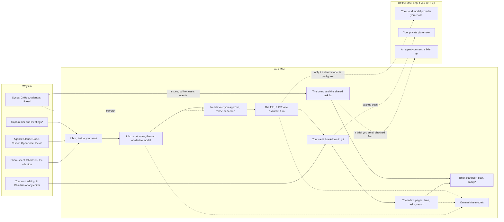
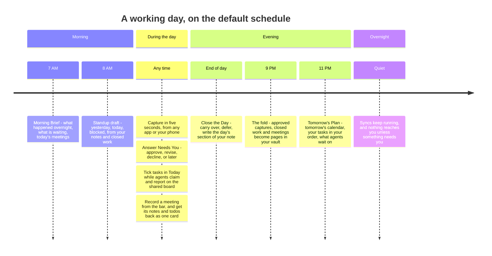
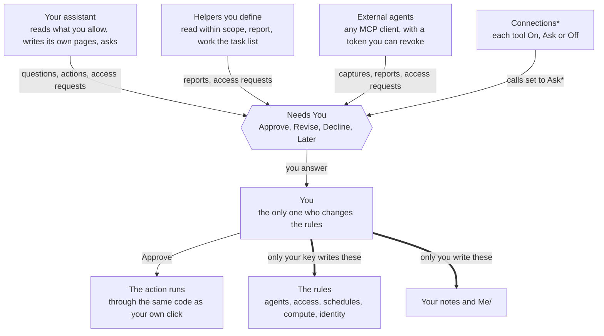
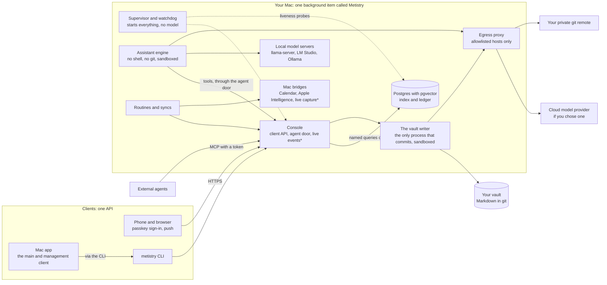

# Website brief — metistry.ai (2026-09-26)

> **For** the designer building Metistry's public site. This is the copy source
> and the structure, not a build plan: the headlines and paragraphs marked
> *Copy* are written to ship as they are (edit freely for layout); everything
> marked *Behind it* is the proof, for secondary copy, captions and your own
> confidence. **Every claim carries a status and a source.** Where this brief
> and the repo disagree, the repo wins — tell us.
>
> **Why now.** The owner's ask of 2026-09-26: the site comes first, before the
> app's daily screens ship, and it uses the design round's mockups as the app
> images until the real app is working. Google's OAuth verification for
> Calendar also needs a homepage and a privacy policy on `metistry.ai` (§7), so
> the site is on the critical path of a feature.

**Status, used everywhere below:**

| Label | Means | Public wording |
| --- | --- | --- |
| **BUILT** | Merged on `main`. Most of it shipped in v0.11.0 (2026-09-20); a few items marked *(main)* ship in the next release | *Available now* |
| **IN PROGRESS** | Part built (the parts are named), the rest scheduled in the waves named | *Available now* for the built part; *In development* for the rest |
| **PLANNED (Wn)** | In the approved design-build plan — `docs/product/design-build-plan.md` on PR #260, approved 2026-09-26 — at wave *n*. W0 freezes interfaces; W1–W4 ship features; W5 is acceptance and the 1.0 decision | *In development* |
| **LATER** | Named in that plan's §5, "planned, not scheduled" | *Planned* |

**Never publish a wave number or a date for anything not built.** Waves are
checkpoints for the build, not promises to a reader.

**Sources, cited by short name:** *PRODUCT* = `docs/product/PRODUCT.md` (its
Log entries by date); *plan* = `docs/product/design-build-plan.md` on PR #260
(sections §, tickets T/F); *daily-flow* = `docs/product/daily-flow-spec.md`;
*screen-NN* = `docs/product/design/screen-NN-*.md`; research notes by file name
under `docs/research/`.

---

## 1. Positioning

### One line

*Copy:* **A personal AI operating system that runs on your Mac and keeps your
context in files you own.**

Alternates, same claim, for layouts that need a shorter or warmer line:

- *Your assistant, your knowledge, your Mac. Agents come and go; your context stays.*
- *Context that outlives every chat, agent and vendor.*

### One paragraph

*Copy:* Metistry is a local-first personal AI operating system: a persistent
assistant and a knowledge vault that hold your context, so no chat session,
agent or vendor has to. What you know lives as plain Markdown in a git
repository you own — the same folder Obsidian opens. What is happening lives in
a database beside it that your notes can rebuild. The agents you use, from its
own helpers to Claude Code, Cursor and Devin, are disposable; your context is
durable. Metistry runs on your Mac, is open source under Apache-2.0, and every
install is a private instance that belongs to exactly one person.

*Behind it:* PRODUCT "What it is"; README; invariants 1, 6 and 7 in `CLAUDE.md`;
the product/instance split (code flows down as releases, instance data flows
nowhere — PRODUCT, 2026-08-28). *Status:* BUILT.

### The name

The name is **a nod, not an acronym**. The README's closing paragraph is the
approved text; use it as it stands (the About band of the Open Source page is
the natural home) and never add the gloss — the myth-literate get the
reference, everyone else gets the ethos (PRODUCT, "The name"). The name lore is
about the *project*; it never names the assistant (§8).

---

## 2. The main ways Metistry is cool — eight pillars

Each pillar: a headline and body (*Copy*), the mechanism and receipts that make
it true (*Behind it*), its status, and the renders that show it (§6.3). The
home page uses the headline plus the first sentence; How It Works uses the
whole thing.

### Pillar 1 — Your context outlives every session, agent and vendor

*Copy:* Everything Metistry keeps for you is plain Markdown in a git
repository you own — the same folder you open in Obsidian or any text editor.
The database beside it is an index and a ledger: drop it, and one pass over
your notes brings back every page, link, task and search result. Models, agents
and tools will change; your notes don't move.

*Renders:* `Knowledge`.

*Behind it:*
- Git is the record; Postgres is derived (invariant 1). The instance directory
  *is* the vault, with the machinery in one `.metistry/` folder Obsidian does
  not show (PRODUCT, 2026-09-17).
- Captures land in `Inbox/` inside the vault and are committed like everything
  else — "the capture you made on your phone at the airport is a file you can
  open, edit and search on the laptop" (PRODUCT, 2026-09-16).
- Tasks are indexed, never stored: the database holds a projection of your
  Markdown, and a dropped database comes back from the notes that produced it
  (PRODUCT, 2026-09-20).
- Search embeddings are rebuildable byte-for-byte; changing the embedding
  model takes 45 seconds, not a migration (PRODUCT, 2026-09-07).
- Honest limit, internal only: some operational rows — your decisions on
  requests, agent grants, the audit ledger — live in Postgres and are not
  rebuilt from notes; restating that durable set is open decision D6
  (`CLAUDE.md`, invariant 1). The public claim is about *knowledge*, which is
  never only in a database.

*Status:* **BUILT.** Granular commits per act, sync that tolerates your own
pushes, file history, restore and roll back — each rollback approved in Needs
You, never a force-push — are **PLANNED (W1–W3)** (plan §2.21, T10-1…T10-7).

### Pillar 2 — Nothing happens without your say, and the software enforces it

*Copy:* Every agent gets exactly the reach you grant it, checked by one piece
of code on every request. When an agent needs more — a folder, an action, an
answer — it asks, and the ask lands in one place: **Needs You**. Approve,
revise or decline; approving runs the same code your own click would, and every
decision is written down.

*Renders:* `NeedsYou-v5`, `Request`.

*Behind it:* the principle is **enforce at the tool, never by prompting** —
"be careful with X" in a prompt is not a control. Measured basis: prompt-level
guardrails failed every Phase 0 test (a local model leaked a live one-time code
into a "safe" field despite explicit instructions; input filtering missed
memory-poisoning 9 times in 10) (PRODUCT, "Safety considerations").
- One decision function that every door asks; fourteen scattered rules became
  one, with a test that fails if a new one grows (PRODUCT, 2026-09-20).
- An agent that is boxed in can ask for one folder with a reason; it cannot
  grant itself anything, ask twice, or answer itself; a second decline closes
  the question (PRODUCT, 2026-09-19).
- Approving an action runs it through the same service call the owner's click
  makes, from a **closed set of four** — dispatch, update a card, comment,
  capture — with no mail, messages, git, shell or credential change among them
  (PRODUCT, 2026-09-16; invariant 10).
- Autonomy levels are ceilings, and each action shows *why* it is allowed,
  asked or refused (PRODUCT, 2026-09-16; 2026-09-22 *(main)*).
- The files that define how the system behaves can only be written with the
  owner's own key, which the network-facing service never holds (PRODUCT,
  2026-09-20). The assistant cannot overwrite a note you wrote by hand
  (2026-09-19) or write anything under `Me/` (2026-09-21 *(main)*).
- The engine has no shell and no git (invariant 9); agent identity comes from
  the credential, never from what an agent says (PRODUCT, 2026-09-06); misuse
  tests ship with every door (invariant 8).

*Status:* **BUILT**, extended by the plan: per-tool **On · Ask · Off** for
connections (W2–W3), pull requests reviewed in Metistry and posted as you (W3),
restore and rollback through Needs You (W2), and routes that only the Mac may
call for anything that changes the boundary itself (W0, F-13; plan §2.3).

### Pillar 3 — Private by construction

*Copy:* Metistry runs on your Mac. There is no Metistry cloud, no account with
us, and nothing in the software that reports back — we have no way to see your
notes, your calendar or your conversations. Choose a model that runs on the
Mac and your conversations never leave it; choose a cloud model and they go to
that provider and nowhere else.

*Renders:* `Settings-Panes` (Compute), `Secrets`.

*Behind it:*
- No server operated by the maintainer anywhere in the path: releases, updates
  and the update feed are GitHub Releases (PRODUCT, 2026-09-07 "the release
  pipeline is real, so 'no FSL server' is now a shipped property"). No
  telemetry, analytics or crash reporting in the code (checked 2026-09-26).
- On-machine models, first-class: Apple's on-device model (cost 0; 60 of 60
  requests succeeded, 40 of 40 structured answers valid; 22.7 MB resident
  against 842 MB for a comparable local server — PRODUCT, 2026-09-16), a bundled
  `llama-server` (one 11 MB Metal binary, loopback-only), LM Studio and Ollama.
- The assistant's engine and the one process that writes your notes run inside
  sandboxes macOS enforces; their only way off the machine is a local
  checkpoint that allows the hosts your configuration names — your model
  provider and your notes' backup remote — and refuses the rest, without ever
  decrypting the traffic (PRODUCT, 2026-09-19).
- Keys live in the macOS Keychain and never reach a file, an argument list or a
  log (PRODUCT, 2026-09-07). A provider that does not promise zero data
  retention is badged, never silently used (2026-09-16).
- Remote sign-in is passkeys only; the Mac app's local token is refused from
  any address that is not the Mac itself (PRODUCT, 2026-08-29; 2026-09-10).

*Status:* **BUILT.** Secrets per instance only, filled in at the moment they
leave and never shown to a model: **PLANNED (W1)** (plan §2.14). Meeting
transcription on the Mac and an on-machine-only tier for anything touching a
recording: **PLANNED (W3)** (plan §2.15, T8-6).

### Pillar 4 — Costs you can see coming

*Copy:* Your rules decide which model answers, and they always win. Everyday
questions — what's on today, what's waiting on me — are answered from your own
data without calling a model at all. Every run records what it cost and where
that number came from, and a spending limit is checked before a call, not
reported after it.

*Renders:* `Usage`, `Settings-Panes` (spending limits).

*Behind it:*
- A status question answered in **0.6 ms cached / 24 ms uncached**, no model
  call (PRODUCT, Benefits; the 2026-08-30 Phase 2 measurement).
- Spending limits per day and month, per provider and for the instance: a
  warning at 80%, then carry on, stop, or keep only the turn you are waiting on
  (PRODUCT, 2026-09-16; 2026-09-17). A stop pauses scheduled work instead of
  filling a queue with refusals.
- Every run records provider, model, tokens, cache hits and dollars, and
  whether the figure came from the provider's charge, a price list, on-machine
  (zero) or *unknown* — shown as unknown, never guessed (PRODUCT, 2026-09-16).
- `metistry compute cache-report` says how much of each prompt came from cache
  and what that was worth (PRODUCT, 2026-09-19); a cache read costs a tenth of
  fresh input on Anthropic's pricing (`docs/research/2026-09-cost-optimization.md`).
- The assistant's tool list was cut by 944 tokens — 19% of what it reads
  before every reply — and CI now refuses to let it grow without a decision
  (PRODUCT, 2026-09-19).
- Try a cheaper model on your own real turns first: a shadow run is recorded
  beside the real one and never shown, sent or acted on (PRODUCT, 2026-09-16).
- Why it matters: idle cost is the most-documented reason people abandon
  personal AI (`docs/research/2026-08-prior-art-review.md` §1).

*Status:* **BUILT.** The usage gauge (W2), project budgets (W3) and the
redesigned Compute pane (W4) are **PLANNED**. A local routing policy that picks
operations and tier *inside* your rules — logged in shadow from W1, wired only
after an evaluation clears the bar the owner set — is **PLANNED (W1–W4)**
(plan §2.8, T9). The wording of invariant 4 changes with it (ratified
2026-09-26, lands in F-0); until then the router is fully deterministic. The
public copy above is true on both sides of that change.

### Pillar 5 — Your day, organized from the notes you already write

*Copy:* Type a todo the way you'd say it — `- [ ] Draft the Q4 plan due friday
p1` — in any note. Metistry finds it, keeps it on your list and never rewrites
your line. Each morning brings a brief and a standup draft; each evening it
folds the day into your knowledge and writes tomorrow's plan from a template
you edit.

*Renders:* `Today-Hub`, `PWA-Today`.

*Behind it:*
- A task is a plain `- [ ]` line anywhere in the vault, with English-shaped
  fields at the end (`due friday`, `p1`, `@Jim`, `every week`); Dataview and
  Obsidian Tasks syntax are read too and never written back; a field it cannot
  read is shown, never guessed (PRODUCT, 2026-09-20; daily-flow §1).
- Every todo is findable within one reconcile, with due dates, priorities,
  who it waits on and how long it has been carried (PRODUCT, 2026-09-20).
- One filter language — `due <= today or overdue` — shared by templates, the
  app and the plugin; it never reaches the database as text (PRODUCT,
  2026-09-20).
- Tomorrow's Plan renders from `Templates/Plan.md` with no model in it; the
  evening fold writes `Journal/Fold/<date>.md`, never your own daily note
  (PRODUCT, 2026-09-20). The morning brief and weekly review are BUILT as
  messages (PRODUCT, 2026-09-06).

*Status:* **IN PROGRESS.** Built: the task line, the index, the filter
language, templates, Tomorrow's Plan, the fold. **PLANNED (W2):** Today —
ticking a task from the app with Undo, Next Up before each meeting, Close the
Day; the Standup routine at 8:00; the Morning Brief as Today's first screen at
7:00; Tomorrow's Plan at 11:00 PM after the fold (plan §2.5, §2.13; T2-4…T2-8,
T3-5…T3-7, T6-1). Every schedule visible and editable under Scheduled:
**PLANNED (W1–W3)**.

### Pillar 6 — Every agent you use, working from one place, on your terms

*Copy:* Claude Code, Cursor, OpenCode, Devin — or any tool that speaks MCP —
connects with its own token that you can revoke. They share one task list with
the helpers you define, publish work you can review, and capture what they
learn into your inbox. Connect the services they need once — an MCP server, an
API, a calendar — and decide, tool by tool, whether it's **On**, **Ask** or
**Off**.

*Renders:* `Agents`, `Board`, `Connections`.

*Behind it:*
- One MCP door for every agent; `metistry connect cursor | claude-code |
  opencode | devin` gives each tool its own row, token and revocation — the
  token stays in the Keychain, not in the tool's config file (PRODUCT,
  2026-09-15; 2026-09-16).
- One shared task list with atomic claims: five concurrent claims, exactly one
  winner (PRODUCT, 2026-09-06). Versioned artifacts with review threads; rooms
  on a task that, by construction, cannot summon anyone; ten agent-only turns
  and the eleventh comes to you (PRODUCT, 2026-09-07; 2026-09-16).
- Helpers defined in one file each, with their own model, tools, read scope and
  per-run budget; a fresh credential per run, burned after (PRODUCT,
  2026-09-07).
- Coding sessions become captures from Claude Code, Cursor and OpenCode, deduped
  across four doors; a Devin session's answer comes back as a request you
  triage, not a fact you're told (PRODUCT, 2026-09-15; 2026-09-16).

*Status:* agents **BUILT**. Connections — the registry, the proxy that offers a
connection's tools to agents with secrets filled in at the door and every call
logged, and per-tool On · Ask · Off — **PLANNED (W2–W4)** (plan §2.6; T4-8a…T4-11).
Linear as a connection: **PLANNED (W2–W3)**. Calendar feeds and CalDAV replies
(W3), Google Calendar and mail drafts (W4) — mail never sends (plan §2.6).

### Pillar 7 — Capture in five seconds, meetings included, on your terms

*Copy:* Anything you drop in — from the share sheet, a shortcut, the **+**
button or an agent — lands in your inbox, inside your vault, and is sorted on
the Mac. A floating bar takes a note, a todo or a question from any app, and
records a meeting: sound from only the apps you pick, transcribed on your Mac,
started by nothing but your hand, and deleted on a schedule you can read.

*Renders:* `CaptureBar`, `Capture`.

*Behind it:*
- One capture door, idempotent: a retried capture is one note, even under a
  race (PRODUCT, 2026-09-11; 2026-09-18).
- Captures are sorted on the Mac in about 150 ms against a closed list of
  sixteen intents, and how sure it must be before anything moves is one line
  in your own file — off until you turn it on (PRODUCT, 2026-09-22 *(main)*).
- Meeting audio uses macOS process taps, which yield only the named apps'
  sound — a scope the operating system enforces. Window capture uses Apple's
  picker, which is a selection, not a fence; the design says so rather than
  implying otherwise (`docs/research/2026-09-21-live-capture-bar.md`, short
  version 3).
- Recording is never started by a tool call; audio is kept until the meeting
  is filed plus 7 days, never more than 30; transcripts 30 days; "check the
  audio again" returns text, never audio, to a model, on an on-machine tier
  (plan §2.15). Consent from the people in the meeting is the user's to obtain
  — no product control discharges it (research note, short version 8).

*Status:* capture **BUILT**. The recorder (audio, W3; window and screen, W4),
the floating bar (W4), retention and re-review (W4), and a meeting arriving as
one card to approve (W4) are **PLANNED** (plan T8-1…T8-7). Transcription as it
records needs macOS 26.

### Pillar 8 — One Mac app, a phone view, and a system built to last

*Copy:* Download one signed app. It carries everything it needs — database,
runtime, a local model server — installs as a single background item called
Metistry, and keeps itself up to date. On your phone, the same instance is a
web app you sign into with Face ID and whose notifications you can answer. And
it's built to be run for years by one person: a small, plain stack you can read.

*Renders:* real screenshots of the installer and menu bar; `PWA-Shell`.

*Behind it:*
- A Developer ID signed, notarized DMG on GitHub Releases, with a signed update
  feed (PRODUCT, 2026-09-09). The bundled runtime — Node, Postgres 17 with
  pgvector, git — means no Docker, Homebrew or Xcode; proven on a clean Mac from
  release artifacts alone (PRODUCT, 2026-09-09; 2026-09-10).
- One background item, named Metistry, with one switch in System Settings and
  in the app (PRODUCT, 2026-09-10; 2026-09-17). A menu bar that shows the worst
  fault and restarts things.
- Updates verify a checksum before unpacking, keep the previous release, and
  roll back in one step; a tampered download changes nothing (PRODUCT,
  2026-09-07).
- Keeps the Mac awake only if you said yes, with the battery cost printed next
  to each choice; nothing outlives the install (PRODUCT, 2026-09-19).
- Eight third-party runtime packages across the whole TypeScript product, plus
  Sparkle in the Mac app (counted at `0b20767`, 2026-09-26); migrations are
  plain SQL; the watchdog calls no model (`CLAUDE.md`, Stack; PRODUCT,
  2026-09-06).

*Status:* **IN PROGRESS.** Built: the installer app, its status window and
settings, the menu bar, the phone web app with passkeys and push. **PLANNED:**
the app's daily screens — Today, Chat, Activity and Needs You (W2); Work,
Knowledge, Agents, Scheduled and the Settings window (W3); Connections, Compute
and the capture bar (W4); the phone web app's new shell (W1–W2). A native
iPhone app is **LATER** (plan §5).

---

## 3. Feature inventory

Every feature, one line each, grouped by the app's sections as the design
ruled them (sidebar: Needs You · Today · Chat · Activity · Work · Knowledge ·
Agents · Scheduled; Connections and Settings in the Settings window; Usage and
Capture in the toolbar — `docs/product/design/DEVELOPER-HANDOFF.md` §1). "PWA"
means the installed web app that is today's daily client; "Mac" means the
native app's screen for it.

### Today

| Feature | What it does | Status | Source |
| --- | --- | --- | --- |
| Tasks in plain Markdown | A `- [ ]` line in any note is a task; fields typed in English at the end of the line | BUILT | PRODUCT 2026-09-20; daily-flow §1 |
| Reads your existing syntax | Dataview and Obsidian Tasks fields are read, never written back | BUILT | daily-flow D2 |
| Task index | Every open todo in the vault is findable, with due, priority, people and age | BUILT | PRODUCT 2026-09-20 |
| Filter language | `due <= today or overdue`, shared by templates, the app and the plugin | BUILT (engine); Mac filter box W2 | PRODUCT 2026-09-20; T6-1a |
| Templates you edit | Daily, plan, fold, standup, meeting and weekly templates in `Templates/`, checked by `metistry templates check` | BUILT | PRODUCT 2026-09-20; `seed/vault/Templates/` |
| Recurring tasks | A rule line; tomorrow's instances listed in the plan, one open instance per rule | BUILT (in the plan); written into your daily note by your own template action with the Obsidian plugin, LATER | daily-flow §4; `packages/core/src/template.ts` |
| An agent waiting on you | A card says when it waits on a todo only you can do, without blocking anything else | BUILT | PRODUCT 2026-09-20 |
| Tomorrow's Plan | Tomorrow's events, your tasks in your order and what agents wait on, from `Templates/Plan.md`, no model | BUILT; at 11 PM after the fold W2 | PRODUCT 2026-09-20; T3-7 |
| Morning Brief | Overnight, what's waiting, today's meetings | BUILT as a message; as Today's first screen and a file W2 | PRODUCT 2026-09-06; T3-6 |
| Standup draft | Yesterday, today, blocked — a file of its own at 8:00 on working days | W2 | T3-5 |
| Today screen | The day as a spine anchored at now, a day bar, drag to order, Slipping · Owed · Waiting on Others | W2 | screen-05 §12–15; T6-1a |
| Tick a task anywhere | Writes `[x]` and the date into its own line; Undo; refused if the line changed meanwhile | W1 (door); W2 (screens) | plan §2.11; T2-4 |
| Defer | `do <date>` or someday, written into the line | W1 | T2-5 |
| Next Up | A short prep line before each meeting, with Record | W2 | screen-05 §15.2; T6-1b |
| Meeting note | One note per event from `Templates/Meeting.md` | W2 | T2-11 |
| Close the Day | Writes the day's section of your daily note, between markers, and re-plans tomorrow | W2 | plan §2.13; T2-8 |
| Move a meeting | After a warning that names who is told and the new time | W3 | T2-12 |
| The Obsidian plugin | Suggests fields as you type and gives tasks stable ids | LATER (not in this plan) | daily-flow §9 |

### Chat

| Feature | What it does | Status | Source |
| --- | --- | --- | --- |
| Chat with your assistant | Message-app bubbles, a "↓ New Reply" pill that never yanks the page | BUILT (PWA); Mac W2 | PRODUCT 2026-09-08; T6-2 |
| Tool activity under each reply | What it looked up and changed, collapsed | BUILT (PWA) | `design-brief.md` §2.2 |
| Composer that completes | `@` agents and `/` commands from your own rules; inserts at the caret | BUILT | PRODUCT 2026-09-08; 2026-09-18 |
| Answers with no model | Status questions from your own data | BUILT | PRODUCT Benefits |
| Questions it can't continue without | A reply that asks becomes a request you can answer in chat, from the queue or a notification | BUILT (one question); several, stepped W2 | PRODUCT 2026-09-08; T2-3 |
| 👍 / 👎 that teaches safely | A thumbs-down becomes one suggested prompt change you approve; never applied by itself | BUILT | PRODUCT 2026-09-08 |
| Pick the model for a turn | Tier, model and effort, applied at a turn boundary | BUILT (commands); Mac picker W2 | T6-2 |
| Working indicator | Shows the tool that's running, live | W1 (server); W2 (Mac) | T2-17, T2-18, T6-2 |
| Routing inside your rules | A local policy picks operations and tier within your limits, recorded per turn | W1 shadow → W4 | plan §2.8; T9 |

### Activity

| Feature | What it does | Status | Source |
| --- | --- | --- | --- |
| One feed | Captures, turns, tool calls, routine runs and agent reports, filterable | BUILT (PWA); Mac W2 | PRODUCT 2026-09-07; T6-3 |
| Captures show at once | A note from the phone appears immediately, wearing its status | BUILT | PRODUCT 2026-09-16 |
| A reply's actions grouped | Every tool call joined to the reply that made it | BUILT | PRODUCT 2026-09-08 |
| Run detail | Steps, cost, tokens, tools; the conversation as sent | BUILT (data); Mac W3 | T6-10; T3-9 |
| Export the audit ledger | `metistry runs export`, redacted | BUILT | PRODUCT 2026-09-16 |
| Configuration changes visible | Every write to a rules file appears in Activity | W1 | T2-16 |

### Needs You

| Feature | What it does | Status | Source |
| --- | --- | --- | --- |
| One queue | Everything that needs you — knowledge to keep, reports, access, improvements, questions, actions | BUILT (PWA, push, brief) | PRODUCT 2026-09-08 |
| Approve · Revise · Decline, Later | One answer set everywhere; Skip in bulk | BUILT; consolidated to the design's set W0 | glossary; plan §2.12; F-14 |
| Approve as Work | A suggested todo becomes a task in one click | BUILT | PRODUCT 2026-09-16 |
| Approve runs the action | From a closed set, through the same code your click uses | BUILT; connection calls W3 | PRODUCT 2026-09-16; T4-9 |
| Stale answers refused | An answer to a question that changed is not applied | BUILT; per-type W2 | PRODUCT 2026-09-16; T2-14 |
| Answer from a notification | Web push you can act on | BUILT | PRODUCT 2026-09-08 |
| Twelve request types | Adds pull request, meeting, invitation, task and message | W2 (screen); sources W2–W4 | glossary; T5-4 |
| Review pull requests | Approve or request changes in Metistry, posted as you, checked against the commit you saw | W3 | T2-13 |
| Mirrors | A request from GitHub, a calendar or Linear clears when you answer at the source | W1–W3 | plan §2.12; T1-8, T4-23 |
| Problems become requests | A failed routine, an expired key, a conflict — one request each | W2 | T2-9 |
| Only while something waits | The sidebar row and the Dock badge exist only then | W1 | T5-2, T1-7 |

### Work

| Feature | What it does | Status | Source |
| --- | --- | --- | --- |
| One shared task list | You and every agent; claims, leases, dependencies | BUILT | PRODUCT 2026-09-06 |
| Board | Drag cards; a drop the service would refuse is never offered | BUILT (PWA); five columns and Mac W3 | PRODUCT 2026-09-16; T6-7 |
| Card detail | Description, thread, history in one popover | W1 (data); W3 | T1-1, T6-7 |
| Rooms | A thread on a task that cannot summon anyone | BUILT | PRODUCT 2026-09-16 |
| Projects | Autonomous or Review — the one-tap kill switch — with caps and a daily budget | BUILT; Mac W3; project grants W2 | PRODUCT 2026-09-07; T6-8, T4-7 |
| Artifacts | Versioned, reviewable agent output in git, with threads | BUILT (PWA); Mac W3 | PRODUCT 2026-09-07; T6-9 |
| Send a brief out | To a GitHub issue or a Devin session, checked against a data policy first | BUILT | PRODUCT 2026-09-06; 2026-09-15 |
| GitHub on the board | Your issues and PRs, and what's waiting on your review | BUILT | PRODUCT 2026-09-06 |
| Linear | Your issues on the board; send a task to Linear; done in both directions | W2–W3 | T4-24…T4-26 |

### Knowledge

| Feature | What it does | Status | Source |
| --- | --- | --- | --- |
| The folder is the vault | Open it in Obsidian; the machinery hides in `.metistry/` | BUILT | PRODUCT 2026-09-17 |
| The evening fold | The day's approved captures, closed work and sessions become pages | BUILT; 9 PM default W1 | PRODUCT 2026-09-09; 2026-09-20 |
| Search | Keyword, semantic and hybrid, on the Mac; falls back to keyword and says so | BUILT (every client via the API); Mac W3 | PRODUCT 2026-09-07; 2026-09-18 |
| Browse and backlinks | Pages by area, links both ways; drafts never shown to agents | BUILT (API); Mac W3 | PRODUCT 2026-09-18; 2026-09-19 |
| Knowledge screen | Leads with the fold, then what needs your eye, then areas | W3 | screen-10; T6-4 |
| Your notes are yours | The assistant cannot overwrite a note you wrote, or write `Me/` | BUILT *(Me/: main)* | PRODUCT 2026-09-19; 2026-09-21 |
| Conflicts | Keep Mine or Take the Other, with Undo | W2–W3 | T2-10, T6-4 |
| History and rollback | One commit per act; restore a file or roll back, approved in Needs You | W1–W3 | plan §2.21; T10 |
| What it learns about you | Arrives as a proposal to `Me/`, never a silent write | W3 | T3-10 |

### Agents

| Feature | What it does | Status | Source |
| --- | --- | --- | --- |
| External agents | Registered with a token shown once, revocable | BUILT | PRODUCT 2026-09-06 |
| Connect a tool | `metistry connect cursor · claude-code · opencode · devin` | BUILT | PRODUCT 2026-09-15; 2026-09-16 |
| Session capture | Coding sessions summarized into your inbox from three tools | BUILT | PRODUCT 2026-09-09; 2026-09-15; 2026-09-16 |
| Read access | None, titles, or named folders; an agent can see what exists without reading it | BUILT | PRODUCT 2026-09-19 |
| Ask for access | One folder with a reason; one escalation; your answer | BUILT | PRODUCT 2026-09-19 |
| Autonomy | Observe, propose, act within scope, per action, with the reason shown | BUILT | PRODUCT 2026-09-16; 2026-09-22 |
| Helpers | Defined in a file: model, tools, scope, budget; credentials per run | BUILT | PRODUCT 2026-09-07 |
| Presence | Working, queued, idle, interrupted, over cap | BUILT | PRODUCT 2026-09-07 |
| Agents screen | One permissions table (On · Ask · Off); a definition editor; New Agent | W1 (model); W3 (screen) | T4-6, T6-5 |

### Scheduled

| Feature | What it does | Status | Source |
| --- | --- | --- | --- |
| Routines and syncs | Brief, fold, plan, weekly review; GitHub, usage, AWS costs, Devin | BUILT (fixed schedules) | PRODUCT 2026-09-06 onward |
| Failures that say so | Preflight, stop after repeated failures, one request per fault | BUILT | PRODUCT 2026-09-15 |
| Weekly review | Projects, decisions, agents, spend, health, next week | BUILT | PRODUCT 2026-09-06 |
| Everything visible and editable | Defaults tagged, Reset to Default, day bands | W1–W3 | plan §2.5; T3-1…T3-3, T6-6 |
| A real clock | Time-of-day schedules, DST-correct | W1 | T3-1 |
| New Routine | An agent, a task, a schedule, per-run access — no code | W3 | T3-8 |

### Connections

| Feature | What it does | Status | Source |
| --- | --- | --- | --- |
| What's connected today | GitHub, Apple Calendar (read; write your own events after a preview), Apple Intelligence, AWS costs, Devin | BUILT | PRODUCT 2026-09-06; 2026-09-15 |
| One list of connections | MCP servers, agents, APIs, feeds, files, calendar, mail, trackers | W2 | plan §2.6; T4-8a |
| Offer to agents | Tools reached through Metistry: checked, secrets filled in, logged | W2–W3 | T4-8b, T4-9 |
| On · Ask · Off per tool | Reads, changes and agent-starting tools grouped; destructive tools default to Ask | W2–W3 | C114; T4-9 |
| Calendar | Subscription feeds and CalDAV replies (W3); Google Calendar (W4) | W3–W4 | T4-12…T4-14 |
| Mail | Read and draft over IMAP; nothing can send | W4 | T4-15 |
| HTTP, OAuth, generated tools | Any API or feed as a connection, no Cloud project needed for Google | W4 | T4-10 |

### Settings

| Feature | What it does | Status | Source |
| --- | --- | --- | --- |
| Settings today | Instance, services, account, secrets by name, updates, compute | BUILT | PRODUCT 2026-09-09; 2026-09-17 |
| Compute | Providers, models, test, spending limits; local servers discovered | BUILT | PRODUCT 2026-09-17 |
| Keep this Mac awake | Asked once, cost stated; switches and the lid dialog | BUILT; redesign W1–W3 | PRODUCT 2026-09-19; T4-20, T6-11 |
| Devices | Passkeys per device, revoke from anywhere | BUILT | PRODUCT 2026-08-29 |
| The Settings window | Instance, Services (Doctor first), Updates, Account, Keyboard, Advanced | W3 | screen-15; T6-11 |
| Name your assistant | Set in Settings; shown in Activity | W1 | T2-16 |
| Secrets and Variables | Per instance, sent only to hosts you list | W1 (store); W4 (panes) | plan §2.14; T6-14 |
| Keyboard | Shortcuts in any app, off by default, conflicts checked | W4 | T6-16 |

### Usage

| Feature | What it does | Status | Source |
| --- | --- | --- | --- |
| Spend on every run | Provider, model, tokens, cache, dollars and where the figure came from | BUILT | PRODUCT 2026-09-16 |
| Limits before the call | 80% warning; stop or critical-only | BUILT | PRODUCT 2026-09-16 |
| Cache report | What caching saved, per provider and model | BUILT | PRODUCT 2026-09-19 |
| Shadow a cheaper model | Compared on your own turns, never shown | BUILT | PRODUCT 2026-09-16 |
| Dashboard | Spend by tier and day; AWS by service | BUILT (PWA) | PRODUCT 2026-09-06 |
| Usage gauge | The month against its limit, beside +, one click away | W2 | screen-17; T5-6 |
| Project budgets | Beside instance and provider limits | W3 | T4-19 |

### Capture Bar

| Feature | What it does | Status | Source |
| --- | --- | --- | --- |
| Capture from anywhere | Share sheet, Shortcuts, +, `/note`, agents; one door, idempotent | BUILT | PRODUCT 2026-09-11; `docs/ops/capture-shortcut.md` |
| Sorted on the Mac | Intent triage in ~150 ms; the threshold is yours; off by default | BUILT *(main)* | PRODUCT 2026-09-22 |
| The floating bar | Ask, Note, To-do and Record from any app, docked to the edge you choose | W4 | screen-11; T8-5 |
| Audio-only recording | Only the apps you pick, enforced by macOS | W3 | T8-2a |
| Window, audio and mic | Apple's picker; the grant stays global and the app says so | W4 | T8-3 |
| Transcribed on the Mac | As it records (macOS 26) | W3 | T8-2a |
| Retention you can read | Audio until filed + 7 days, never over 30; transcripts 30 days; Purge Now | W4 | plan §2.15; T8-4 |
| A meeting is one card | Notes and todos approved together, in order | W4 | T8-7 |

### PWA — the phone and any other computer

| Feature | What it does | Status | Source |
| --- | --- | --- | --- |
| The daily client today | Chat, feed, board, requests, agents, artifacts, rooms, dashboard, devices, capture | BUILT | `apps/console/web/index.html` |
| Face ID sign-in and push | Passkeys only; notifications you can answer | BUILT | PRODUCT 2026-08-29 |
| Capture that survives a dropped connection | Replays with the same key; one note, never two | BUILT (server); outbox W3 | PRODUCT 2026-09-11; T7-4 |
| New shell | Today · Chat · Work · Knowledge · More; the bell and + in the header | W1–W2 | screen-18; T7-2, T7-3 |
| Live updates | Pushed from the instance instead of polled | W2 | T7-7 |
| Settings from the phone | Act inside the boundary; only the Mac changes it | W4 | plan §2.3; T7-6 |
| Native iPhone app | Share extension, offline outbox, widgets | LATER | plan §5 |

### Platform — not a screen, but what the site's How It Works describes

| Feature | What it does | Status | Source |
| --- | --- | --- | --- |
| Signed installer, auto-update | Notarized DMG, signed feed, bundled runtime | BUILT | PRODUCT 2026-09-09 |
| One background item | Named Metistry; one switch | BUILT | PRODUCT 2026-09-17 |
| The CLI | `init`, `up`, `down`, `update` (verified, with rollback), `doctor` | BUILT | `docs/ops/cli.md` |
| Sandboxes and one door out | Engine and committer confined; an allowlisting egress proxy | BUILT | PRODUCT 2026-09-07; 2026-09-19 |
| A watchdog with no model | Tells you when things are broken, including cost runaways | BUILT | PRODUCT 2026-09-06 |
| One client API, versioned | The Mac, the PWA and a future phone app speak the same routes | W0 | plan §2.1; F-1 |
| Live events | The instance tells clients what changed — ids, never content | W1 | plan §2.20; T2-18 |
| Extensions | Data-only extensions through the same registries as product units | W1; code extensions LATER | plan §2.7, §5 |
| Second instance | A second, separate install with its own repo and vault, on another Mac | BUILT | `docs/ops/second-instance.md` |

---

## 4. What makes it different

*Copy (intro):* Plenty of good tools remember things, run agents or record
meetings. Metistry's difference is where your context lives and who is allowed
to change it.

The comparison below uses only the neighbours the project's research actually
studied, and says what each does well before what differs. **Name a neighbour
only on this page, only with a source, and never with an adjective.**

| Neighbour | What it does well | Where Metistry differs | Source |
| --- | --- | --- | --- |
| **Memory layers** — Mem0, Letta, Zep/Graphiti, TencentDB Agent Memory | Measured recall on public benchmarks (Mem0 publishes LoCoMo and LongMemEval); memory the agent manages itself (Letta); facts with valid-time (Zep) | Your knowledge is files in your git, not rows in a memory service; a fact a model extracts about you is a proposal you approve, never a silent write; git gives you "what did I believe three weeks ago" for free; everything opens without the software | `2026-09-21-agent-memory-lessons.md` §2, §4; `2026-08-prior-art-review.md` §4 |
| **Agent platforms and frameworks** — Devin (a hosted coding agent), Vercel's Eve (an agent framework whose defaults deploy to Vercel), Rivet's agentOS (sandboxed VMs for untrusted agent code) | Capable workers; Eve's agents defined as directories of files, the same instinct Metistry has; agentOS's isolation for code nobody trusts | Metistry is not where agents run; it is where their context lives. Devin connects as an external agent and a dispatch target, and its answers come back as requests you triage; a brief is checked against a data policy before it leaves; Metistry runs no untrusted code, so it needs no VM | `2026-09-15-devin-cursor-integration.md`; `2026-09-15-vercel-eve-review.md`; `2026-09-12-rivet-agentos-review.md` |
| **MCP gateways** — Executor | The same shape: integrations, connections, per-tool policy, one MCP endpoint, a small tool list that grows by search | Approval is enforced at the gateway, never handed to the client; every call is an audit row; the gateway shares identity, grants and approvals with your tasks and knowledge *(planned, W2–W4)* | `2026-09-22-connectors-mcp-gateway.md`, short version 3, 5, 6 |
| **Desktop capture** — Glass | Capture straight from the source and review it right after; pairs with a local model | Recording is visible, started only by you, and audio is scoped by the OS to the apps you pick; transcription stays on the Mac; retention is stated *(planned, W3–W4)* | `2026-09-21-live-capture-bar.md`, short version 2–3 |
| **General-purpose agents** — Hermes Agent, Taskuary, always-on self-hosted assistants | Breadth — dozens of adapters and tools, messaging-app reach, fast task loops | A closed, budgeted tool surface with no shell and no raw git; quiet by default, with no heartbeat loop spending tokens while you sleep; your approval gate enforced in code, not in a prompt | `2026-09-12-hermes-agent-review.md`; `2026-09-12-hermes-agent-review-2.md`; `2026-09-16-taskuary-review.md`; `2026-08-prior-art-review.md` §1 |

**The five threads, for a summary band:**

1. **No hosted service.** Nothing of yours passes through a server we run. (BUILT)
2. **Git is the record.** Your knowledge is files you can read, diff and carry away. (BUILT)
3. **Enforced at the tool.** Rules are things the software cannot do, not things a model is asked not to do. (BUILT)
4. **Predictable cost.** Your rules pick the model; limits apply before the call. (BUILT)
5. **Vendor-neutral.** Any agent that speaks MCP works with it; no vendor is privileged. (BUILT)

**What Metistry is not** — a band worth having, because it answers the
questions the one-liner raises:

- Not a hosted service, and not an account.
- Not a chat wrapper: most of what it does happens without a conversation.
- Not a coding workbench: it coordinates the coding tools you already use.
- Not a messaging bot: you talk to it in its own app and on your phone, not
  through a chat service — iMessage was dropped as too insecure (PRODUCT Log,
  2026-08-29).
- Not a memory API for someone else's app: it is one person's instance.

---

## 5. Diagrams

Each is drawn as Mermaid so it renders here and is easy to redraw. **Redraw
them in the brand** (brand-kit.md) — these fix the content and the arrows, not
the look. An asterisk (*) marks a part that is planned, not built; the site
version should draw planned parts dashed or omit them.

### 5.1 Where your data goes

*Caption:* Captures come in through one door and land as files in your vault's
inbox; your own edits go straight into the vault; syncs bring your issues,
pull requests and events onto the board. Rules and a model on your Mac sort
captures into requests; what you approve, the evening fold writes into pages;
the index over those pages, and the board, feed the brief, the plan and Today.
Classification, search embeddings and — if you choose a local model — the
assistant itself all run on the Mac. What can leave it, and only because you
set it up: the prompts sent to the cloud model provider you picked, the backup
push to your own private git remote, and a brief you choose to send to another
agent, checked against a data policy before it goes. Your notes, the index,
your keys and any recordings stay on the Mac.
*Sources:* PRODUCT 2026-09-06 (github-state, the dispatch data policy),
2026-09-07 (local embeddings), 2026-09-09 (the fold), 2026-09-16 (inbox in the
vault), 2026-09-19 (egress), 2026-09-22 (intent tier); plan §2.12 (mirrors).

### 5.2 A day with Metistry

*Caption:* The defaults the owner set on 2026-09-26: the Morning Brief at 7:00
and the Standup at 8:00 on working days, the fold at 9:00 PM, and Tomorrow's
Plan at 11:00 PM on the eve of a working day, after the fold so it can read it.
Every time is a routine you can move under Scheduled. Built today: the fold,
Tomorrow's Plan (on an evening gate), the brief as a message, capture, Needs
You and the shared board. Planned: the standup (W2), Today with ticking and
Close the Day (W2), the new schedule times (W1), and meeting capture (W3–W4).
*Sources:* plan §2.5 and §4 Q12; daily-flow §7.

### 5.3 Who may do what

*Caption:* Everyone and everything that acts for you — your assistant, the
helpers you define, outside agents, and (planned) the services you connect —
can ask, and every ask lands in one place. Nothing an agent does can grant it
more: widening access, changing the rules and editing your own notes are
yours alone, and the software refuses the rest rather than asking a model to
behave. What the diagram does not show, because it is an absence: the
assistant has no shell and no git; helpers never write knowledge; an agent's
identity comes from its token, never from what it says; and a request that
changed after you saw it is refused rather than applied.
*Sources:* PRODUCT 2026-09-16 (actions, autonomy), 2026-09-19 (access
requests, your notes), 2026-09-20 (one decision function, the owner's key),
2026-09-21 (`Me/`); plan §2.6 (connections), §2.12 (Needs You).

### 5.4 How it's built

*Caption:* One process — the console — is the front door for every client and
every agent. The Mac app reaches it through the command-line tool so the app
never holds a credential; the phone and browser reach it over HTTPS with a
passkey; agents reach it over MCP with their own tokens. The console reads
state only through named, reviewable queries, and it never touches your notes
directly: one sandboxed process holds the vault and is the only thing that
commits. The assistant's engine has no shell and no git; its tools are the
console's agent door, and its only way off the Mac is the egress proxy. A
supervisor starts everything as one background item, and a watchdog with no
model in it tells you when something is wrong.
*Sources:* invariants 3, 6, 9 in `CLAUDE.md`; PRODUCT 2026-09-06 (the vault
writer, `mcp-brain`), 2026-09-10 (one background item, the local token),
2026-09-18 (the app holds no credential), 2026-09-19 (sandbox and egress);
plan §2.1 (one client API; the Mac's `console session --stdio` is W0, F-12),
§2.20 (live events, W1).

---

## 6. Site structure

### 6.1 Domains

- **metistry.ai** — the site: Home, How It Works, Privacy, Open Source, Docs,
  Changelog. Google's verification reads the homepage and the privacy policy
  here (§7).
- **metistry.app** — Download. One page (plus the phone setup below it), so
  "get the app" has an address of its own. `auth.metistry.app` is reserved for
  a token broker that is designed and **not built** (plan §2.6, §5); nothing on
  the site should link to it.

### 6.2 Pages

| Page | Purpose | Sections, in order | Renders (§6.3) |
| --- | --- | --- | --- |
| **Home** `metistry.ai/` | Say what it is and why it's different in one screen; get the download | Hero (one line, paragraph, Download for Mac); the eight pillars, short form; the day timeline (§5.2); "What it's not"; open source band; footer with **Privacy Policy** link (Google requires it on the homepage) | `Today-Hub` (hero, Mac) with `PWA-Today` (phone) beside it; one per pillar: `Knowledge`, `NeedsYou-v5`, `Settings-Panes` (Compute), `Usage`, `Today-Hub`, `Agents` + `Connections`, `CaptureBar`, `PWA-Shell` |
| **How It Works** `/how-it-works` | The architecture and the trust model for a technical reader who will check | The pillars in full (§2); the four diagrams (§5) with captions; "What leaves your Mac" (from §5.1's caption); the comparison (§4) | `Activity`, `RunDetail`, `Board`, `Agents`, `Scheduled`, `Connections`, `Secrets`, `Usage` |
| **Privacy** `/privacy` | The privacy policy itself, with a one-minute summary on top — one URL for users and for Google | `docs/product/website/privacy-policy.md` | none — text only |
| **Download** `metistry.app` | Install on a Mac; set up the phone | Requirements; the download button (latest DMG on GitHub Releases, with checksum and the notarization note); first run in five steps; the terminal path; the phone (install the web app, enroll a passkey); updates and rollback | Real screenshots of the shipped installer and menu bar (they exist today); `PWA-Shell` for the phone |
| **Docs** `/docs` | Point at the operator docs | A link list: glossary, CLI, second instance, capture shortcut, compute | none |
| **Changelog** `/changelog` | What shipped, per release | Rendered from GitHub Releases notes (changesets, one version for the whole product) | none |
| **Open Source** `/open-source` | License, code, security, and the name | Apache-2.0; the repository; how to build; security — built to survive full code visibility (invariant 8) and how to report a vulnerability; the README's name paragraph | `Kit` or `Direction-C` (the mark) |

**Download requirements, from the repo:** Apple silicon Mac (the runtime pack
is `darwin-arm64` only, v0.11.0 assets); macOS 14 or later
(`apps/macos/resources/Info.plist` `LSMinimumSystemVersion`); live meeting
transcription, when it ships, needs macOS 26 (plan §4 Q18). The terminal path
is `npx @foldedspacelabs/metistry-cli init <dir> --name <name>` then `metistry
up` (`docs/ops/cli.md`). First run, in the app's own words: copy the runtime,
create the instance, connect a private GitHub repo, keep the Mac awake or not,
choose compute or skip it (PRODUCT 2026-09-10; 2026-09-16).

**Two blockers the owner must clear before these pages work** (§9): the
repository is **private** today, so the GitHub Releases download, the update
feed, the docs links and the Open Source page all point at something the public
cannot reach; and the host for the site is not chosen.

### 6.3 The app images

**Use the design canvas boards, not the SVGs in the repo.** The boards are the
round-0 design the owner approved (2026-09-26), generated by
`docs/product/design/boards/build.py` into the owner's private canvas
(`DEVELOPER-HANDOFF.md` §6 lists every board by row). The SVGs under
`docs/product/design/*.svg` are wireframes from 2026-09-17 with the old blue
accent and the retired section names (Feed, Insights, Rooms) — do not publish
them.

Boards by the screen they show:

| Screen | Board(s) |
| --- | --- |
| Today | `Today-Hub` |
| Chat | `Chat` |
| Activity | `Activity`, `RunDetail` |
| Needs You | `NeedsYou-v5` (the view), `NeedsYou-v4` (the request types), `Request` |
| Work | `Board`, `CardDetail`, `Projects`, `Artifacts` |
| Knowledge | `Knowledge` |
| Agents | `Agents` |
| Scheduled | `Scheduled` |
| Connections, Secrets | `Connections`, `Secrets` |
| Settings, Compute | `Settings`, `Settings-Panes` |
| Usage | `Usage` |
| Capture | `CaptureBar`, `Capture` |
| Phone | `PWA-Shell`, `PWA-Today`, `PWA-NeedsYou`, `PWA-Work`, `PWA-More` |
| States and flows | `States`, `States-Screens`, `States-Settings`, `Flows` |
| Brand | `Direction-C`, `Wordmark`, `Icon-App`, `Icon-Web`, `Colour`, `Kit` |

Three rules for using them on the site:

1. **Crop to the app frame.** Artboards carry design annotations; those are
   not product copy.
2. **The assistant's name.** Every board labels the assistant with the default
   name (`boards/lib.py` `ASSISTANT_NAME`, plus literals in the board modules).
   Public copy never names the assistant (§8); whether a screenshot may show
   the default name is **the owner's decision** (§9). Until he rules, render
   with a neutral example name.
3. **Label planned screens.** Every image of a screen that is not built carries
   a small "Design preview" mark. Built surfaces (the installer, the menu bar,
   the PWA) use real screenshots where possible.

### 6.4 The messaging register

Reference, don't restate — the source is `docs/product/design/brand-kit.md`:

- **The mark** — the keyed square, "a boundary that only fits one way": the
  product's safety story as a shape. Its do-not list applies to the site.
- **The wordmark** — IBM Plex Sans SemiBold as outlines; never set in the
  accent.
- **The color** — the pinned petrol accent and the two themes (warm paper
  light, neutral dark) from round B.
- **The serif voice** — in the product, the assistant's own prose is set in a
  serif and everything the system says is sans (C32, C35;
  `DEVELOPER-HANDOFF.md` §2.18). On the site, use the serif only where you quote
  the assistant (a brief excerpt, a reply), so the page keeps the product's rule
  that agent text never looks like the interface.

---

## 7. What the site must satisfy for Google OAuth verification

**Why.** Google Calendar replies and event moves (PLANNED, W4) use one public
OAuth client that Metistry ships, so no user ever creates a Google Cloud
project. Calendar's `calendar.events` scope is **sensitive**: until Google
verifies the app, every user sees *Google hasn't verified this app*, and an
unverified app has a user cap (documented as 100 — confirm when submitting).
Verification takes weeks, so the plan schedules it **now, before W1**, as the
maintainer's step (plan §3.4, first row; §2.6 *Resolving Q7* and *OAuth
without every user registering an app*; tickets T4-10, T4-14 on PR #260).

**The homepage — `https://metistry.ai`** (Google, *OAuth app verification*,
support.google.com/cloud/answer/13464321, read 2026-09-26):

- [ ] hosted on a domain the maintainer has verified in Google Search Console;
- [ ] publicly reachable, and **not only a login page**;
- [ ] accurately names the app — **Metistry**, the same name as the consent
      screen — and describes its functionality to users;
- [ ] **links to the privacy policy**, with the same URL the consent screen
      uses;
- [ ] says, in plain words, what the app does with Google data — one sentence
      on Home is enough: *"If you connect Google Calendar, Metistry reads and
      updates your calendar on your Mac to show your day, prepare meetings and
      answer invitations; your calendar data is never sent to us."*

**The privacy policy — `https://metistry.ai/privacy`**:

- [ ] on the same domain as the homepage;
- [ ] discloses how the app **accesses, uses, stores and shares** Google user
      data (§ "Google user data" in the draft);
- [ ] carries the Limited Use statement: *"Metistry's use and transfer of
      information received from Google APIs to any other app will adhere to the
      Google API Services User Data Policy, including the Limited Use
      requirements."* Google's Workspace policy asks for a statement of this
      kind "in your application or on a website belonging to your web-service
      or application" (Google Workspace APIs User Data and Developer Policy,
      read 2026-09-26);
- [ ] says Google user data is not used to train generalized AI or ML models.

**The consent screen** (the maintainer's, not the site's): app name
*Metistry*; the mark as logo; a support email; authorized domain
`metistry.ai`; homepage and privacy policy URLs matching the site; publishing
status **In production** (a consent screen in Testing expires refresh tokens
after seven days — plan §2.6).

**The scope and its justification** — the plan names `calendar.events` only
(plan §3.4). Draft text for the submission:

> Metistry is a personal assistant that runs entirely on the user's own Mac;
> the developer operates no server that receives user data. It requests
> `calendar.events` to (1) read the user's events so it can show their day,
> prepare a note before each meeting and plan tomorrow; (2) create or move
> events on the user's calendars, only after the user confirms a preview that
> names the attendees and the new time; and (3) reply to invitations by
> changing only the user's own attendee response. OAuth runs as a desktop
> public client with PKCE and a loopback redirect, so tokens go from Google
> directly to the user's Mac and are stored in the macOS Keychain. Calendar
> data is stored in a local database on the user's Mac and is never transmitted
> to the developer.

**The demo video** Google asks for: the connection sheet in the Mac app, the
Google consent screen with the scope visible, the return to the app, and each
feature that uses the scope — Today showing events, a meeting moved after its
preview, an invitation answered. It can only be recorded once T4-14 is built
(W4), which is why the homepage and policy go up first and the rest of the
submission follows.

**Two questions to settle before submitting** — found while writing this, not
in the plan:

1. **Narrower scopes.** Google asks why a narrower scope will not do. The
   candidates are `calendar.events.owned` ("See, create, change, and delete
   events on Google calendars you own") plus `calendar.calendarlist.readonly`;
   read-only `calendar.events.readonly` cannot move events or reply. Whether
   `.owned` covers every calendar the owner wants on Today (shared ones are the
   question) decides whether the justification above holds. For T4-14 and the
   maintainer.
2. **Calendar data and a cloud model.** If the owner has configured a cloud
   model provider, a turn that uses calendar content — the Morning Brief's
   Next Up lines are written by one assistant turn (plan §2.13) — sends event
   details to that provider. The draft policy discloses this truthfully. The
   plan has an on-machine-only tier for recordings (T8-6) but no such rule for
   calendar data; adding one would make the Limited Use story the simplest
   possible. The owner's call.

---

## 8. Voice and don'ts

- **A nod, not an acronym.** Hint at the name; never explain it. The README
  paragraph is the approved text.
- **Never name the assistant in public copy.** Say *your assistant*. The name
  belongs to each install's `identity.yaml`; the site talks about the project.
  (Screenshots: §6.3, rule 2.)
- **Second instance.** Describe a second install as *a second instance*, *a
  second Mac* or *a separate context*, and say nothing about who it is for or
  why.
- **Proven numbers only, each with its date.** Every figure on the site comes
  from PRODUCT's Benefits or Log and keeps its date, in a footnote if not in
  the sentence. No "up to", no projections, no numbers for planned features.
- **Status on every feature.** *Available now*, *In development*, *Planned* —
  never a date or a wave.
- **Glossary nouns.** Knowledge, page, capture, request, task, artifact,
  project, agent, routine, connection (`docs/product/glossary.md`). Builder
  words — collector, bridge, reconciler, principal, grant, crew, named query —
  appear only on How It Works, and only with a plain gloss beside them.
- **Specific, not superlative.** No "most secure", "revolutionary", "magic",
  "supercharge", "AI-powered". Say the mechanism instead.
- **Neighbours by name only in the comparison**, with a source and what they
  do well first. No adjectives about them anywhere.
- **US spelling** (the design rounds use it), **Title Case for names of
  things, sentence case for sentences** (design-system P10), and no emoji.

---

## 9. Open items for the owner — what this brief could not source

1. **The repository is private.** GitHub Releases downloads, the update feed
   (`SUFeedURL` points at the repo's `releases/latest`), the Docs links and the
   Open Source page all need the repo public, or a different download host.
   Confirmed with `gh repo view` on 2026-09-26: `visibility: PRIVATE`. (The npm
   packages are public: `@foldedspacelabs/metistry-cli` 0.11.0.)
2. **The site's host** — needed for the privacy policy's "what the website
   collects" paragraph.
3. **A privacy contact address and the legal entity's name and postal
   address** — placeholders in the policy.
4. **The assistant's name in screenshots** — may a public image show the
   default name, or does every render use a neutral example? (§6.3.)
5. **The two Google questions in §7** — narrower scopes, and whether calendar
   content should be kept to on-machine models.
6. **The unverified-app user cap** — documented as 100; confirm at submission
   (plan §2.6 says the same).
7. **Stale product copy outside this brief's scope**, noted not edited:
   `README.md`'s Status section still says Phase 1 is partly built;
   `PRODUCT.md`'s "Premium candidates" section predates the 2026-09-07
   fully-open-source ruling; `docs/plan-refresh-2026-09-13.md` Q3 still
   defers the website until the apps are designed — the owner's 2026-09-26 ask
   supersedes it.
