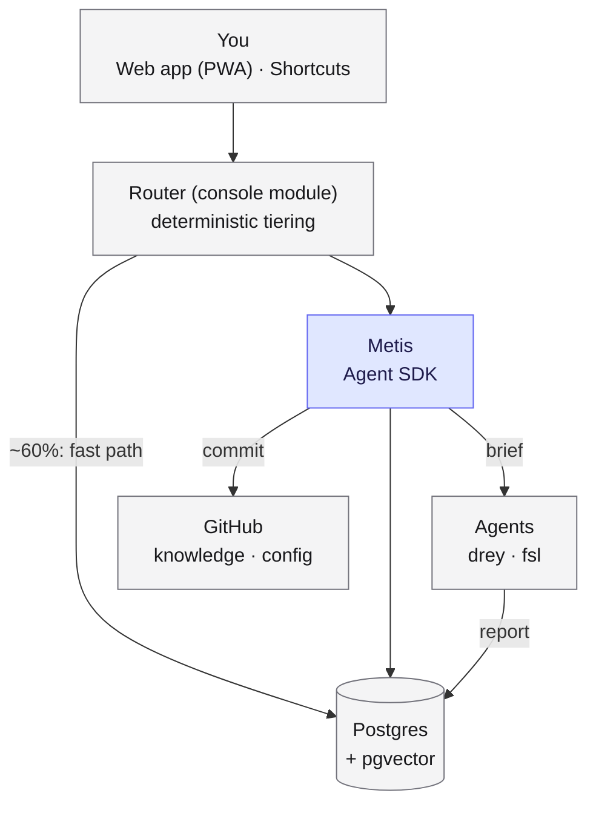
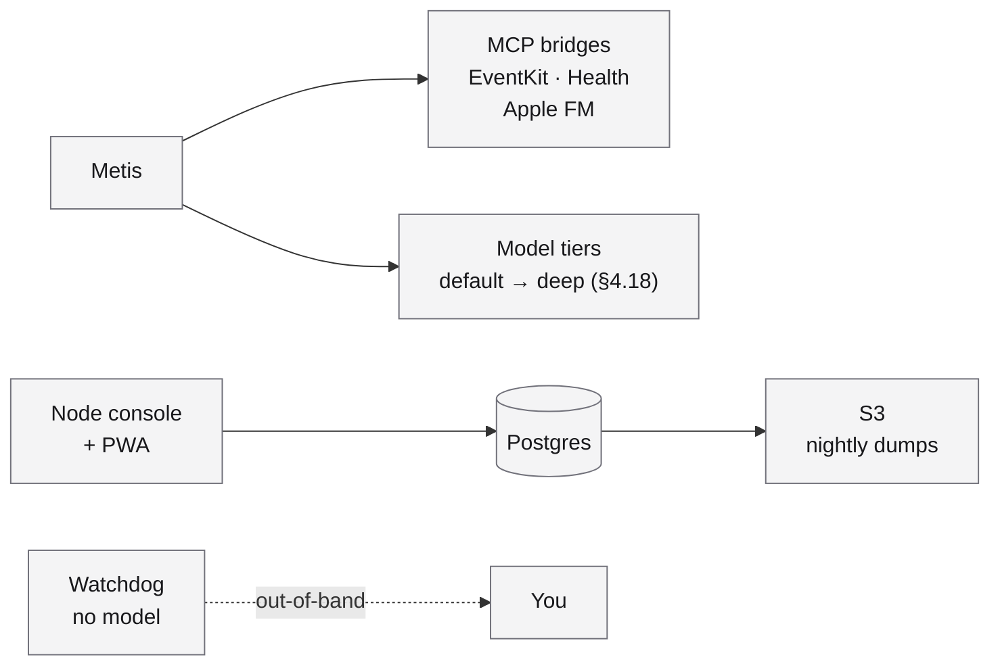

# Metistry — Build Plan

A personal AI operating system: a persistent assistant + knowledge graph the
user owns entirely. The assistant's name is instance config (`identity.yaml`;
the author's is Metis). **Host it anywhere** — the reference deployment is a
single always-on machine (the author's is a Mac Studio, which the
Apple-native bridges require for *those* capabilities), but the system is
hosting-agnostic by construction (invariants 7–8): services bind configured
ports, network exposure is the user's routing layer, and the Apple tier is a
satellite, not a dependency. Local-first in ownership (your data in your git
and your Postgres, local models where they win), not local-only in
deployment. Two kinds of repo: one public product repo (code, Apache-2.0),
and one private instance repo per install (vault + config) — see §4.16.

---

## 0. Summary

### What it is

A persistent assistant that holds your context so sessions don't have to. Agents
are disposable; state is durable. Two things persist: **markdown in git** (what
you know) and **Postgres** (what's happening). Everything else can be rebuilt.

### Architecture



Everything above runs on the user's host machine except GitHub. Supporting
pieces:



### Terminology

| Term | Is | Triggered by | Writes |
|---|---|---|---|
| **Bridge** | Capability an agent calls | An agent | Returns to caller |
| **Collector** | Scheduled data pull, no model | The clock | Postgres |
| **Agent** | A worker with a job and a scope | A routine, Metis, or you | `brain-report` |
| **Skill** | Reusable instructions, lazily loaded | An agent invoking it | Nothing |
| **Routine** | A schedule, nothing more | Cron | Nothing directly |
| **Named query** | The only read path into state | Anything | Nothing |
| **Knowledge** | Durable prose in git | You or the assistant | Git |
| **State** | Operational, regenerable | Collectors | Postgres |
| **Target** | A place work can execute (§4.18) | The router / dispatch rules | Per its manifest |
| **Work item** | One task on the shared list, claimable with a lease (§4.19) | Anything, via the hub | `work` table |
| **Project** | A multi-agent effort: agents + tasks + proposals + spend, one view (§4.19) | The user | View over existing tables |
| **Proposal** | A suggested knowledge/action addition awaiting triage | Any agent or capture | Inbox; never the vault directly |
| **Grant** | A user-issued, server-side permission (read tier, area scope) (§4.11) | The user, via the management API | Attached to a credential |
| **Profile** | What the assistant knows about its user (§4.15) | Init interview + accepted proposals | `Knowledge/Me/` |
| **Product / Instance** | The public code vs. one private install (§4.16) | — | Releases down; data nowhere |

Agents are grouped by area (`agents/<area>/<name>.md`) with hierarchy in
frontmatter (`manages: [designer, developer, qa]`), not filesystem depth —
reporting relationships change, and an agent can serve two managers. Mention
tags (`@<agent>`) address these **named agents from the instance's registry**
— the author's `@drey`/`@fsl` are examples of their setup, not built-ins.

### The flow

**Capture → Ingest → Index → Query → Compound.**

1. **Capture** — web app, share sheet, Shortcuts, Obsidian mobile. Lands
   in `inbox/`. Must take under five seconds or it won't happen.
2. **Ingest** — `inbox-drain` classifies with local models, emits *proposals*,
   never auto-creates.
3. **Index** — reconciler re-embeds changed chunks, parses links, updates
   freshness. Batched, hash-compared, never notifies Metis.
4. **Query** — named queries serve the router, Metis, the console, and Obsidian
   from one implementation.
5. **Compound** — evening and weekly routines distill activity into knowledge, in
   Metis's voice, as its own commits.

### Working style

- **Chatty is fine.** Sessions resume by UUID; cost per turn is flat. Corrections
  and redirects are the expected interaction, not an exception.
- **Adaptive escalation.** The assistant runs the default tier and delegates
  hard sub-tasks to the deep tier, so escalation cost is bounded to the hard
  part rather than the whole turn. `/model <tag>` (and its shipped alias
  `/deep`) remains the manual override. Per-tier daily budgets in
  `rules.yaml`; every escalation logged.
- **Metis routes; agents execute.** Briefs carry context, not access.
- **You review by audit, not by gate** (reaffirmed 2026-08-28 against the
  prior-art junk evidence). Knowledge commits flow freely; changes to how the
  system works need a PR. The one refinement: distillation-produced *facts*
  land as `status: draft` and surface in the morning brief for one-tap
  settle/reject — an audit affordance with visible trust levels, not a gate;
  nothing blocks on it. Journal/log-type notes stay plain audit.

---

## 1. Invariants

Eight rules. Every later decision should be checkable against these.

1. **Git is the record. Postgres is derived and operational.**
   Test: `docker compose down -v`, rebuild from the repo, run collectors once →
   back in business minus historical trend lines. Anything failing that test
   belongs in the backup; nothing else does.

2. **Shared responsibility, enforced at the tool.** Metis commits freely to
   `Knowledge/`. Anything defining how the system behaves requires a PR. Enforced
   by the commit tool, not by convention — see §4.7.

3. **One read path into state.** Named queries in `router/queries/`. Consumed by
   the router, the `brain-query` MCP bridge, the console, and Obsidian. No
   component talks to Postgres directly.

4. **The router is deterministic.** No model decides which model to use.
   Prefix, regex, and explicit commands only.

5. **Everything is a directory with a manifest.** Bridges, collectors, agents,
   routines, targets. Adding capability = dropping in a directory. CI validates.

6. **Native only where macOS requires it.** Apple bridges and local inference run
   under launchd. Everything else is a container.

7. **Cloud-portable by construction.** Everything outside the Apple tier runs in a
   container with config from environment — no absolute paths, no assumption of a
   local filesystem. The Apple tier is a satellite, not a dependency. See §4.17.

8. **Security survives full code visibility, and the network is not a
   boundary** (added 2026-08-28). This is an open-source project: adversaries
   — including AI agents — read the source, and will probe every interface
   for workarounds to weak designs. So: Kerckhoffs's principle throughout
   (nothing depends on secrecy of mechanism); boring, standard, verifiable
   security primitives (bearer tokens, server-side authz, audit logs) over
   anything clever; every boundary enforceable at the tool AND testable
   (misuse tests ship with the interface). And the project is **network-
   agnostic**: services bind configured host/port (loopback by default) and
   authenticate every request as if internet-exposed — reachability (tailnet,
   reverse proxy, cloud LB, Docker port maps) is a routing layer the *user*
   provides, which docs may suggest patterns for but code never assumes.
   "We're on the tailnet" is never an auth argument.

---

## 2. Phase 0 — Proof of concepts

Ordered by how much of the design dies if the answer is no. Each should take
under an hour. Do not start Phase 1 until PoC-1 through PoC-4 pass.

### Outcomes (2026-08-28) — Phase 0 complete

Full evidence in `docs/poc/RESULTS.md`. Summary below. **Note (2026-08-29):**
this section is the historical record; the PoC descriptions keep their
original framing. Decision D1 (`docs/plan-review-2026-08-29.md` §8) later
dropped iMessage entirely — as the door and as an ingest source — so the
iMessage-specific findings (PoC-2, hard requirement 5) no longer ship,
while the TCC/signing/probe lessons from PoC-1/2/9/11 carry unchanged to
the EventKit and Apple FM bridges.

| PoC | Result | What it settled |
|---|---|---|
| 1 MCP+TCC headless | **PASS** | The headless door works. TCC attributes access to the responsible process, so a stdio MCP server inherits the *agent's* TCC identity — an HTTP bridge as its own launchd service is the only shape that works without granting FDA to the agent binary. |
| 2 iMessage attachments | **PARTIAL / PASS** | Text door + *opportunistic* media door: ~89% of images older than a few days are iCloud-offloaded, but a just-received image is on disk within a minute. Copy-on-detect works; the share sheet is the canonical media path. |
| 3 Apple FM headless | **PASS** | 2.2 items/sec under launchd, byte-identical to interactive. Swift-only (no Python SDK). 4096-token context, fresh session per item. |
| 4 Container → host bridge | **PASS** | Networking (explicit `add-host`, no Desktop magic), subscription-token auth, and session-survives-restart all pass. **Decision #9 = Docker.** |
| 5 pgvector | **PASS (mechanics)** | Ollama `nomic-embed-text` (768d), ~125 chunks/sec, deterministic rebuild. Retrieval *quality* deferred until the real vault has content. |
| 6 PWA + web push | **PASS** | Delivered to iPhone over the tailnet. VAPID `sub` must be a real contact (Apple rejects `example.invalid`); tailnet needs Serve + HTTPS enabled. |
| 7 HTTP capture | **PASS** | All surfaces incl. a 25 MB binary, byte-identical. |
| 8 Router fast path | **PASS** | 0.6 ms cached / 24 ms uncached vs the 200 ms bar. Real console needs a persistent pg pool, not `psql` subprocesses. |
| 9 EventKit writes | **PASS** | Calendar + Reminders CRUD under launchd; iPhone sync confirmed. |
| 10 RTSP camera | **DEFERRED** | No RTSP hardware (HomeKit-only). |
| 11 Watchdog independence | **PASS** | Model-free probes + out-of-band iMessage send, interactive and headless. |
| 12 Obsidian Sync | **DEFERRED** | No Sync subscription yet; new vault built from scratch. |
| 13 Comms reduction | **FAIL (quality)** | Plumbing works; extraction precision ~30% fails the bar as configured. See §4.12 — revised. |
| 14 Local input classifier | **FAIL** | A user-proposed pre-router classifier; over-split 42–54% on must-not-split inputs and promoted quoted/forwarded text to intent. Invariant 4 stands; see §4.1. |
| 15 Complexity-tier scorer | **SPLIT** | Apple FM rejected (cheap class collapsed); Haiku passed quality (91.7%, 1/16 deep-miss) through a contaminated harness. Cost criterion corrected: routing is a quality purchase (~4¢/rescued turn), not a saving. |
| 16 Local tier-scorer models | **PASS** | `gemma4:e4b` beat the Haiku baseline on every quality axis (97.9%, 6/6+6/6 traps, 667 ms, $0). Calibration, not size, is the variable. Invariant-4 amendment still gated on a blind confirmatory eval. |

**Hard requirements Phase 0 forced into the design (each is "enforce at the
tool," and each is now load-bearing rather than stylistic):**

1. **TCC-bound bridges are HTTP services of their own** — never stdio spawned
   by the agent (the agent's TCC identity would govern). See §4.3.
2. **The native tier is stable-identity *signed* binaries.** Three grant-rot
   variants were observed — Homebrew `node`'s versioned Cellar path, the
   `claude` CLI's versioned path, and an ad-hoc-signed binary's cdhash — each
   silently drops a TCC grant when its identity changes. A purpose-built,
   stably-signed binary per TCC bridge is required, not optional. See §4.16.
3. **`check()`/doctor probes behavior in the bridge's own context**, never a
   permission API. Three silent/mis-reporting failure modes were found:
   FDA denials are invisible to Claude's permission layer, unauthorized
   EventKit returns an empty world with no error, and TCC status reads are
   themselves responsible-process-bound. See §4.3, §4.16.
4. **Model output gets a deterministic redaction pass before it is trusted as
   low-sensitivity.** A local model copied a live OTP verbatim into a
   "body-free" structured field despite explicit prompt instructions. Prompt
   rules are not a control. See §4.3, §4.12.
5. **A Messages bridge must decode `attributedBody`** — `message.text` is
   NULL on ~99% of recent messages. *(Superseded by D1: no Messages bridge
   ships; preserved in case Messages work ever returns.)* Mail ingest needs
   no IMAP: the local `~/Library/Mail` `.emlx` store is present and large.
   See §4.12.
6. **Container config is Linux-portable by construction** — explicit
   `extra_hosts: host-gateway`, bridge URLs from env, subscription token via
   `CLAUDE_CODE_OAUTH_TOKEN` (never set `ANTHROPIC_API_KEY` in-container). See
   §4.17, §6 #9.

### PoC-1 — MCP tool call under `claude -p` with macOS permissions

**Assumption:** a non-interactive session can invoke a tool that needs Full Disk
Access / Automation, without blocking on a permission prompt.

**Kills:** the iMessage door, and possibly the whole "assistant in headless mode" model.

```bash
# minimal MCP server exposing one tool that reads chat.db
mkdir -p ~/poc/mcp-messages && cd ~/poc/mcp-messages
# implement: list_recent_messages(limit) -> reads ~/Library/Messages/chat.db

claude -p "List my 3 most recent messages using the messages tool." \
  --mcp-config ./mcp.json \
  --output-format json | jq '{result, denials: .permission_denials, err: .is_error}'
```

**Watch for:** `permission_denials` non-empty; the call hanging; a GUI prompt
appearing. Then repeat the same command from a launchd-started shell — TCC grants
are per-binary and a grant to Terminal.app does not transfer.

**If it fails:** pre-grant Full Disk Access to the binary launchd invokes, or move
the Messages read behind a small native helper the MCP server shells out to.

### PoC-2 — iMessage attachments

**Assumption:** the bridge can surface images and files you send, not just text.

**Kills:** rich media via iMessage. Fallback is the share sheet, which you want
anyway — so this decides whether iMessage is the whole door or just the text door.

```bash
# send yourself a photo, then:
sqlite3 ~/Library/Messages/chat.db \
  "SELECT a.filename, a.mime_type, m.date
   FROM attachment a
   JOIN message_attachment_join j ON j.attachment_id = a.ROWID
   JOIN message m ON m.ROWID = j.message_id
   ORDER BY m.date DESC LIMIT 5;"
```

Confirm the paths resolve and are readable by the service account. Then confirm
Metis can actually read one: pass the path to a session and ask it to describe
the image.

### PoC-3 — Apple Foundation Models from a headless service

**Assumption:** the Python SDK works without a GUI session, at usable throughput.

**Kills:** the free classification tier. Everything falls back to Haiku, which is
cheap but not free, and the token savings argument weakens considerably.

```bash
# classify 50 synthetic inbox lines, measure wall time and correctness
python3 ~/poc/afm_classify.py --input ~/poc/fixtures/inbox-50.txt
# then the same via launchd, not from your logged-in shell
launchctl submit -l poc.afm -- /usr/bin/python3 ~/poc/afm_classify.py ...
```

**Watch for:** requires an active user session; throughput under ~1/sec makes
nightly triage of a large inbox impractical; quality on your actual phrasing.

### PoC-4 — Container reaching a host MCP bridge

**Assumption:** Metis in Docker can call native bridges on the host.

**Kills:** the container/native split. Fallback is running Metis natively too,
which loses the Docker controls you wanted.

```bash
# bridge listening on host:7801
docker run --rm alpine/curl \
  curl -s http://host.docker.internal:7801/health
```

Then end-to-end: Metis container → host bridge → Messages. Also test session state
survival:

```bash
docker compose restart cos
# resume a session UUID created before the restart, confirm it remembers
```

### PoC-5 — pgvector retrieval quality on your notes

**Assumption:** semantic search over your own writing is good enough to change how
you work.

**Kills nothing** — but if retrieval is mediocre, don't build the embed pipeline
yet, and keep `now.md` doing more work.

```bash
# embed 200-500 real notes, run 10 realistic queries
psql -f ~/poc/embed_and_query.sql
```

**The bar:** for a question you know the answer to, does the right document come
back in the top 3? Judge it on questions phrased the way you'd actually ask, not
keyword-shaped ones.

### PoC-6 — Tailscale + PWA + web push on iOS

**Assumption:** the console installs to the Home Screen and can notify you.

**Kills:** push notifications from the console. iMessage still notifies, so this
is degradation not failure.

```bash
tailscale serve --bg 8080
# then on iPhone: open https://mac-studio.tailXXXX.ts.net, Add to Home Screen,
# grant notifications, trigger a test push
```

**Watch for:** service worker registration (needs the valid cert), push arriving
with the tunnel down, cold-open behavior from a notification tap.

### PoC-7 — Capture, HTTP first

**Assumption:** capture works from every surface without depending on the Mac
being the host.

**HTTP is the canonical path.** `POST /capture` on the Node console works from the
iOS share sheet, a macOS Quick Action, the CLI, Obsidian, and — later — a native
iOS app. It is the only capture path that survives a move to cloud hosting.

```bash
curl -F file=@shot.jpg -F note="whiteboard from standup" \
  -H "Authorization: Bearer $TOKEN" https://<host>/capture
```

**iCloud Drive is a local-only convenience,** not the design. It buys one real
thing: capture still succeeds when the Mac is off, because iCloud queues and the
Mac ingests on wake. Keep it as a secondary path under the `local-mac` profile;
drop it under `cloud`.

Test both: share a photo, a URL, a contact card, and a PDF. Confirm each lands in
`inbox/` with metadata, and that a large attachment arrives complete.

**Longer term:** a native iOS app is the cleaner interface precisely because it
lets the underlying implementation change without you noticing — share extension,
push, offline queue, and quick-action buttons, all against the same endpoint.

### PoC-8 — Router fast path, end to end

**Assumption:** a status question answers in well under a second with no model.

```bash
time curl -s http://localhost:8080/api/q/open_work | jq
```

**The bar:** under 200ms warm. If it isn't, the fast path won't feel different
from a Haiku turn and you'll stop using it.

### PoC-9 — EventKit writes (Calendar + Reminders)

**Assumption:** Metis can create events and reminders, not just read them.

**Kills:** half the use-case list — scheduling, reminders, shopping list.

Test create, update, and delete on both stores from a launchd-started process.
Confirm items appear on the iPhone within seconds. Confirm a `destructive: true`
tool triggers confirmation in Metis rather than firing silently.

**Note:** Reminders is a *surface*, not a store. The shopping list lives there,
syncs everywhere, and supports location triggers. Metis reads and writes that
list rather than reimplementing lists in the brain.

### PoC-10 — Camera snapshot via RTSP

**Assumption:** package detection is possible.

**Important:** HomeKit Secure Video is end-to-end encrypted — there is no API to
pull clips or snapshots from iCloud. The path is RTSP directly from the camera on
the LAN.

```bash
ffmpeg -rtsp_transport tcp -i rtsp://<cam>/stream -frames:v 1 /tmp/snap.jpg
```

Then: snapshot on motion → vision model → result to Postgres. HomeKit stays for
sensors and device state; cameras are their own bridge.

### PoC-11 — Watchdog independence

**Assumption:** you can be told Metis is broken *by something that isn't Metis*.

**The problem:** if the Claude token expires, Metis can't tell you the token
expired. Same for Postgres down, or the container dead.

```bash
# no model involved anywhere in this path
osascript -e 'tell application "Messages" to send "test" to buddy "<you>"'
```

Confirm the watchdog can probe token validity, container liveness, and collector
staleness, then message you with zero dependency on Anthropic being reachable.

### PoC-12 — Obsidian Sync alongside git

**Assumption:** vault-inside-repo works without either system corrupting the other.

**Kills:** mobile editing. Fallback is desktop-only knowledge editing, which
undermines the capture story.

Set vault root to `<instance>/Knowledge/`, git root at the instance repo root
(§4.16). Then:

- Edit a note on iPhone → confirm it reaches the Mac and commits cleanly
- Edit the same note on both, offline → confirm Obsidian produces a conflict file
  and the reconciler flags rather than indexes it
- Confirm `git status` never shows `.obsidian/` churn (gitignore it) and never
  sees a sync temp file mid-write

### PoC-13 — Comms reduction quality

**Assumption:** Apple FM extracts real action items from your actual mail and
messages at a useful precision.

**Kills:** the comms pipeline. Better to know before building the ingest.

Run stage 2 over 200 real items. Measure: how many true actions found, how many
false positives, and whether the structured row is genuinely body-free. **The
bar is precision, not recall** — a queue of forty proposals a day gets ignored;
five accurate ones get used.

### PoC-14 — local input classifier (added mid-phase, user proposal)

**Assumption:** a small local model can split multi-intent input ahead of the
router. **FAILED** — deterministic over-splitting on lexical cues, quoted
third-party text promoted to user intent. Invariant 4 stands. Full evidence:
`docs/poc/RESULTS.md` §PoC-14; fixtures kept as a re-test eval.

### PoC-15 — complexity-tier scorer (invariant 4 evaluation)

**Assumption:** a cheap model can classify ask-complexity to route among
user-configured tiers. **SPLIT** — Apple FM failed (cheap class collapsed);
Haiku passed the quality bar through a contaminated harness on author-shared
fixtures. Also corrected an ill-posed cost criterion: correct routing beats
always-standard on *quality* (~4¢ per rescued high-stakes turn), never cost.
Full evidence: `docs/poc/RESULTS.md` §PoC-15.

### PoC-16 — local models as tier scorer

**Assumption:** a local model can match cloud scoring quality at $0.
**PASSED** — `gemma4:e4b-it-qat` (6.3 GB resident, 667 ms warm p95) beat the
Haiku baseline on every quality axis on identical fixtures; reasoning-mode
measurably hurt the task; calibration, not parameter count, decides. The
invariant-4 amendment remains gated on an independent confirmatory eval
(blind fixtures, ≥50 deep items) with `gemma4:e4b` as candidate. Full
evidence: `docs/poc/RESULTS.md` §PoC-16.

### Already settled

Session resumption with a caller-supplied UUID; resume failing loudly on unknown
IDs; flat cost per turn across a long session; Haiku adequate for routine work;
Sonnet has no niche between Haiku and Opus.

---

## 3. Build phases

### Phase 1 — Substrate (weekend)

- Monorepo skeleton: pnpm workspaces, changesets, `apps/` + `packages/`
- `packages/core` — manifest schema, lazy-discovery helpers, redaction
  (inputs AND model-generated output, §4.3), preview-confirm, and the
  `check()` interface every component implements
- **Lazy-discovery spike before core's interface freezes** (§4.3 caveat): one
  toy bridge, lazy vs eager, scripted Haiku tasks — does the meta-tool
  indirection actually work at the Haiku tier, and what does the discovery
  round-trip cost?
- `CLAUDE.md`, `now.md`, `identity.yaml`, `.env.example`
- `docker-compose.yml`: Postgres + pgvector
- `db/migrations/0001` — `runs`, `inbox`, `sessions`, `work`, `metrics`,
  `knowledge_files`, `knowledge_links`, `embeddings`. The `sessions` schema is
  designed for **re-briefing, not transcript reconstruction** (§4.17 rule 6):
  thread identity, rolling summary, key decisions, open loops, refs.
- `ops/scripts/backup.sh` + restore-test script
- CI **on Linux** from day one: migrations apply cleanly, manifests validate,
  path-case check passes

**Done when:** `docker compose up` from a fresh clone gives a working database, a
dump restores into a scratch DB, and `core` exports the interfaces everything
else will implement.

### Phase 2 — Door (weekend)

The door is the **web app** (D1/D2, 2026-08-29) — and it needs zero TCC
grants, which is what makes a fast first-run possible.

- `apps/console` serving the PWA: thread view (ask/answer), capture box,
  Home Screen install, **web push** (PoC-6)
- `POST /message` lands a **durable row before the 202**; the assistant
  drains the queue — a message sent during a restart is never lost. The
  drain step is also the home of the deterministic pre-check before any
  model turn.
- Metis container, Agent SDK, resuming by UUID from `sessions`
- Router as a **console module** with `rules.yaml`, fast path + default tier
- **Keyword/FTS recall over the vault as a named query** (D8) — "what did
  we decide about X" works from week one; embeddings stay Phase 6
- Slow-turn ack: any turn expected >~5s immediately acks, naming the tier
- `runs` logging on every turn — two-phase rows (insert on start, update on
  completion) so a hung or crashed call is visible, not silent

**Done when:** you open the PWA on your phone, ask, and get a useful answer,
with a push arriving when the reply is slow. This is the day it feels real —
everything after is additive. Target: `metistry init` to a working door in
under ten minutes, no TCC prompts; the native tier is a progressive unlock
via the `doctor` capability checklist (which doubles as grant-rot recovery).

### Phase 3 — Capture (a few evenings)

- iOS share-sheet Shortcut + macOS Quick Action → `POST /capture`, with a
  **local-file fallback on any HTTP failure** (iCloud Drive inbox folder,
  already a `local-mac` path) — one silent capture drop ends the trust
- `inbox-drain` collector (drains both paths)
- Apple FM bridge + nightly triage routine — the first progressive TCC
  unlock via the `doctor` checklist
- `/note` command

**Done when:** you can share a photo from any app and it lands, gets classified,
and shows up in the morning brief.

### Phase 4 — Visibility (a week of evenings)

- Collectors: `aws-costs`, `claude-usage`, `github-state`, `drey-metrics`
- Named queries in `router/queries/`
- Node console + static dashboard on a configured port (exposure = the
  user's routing layer, invariant 8; on this install, tailnet is the
  chosen pattern)
- The PWA (shipped as the door in Phase 2) **grows the management UI**
  (§4.2 management surface — agent registry, grants, proposal triage with
  push notifications), under the CRIT-7 rules: management endpoints take
  the owner credential only, and every agent-authored field is
  output-encoded before rendering
- **`metistry` Claude Code plugin** (§4.11 external capture — small; rides
  with the console since `POST /capture` is its endpoint)

**Done when:** you check the dashboard instead of four separate places, and you
can see your own token spend split by tier.

### Phase 5 — Delegation (ongoing)

- Crew definitions with their own toolsets
- **Compute-target registry (§4.18)** — dispatch generalized from
  GitHub-issues-only to manifest-defined targets (MCP-first)
- `@agent` dispatch → GitHub issues (the first target)
- `brain-query` MCP bridge exposing named queries to Metis; **`mcp-brain`'s
  write-only door opened to external agents** (§4.11)
- **Coordination hub tools + multi-agent projects (§4.19)** — claim/lease/
  dependency columns, agent identity, event-driven proposal triage
- Weekly review routine

### Phase 6 — Knowledge (when Phase 5 is stable)

- `knowledge-embed` collector on commit
- `search_knowledge` named query goes semantic (the keyword/FTS version has
  been serving recall since Phase 2 — D8)
- Obsidian pointed at `Knowledge/`, reading state via the console HTTP API

**Deliberately last** — for *embeddings*, not recall. Semantic search over a
thin corpus isn't worth much; it earns its place once there's a year of
notes. Keyword recall, the behavior that makes the system indispensable,
ships in Phase 2.

### Later — native iOS app (post-Phase 6; premium candidate)

Same management API as the web app — no private endpoints — adding what only
native can do: share extension, real push, offline queue, widgets/Shortcuts
depth. Explicitly a candidate for a **paid/premium addition to the
open-source project**; the product framing accumulates in
`docs/product/PRODUCT.md` as features and guardrails are designed, so the
pitch exists when it's needed rather than being reconstructed later.

---

## 4. Interfaces

### 4.1 Human → Metis

**Natural language is the interface. Slash commands are an accelerator.**
`rules.yaml` regex-matches natural phrasings onto fast-path queries, so "what's my
spend" works without a slash. Commands exist for people who like typing them.

The genuinely fast mobile path isn't chat at all — it's **Shortcuts**. A `/status`
Shortcut in a Home Screen widget, on the Lock Screen, or as a Watch complication
is one tap with no typing and no typos. The PWA renders one-tap actions
(triage, settle/reject, elevation approvals); the eventual iOS app adds a
share extension, real push, and widgets.

| Input | Tier | Behavior |
|---|---|---|
| *bare text* | adaptive | Resume thread session, escalate sub-tasks as needed |
| natural status phrasings | fast path | Matched by regex to a named query |
| `/status` `/today` `/open` `/spend` `/queue` `/runs` | fast path | Named query, no model |
| `/note <text>` | none | Straight to inbox, acknowledged instantly |
| `/model <tag> <text>` | as configured | Manual tier/model override — tags from the user's `rules.yaml` tier menu (§4.18.A) |
| `/deep <text>` | deep tier | Shipped default alias for `/model deep` — zero setup, works day one |
| `/new` | none | Roll to a fresh session UUID |
| `@<agent> <brief>` | dispatch | Brief → the named agent's target (default: GitHub issue). Agents come from the instance registry — e.g. the author's `@drey`, `@fsl` |

**Adaptive escalation.** The assistant runs the default tier and delegates
hard sub-tasks to the deep tier — cost is bounded to the hard part, not the
whole turn. In the multi-model world (§4.18.A) tiers are user-configured
model bindings with shipped defaults (default=Haiku-class, deep=Opus-class),
so `/model` names *your* menu, not hardcoded vendors. Guardrails: per-tier
daily budgets in `rules.yaml`, and every escalation logged to `runs` so you
can audit whether it escalates sensibly and tune the threshold.

**Every fast-path answer carries a freshness stamp** ("as of 14 min ago") so stale
collectors are visible rather than silently wrong.

**Rejected (PoC-14): a local-model "classifier" pre-stage** that would parse
input, detect commands, and split multi-intent messages before the router.
Tested at the user's request with an amendment to invariant 4 on the table. It
failed: 42–54% over-split rate on inputs that must not be split, it promoted
quoted and forwarded third-party text to first-person intent (including
overriding an explicit "don't do anything with this"), and its own confidence
flags were anti-correlated with truth. **Invariant 4 stands as written** — the
router is deterministic; multi-intent decomposition stays with Metis, which
has the session context a stateless classifier lacks. The only defensible
remnant, if ever wanted, is a split *suggestion* surfaced for user
confirmation (never acted on silently) behind a deterministic pre-filter that
skips quotes, pastes, forward markers, and URLs. The PoC-14 fixtures are a
ready-made eval if a stronger local model later warrants a re-test.

### 4.2 Console HTTP API

Binds a configured host/port (loopback by default); reachability beyond the
machine is the user's routing layer (invariant 8 — tailnet, reverse proxy,
cloud, Docker port maps; docs suggest patterns per hosting model, code
assumes none). Four consumers: PWA, Shortcuts, Obsidian, and **external
agents pushing captures/reports** (§4.11 — via `mcp-brain`'s write-only door
or `POST /capture` directly, per-agent bearer tokens).

```
POST /capture              multipart or json → inbox/    (Shortcuts)
POST /message              { thread_id, text } → 202 + message_id
GET  /api/q/:name          named query, params via querystring
GET  /api/state            bundled dashboard payload
GET  /api/stream           SSE — state changes, Metis replies
GET  /health               liveness + collector staleness summary
```

**Management surface (added 2026-08-28)** — the API the web app (and later
the iOS app) drives; everything a user configures gets an endpoint, never a
hand-edited file on the server:

```
GET/POST   /api/agents                external-agent registry + token issuance
GET/PUT    /api/agents/:id/grants     read tiers (§4.11): none | index | areas[]
GET        /api/agents/:id/inbox      the agent's pull inbox (feedback, replies)
GET        /api/proposals             pending knowledge proposals, with provenance
POST       /api/proposals/:id         allow | deny | accept_with_changes
                                      { feedback } — deny/changes feedback routes
                                      to the source agent's inbox (§4.19)
GET        /api/projects              multi-agent projects (§4.19): agents,
                                      task rollup, proposal stream, progress
POST       /api/grants/requests/:id   approve/deny an elevation request (§4.11)
```

Mutations are few, explicit, audit-logged to `runs`, and carry the same auth
as everything else — a bearer credential on every request, validated as if
the port were internet-exposed (invariant 8; the network layer gets no
trust). The console PWA is the first client; the eventual iOS app is the
second — same API, no private endpoints. **Open-source discipline:** this
surface will be read and probed by AI agents; keep it small and boring,
authorize server-side per request (never per session-establishment), return
uniform errors that don't leak existence, and ship misuse tests alongside
every endpoint.

`/api/q/:name` resolves against `router/queries/` only — no arbitrary SQL, ever.
Auth is a bearer token on every request from every client — the routing
layer in front of the port adds reachability, never trust (invariant 8).

**`POST /message` is async — and durable before it is acknowledged.** The 202
is returned only after the message lands in a durable row; the assistant
drains the queue, so a message sent during a restart (every `metistry
update`) is never lost. The drain step is also where the deterministic
pre-check runs before any model turn. The reply arrives over `/api/stream`
or as a web push. Build the client as a messaging client from day one —
retrofitting that is painful.

### 4.3 MCP bridge contract

Each bridge is a **published npm package** (see §4.16), usable standalone by
someone who has never heard of this project.

```yaml
name: messages
type: bridge
transport: http          # stdio only for NON-TCC bridges — see rule below
port: 7801
runs_on: host            # host | container
requires_tcc: [full_disk_access, automation]
discovery: lazy          # lazy | eager
degrades: absent         # absent | <fallback bridge name>
exposes:
  - name: list_recent
    description: Recent messages from a handle
  - name: send
    destructive: true
```

**Three defaults every bridge inherits from `@foldedspacelabs/core`:**

**1. Lazy tool discovery.** Measured: ~21k tokens of tool definitions ride on
every turn, and `--allowedTools` does not trim them. In lazy mode a bridge exposes
three meta-tools — `tool_index`, `execute`, `batch` — instead of its full surface.
A bridge with 40 tools costs 3 in the prompt; the agent discovers when it needs
to. This is what lets the assistant carry real capability without the per-turn
floor climbing. `eager` stays available for small, always-needed bridges.
*Caveat: this is the largest design claim Phase 0 did NOT test.* The token
measurement is real, but whether models (Haiku especially) drive the
meta-tool indirection reliably — and what the extra discovery round-trip costs
per turn — is unproven. **Phase 1 includes a cheap spike** (one toy bridge,
lazy vs eager, scripted Haiku tasks) *before* the discovery interface is
frozen into `core`; every bridge inherits this, so learning its failure modes
after Phase 2 would be the expensive version.

**2. Preview-then-confirm on mutations.** Any `destructive: true` tool returns a
diff of what *would* change and requires a second confirming call. Generalizes
better than prompt-level caution, because the bridge enforces it.

**3. Secret redaction by default — of inputs AND model-generated output.**
Known secret fields — tokens, keys, passphrases, credentials — return
`***REDACTED***` so they never enter agent context, transcripts, or logs. Opt
out per-process only, never per-call. Passing the placeholder back is rejected
so it can't be written as a real value. **PoC-13 forced this wider:** a bridge
that returns model-*generated* structured data (the comms reducer, §4.12) must
run a deterministic redaction pass over that output — digit-run scrubbing for
OTP/PIN/card/phone, capitalized-token filtering for names — because a local
model copied a live verification code verbatim into a field that was supposed
to be body-free, ignoring an explicit prompt instruction not to. Prompt rules
are not a control; the bridge must be mechanically incapable of emitting the
forbidden shape.

**Transport is not free choice for TCC bridges (PoC-1).** A stdio MCP server
spawned by the agent inherits the *agent binary's* TCC identity and is denied
even when the server binary itself holds the grant. Any bridge with a
non-empty `requires_tcc` MUST be `transport: http` and `runs_on: host`,
running as its own launchd service so it is its own responsible process.
`stdio` is fine only for bridges that need no TCC grant.

**Scoping still matters.** The assistant loads only the bridges it needs;
specialized tools belong to agents. Lazy discovery lowers the cost of each
bridge, it doesn't make the list free.

**Every bridge exports `check()`** so `metistry doctor` is generic, and logs one
row per call to `runs`. **`check()` must probe behavior, not a permission API
(PoC-1/9):** attempt the actual privileged read and inspect the result, because
TCC denials are invisible to the permission layer, an unauthorized store can
return an empty world with no error, and an authorization-status read is itself
responsible-process-bound (it lies when run from the wrong process tree).

### 4.4 Skills

One directory. Skills are reusable instruction sets — how to run a weekly review,
write a brief, hold a Decision Council — stored as markdown, not prompts baked
into an agent.

```
skills/
  _shared/                 utilities skill scripts can use
  decision-council/
    SKILL.md
    references/
  meeting-notes/  weekly-review/  brief-writer/
```

**Skills load lazily too.** Only the frontmatter `description` sits in the prompt;
the body loads when the skill is invoked. Eager tools and eager prompt injections
are the same tax — fix both.

Agents bind skills in their manifest (`skills: [decision-council, brief-writer]`),
so an agent carries only its own descriptions.

### 4.5 Named query contract

```yaml
# router/queries/open_work.yaml
name: open_work
description: Work items not yet closed, newest first
params:
  limit: { type: int, default: 20 }
sql: |
  SELECT id, title, area, status, updated_at
  FROM work WHERE status <> 'closed'
  ORDER BY updated_at DESC LIMIT :limit
cache_ttl: 60
```

One definition, four consumers. Adding a query is a file, not a deploy.

### 4.6 Manifest schema (all component types)

```yaml
name: aws-costs
type: collector          # bridge | collector | agent | routine | target (§4.18)
schedule: "0 */6 * * *"  # collectors and routines
writes: [metrics]        # tables or paths
reads: []
requires: [aws-cli]
model: haiku             # agent only
uses: [brain-query]      # agent only — bridges it may load
```

CI validates: schema conformance, unique `writes` targets, no dangling `uses`
references, every `schedule` a parseable cron.

---

### 4.7 Repo governance

Shared responsibility: Metis writes knowledge without ceremony; you review
changes to how the system works.

**Free — direct commit by Metis**

`Knowledge/` — Areas, People, Decisions, Journal, `now.md`

**Protected — PR required**

`agents/` `bridges/` `collectors/` `router/` `db/migrations/` `ops/`
`docker-compose.yml` `.github/` `CLAUDE.md`

Two of those matter more than the rest. `CLAUDE.md` is Metis's own operating
instructions — an agent that can rewrite its own constraints has none. And
`router/rules.yaml` decides what escalates and what dispatches; an agent that can
edit its routing can grant itself Opus on everything.

**Three enforcement layers, most reliable first**

1. **Tool-level.** Metis never calls `git commit`. It calls `brain-commit`,
   which stages only `Knowledge/` and refuses other paths. An agent can't route
   around a tool that won't accept the argument.
2. **Repo-level.** A GitHub ruleset with path restrictions on `main`.
3. **CODEOWNERS.** For PRs opened by you or by Claude Code. Note it only assigns
   review — it does not block direct pushes.

**Commit hygiene** (so rollback is actually usable)

- One logical change per commit — never "nightly sync" across forty files
- `Brain-Source: cos` trailer distinguishing agent commits from yours
- `now.md` committed once per routine, not per edit

**Review is an audit, not a gate.** The weekly routine emits a digest of what the
Metis committed, grouped by area, with diff links. Anything wrong is a revert.

### 4.8 Work model

A `work` table federating GitHub issues, calendar holds, and internal threads into
one status view. Powers "how's development going," "what's the trip status,"
and "what should I focus on today."

```
work(id, title, area, kind, status, external_ref, owner, due, updated_at)
```

`external_ref` points at a GitHub issue, a calendar event, or an inbox item.
Collectors reconcile status from the source; Metis never invents it.

### 4.9 Outbound

The door is inbound-only by default. Proactive messages — briefs, reminders,
package alerts, watchdog warnings — go out as **web push to the PWA**
(later also the iOS app), from a routine.

Guardrails, because an assistant that pings eleven times a day gets muted:

- **Quiet hours** in `rules.yaml`
- **Rate limit** per category per day
- **Everything outbound logged** to `runs` so you can see what it sent and why

**The daily review carries a soft budget (ratified D10, 2026-08-29).** The
morning brief surfaces the most impactful items — plus one or two extra
only if also critical — and **links to full detail in knowledge rather than
truncating**: the daily view stays actionable at the real human budget
(~5 decisions), while the full queue remains one tap away so the user can
optimize it. Un-acted proposals auto-expire to `draft, reviewed: never`
(searchable, never lost). The full brief spec is a design task before
Phase 3 builds it.

**The watchdog needs a channel that doesn't depend on this stack.** With
iMessage gone (D1), the out-of-band alert is a **dead-man's switch**: the
watchdog pings an external uptime service on schedule, and when the pings
stop, *that service* emails the user — covering the one failure the system
cannot self-report (the whole machine, or the watchdog itself, down). Web
push is the primary notification path; a push subscription returning 410
(silently dead after a Home-Screen reinstall) is itself treated as an
alertable failure, not a quiet degrade.

### 4.10 Self-modification

Claude Code improving Metis means the running system is also the dev target.

- Work happens on a branch; CI validates manifests; restart via compose
- **Never hot-patch a running Metis**
- Metis may file issues against itself ("this collector has failed six nights")
  but never merge them

### 4.11 Sub-agent knowledge access

**The brief is the context transfer.** When Metis dispatches, it does not hand
over the brain — it writes a brief containing the relevant knowledge. Deciding
what's relevant is the judgment Metis exists to apply. Three consequences: the
privacy boundary is enforced by construction, no extra tool definitions ride
along on every turn, and the brief is a reviewable artifact showing exactly what
context crossed.

**Discovery without access.** Briefs go stale. Include an *index* — paths plus
one-line descriptions, scoped to the agent's area. Cheap in tokens, and it
lets the agent ask for what it needs rather than guess.

**Scoped escape hatch.** A `brain-read` bridge whose allowed paths come from the
agent manifest, never from the agent:

```yaml
name: drey-dev
uses: [brain-read, brain-report]
scope: [Knowledge/areas/drey, Knowledge/areas/fsl]
```

**Sub-agents never write knowledge.** Five writers destroys the one-writer
property, the consistent voice, and the audit story at once. They call
`brain-report` — write-only, appending a structured report to a queue. Metis
folds reports into knowledge on the evening routine, in its own voice, as its own
commit. Agents report to Metis; Metis keeps the record.

Most "progress" needs no new mechanism: a collector reconciling GitHub issue state
into `work` already answers "how's development going." Reserve `brain-report` for
findings, decisions, and gotchas that issue state doesn't capture.

**One knowledge interface for ALL agents (unified 2026-08-29).** Internal
and external agents use the **same** `mcp-brain` surface — search/read under
scoped grants, propose/report for write-backs, one acceptance flow — rather
than parallel internal/external mechanisms. The only difference is where the
scope comes from: internal agents get theirs from their manifest (reviewed
in git, a protected path); external agents get theirs from user-issued
grants via the management API. Same tiers, same enforcement, same audit
rows, one implementation to make bulletproof (invariant 8: one small
interface with misuse tests beats two similar ones). Frontmatter carries the
differentiation: every accepted addition records `source` (which agent),
`trust` (internal-manifest vs external-grant), and provenance per §4.15 —
so downstream consumers can weight by origin without the interface caring.

**External agents (added 2026-08-28): the same trust model, opened outward.**
Context created in tools the assistant never touches — standalone Claude
sessions, other AI products, coding agents — is captured by giving foreign
agents the *capture/report surface only*, never `brain-commit`:

- **`mcp-brain`'s write-only tools (`capture`, `report`) double as the
  universal inbound door.** Served over HTTP on a configured port
  (reachability per invariant 8 — the user's routing layer); any MCP-capable
  tool mounts it with a per-agent bearer token. Exposure beyond localhost
  goes through the user's gateway with real auth, never a direct bind.
  MCP-first, no bespoke per-tool integrations — the adapter long tail is what
  kills one-person projects.
- **A `metistry` Claude Code plugin** covers the zero-effort case: a skill
  that pushes decisions/findings at natural moments, plus an optional
  session-end hook offering a summary to `POST /capture`. Ships in
  `plugins/`.
- **Everything lands as inbox proposals with provenance** (source agent,
  session id, machine) and flows through the same triage gate and
  morning-brief review as every other capture. Foreign content is untrusted
  by definition (memory-poisoning is a one-email attack, per the prior-art
  review) — it can propose knowledge; it can never write it.

Two properties fall out: the instance split preserves the IP boundary (a
work agent's config points at the work instance's endpoint and token, so
work context can only land in the work vault), and capture-from-anywhere is
the single most-demanded capability class in the 2026 skill ecosystem —
this is the highest-leverage door after the web app itself.

**External read access: tiered, default-deny, user-granted.** Writing
proposals is safe by construction; *reading* knowledge is where the risk
lives, so it is permissioned in tiers that reuse the internal `brain-read`
mechanics:

- **Tier 0 — none.** The default for every external agent. A capture-only
  agent needs nothing more.
- **Tier 1 — index.** Titles and one-line descriptions only — §4.11's
  "discovery without access," promoted to a grantable permission. Lets an
  agent see *that* relevant knowledge exists and request elevation for
  knowledge the user didn't anticipate needing. Granted, not default:
  titles themselves can be sensitive (People notes, project names).
- **Tier 2 — scoped read.** A user-granted set of `Knowledge/` area
  prefixes, exactly the prefix mechanics internal agents use
  (`scope: [Knowledge/Areas/fsl]` picks up every sub-area). Granted per
  agent, per planned work; revocable.

Enforcement rules: grants attach **server-side to the agent's token** —
never asserted by the agent, never carried in the request; a scope's
denials return "not granted," not "not found," so absence of knowledge and
absence of permission are distinguishable to the user but not
information-leaking to the agent. **Elevation requests flow to the user**
(push notification / morning brief) carrying the requesting agent, the
areas requested, and its stated reason — one-tap grant or deny, every
grant and every read logged to `runs`. `status: draft` notes (unsettled,
AI-authored) are excluded from external reads at every tier: external
agents see only settled knowledge.

### 4.12 Personal comms

**Scope reduced 2026-08-29 (D1): iMessage is dropped entirely** — as the
door and as an ingest source. The Messages bridge, `chat.db` reading, and
`attributedBody` decoding no longer ship. Mail and call metadata remain the
candidate sources, and the whole pipeline stays gated behind the PoC-13
re-run bar below. The design principles in this section (reduction not
filter, the redaction boundary, reader/writer separation) are
source-agnostic and stand.

The local model is a **reduction**, not a filter. A filter implies "mostly passes
through, blocks the bad bits" — that fails open. Reduction turns a high-volume,
high-sensitivity stream into a low-volume, low-sensitivity stream of facts.

**Three stages. The boundary is between 2 and 3.**

1. **Ingest** — no model. Mail via the **local Mail store** (`~/Library/Mail`
   `.emlx` — PoC-13 confirmed it is present and large, ~72k files/3 months; no
   IMAP credentials needed), call metadata via CallHistoryDB. Lands in a
   local table. (Messages was a source pre-D1; the validated
   `attributedBody` decoder survives at `docs/poc/poc13-comms/export2.mjs`
   should that ever return.)
2. **Reduce** — Apple FM, on-device. Per item: classify, extract action / entity /
   date / urgency. Emits a structured row containing **no message body** — and
   that row passes a **deterministic redaction pass** before anyone sees it
   (§4.3 rule 3). PoC-13 proved this is mandatory, not belt-and-suspenders: the
   model copied a live OTP into the action field despite being told not to.
3. **Metis sees stage 2 only.** "Action item from a conversation with [person]
   yesterday, ref `msg:12345`."

**The rule: the reference, not the content.** Metis gets an ID it can ask about.
Whether that ask returns anything is policy, per source, in `sources.yaml`
(protected path):

```yaml
mail_work:     { extract: false }
mail_personal: { extract: true, body: never, summary: local }
calls:         { extract: metadata_only }
```

`summary: local` is the useful middle — a second on-device call yields two lines,
so Metis can act without raw text crossing.

**Reader/writer separation (ruled 2026-08-28, per the memory-poisoning
evidence):** the agent that reads third-party content — messages from others,
mail, web pages — holds **no vault-commit and no durable-memory-write tools**
in that session. It emits structured, redacted intent into the report queue;
knowledge writes happen only in sessions whose inputs are the user's own
words or already-triaged proposals. One crafted email defeated input
filtering 9 times in 10 in testing; the separation is architectural, not
detective.

**Enforce at the bridge, never by prompting.** "Be careful with sensitive content"
in `CLAUDE.md` is not a control. If raw text reaches a session it's in the
transcript on disk regardless. The bridge must be incapable of returning what
policy forbids.

**Two things that will bite — PoC-13 measured both, and they are worse than the
plan assumed:**

- *Volume.* Pre-filter deterministically — sender rules, list headers, newsletter
  patterns — before spending any inference. Don't run a model over 400 marketing
  emails to find two todos. *Measured:* dropping automated/short-code traffic
  removes ~55 false positives at almost no cost — necessary, but not sufficient
  (see below).
- *Over-extraction.* Small models find todos everywhere. Emit **proposals** into a
  review queue surfaced in the morning brief, accept or reject in one tap. Never
  auto-create reminders. Rejections tell you which rules to tighten.

**PoC-13 verdict: do NOT build the ingest on the current extraction step.**
Over 200 real messages, precision was ~30% (58% flag rate), it read *posted*
bank transactions as bills to pay, and — the failure that matters most — it
flagged trivial automated texts while missing the single highest-stakes human
item in the corpus (a job-offer message with an explicit ask). The bar is
precision, and this misses it badly. The identified levers, none yet proven
sufficient: the deterministic prefilter above; making `date_ref`/`entity`/
`urgency` *optional* in the `@Generable` schema so the model can decline rather
than confabulate (a fabricated date is itself a rejection signal); past-vs-
future tense discrimination; and dedup by action string before surfacing.
**Recommendation:** keep §4.12 "build this last," and gate it behind a re-run
of PoC-13 that clears a two-sided bar before any comms ingest is written:
**≥80% precision on a held-out labeled set, AND zero misses on a hand-labeled
"must-catch" stratum** of genuinely high-stakes items — precision alone can be
gamed by timidity (a reducer that flags two items a month is 100% precise and
useless, and PoC-13's worst single result was a *recall* failure: it missed a
job-offer message while flagging OTP texts). The eval protocol — corpus size,
who labels, what's held out, how the must-catch stratum is chosen — gets
defined when the re-run is scoped, not improvised mid-run. Until the bar is
cleared, the reducer is a research task, not a build task.

**Retention.** The aggregate is more sensitive than any item — continuous
visibility across mail, messages, and calls builds a picture no single message
reveals, and it lives in Postgres and in nightly S3 dumps. Keep the raw stage-1
table short: days, not years. The derived actions are what you need.

**Build this last,** and build the redaction boundary and `sources.yaml` *before*
the ingest, so there's never a window where raw content flows and policy doesn't.

### 4.13 Change detection and indexing

Edits are mechanical to absorb — re-embed, re-parse links, mark freshness. None
of it needs a model, so **the watcher updates the index; it does not notify the
Metis.**

- `fswatch`/chokidar on `Knowledge/`, debounced ~30s of quiet
- Marks rows dirty in `knowledge_files(path, mtime, content_hash, indexed_at)`
- Reconciler every 5 min: **compare content hash, not mtime** — sync touches mtime
  constantly; hashing prevents pointless re-embeds
- Chunk-level hashing, so a one-paragraph edit re-embeds one chunk
- **Nightly full sweep** — watchers drop events, most under sync pressure

The only edit worth interrupting Metis for is a conflict: you edited a file it
was about to write.

### 4.14 Obsidian and visualization

**Vault root = `<instance>/Knowledge/`. Git root = the instance repo root
(§4.16).** `.git` lives one level
above the vault, so the sync layer never sees it. This is the decision that makes
mobile editing safe — a git working tree synced through iCloud is a known
corruption path.

**Use Obsidian Sync**, not iCloud. ~$5/month and the only paid dependency, but
E2E encrypted, purpose-built, correct on mobile, and it gives version history
independent of git. iCloud mostly works and fails in ways that are hard to
diagnose.

Git commits happen only on the Mac. Mobile edits flow Mac-ward through Sync and
get committed on the next reconciler cycle.

**Graph quality is a linking discipline**, and since Metis writes most of the
knowledge, that becomes a `CLAUDE.md` rule rather than a habit to maintain:
wikilink people, areas, and decisions on first mention; typed frontmatter
(`area`, `people`, `status`, `type`) on every note; every note joins at least one
Map of Content. That yields consistency no human sustains by hand.

The reconciler already parses links, so store `knowledge_links(from, to, type)` in
Postgres. Obsidian for exploring; the console renders whatever filtered view you
find yourself wanting — by recency, by access frequency, scoped to one area.

**Conflicts:** Metis never rewrites a file wholesale that it didn't author. The
reconciler detects Obsidian conflict files and surfaces them in the morning brief
rather than silently indexing both copies.

### 4.15 Knowledge structure — CODE/PARA, adapted

Base: Tiago Forte's CODE (Capture, Organize, Distill, Express) for flow and PARA
(Projects, Areas, Resources, Archive) for structure, in the machine-readable form
Croft demonstrates — consistent templates, typed frontmatter, predictable
sections, wikilinks as graph edges.

```
Knowledge/                    the live Obsidian vault
  now.md
  Areas/                      NESTED — hierarchical and stable
    fsl/
      fsl.md                    the area note itself
      drey/
        drey.md
        website/  ios-app/  branding/
    home/  health/
  Projects/                   FLAT — temporal, often cross-area
  Resources/
  Techniques/
  Journal/                    Daily, Meetings, Weekly, Monthly
  People/
  Me/                         the user profile — §"What the assistant knows
                              about its user" below
  Templates/
  Attachments/
```

**Areas nest; Projects don't.** Areas are hierarchical and stable — a company owns
a product, permanently. Projects are temporal and frequently cross-cutting (a
rebrand touches both Drey and FSL), so forcing them into a tree means choosing one
parent for something with two. Projects carry `area: "[[Drey]]"` instead.

The payoff: `brain-read` scoping becomes a prefix match.
`scope: [Knowledge/Areas/fsl]` picks up FSL, Drey, and every sub-area beneath in
one line — no enumeration, no maintenance as sub-areas are added.

**No prefix on `Templates/` or `Attachments/`.** Dot-prefixed folders are out —
Obsidian ignores them entirely, so `.Templates` would be invisible to Templater
and `.Attachments` would break embeds. But an underscore isn't needed either:
Obsidian configures template and attachment locations in settings, and excluding
them from embedding is reconciler config, not a filename convention.

**Three deviations from the source material**, each for a specific reason:

1. **Folders are stable; status is frontmatter.** No `Archive/` folder. PARA
   normally moves notes between folders as actionability changes, which breaks
   the two things that depend on stable paths: `brain-read` scopes in the agent
   manifest, and the embedding index keyed by path. Use `status:
   active|archived`. Actionability was always a property, not a location.

2. **Knowledge holds context; Postgres holds status.** Croft has no operational
   database. You do. `Projects/` notes carry decisions, constraints, and why —
   the `work` table carries what's open, blocked, and due. Never mirror status
   into markdown; it drifts within a week.

3. **Skills belong to agents.** Croft's `.github/skills/` become `agents/` definitions with
   model tiers, scoped `brain-read` paths, and `brain-report` write access.

**Frontmatter schema** (validated in CI, since the agent depends on it;
frozen 2026-08-28 with the three prior-art-review additions; `id` added
2026-08-29 — the moves/renames design below already required it, the frozen
schema had simply omitted it):

```yaml
id: 01J8Z3K9A2                      # immutable, assigned at creation, never
                                    # edited — durable references prefer id
                                    # over path (see moves/renames below)
type: project | area | resource | technique | person | journal
status: draft | active | archived   # draft = AI-authored, unsettled; surfaced
                                    # in the morning brief; excluded from
                                    # external reads (§4.11)
area: "[[Drey]]"                    # MUST be a wikilink, never plain text
people: ["[[Person]]"]              # MUST be a list of wikilinks — list-typed
                                    # fields never collapse to a scalar
decisions: []                       # structured, queryable decisions on
                                    # meeting/journal notes (list of short
                                    # strings or wikilinks to Decision notes)
created: 2026-08-22
updated: 2026-08-22
tags: []
```

CI validates not just presence but **shape**: `area`/`people` values are
actual wikilinks everywhere (sometimes-text is the top documented cause of
silently broken Bases/Dataview queries), and list fields stay lists even
with one element.

**Linking rules for `CLAUDE.md`:** wikilink people, areas, and decisions on first
mention; every note carries typed frontmatter; every note joins at least one Map
of Content. Since Metis writes most of the knowledge, linking discipline is a
prompt rule rather than a habit — which yields consistency no human sustains.

**Obsidian plugins**, ranked by value to this system:

- **Linter** — enforces the frontmatter contract client-side so you and CI agree
- **Advanced URI** — briefs and pushes can carry `obsidian://` deep links
  opening exact notes
- **Bases** (core) — database views over frontmatter; covers most of Dataview
- **Templater** — templates with date logic and prompts
- **QuickAdd** — capture flows into `inbox/`
- **Periodic Notes** — daily/weekly/monthly journal scaffolding
- **Omnisearch**, **Excalidraw**, **Kanban** — as needed

**Skip Obsidian Git.** Two committers to one repo is the exact conflict scenario
this design avoids. The reconciler owns commits.

**What the assistant knows about its user lives in `Knowledge/Me/`** (added
2026-08-29). Name, location, affiliations, career, working style,
preferences, quiet hours — centralized for management instead of scattered
through config and prose. Two forms in one place: `Me/profile.md` carries
the **machine-readable core** as typed frontmatter (name, timezone,
quiet_hours, notification preferences — keys that routines and the router
consume via the reconciler, so `rules.yaml` *references* profile values
rather than duplicating them), with free-text sections for everything that
reads better as prose (working style, context, history). Additional
`Me/` notes as needed. Two rules: **profile updates follow the normal
proposal/acceptance flow** — the assistant proposing "I've noticed you
prefer X" is a `draft` like any other knowledge; and **`Me/` is never
readable by external agents at any grant tier** — it is the most sensitive
prefix in the vault. Initial population is an **init interview**: `metistry
init` (and `/setup` later) asks a short question set and writes the first
profile — so day one isn't a blank brain.

**The daily flow — where things land (added 2026-08-29).** The rule that
resolves "inbox everything vs. file directly": **capture goes to the inbox;
deliberate authoring goes direct via a template.** A random thought, a
shared link, a photo, a todo — captured in under five seconds, into
`inbox/`, and the assistant proposes classification and placement (the user
never mis-files what they never filed). But when the user *sits down to
write* — a meeting, a day's journal, a project note — they use a template
into a known-good home, because that intent is already classified:

- **Daily note** (`Journal/Daily/2026-08-29.md`) — one running note per day
  for thoughts, worklog, short-term ideas. The evening routine harvests
  action items and knowledge candidates from it as proposals.
- **Meeting note** (`Journal/Meetings/2026-08-29 <topic>.md`) — one per
  meeting, from the template (attendees as wikilinks, `decisions` list,
  action items). People pages are *updated by reference* (backlinks), never
  duplicated per meeting.
- **People / Projects / Areas** — updated in place (ingest-as-update, per
  the prior-art review, `docs/research/2026-08-prior-art-review.md`); a new
  note only when a genuinely new entity appears.
- **Todos** — never markdown lists that rot: `/note` or capture → triage →
  the `work` table or Reminders (§PoC-9), where status lives.
- **Long-term ideas** — `Resources/` or a `Projects/` seed note via
  template, at the user's choice in the moment; if unsure, inbox it and let
  triage decide.

Templates ship in `seed/` (stamped to `Templates/`), pre-wired to Templater/
QuickAdd so each of these is one action on any device. The test for this
section: every "where does X go?" has exactly one obvious answer, and the
expensive judgment (classification) defaults to the assistant, not the user.

**Moves and renames don't break the system (added 2026-08-29).** Users must
be free to reorganize as their practice evolves; agents and indexes must
survive it. Mechanics, cheapest first:

1. **Every note carries an immutable `id`** in frontmatter (assigned at
   creation, never edited). Durable references — briefs, reports, `refs` in
   sessions, external-agent citations — prefer `id` over path; `brain-read`
   resolves either.
2. **The reconciler detects renames by content hash** (§4.13 already hashes
   chunks): same hash at a new path re-keys `knowledge_files`, `embeddings`,
   and `knowledge_links` rows — a move costs an index update, never a
   re-embed.
3. **Wikilinks**: Obsidian rewrites them on rename; the nightly sweep
   catches links broken by out-of-Obsidian moves and files a fix proposal.
4. **Scope semantics are a feature, not a bug**: `brain-read` scopes are
   path prefixes, so moving a note *across areas* changes who can read it —
   which is exactly right, and the reconciler surfaces cross-area moves in
   the morning brief so the permission consequence is visible, not silent.

### 4.16 Repo structure and distribution

Built to be forked. Someone else should be able to run this, name their assistant
whatever they like, and use any single bridge on its own. The same properties make
the work instance a clone rather than a rebuild.

**The product and each instance are separate repos** (decided 2026-08-28,
before Phase 2 put anything real in a vault). One repo holding both code and a
live vault breaks on every multi-install requirement at once: instance
histories diverge from upstream forever, knowledge commits during work hours
entangle an employer's information with the open-source project (and vice
versa — personal or work knowledge would sit in an FSL-owned repo), and
strangers must be able to fork code without inheriting anyone's vault.

**The product repo** (`foldedspacelabs/metistry`, Apache-2.0, eventually
public) is code only:

```
metistry/
  apps/                   NOT published to npm — shipped as container images
    assistant/              Agent SDK host       ghcr.io/foldedspacelabs/metistry-assistant
    console/                Node server + PWA    ghcr.io/foldedspacelabs/metistry-console
    router/                                      ghcr.io/foldedspacelabs/metistry-router
  packages/               PUBLISHED to npm
    mcp-messages/           @foldedspacelabs/mcp-messages
    mcp-eventkit/  mcp-health/  mcp-apple-fm/
    mcp-brain/              read · report · query — report/capture double as
                            the inbound door for external agents (§4.11)
    core/                   manifest schema, lazy discovery, redaction,
                            preview-confirm, check() interface
    cli/                    init | doctor | up | update
  plugins/                Claude Code / Codex bundles
  skills/                 §4.4
  seed/                   templates a fresh instance is stamped from:
                          identity.yaml, now.md, vault starter, rules examples
  collectors/  agents/  routines/  db/  ops/
  LICENSE                 Apache-2.0 — the patent grant eases corporate use
```

**An instance repo** (one per install, each separately owned and private) is
everything the product repo must never contain — created by `metistry init`
as its own git repo:

```
<instance>/               personal → personal GitHub; work → work-owned remote
  Knowledge/              the live Obsidian vault — §4.15
  inbox/
  identity.yaml           the ONLY place the assistant is named
  rules.yaml  sources.yaml  deployment.yaml
  now.md
  metistry.lock           the product release this instance runs
```

**Code flows downward as releases, never as git merges.** Product CI publishes
versioned artifacts — npm packages for bridges/core/cli, container images for
the apps. `metistry update` bumps `metistry.lock`, pulls the pinned artifacts,
and runs migrations (the `schema_migrations` table makes that idempotent). An
instance has **no git relationship with upstream at all** — which is exactly
what makes the work install clean: consuming released open source at work is
ordinary OSS use; contributing happens upstream, on personal time, from a
personal machine. Improvements conceived at work are re-implemented upstream
on personal time (§5). Data flows in no direction; code flows down.

Knowledge versioning is simply each instance repo's own git history, written
by `brain-commit` and the reconciler as designed — §4.7's split becomes
physical: the assistant only ever commits to the *instance* repo; every change
to the *product* repo is a human PR upstream.

**Casing has exactly one boundary.** `Knowledge/` and everything inside it is
TitleCase, because Obsidian renders those names to you. Everything else is
lowercase, because code and tooling reference it — `apps/` and `packages/` are
pnpm conventions, and manifests reference `agents/`, `bridges/`, and `skills/` by
path.

This matters more than style: macOS is case-insensitive, Linux containers are
not. `knowledge/Areas` in one file and `Knowledge/areas` in another works on the
Studio and breaks in a container. **CI runs a path-case check on Linux.**

pnpm workspaces + changesets. Packages version independently; `apps/` is a
deployment, not a release.

**Three rules that keep packages genuinely standalone:**

1. **The dependency arrow points one way.** `apps/` → `packages/`, never the
   reverse. No package imports project config, Postgres, or the vault.
2. **A stranger must be able to use it.** `npx @foldedspacelabs/mcp-eventkit` works for
   someone who's never heard of this project. Config via env vars, MCP over
   stdio or HTTP, no assumptions about the caller.
3. **External servers are first-class.** The registry doesn't care about origin:

```yaml
- name: unifi-network
  source: { type: uvx, package: unifi-network-mcp }
  env: [UNIFI_HOST, UNIFI_USERNAME, UNIFI_PASSWORD]
- name: eventkit
  source: { type: npm, package: "@foldedspacelabs/mcp-eventkit" }
  runs_on: host
  requires_tcc: [calendars, reminders]
```

**Identity is config, not code.** `identity.yaml` holds the assistant's name,
mention trigger, voice, and icon. That name appears nowhere else — not in a path,
table, env var, package name, or repo name. Internally everything is
`assistant_*`; prompts template it. This is also why the project name and the
assistant name are thematically independent: renaming one must not orphan the
other.

**Install.** `npx metistry init <dir>` — creates the **instance repo**: prompts
for the assistant's name, stamps `identity.yaml`/`now.md`/vault starter from
`seed/`, writes `metistry.lock` pinned to the current release, generates
`.env`, `git init`s the instance, brings up compose from pinned images, runs
migrations, prints the TCC grants to click, verifies. `metistry update` moves
the pin and re-runs migrations.

Not a single binary. The stack is already Node plus Docker plus native macOS
pieces; a compiled binary would shell out to both and buy nothing. `npx` is the
thin bootstrap on any machine with Node.

**But every TCC-bound native bridge IS its own stably-signed compiled binary
(PoC-1/3/9).** TCC grants attach to a binary's identity, and three grant-rot
variants were observed in Phase 0 — Homebrew `node`'s versioned path, the
`claude` CLI's versioned path, and an ad-hoc-signed binary's cdhash — each of
which silently drops the grant when its identity changes (a `brew upgrade`, a
CLI auto-update, a one-character source edit). So the Messages, EventKit, and
Apple FM bridges ship as purpose-built binaries with a **stable signing
identity**, not `node script.mjs` under launchd. The identity is the user's
existing **Developer ID Application certificate** (an active Apple Developer
account already exists — no new cost): TCC grants then follow Team ID + code
requirement and survive rebuilds and source edits, and signed + notarized
prebuilt binaries can ship inside the npm packages, keeping the
stranger-runs-`npx` story intact (each machine's user still clicks their own
consent prompts, which is correct). Operational notes, not blockers:
notarization becomes a release step, and CI signing needs certificate
management if releases ever move off this Mac. `mcp-apple-fm` specifically is
a thin MCP server that shells out to a compiled **Swift** helper — the
FoundationModels framework is Swift-only (no Python/ObjC surface), and the
helper is where the `sk`-free, model-load-amortized inference happens (4096-token
context, a fresh `LanguageModelSession` per item).

`metistry doctor` falls out of `core` requiring `check()` on every bridge and
collector — iterate the registry, call check, report. **Define that interface in
Phase 1** even though doctor ships much later; retrofitting it across twenty
components is the annoying version.

### 4.17 Cloud portability

The reference deployment is a single always-on machine (the author's: a Mac
Studio). But the split that already exists —
TCC-bound native tier vs. everything else — *is* the cloud seam, so keeping the
option open costs almost nothing if the rules below hold from the start.

**What genuinely cannot move**

| Component | Why | Without it |
|---|---|---|
| EventKit | macOS framework | CalDAV / Google Calendar |
| HealthKit ingest | iOS/macOS only | No fallback — accept the loss |
| HomeKit | No headless API | No fallback |
| Apple FM | Apple silicon + OS | Local model via Ollama, or Haiku |
| RTSP cameras | LAN presence | Reachable from cloud via the user's routing layer (e.g. tailnet) |

**Two profiles**, selected in `deployment.yaml`:

- `local-mac` — everything on the Studio. Today's build.
- `cloud` — Metis, Postgres, console, and non-Apple collectors hosted; the Mac
  joins as a **satellite node** reachable through whatever routing layer the
  user provides (a tailnet is the suggested pattern, never assumed by code —
  invariant 8), exposing its Apple bridges. When
  the Mac is off, those bridges are absent rather than broken.

**Seven rules that keep the option open**

1. **Every Apple bridge declares a fallback** in its manifest — a substitute
   bridge, or `degrades: absent` so the router stops offering the capability
   rather than failing a turn.
2. **Container-first.** Only `runs_on: host` components are exempt. No component
   assumes it shares a filesystem with another.
3. **No absolute paths, and no Docker-Desktop magic (PoC-4).** All roots from
   environment; nothing hardcodes `/Users/...`. Host reachability from a
   container is explicit — compose declares
   `extra_hosts: ["host.docker.internal:host-gateway"]` and every bridge URL
   comes from env — so it works on plain Linux, not just Docker Desktop.
4. **The reconciler accepts two triggers** — `fswatch` locally, a git webhook in
   cloud. There is no filesystem to watch on a hosted clone.
5. **Capture is HTTP-first.** iCloud Drive is a `local-mac` convenience only.
6. **Sessions must be re-briefable from Postgres; transcripts are a resume
   fast-path, not the record.** Stated precisely, because the strong version
   is not achievable: the Agent SDK resumes only from its on-disk transcript
   JSONL, and that format is internal — bit-for-bit session reconstruction
   from a database is not supported and we do not build on undocumented
   internals. What the `sessions` table guarantees instead: enough state
   (thread identity, rolling summary, key decisions, open loops, refs) that on
   transcript loss, a **fresh session UUID re-briefs via `brain-query` and
   continues the thread** — §4.11's "the brief is the context transfer,"
   applied to the assistant itself. Verbatim memory of old turns is lost in
   that case; continuity of knowledge is not. (PoC-4 confirmed transcripts
   survive `docker restart` via the mounted volume, so re-briefing is the
   recovery path, not the daily path.) Phase 2 adds the test: delete the
   transcript, re-brief, verify the thread continues sensibly.
7. **Container auth is a subscription `setup-token` (PoC-4).** Mint on the host
   with `claude setup-token`, inject as `CLAUDE_CODE_OAUTH_TOKEN` via env/secret
   (never bake into the image). Never set `ANTHROPIC_API_KEY` in-container — it
   silently overrides onto per-token API billing. The token is ~1 year with no
   documented auto-refresh, so the watchdog tracks its expiry and warns ahead.

**Case sensitivity is the sleeper issue.** Every path bug that macOS forgives, a
Linux container surfaces. CI runs on Linux from Phase 1 for exactly this reason.

### 4.18 Flexible compute (added 2026-08-28)

The user configures what compute runs where — Claude subscription, other
providers' APIs, local models, and external systems — without the router ever
becoming model-driven. Three mechanisms, in increasing order of cost, and the
constraint that binds all three: **v1 validates Claude-primary plus one
alternate path; everything else is supported-by-configuration, not promised.**

**A. Model configuration inside the assistant (now).** The Agent SDK reads
model names and endpoint from environment; a gateway (LiteLLM-style,
Bedrock, Vertex) puts non-Anthropic models behind the same interface. So
provider choice is instance config (`deployment.yaml` + env), not
architecture. Stated plainly in docs: *configurable ≠ equal quality* — the
operating prompt, escalation behavior, and skills are tuned against Claude;
alternates run untested by upstream. Economic note (corrected 2026-08-28):
Anthropic announced metered "Agent SDK credits" for programmatic subscription
use (April/May 2026) but **paused the change on June 15, the day it was due —
Agent SDK / `claude -p` / third-party usage currently draws normal
subscription limits** (per Anthropic's help center; a reworked change may
return "with advance notice"). So routine-lane cost arbitrage via this layer
is a *contingency*, not a present need — but per-target cost accounting
(§4.18.D) means if metering ever ships, responding is a config tweak, not a
redesign.

**B. Compute targets (Phase 5).** A **target** is a directory with a manifest
(invariant 5): how to submit work, how results return, auth ref, cost
profile, and a **data policy** stating what a brief bound for this target may
contain — enforced at the dispatch tool, so "comms-derived content never
leaves the machine" is a machine rule, not a memory. Targets include local
subagents, headless CLI runs, GitHub Actions, cloud agent platforms, and any
external system speaking MCP. **MCP-first is the discipline**: bespoke
integrations are the maintenance long tail that kills one-person projects
(see prior-art review); an external platform earns a target by exposing MCP
or a webhook contract, not by us writing an adapter. Results land in the
existing report queue; every dispatch logs to `runs` with cost, so per-target
spend is queryable for free.

```yaml
name: cloud-worker
type: target
transport: mcp                 # mcp | http | github | local
submit: { tool: run_task }     # how work goes in
result: { via: report_queue }  # how it comes back
auth: env:CLOUD_WORKER_TOKEN
cost: { per_run_estimate_usd: 0.10 }
data_policy: no_personal_comms # what a brief may carry — enforced at dispatch
```

**C. Swappable assistant engines (contract, not abstraction).** The assistant
is a container with a defined contract: messages in from the router,
`sessions` rows in Postgres, brain tools via MCP, every call logged to
`runs`. That contract is documented; the product ships exactly **one** engine
(Claude Agent SDK — the reference engine). Anyone can build another container
honoring the contract. No in-process provider-abstraction layer inside the
engine — flexibility lives at the container boundary, so the primary path
pays zero complexity tax.

**D. Visibility and tuning (a requirement, not a nice-to-have).** Flexible
compute is only usable if the user can see what it's doing and tweak it.
Everything below reads through named queries (invariant 3) and shows up in
the console; nothing here adds a new mechanism, only discipline on an
existing one:

- **Every model call, on every tier and target, logs one `runs` row** —
  component, model, tokens in/out, `cost_usd`, duration, ok/error (schema
  already exists) — plus routing fields: which tier ran, *why*
  (`routed_by: rule | scorer | escalation | override`), and the scorer's
  verdict when one was consulted.
- **Effectiveness by proxy, honestly.** "Was the model choice good" is not
  directly measurable; the trackable signals are: an explicit `/deep`
  override immediately after a scored turn, a re-ask of the same request at
  a higher tier, and escalation-after-cheap frequency. Each is logged as a
  routing-miss event. A rising miss rate — or a rising scorer speak-rate —
  is the early warning that the rubric has drifted.
- **Budget visibility**: daily tier budgets tracked and surfaced on the
  dashboard and via the `/spend` fast path (per-tier breakdown,
  freshness-stamped). If Anthropic's paused Agent SDK metering ever ships,
  its monthly pool becomes one more tracked budget here — no redesign.
- **The tuning loop is human**: the weekly review includes a routing report —
  spend by tier/target, verdict distribution, miss events with links to the
  offending turns — and may *propose* `rules.yaml` tweaks; it never applies
  them (routing config is a protected path, §4.7).

**What does not change:** invariant 4's purpose. Routing between tiers and
targets is user-configured and budget-bounded (`rules.yaml`, agent
manifests); deterministic rules take precedence; any model-judgment scorer
(under evaluation, PoC-15) picks only within the configured tier menu and
can never expand its own budget — enforced at the dispatch tool. Collectors
still never call models.

### 4.19 Metis as coordination hub (added 2026-08-28)

Heterogeneous agents — internal crews, external Claude sessions, other
vendors' agents — coordinate through Metis via shared knowledge, shared
context, and a shared task list. Evidence and rejected alternatives in
`docs/research/2026-08-agent-coordination.md`; the design is deliberately
small: **~8 MCP tools on the existing scoped bridge plus ~3 columns on
`work`**. The governing shape: **the hub holds state; agents pull.** Metis
never autonomously dispatches external agents.

**The tools** (exposed per-agent under §4.11's auth and read tiers):
`work.list_ready` (unblocked, unclaimed — requires dependency edges),
`work.claim(id)` (**atomic** assignee+status+lease in one operation),
`work.heartbeat(id)` (lease renewal; expired leases release the task),
`work.update(id, status, note)`, `brief.get(id)` (**handles, never
payloads** — one canonical copy; embedded spec-copies drift within minutes),
`report.submit(...)` (idempotent, near-duplicate-suppressed), plus
`knowledge.search/read` per granted tier.

**Trust rules** (from documented failures, not caution):
- **Agent identity is server-side** — stamped from the credential onto every
  claim and report; nothing an agent says about itself is trusted
  (audit-log impersonation via self-declared fields is a documented attack).
- **An agent's message can never carry user authority** — cannot approve a
  permission, relay a "the user said yes," or ratify anything. Labeled
  agent-sourced everywhere it surfaces.
- Contradiction persistence (two agents report conflicting findings, both
  survive) is the known open gap — a `supersedes` relation is reserved for
  when report volume justifies it.
- `AGENTS.md` at the vault root (imported by the instance `CLAUDE.md`) makes
  the vault self-describing to any of the 30+ agent tools that read it.

**Proposal velocity — coordination cannot wait for the weekly digest.** The
morning brief and weekly audit remain the *batch* reviews, but when agents
are actively coordinating, knowledge proposals and elevation requests are
**event-driven**: a push notification (console PWA, later iOS) offers
**allow / deny / accept-with-changes**, and deny-or-changes carries feedback
that routes back to the **source agent's inbox** — the agent learns why and
can revise, instead of resubmitting blind. Every decision logs to `runs`.
This is still audit-not-gate (ruling #1): nothing blocks on review; `draft`
status marks the unsettled until the user acts, at whatever cadence they
choose.

**Multi-agent projects.** A `project` groups a coordination effort into one
visible unit: the involved agents (with grants and last-seen), its slice of
the shared task list (claims, leases, dependencies, progress rollup), its
proposal stream and pending feedback, and per-agent spend from `runs`. One
dashboard panel per project; `GET /api/projects` serves it (§4.2). This is a
*view over existing tables* (agents, work, proposals, runs — a `project`
column/table plus named queries), not new machinery.

## 5. Growing it

Each component type has one recipe. That's the whole maintainability story.

**Add a collector** → `collectors/<name>/{manifest.yaml,run.py}`, a migration if
it needs a table, a routine entry. Writes to Postgres, never calls a model.

**Add a bridge** → `packages/mcp-<name>/` with manifest, server, `check()`, and a
README written for a stranger. Publish independently. Add to the relevant agent's
`uses` — not automatically to the assistant.

**Add an external bridge** → a registry entry pointing at the npm/uvx package. No
code.

**Add a skill** → `skills/<name>/SKILL.md` with a frontmatter description. Bind it
in an agent's `skills` list.

**Add an agent** → `agents/<area>/<name>.md` with model tier, `uses`, `skills`,
and `scope`.

**Add a command** → a rule in `rules.yaml`, plus a named query if it's fast path.

**Add a dashboard panel** → a named query plus a component in `apps/console`.

### User extensions — quick local, contribute when general (added 2026-08-29)

The shipped connectors (Messages, EventKit, Apple FM, Health, HomeKit-ish)
are the author's initial set, not the boundary. Every component type above
supports **three provenance levels through one registry**, so a user's own
connector is a first-class citizen the moment it exists:

1. **Shipped** — in the product repo, released as npm/images.
2. **External** — a registry entry pointing at anyone's npm/uvx package (no
   code, already first-class in §4.16).
3. **Local** — the quick one: the registry accepts
   `source: { type: local, path: ... }` pointing at a directory in the
   user's own space (their instance repo's `extensions/`, or anywhere).
   Same manifest, same `check()`, same CI-shape validation run by
   `metistry doctor` — a local bridge is held to the same contract as a
   shipped one, because the manifest is the contract.

`metistry create <bridge|collector|skill|agent>` scaffolds a working local
extension from templates (manifest, server stub with `check()`, README) so
"I want the assistant to talk to my thing" is an evening, not a project.
The upstreaming path is ordinary open source: a local extension that proves
general gets a PR to the product repo — and because it was built against
`core`'s interfaces from the scaffold, promotion is mostly moving files.
(Note the instance-repo rule stays intact: instance repos hold no *product*
code; `extensions/` is the user's own code, owned like their vault.)

### Maintenance cadence

- **Weekly:** review routine prunes `now.md`, rolls the week's log into area docs,
  flags stale threads and dead collectors.
- **Monthly:** check token spend by tier against your subscription headroom.
  If Metis usage is crowding Claude Code, that's the signal to move Metis to an
  API key.
- **Quarterly:** automated restore test — restore last night's dump to a scratch
  DB, run three sanity queries, report row counts and oldest timestamp, tear down.
  An untested backup is a hypothesis.
- **On drift:** if you find yourself hand-editing `now.md` often, the evening
  routine is wrong. If you stop checking the dashboard, delete the panels you
  don't read.

### Portability to work

### Work: a separate instance, not a separate folder

Two Metis instances is more annoying, and it's still right. The boundary isn't your
preference — it's your employer's, and MDM plus an AI usage policy will likely
decide it before you get a vote.

One instance with logical scoping also violates the project's own principle:
enforce at the bridge, never by prompting. A shared vector index and shared
session transcripts are exactly where silent leakage happens, with no tool
boundary to catch it.

**What's separate:** the instance repo (work's vault on a work-owned remote),
Postgres, Claude account, Apple ID, machine, and door (each instance's own
web app; a Slack or Teams bridge at work if ever wanted).

**What's shared:** the product — consumed as pinned releases (`metistry.lock`),
never as a git fork. The §4.16 split is what makes the IP boundary mechanical
rather than disciplinary: *using* released Apache-2.0 open source at work is
ordinary OSS consumption; *contributing* happens upstream, on personal time,
from a personal machine. An improvement conceived at work is re-implemented
upstream on personal time — never committed from work hardware, never during
work hours — then flows back down to the work instance as a release like any
other. Data flows in no direction.

The annoyance is smaller than it sounds: context does the switching. You're on
work hardware during work hours. Obsidian being free for commercial use as of
early 2026 means no licensing friction on the work side. (Worth one check of
the employer's OSS-use policy — most permit use freely; some want the license
on a list. Apache-2.0 is usually the easiest answer.)

---

## 6. Open decisions

Worth settling before Phase 1, since each is cheap now and annoying later.

**Resolved**

1. **Inbox: files.** Lets you add from Obsidian, Metis, or the share sheet with
   no special path. Triage record is a Postgres row referencing the file.
2. **Downsampling:** full resolution 90 days → hourly to 1 year → daily beyond.
3. **Session roll:** no fixed cadence. Cost is flat, so this is about coherence.
   Instrument context size per turn, and put a self-check in `CLAUDE.md` — Metis
   flags when it's losing track of earlier context. Hard ceiling as a backstop.
4. **Dispatch target:** GitHub issues as the queue. A `work` row's `external_ref`
   can also hold a live session UUID, so Metis can *resume* a running session to
   check in rather than only reading issue state.
5. **Quiet hours govern outbound only.** Inbound is always answered, any hour.
   Configurable working hours in `rules.yaml`, with a watchdog severity override
   that ignores them.
6. **Knowledge structure:** §4.15. Areas nested, Projects flat, status in
   frontmatter.
7. **GUI:** Obsidian. **Adaptive escalation,** not `/deep`
   as the only path.

**Resolved by Phase 0**

8. **Embedding model → local Ollama `nomic-embed-text` (768d), as working
   default.** PoC-5 validated the mechanics: ~125 chunks/sec, deterministic
   rebuild script, model+dim stored per row so the choice stays reversible.
   The choice is only truly settled once retrieval quality on the real vault
   is judged — the deliberately deferred half of PoC-5. Until then this is the
   default, and the per-row model/dim + 45-second full-rebuild story is what
   makes revisiting it cheap.
9. **Metis in Docker or native → DOCKER.** PoC-4 passed every leg: networking
   (explicit `add-host`, no Docker-Desktop magic), auth (subscription
   `setup-token` in `CLAUDE_CODE_OAUTH_TOKEN`, never `ANTHROPIC_API_KEY`), and
   session survival across `docker restart`. Watchdog tracks the ~1yr token
   expiry (no auto-refresh). See §4.17.

**Still open**

10. **HomeKit.** Deferred. No headless API, and Home Assistant's controller
    integration would require unpairing accessories from Apple Home. The
    Apple-native path is Shortcuts automations writing state to a file — clunky
    but non-disruptive. Video analysis dropped for now.
11. **`Techniques/`** — own folder or fold into `Resources/`? And how granular
    should `Areas/` sub-nesting go before it's noise?

---

## 7. Frameworks — decisions

**Claude Agent SDK** — Metis. Already chosen, now framed precisely: it is the
**reference engine** behind the documented assistant contract (§4.18.C). It
is the agent framework for the shipped engine — explicitly a building block
rather than an orchestration platform — and model/provider variation happens
via configuration (§4.18.A), never via an in-process abstraction layer.

**Home Assistant** — recommended. Docker on the Mac. Gives HomeKit device state,
RTSP camera handling, presence, sensor history, and automation triggers with an
MCP server on top. Replaces most of what you'd hand-build for the home tier,
which is where hand-rolling is worst value.

**Official MCP SDK** — for all bridges. Don't hand-roll the protocol.

**Durable execution (Temporal, Inngest, Restate)** — skip. They solve
crash-resistance for workflows spanning hours with strict guarantees, at the cost
of a cluster to operate or per-step billing that multiplies inside agent loops.
Your long-running work is days with human checkpoints. The `work` table plus cron
plus the `runs` log gives the same visibility with none of the machinery.

**Mastra** — maybe later. TypeScript-native, with suspend-and-resume workflows
that map well onto "plan the trip, ask three questions, wait." Overlaps the Agent
SDK for Metis itself, so keep it off the critical path and revisit if agent
orchestration gets awkward.

**Obsidian** — the knowledge GUI. One criterion decides this: the tool must be a
viewer over files the agent owns, not a system of record. Metis writes markdown
to disk; anything owning its own database is disqualified because agent writes
land outside its model.

- *Logseq OG* — markdown, but in maintenance mode. Dead end.
- *Logseq DB* — SQLite is the source of truth; markdown is a generated mirror.
  Wrong direction. Its own docs warn of data loss during migration.
- *Octarine* — genuinely local markdown, document-first. Viable, thin ecosystem.
  Reasonable fallback if Obsidian ever changes its model.
- *Anytype* — object model, not files. Disqualified.

**OpenClaw** — no. Its value was multi-channel reach and a heartbeat; you now have
the web app, launchd, and a router. What remains is Signal/WhatsApp and
phone-as-sensor, neither worth the security surface next to a system that reads
your mail and holds your keys. If you want Signal later, that's a bridge.

**Everything else in the orchestration category** — no. The framing that matters:
pick by who owns the code in six months. That's you, alone, in TypeScript.
